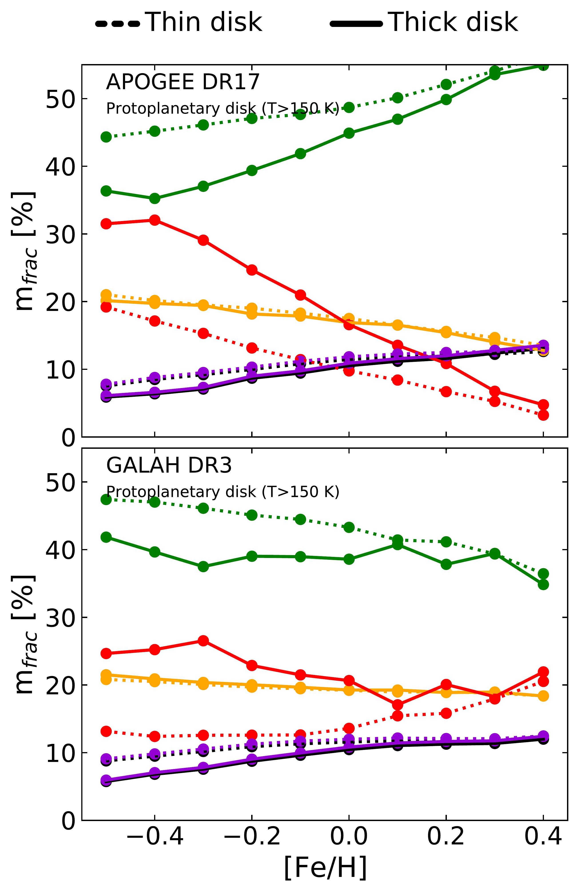
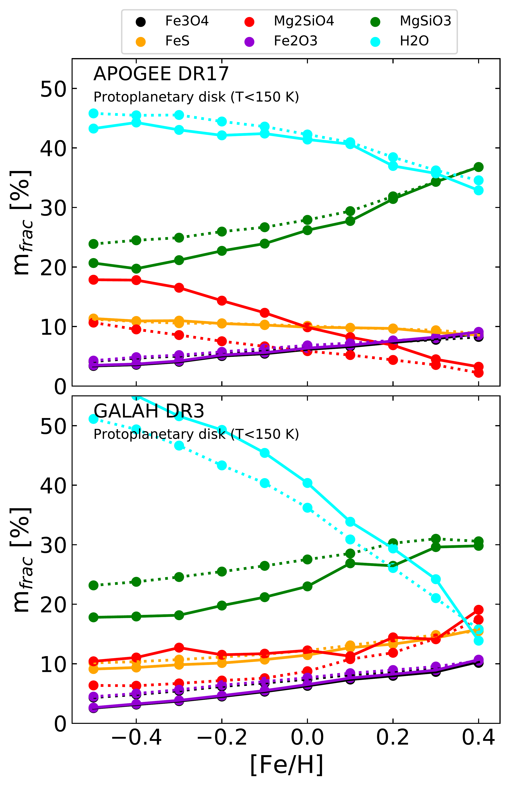
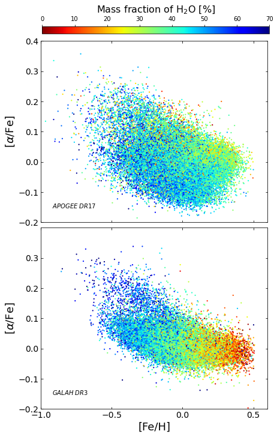
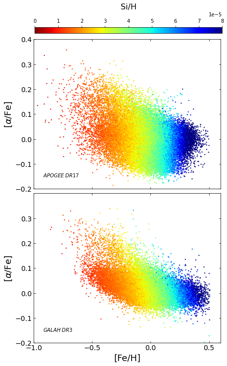
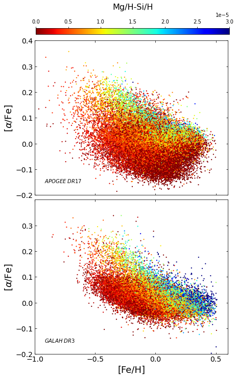

$\newcommand{\ensuremath}{}$
$\newcommand{\xspace}{}$
$\newcommand{\object}[1]{\texttt{#1}}$
$\newcommand{\farcs}{{.}''}$
$\newcommand{\farcm}{{.}'}$
$\newcommand{\arcsec}{''}$
$\newcommand{\arcmin}{'}$
$\newcommand{\ion}[2]{#1#2}$
$\newcommand{\textsc}[1]{\textrm{#1}}$
$\newcommand{\hl}[1]{\textrm{#1}}$

$\newcommand{\ensuremath}{}$
$\newcommand{\xspace}{}$
$\newcommand{\object}[1]{\texttt{#1}}$
$\newcommand{\farcs}{{.}''}$
$\newcommand{\farcm}{{.}'}$
$\newcommand{\arcsec}{''}$
$\newcommand{\arcmin}{'}$
$\newcommand{\ion}[2]{#1#2}$
$\newcommand{\textsc}[1]{\textrm{#1}}$
$\newcommand{\hl}[1]{\textrm{#1}}$

# How the origin of stars in the Galaxy impacts the composition of planetary building blocks

<mark>Appeared on: 2023-01-12</mark> - __

N. Cabral, et al. -- incl., <mark>B. Bitsch</mark>

**Abstract:** Our Galaxy is composed of different stellar populations with varying chemical abundances, which are thought to imprint the composition of planet building blocks (PBBs). As such, the properties of stars should affect the properties of planets and small bodies formed in their systems. In this context, high-resolution spectroscopic surveys open a window into the chemical links between and their host stars. We aim to determine the PBB composition trends for various stellar populations across the Galaxy by comparing the two large spectroscopic surveys APOGEE and GALAH. We assess the reliability of the PBB composition as determined with these surveys with a propagation error study. Stellar spectroscopic abundances from the large surveys GALAH-DR3 and APOGEE-DR17 were used as input with a stoichiometric condensation model. We classified stars into different Galactic components and we quantified the PBB composition trends as a function of [ Fe/H ] . We also analysed the distribution composition patterns in the [ $\alpha$ /Fe ] - [ Fe/H ] diagram. Our propagation error study suggests that the overall trends with [ Fe/H ] and [ $\alpha$ /Fe ] are robust, which is supported by the double study of both APOGEE and GALAH. We therefore confirm the existence of a bimodal PBB composition separating the thin disc stars from the thick disc stars. Furthermore, we confirm that the stoichiometric water PBB content is anti-correlated with [ Fe/H ] . Our results imply that metal-poor stars both in the thin and thick disks are suitable hosts for water-rich PBBs and for ice-rich small bodies. However, for metal-poor stars ( [ Fe/H ] <0), the PBBs around thick disc stars should have a higher water content than that around thin disc stars because of the $\alpha$ -content dependence of the water mass fraction. Given the importance of the initial water abundance of the PBBs in recent planet formation simulations, we expect that the star origin influences the exoplanet population properties across the Galaxy.

**Figure 11. -** Mean molecular mass fractions per bin of metallicity for thin disc (solid line) and thick disc (dashed line). Top panels correspond to APOGEE-DR17; bottom panels correspond to GALAH-DR3. Left panels correspond to the inner proto-planetary disc (T>150K); right panels correspond to the outer proto-planetary disc (T<150K, which includes the H2O molecule). (*Fig_Mfrac_ThinThickperFeH*)

**Figure 3. -** PBB mass fraction distribution of H$_2$O for T<150 K (outer proto-planetary disc) in the [$\alpha$/Fe]-[Fe/H] diagram. We display the surveys APOGEE-DR17 (top panels) and GALAH-DR3 (bottom panels). (*Fig7_Mfrac_AlphaFe_Outer*)

**Figure 8. -** Stellar abundance distribution in the [$\alpha$/Fe]-[Fe/H] diagram for  Mg/H (left panel), Si/H (middle panel), and Mg/H-Si/H (right panel). We display the surveys APOGEE-DR17 (top panels) and GALAH-DR3 (bottom panels). (*Fig6_MgH_AlphaFe_FeH*)

