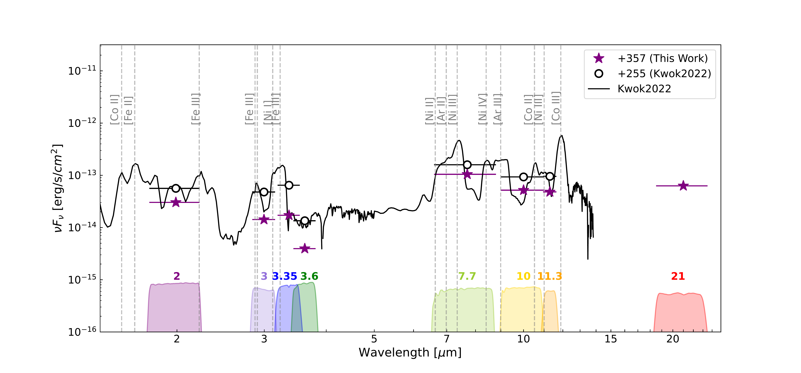
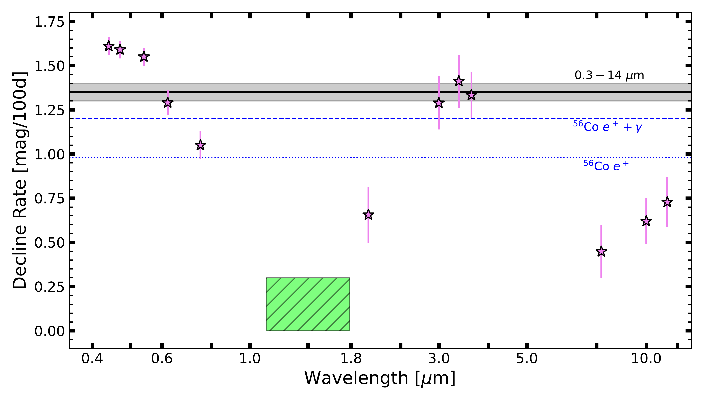

$\newcommand{\ensuremath}{}$
$\newcommand{\xspace}{}$
$\newcommand{\object}[1]{\texttt{#1}}$
$\newcommand{\farcs}{{.}''}$
$\newcommand{\farcm}{{.}'}$
$\newcommand{\arcsec}{''}$
$\newcommand{\arcmin}{'}$
$\newcommand{\ion}[2]{#1#2}$
$\newcommand{\textsc}[1]{\textrm{#1}}$
$\newcommand{\hl}[1]{\textrm{#1}}$
$\newcommand{\head}[2]{\multicolumn{1}{>{\centering\arraybackslash}p{#1}}{\textbf{#2}}}$
$\newcommand{\name}{SN~2021aefx\xspace}$
$\newcommand{\mat}[1]{\textcolor{purple}{MAT: #1}}$
$\newcommand{\CITE}{\textcolor{orange}{(add citation))}\xspace}$
$\newcommand{\um}{\hbox{\ensuremath{\mu\rm m}}\xspace}$
$\newcommand{\jwst}{\emph{JWST}\xspace}$
$\newcommand{\sneia}{SNe Ia\xspace}$
$\newcommand{\snia}{SN Ia\xspace}$
$\newcommand{\tmax}{\hbox{\ensuremath{t_{\rm{max}}}}\xspace}$
$\newcommand{\fopt}{\hbox{\ensuremath{F_{\rm{opt}}}}\xspace}$
$\newcommand{\fmir}{\hbox{\ensuremath{F_{\rm{mIR}}}}\xspace}$
$\newcommand{\lak}[1]{\textcolor{maroon}{LAK: #1}}$
$\newcommand{\OSU}{\affil{Department of Astronomy, The Ohio State University, 140 West 18th Avenue, Columbus, Ohio 43210, USA}}$
$\newcommand{\CCAPP}{\affil{Center for Cosmology and Astroparticle Physics, 191 West Woodruff Avenue, Columbus, OH 43210, USA}}$
$\newcommand{\NRAO}{\affil{National Radio Astronomy Observatory, 520 Edgemont Road, Charlottesville, VA 22903-2475, USA}}$
$\newcommand{\UAlberta}{\affil{4-183 CCIS, University of Alberta, Edmonton, Alberta, T6G 2E1, Canada}}$
$\newcommand{\Rutgers}{\affiliation{Department of Physics and Astronomy, Rutgers, the State University of New Jersey,\\136 Frelinghuysen Road, Piscataway, NJ 08854, USA}}$
$\newcommand{\STScI}{\affiliation{Space Telescope Science Institute, 3700 San Martin Drive, Baltimore, MD 21218, USA}}$
$\newcommand{\Alberta}{\affil{Department of Physics, University of Alberta, Edmonton, AB T6G 2E1, Canada}}$
$\newcommand{\HD}{\affil{Astronomisches Rechen-Institut, Zentrum f\"{u}r Astronomie der Universit\"{a}t Heidelberg, M\"{o}nchhofstra\ss e 12-14, D-69120 Heidelberg, Germany}}$
$\newcommand{\ITA}{\affiliation{Universit\"{a}t Heidelberg, Zentrum f\"{u}r Astronomie, Institut f\"{u}r Theoretische Astrophysik, Albert-Ueberle-Str 2, D-69120 Heidelberg, Germany}}$
$\newcommand{\IWR}{\affiliation{Universit\"{a}t Heidelberg, Interdisziplin\"{a}res Zentrum f\"{u}r Wissenschaftliches Rechnen, Im Neuenheimer Feld 205, D-69120 Heidelberg, Germany}}$
$\newcommand{\ANU}{\affiliation{Research School of Astronomy and Astrophysics, Australian National University, Canberra, ACT 2611, Australia}}$
$\newcommand{\ASTROThreeD}{\affiliation{ARC Centre of Excellence for All Sky Astrophysics in 3 Dimensions (ASTRO 3D), Australia}}$
$\newcommand{\MPIA}{\affiliation{Max Planck Institute for Astronomy, K\"onigstuhl 17, 69117 Heidelberg, Germany}}$
$\newcommand{\MISSING}{\affiliation{\textcolor{purple}{Need affiliation}}}$

$\newcommand{$\ensuremath$}{}$
$\newcommand{$\xspace$}{}$
$\newcommand{$\object$}[1]{\texttt{#1}}$
$\newcommand{$\farcs$}{{.}''}$
$\newcommand{$\farcm$}{{.}'}$
$\newcommand{$\arcsec$}{''}$
$\newcommand{$\arcmin$}{'}$
$\newcommand{$\ion$}[2]{#1#2}$
$\newcommand{$\textsc$}[1]{\textrm{#1}}$
$\newcommand{$\hl$}[1]{\textrm{#1}}$
$\newcommand{$\head$}[2]{\multicolumn{1}{>{\centering\arraybackslash}p{#1}}{\textbf{#2}}}$
$\newcommand{$\name$}{SN~2021aefx$\xspace$}$
$\newcommand{$\mat$}[1]{\textcolor{purple}{MAT: #1}}$
$\newcommand{$\CITE$}{\textcolor{orange}{(add citation))}$\xspace$}$
$\newcommand{$\um$}{\hbox{$\ensuremath${\mu\rm m}}$\xspace$}$
$\newcommand{$\jwst$}{\emph{JWST}$\xspace$}$
$\newcommand{$\sneia$}{SNe Ia$\xspace$}$
$\newcommand{$\snia$}{SN Ia$\xspace$}$
$\newcommand{$\tmax$}{\hbox{$\ensuremath${t_{\rm{max}}}}$\xspace$}$
$\newcommand{$\fopt$}{\hbox{$\ensuremath${F_{\rm{opt}}}}$\xspace$}$
$\newcommand{$\fmir$}{\hbox{$\ensuremath${F_{\rm{mIR}}}}$\xspace$}$
$\newcommand{$\lak$}[1]{\textcolor{maroon}{LAK: #1}}$
$\newcommand{$\OSU$}{\affil{Department of Astronomy, The Ohio State University, 140 West 18th Avenue, Columbus, Ohio 43210, USA}}$
$\newcommand{$\CCAPP$}{\affil{Center for Cosmology and Astroparticle Physics, 191 West Woodruff Avenue, Columbus, OH 43210, USA}}$
$\newcommand{$\NRAO$}{\affil{National Radio Astronomy Observatory, 520 Edgemont Road, Charlottesville, VA 22903-2475, USA}}$
$\newcommand{$\UAlberta$}{\affil{4-183 CCIS, University of Alberta, Edmonton, Alberta, T6G 2E1, Canada}}$
$\newcommand{$\Rutgers$}{\affiliation{Department of Physics and Astronomy, Rutgers, the State University of New Jersey,\\136 Frelinghuysen Road, Piscataway, NJ 08854, USA}}$
$\newcommand{$\STScI$}{\affiliation{Space Telescope Science Institute, 3700 San Martin Drive, Baltimore, MD 21218, USA}}$
$\newcommand{$\Alberta$}{\affil{Department of Physics, University of Alberta, Edmonton, AB T6G 2E1, Canada}}$
$\newcommand{$\HD$}{\affil{Astronomisches Rechen-Institut, Zentrum f\"{u}r Astronomie der Universit\"{a}t Heidelberg, M\"{o}nchhofstra\ss e 12-14, D-69120 Heidelberg, Germany}}$
$\newcommand{$\ITA$}{\affiliation{Universit\"{a}t Heidelberg, Zentrum f\"{u}r Astronomie, Institut f\"{u}r Theoretische Astrophysik, Albert-Ueberle-Str 2, D-69120 Heidelberg, Germany}}$
$\newcommand{$\IWR$}{\affiliation{Universit\"{a}t Heidelberg, Interdisziplin\"{a}res Zentrum f\"{u}r Wissenschaftliches Rechnen, Im Neuenheimer Feld 205, D-69120 Heidelberg, Germany}}$
$\newcommand{$\ANU$}{\affiliation{Research School of Astronomy and Astrophysics, Australian National University, Canberra, ACT 2611, Australia}}$
$\newcommand{$\ASTROThreeD$}{\affiliation{ARC Centre of Excellence for All Sky Astrophysics in 3 Dimensions (ASTRO 3D), Australia}}$
$\newcommand{$\MPIA$}{\affiliation{Max Planck Institute for Astronomy, K\"onigstuhl 17, 69117 Heidelberg, Germany}}$
$\newcommand{$\MISSING$}{\affiliation{\textcolor{purple}{Need affiliation}}}$

# Co Decay Energy

<mark>Appeared on: 2023-01-18</mark> - _Submitted to ApJL; 11 pages, 4 figures, 2 tables in two-column AASTEX63 format. Comments welcome_

Ness Mayker~Chen, et al. -- incl., <mark>Lindsey Kwok</mark>, <mark>Frank Bigiel</mark>, <mark>Francesca~Pinna</mark>, <mark>Eva Schinnerer</mark>

**Abstract:** We present new$0.3-21 $\um$$photometry of$\name$in the spiral galaxy NGC 1566 at$+357$days after$B$-band maximum, including the first detection of any SN Ia at$>15 \micron$. These observations follow earlier$\jwst$observations of$\name$at$+255$days after the time of maximum brightness, allowing us to probe the temporal evolution of the emission properties. We measure the fraction of flux emerging at different wavelengths and its temporal evolution. Additionally, the integrated$0.3-14 $\um$$decay rate of$\Delta m_{0.3-14} = 1.35 \pm 0.05 $mag/100 days is higher than the decline rate from the radioactive decay of$^{56}$Co of$\sim 1.2$mag/100 days. The most plausible explanation for this discrepancy is that flux is shifting to$>14 $\um$$, and future$\jwst$observations of$\sneia$will be able to directly test this hypothesis. However, models predicting non-radiative energy loss cannot be excluded with the present data.

**Figure 3. -** \textit{$\name$ in NGC 1566 at $\approx 2{-}21\mu$m.} Left panel: MIRI \emph{F1130W} PHANGS-JWST image of NGC 1566 showing the location of $\name$ marked with a green circle. Right panels: zoom-ins on $\name$ in each PHANGS-JWST filter. The top four panels show 200 pc $\times $200 pc cutouts from NIRCam images at 2.0$-$3.6 $\micron$. The bottom four panels show $1$ kpc $\times$ $1$ kpc MIRI images at $7.7-21  \micron$. The inner green circle marks the aperture used in the photometry measurement, and the two concentric, dashed, cyan circles mark the inner and outer apertures used for the background subtraction. The results of the photometry appear in Table \ref{tab:photometry}. \label{fig:SN2021aefx} (*fig:SN2021aefx*)

**Figure 4. -** \textit{A comparison of the Near- and Mid- IR flux of $\name$ at +255 and +357 days.} Purple stars mark our flux measurements from each filter and  black open circles signify synthetic photometry from the +255-day spectrum (black line). Horizontal error bars show the nominal wavelength width of each filter. Vertical error bars mark the uncertainty in the measurement and are shown, but are typically smaller than the points. The vertical grey dashed lines mark emission features identified by \cite{Kwok2022}. NIRCam and MIRI filter curves are plotted along the bottom axis.
\label{fig:SED} (*fig:SED*)

**Figure 5. -** Nebular-phase decline rates as a function of wavelength for $\name$. The green region represents the $J$- and $H$-band decay rates of $0.0-0.3$ mag/100 days from \citet{Graur2020}. Blue horizontal lines show the energy deposition rate for $^{56}$Co with (dashed) and without (dotted) including the $\gamma$-ray contribution. The black line and shaded region represent the integrated $0.3-14 $\um$$ decline rate derived in \S\ref{sec:Results}. Data for this figure are included in the online version of the manuscript. (*fig:nebdec*)

