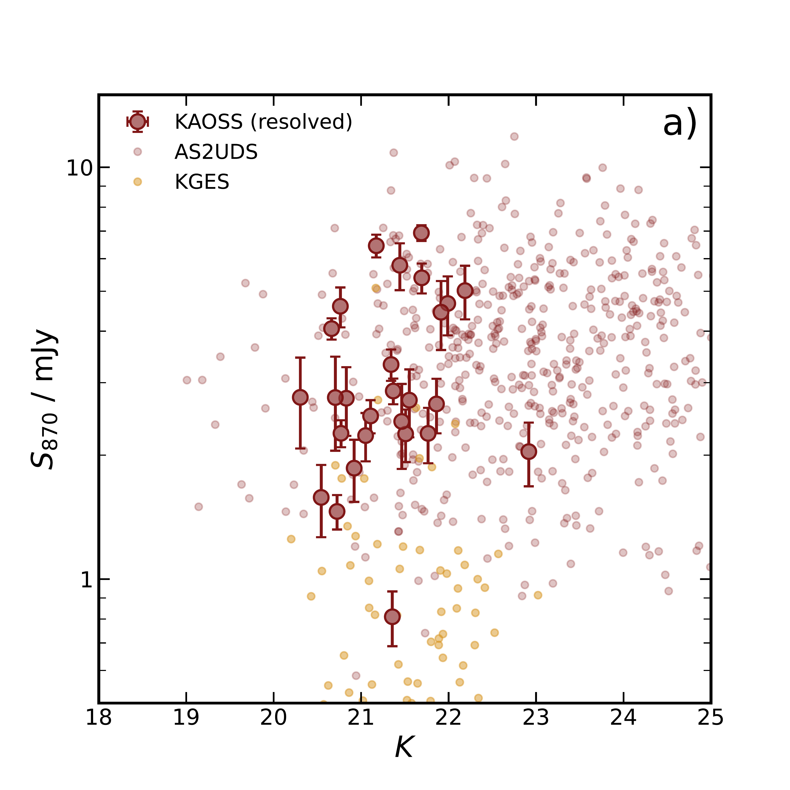
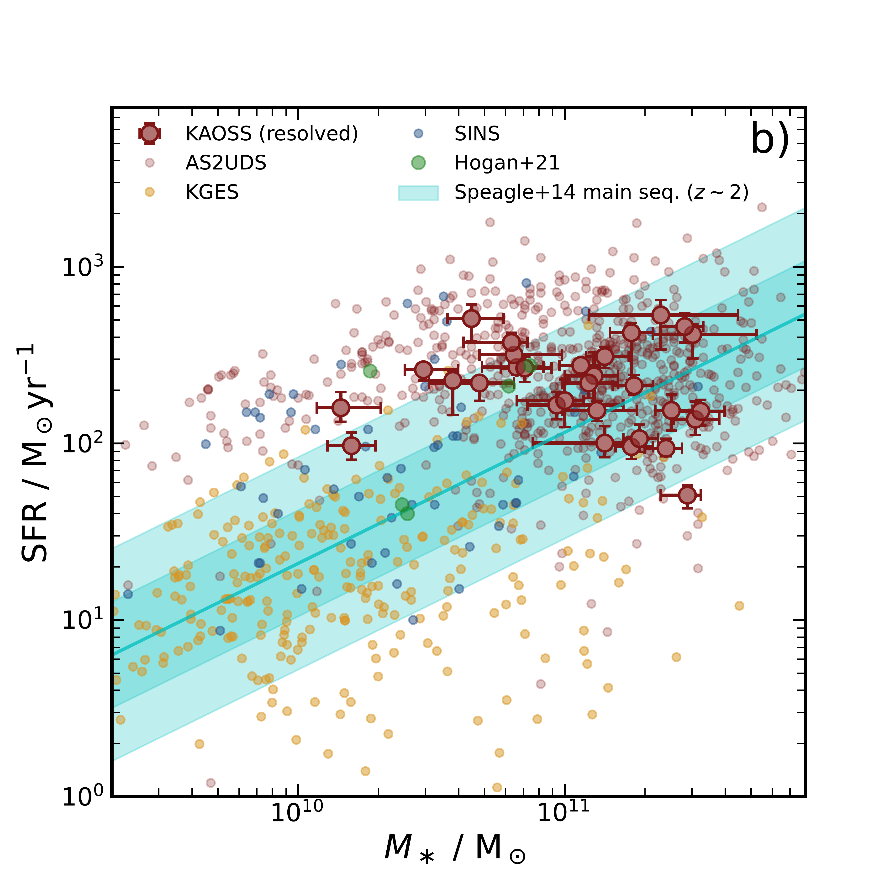

$\newcommand{\ensuremath}{}$
$\newcommand{\xspace}{}$
$\newcommand{\object}[1]{\texttt{#1}}$
$\newcommand{\farcs}{{.}''}$
$\newcommand{\farcm}{{.}'}$
$\newcommand{\arcsec}{''}$
$\newcommand{\arcmin}{'}$
$\newcommand{\ion}[2]{#1#2}$
$\newcommand{\textsc}[1]{\textrm{#1}}$
$\newcommand{\hl}[1]{\textrm{#1}}$
$\newcommand{\todo}[1]{{\color{red} ZZZ: #1}}$
$\newcommand{\thefigure}{\arabic{figure} (Cont.)}$
$\newcommand{\thefigure}{\arabic{figure}}$
$\newcommand{\thefigure}{A1 (Cont.)}$
$\newcommand{\thefigure}{\arabic{figure}}$
$\newcommand{\thefigure}{A1 (Cont.)}$
$\newcommand{\thefigure}{\arabic{figure}}$

$\newcommand{$\ensuremath$}{}$
$\newcommand{$\xspace$}{}$
$\newcommand{$\object$}[1]{\texttt{#1}}$
$\newcommand{$\farcs$}{{.}''}$
$\newcommand{$\farcm$}{{.}'}$
$\newcommand{$\arcsec$}{''}$
$\newcommand{$\arcmin$}{'}$
$\newcommand{$\ion$}[2]{#1#2}$
$\newcommand{$\textsc$}[1]{\textrm{#1}}$
$\newcommand{$\hl$}[1]{\textrm{#1}}$
$\newcommand{$\todo$}[1]{{\color{red} ZZZ: #1}}$
$\newcommand{$\thefigure$}{\arabic{figure} (Cont.)}$
$\newcommand{$\thefigure$}{\arabic{figure}}$
$\newcommand{$\thefigure$}{A1 (Cont.)}$
$\newcommand{$\thefigure$}{\arabic{figure}}$
$\newcommand{$\thefigure$}{A1 (Cont.)}$
$\newcommand{$\thefigure$}{\arabic{figure}}$

#  1.3--2.6

<mark>Appeared on: 2023-01-18</mark> - _20 pages, 12 figures, submitted to MNRAS_

Jack E. Birkin, et al. -- incl., <mark><mark>E. Schinnerer</mark></mark>

**Abstract:** We present spatially resolved kinematics of 31 ALMA-identified dust-obscured star-forming galaxies (DSFGs) at$z$$\sim$1.3--2.6, as traced by H$\alpha$emission using VLT/KMOS near-infrared integral field spectroscopy from our on-going Large Programme "KMOS-ALMA Observations of Submillimetre Sources" (KAOSS). We derive H$\alpha$rotation curves and velocity dispersion profiles for the DSFGs. Of the 31 sources with bright, spatially extended H$\alpha$emission, 25 display rotation curves that are well fit by a Freeman disc model, enabling us to measure a median inclination-corrected velocity at 2.2$R_{\rm d}$of$v_{\rm rot}$$=$190$\pm$30 km s$^{-1}$and a median intrinsic velocity dispersion of$\sigma_0$$=$87$\pm$6 km s$^{-1}$for these{\it disc-like}sources. By comparison with less actively star-forming galaxies, KAOSS DSFGs are both faster rotating and more turbulent, but have similar$v_{\rm rot}/\sigma_0$ratios, median 2.4$\pm$0.5. We suggest that$v_{\rm rot}/\sigma_0$alone is insufficient to describe the kinematics of DSFGs, which are not kinematically "cold" discs, and that the individual components$v_{\rm rot}$and$\sigma_0$indicate that they are in fact turbulent, but rotationally supported systems in$\sim$50 per cent of cases. This turbulence may be driven by star formation or mergers/interactions. We estimate the normalisation of the stellar Tully-Fisher relation (sTFR) for the disc-like DSFGs and compare it with local studies, finding no evolution at fixed slope between$z$$\sim$2 and$z$$\sim$0. Finally, we use kinematic estimates of DSFG halo masses to investigate the stellar-to-halo mass relation, finding our sources to be consistent with shock heating and strong feedback which likely drives the declining stellar content in the most massive halos.

**Figure 5. -** {\bf a)}$K$-band magnitude versus 870-$\mu$m flux density ($S_{870}$) for the KAOSS resolved sample compared with the 707 AS2UDS DSFGs \protect\citep{dudzeviciute20} and $z$$\sim$ 1.5 star-forming galaxies from KGES \protect\citep{tiley21}. The KAOSS resolved sample is generally representative of the range of 870-$\mu$m flux densities in the DSFG population, but biased towards near-infrared-brighter sources. For the KGES sample we indicate the region containing the $K$-band magnitudes of the sample and the expected 870-$\mu$m flux densities estimated from SED-derived dust masses. The KAOSS sample is complemented by KGES in that the latter extends the range in SFR by an order of magnitude. {\bf b)} Star-formation rate versus $M_\ast$ for the same samples, now also including six $z$$\sim$ 2.5 ULIRGs from \protect\cite{hogan21}. KAOSS probes sources that are approximately an order of magnitude more massive than KGES, and overlaps with the parameter range of the {\it Herschel}-selected ULIRGs in \protect\cite{hogan21}. Also shown here are $z$$\sim$ 1.3--2.6 UV/optically selected galaxies from the SINS survey \protect\citep{forster-schreiber09}, which has some overlap with KAOSS, but also probes lower-mass and lower-SFR systems. (*fig:kaoss_selection*)

**Figure 6. -** {\it HST} F160W or ground-based $K$-band images (left), velocity fields (middle) and velocity dispersion profiles (right) for our sample of 31 resolved KAOSS DSFGs. The images are 7.5$"$$\times$ 7.5$"$ in size, and the white box indicates the region shown in the velocity and velocity dispersion maps (3.2$"$$\times$ 3.2$"$ in size). Sources are ordered by the S/N of the H$\alpha$ emission line (shown in the bottom-left corner of the middle panels) and we indicate the inclination angle derived for the source from {\sc galfit} modelling. The black lines on the centre and right panels indicate the kinematic position angle along which rotation curves are measured. For the left panels we indicate the three filters that make up the RGB colour image, or the single filter in cases where the image is greyscale. (*fig:kaoss_vel_fields_1*)

**Figure 13. -** H$\alpha$ rotation curves (left) and velocity dispersion profiles (right) for the resolved KAOSS sample. Sources are ordered by the S/N of the H$\alpha$ emission line as in Fig. \ref{fig:kaoss_vel_fields_1}. The solid black lines indicate Freeman disc model fits to the data, the vertical dashed lines indicate $\pm$ 2.2 times the disc radius (thin) and $\pm$ 2.2 times the disc radius convolved with $\sigma_{\rm PSF}$(thick), the latter at which we measure the rotation velocity, and the cross indicates the original source centroid. Points that are plotted as open circles are masked in the fitting procedure. For the dispersion profiles we indicate the observed velocity dispersion, $\sigma_{\rm obs}$(horizontal black solid line), along with the method used to measure it (top right), and the beam smearing-corrected intrinsic velocity dispersion (horizontal black dashed line). We also indicate the method used to centre the velocity field in the top right corner of the dispersion profile panels. (*fig:kaoss_rot_curves_1*)

