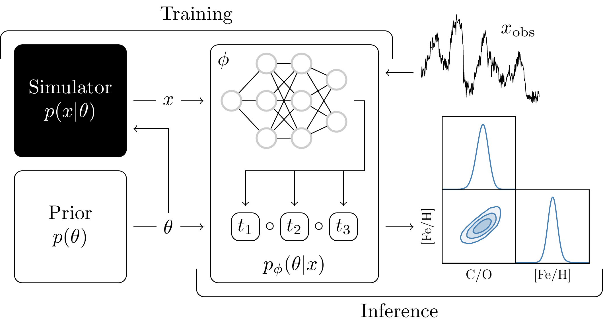
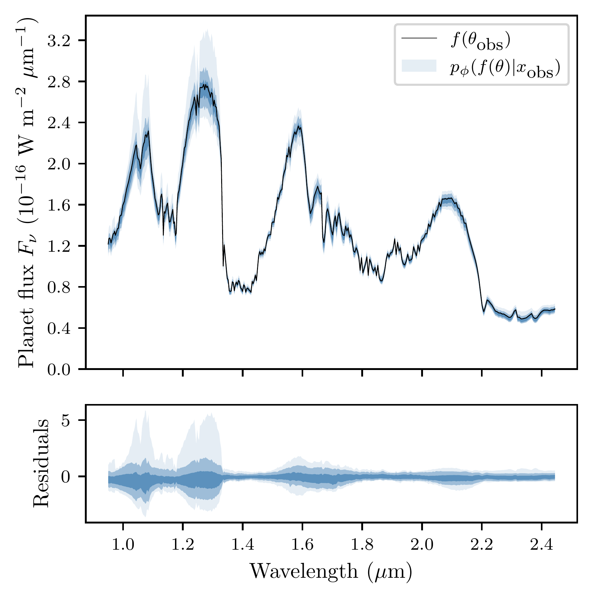
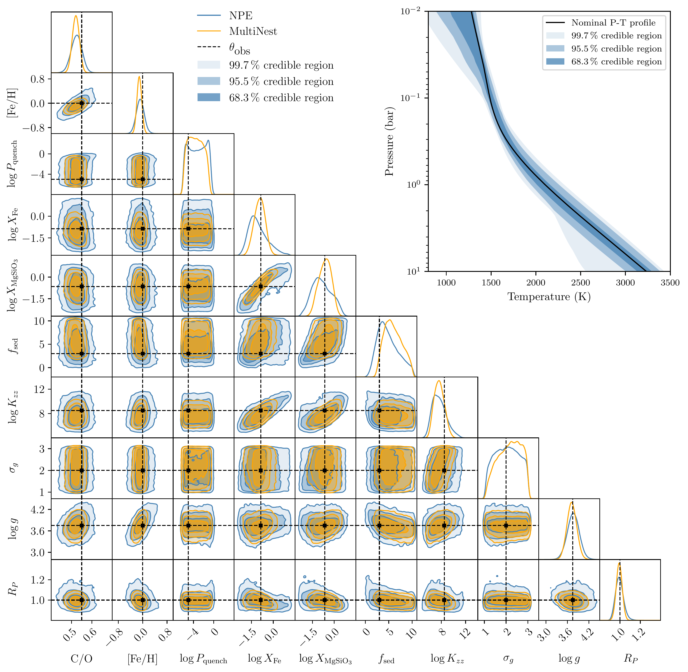

$\newcommand{\ensuremath}{}$
$\newcommand{\xspace}{}$
$\newcommand{\object}[1]{\texttt{#1}}$
$\newcommand{\farcs}{{.}''}$
$\newcommand{\farcm}{{.}'}$
$\newcommand{\arcsec}{''}$
$\newcommand{\arcmin}{'}$
$\newcommand{\ion}[2]{#1#2}$
$\newcommand{\textsc}[1]{\textrm{#1}}$
$\newcommand{\hl}[1]{\textrm{#1}}$
$\newcommand{\footnote}[1]{}$
$\newcommand{\knowing}{|}$
$\newcommand{\}{hyper}$

$\newcommand{\ensuremath}{}$
$\newcommand{\xspace}{}$
$\newcommand{\object}[1]{\texttt{#1}}$
$\newcommand{\farcs}{{.}''}$
$\newcommand{\farcm}{{.}'}$
$\newcommand{\arcsec}{''}$
$\newcommand{\arcmin}{'}$
$\newcommand{\ion}[2]{#1#2}$
$\newcommand{\textsc}[1]{\textrm{#1}}$
$\newcommand{\hl}[1]{\textrm{#1}}$
$\newcommand{\footnote}[1]{}$
$\newcommand{\knowing}{|}$
$\newcommand{\}{hyper}$

# Neural posterior estimation for exoplanetary atmospheric retrieval

<mark>Appeared on: 2023-01-16</mark> - _The paper has been submitted to AandA after a final revision_

Malavika Vasist, et al. -- incl., <mark>Paul Mollière</mark>, <mark>Evert Nasedkin</mark>

**Abstract:** Retrieving the physical parameters from spectroscopic observations of exoplanets is key to understanding their atmospheric properties.Exoplanetary atmospheric retrievals are usually based on approximate Bayesian inference and rely on sampling-based approaches to compute parameter posterior distributions.Accurate or repeated retrievals, however, can result in very long computation times due to the sequential nature of sampling-based algorithms. We aim to amortize exoplanetary atmospheric retrieval using neural posterior estimation (NPE), a simulation-based inference algorithm based on variational inference and normalizing flows.In this way, we aim (i) to strongly reduce inference time, (ii) to scale inference to complex simulation models with many nuisance parameters or intractable likelihood functions, and (iii) to enable the statistical validation of the inference results. We evaluate NPE on a radiative transfer model for exoplanet spectra ( $\texttt{petitRADTRANS}$ ), including the effects of scattering and clouds.We train a neural autoregressive flow to quickly estimate posteriors and compare against retrievals computed with $\texttt{MultiNest}$ . NPE produces accurate posterior approximations while reducing inference time down to a few seconds.We demonstrate the computational faithfulness of our posterior approximations using inference diagnostics including posterior predictive checks and coverage, taking advantage of the quasi-instantaneous inference time of NPE. Our analysis confirms the reliability of the approximate posteriors produced by NPE. The inference results produced by NPE appear to be accurate and reliable, establishing this algorithm as a promising approach for atmospheric retrieval. Its main benefits come from the amortization of posterior inference: once trained, inference does not require on-the-fly simulations and can be repeated several times for many observations at very low computational cost. This enables efficient, scalable, and testable atmospheric retrieval.

**Figure 1. -** Inference pipeline using amortized neural posterior estimation. The joint simulation model $p(x,\theta)=p(\theta)p(x|\theta)$ is used to generate a training set $\{ (\theta, x) \}$ of model parameters $\theta$ and exoplanet spectra observations $x$. A conditional normalizing flow $p_\phi(\theta|x)$ composed of an embedding network and three invertible transformations $t_i$ is trained to estimate the posterior density $p(\theta|x)$. Once trained, sampling from the posterior estimator is as fast as a forward pass through the normalizing flow. Inference can be repeated for many observations without having to regenerate data nor retrain the normalizing flow. (*fig:overview*)

**Figure 2. -** _Top._ Posterior predictive distribution $p(f(\theta)|x_\text{obs})$ of noiseless spectra (without the instrumental noise disturbance $\epsilon$) for the $99.7\%$, $95\%$ and $68.7\%$ quartiles (hues of blue), overlaid on top of the noiseless observed spectrum $f(\theta_\text{obs})$(black line). {_Bottom._ Residuals of the posterior predictive samples, normalized by the standard deviation of the noise distribution for each spectral channel.
    } (*fig:consistency*)

**Figure 5. -** Benchmark retrieval using neural posterior estimation. The corner plot shows 1d and 2d marginal posterior distributions obtained for the benchmark spectrum $x_\text{obs}$ for NPE (in blue) and for nested sampling (in orange). We observe that the nominal parameter values $\theta_\text{obs}$(in black) are well identified. The top right figure illustrates the posterior distribution of the P-T profiles.  (*fig:results*)

