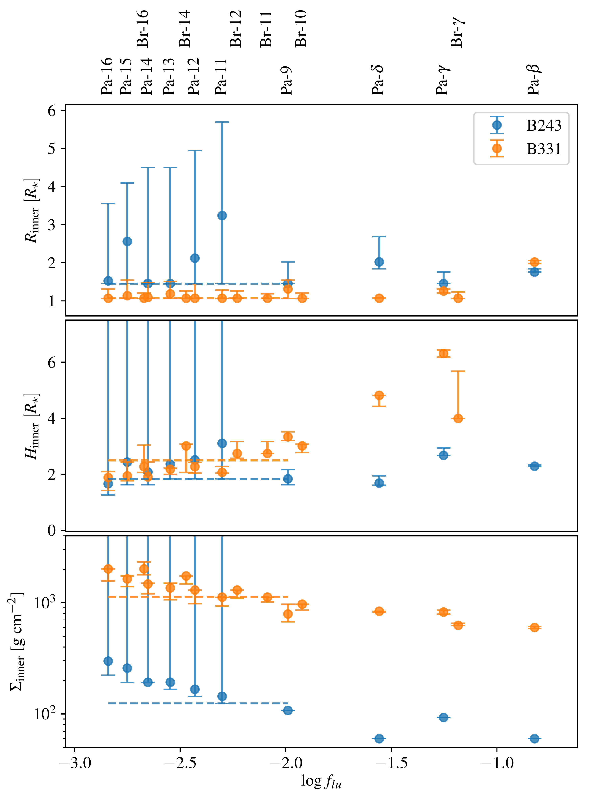
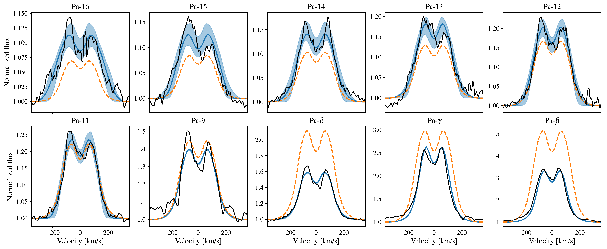
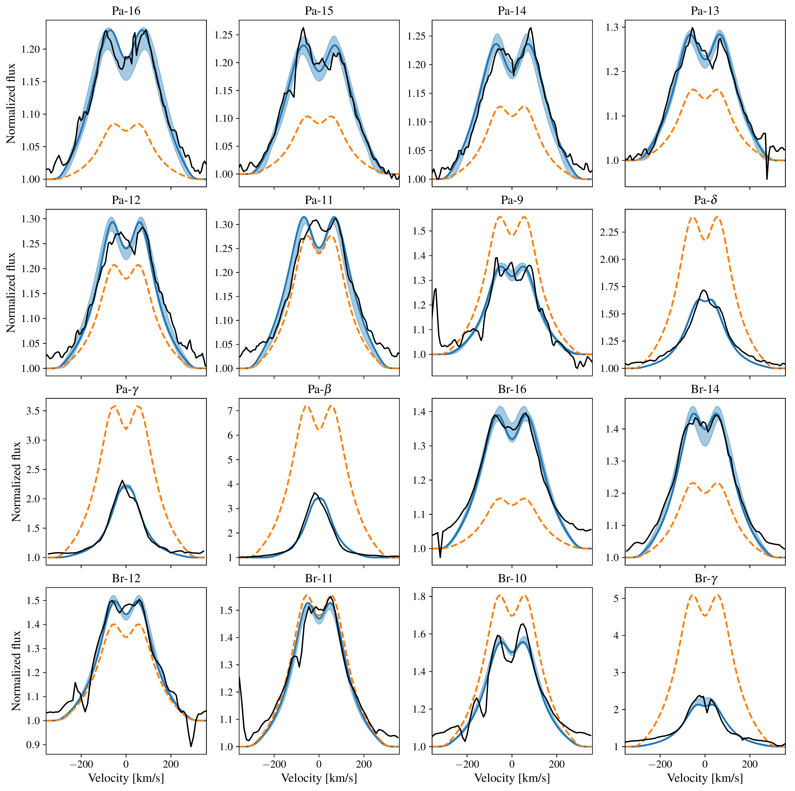

$\newcommand{\ensuremath}{}$
$\newcommand{\xspace}{}$
$\newcommand{\object}[1]{\texttt{#1}}$
$\newcommand{\farcs}{{.}''}$
$\newcommand{\farcm}{{.}'}$
$\newcommand{\arcsec}{''}$
$\newcommand{\arcmin}{'}$
$\newcommand{\ion}[2]{#1#2}$
$\newcommand{\textsc}[1]{\textrm{#1}}$
$\newcommand{\hl}[1]{\textrm{#1}}$
$\newcommand{\blue}[1]{\textcolor{blue}{#1}}$
$\newcommand{\red}[1]{\textcolor{red}{#1}}$
$\newcommand{\cyan}[1]{\textcolor{cyan}{#1}}$
$\newcommand{\magenta}[1]{\textcolor{magenta}{#1}}$
$\newcommand{\arraystretch}{1.4}$
$\newcommand{\footnoterule}$
$\newcommand{\arraystretch}{1.35}$
$\newcommand{\hii}{H {\sc ii}}$
$\newcommand{\Msun}{M_\odot}$
$\newcommand{\Lsun}{L_\odot}$
$\newcommand{\xsh}{X-shooter}$
$\newcommand{\prodimo}{{\sc ProDiMo}}$

$\newcommand{\ensuremath}{}$
$\newcommand{\xspace}{}$
$\newcommand{\object}[1]{\texttt{#1}}$
$\newcommand{\farcs}{{.}''}$
$\newcommand{\farcm}{{.}'}$
$\newcommand{\arcsec}{''}$
$\newcommand{\arcmin}{'}$
$\newcommand{\ion}[2]{#1#2}$
$\newcommand{\textsc}[1]{\textrm{#1}}$
$\newcommand{\hl}[1]{\textrm{#1}}$
$\newcommand{\blue}[1]{\textcolor{blue}{#1}}$
$\newcommand{\red}[1]{\textcolor{red}{#1}}$
$\newcommand{\cyan}[1]{\textcolor{cyan}{#1}}$
$\newcommand{\magenta}[1]{\textcolor{magenta}{#1}}$
$\newcommand{\arraystretch}{1.4}$
$\newcommand{\footnoterule}$
$\newcommand{\arraystretch}{1.35}$
$\newcommand{\hii}{H {\sc ii}}$
$\newcommand{\Msun}{M_\odot}$
$\newcommand{\Lsun}{L_\odot}$
$\newcommand{\xsh}{X-shooter}$
$\newcommand{\prodimo}{{\sc ProDiMo}}$

# Massive pre-main-sequence stars in M17

<mark>Appeared on: 2023-01-17</mark> - _18 pages, 16 figures. Accepted for publication in A&A_

<mark><mark>Frank Backs</mark></mark>, et al.

**Abstract:** The young massive-star-forming region M17 contains optically visible massive pre-main-sequence stars that are surrounded by circumstellar disks. Such disks are expected to disappear when these stars enter the main sequence. The physical and dynamical structure of these remnant disks are poorly constrained, especially the inner regions where accretion, photo-evaporation, and companion formation and migration may be ongoing. We aim to constrain the physical properties of the inner parts of the circumstellar disks of massive young stellar objects B243 (6 M $_\odot$ ) and B331 (12 M $_\odot$ ), two systems for which the central star has been detected and characterized previously despite strong dust extinction. Two-dimensional radiation thermo-chemical modelling with \prodimo of double-peaked hydrogen lines of the Paschen and Brackett series observed with \xsh was used to probe the properties of the inner disk of the target sources. The model was modified to treat these lines. Additionally, the dust structure was studied by fitting the optical and near-infrared spectral energy distribution. B243 features a hot gaseous inner disk with dust at the sublimation radius at $\sim$ 3 AU. The disk appears truncated at roughly 6.5 AU; a cool outer disk of gas and dust may be present, but it cannot be detected with our data. B331 also has a hot gaseous inner disk. A gap separates the inner disk from a colder dusty outer disk starting at up to $\sim$ 100 AU. In both sources the inner disk extends to almost the stellar surface. Chemistry is essential for the ionization of hydrogen in these disks. The lack of a gap between the central objects and these disks suggests that they accrete through boundary-layer accretion. This would exclude the stars having a strong magnetic field.   Their structures suggest that both disks are transitional in nature, that is to say they are in the process of being cleared, either through boundary-layer accretion, photo-evaporation, or through companion activity.

**Figure 5. -** Parameter values of the inner disk with their uncertainties for each modelled line of B243 and B331 as function of their oscillator strength. The horizontal dashed lines indicate the best fit parameters for B243 when fitting Pa-9 and Pa-11 to Pa-16 simultaneously and for B331 when fitting Pa-9, Pa-11 to Pa-16 and Br-11 to Br-16. The corresponding line profiles are shown in Fig. \ref{p1:fig:B243_individual_line_fits} and Fig. \ref{p1:fig:B331_individual_line_fits} for B243 and B331, respectively. For each fit an inclination of 75$^\circ$ is used.
     (*p1:fig:B243_B331_parameter_trend*)

**Figure 13. -** Best fitting models in blue to the observed lines in black for B243. The blue shaded regions indicate models that fall within the 1 $\sigma$ confidence interval. Each line is fitted individually with the inclination set to $75^\circ$, the respective parameters are shown in Fig. \ref{p1:fig:B243_B331_parameter_trend}. The orange profiles indicate the best fit when fitting Pa-16 to Pa-9 simultaneously. Notice the factor $\sim$30 range in line strengths covered by the Paschen series.
     (*p1:fig:B243_individual_line_fits*)

**Figure 14. -** Best fitting models in blue to the observed lines in black for B331. The blue shaded regions indicate models that fall within the 1 $\sigma$ confidence interval. Each line is fitted individually with the inclination fixed at 75$^\circ$, the respective parameters are shown in Fig. \ref{p1:fig:B243_B331_parameter_trend}. The orange profiles indicate the best fit when fitting Pa-16 to Pa-9 and Br-16 to Br-11 simultaneously. Notice the factor $\sim$20 range in line strengths covered by the Paschen series. (*p1:fig:B331_individual_line_fits*)

