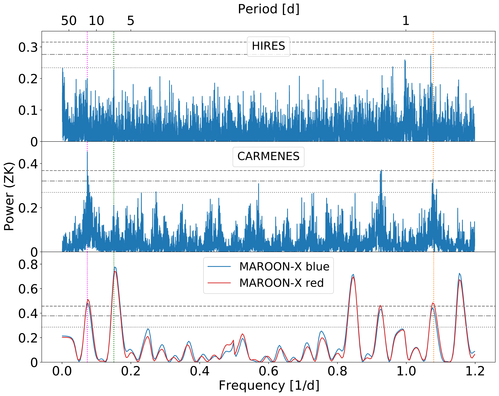
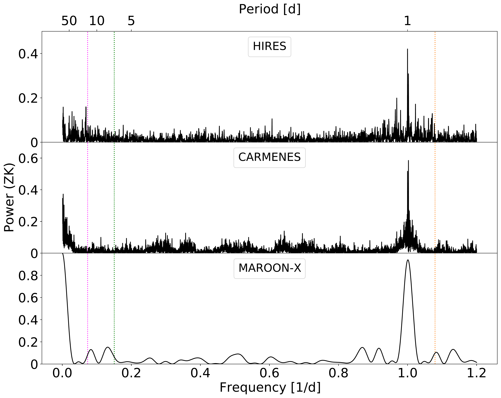
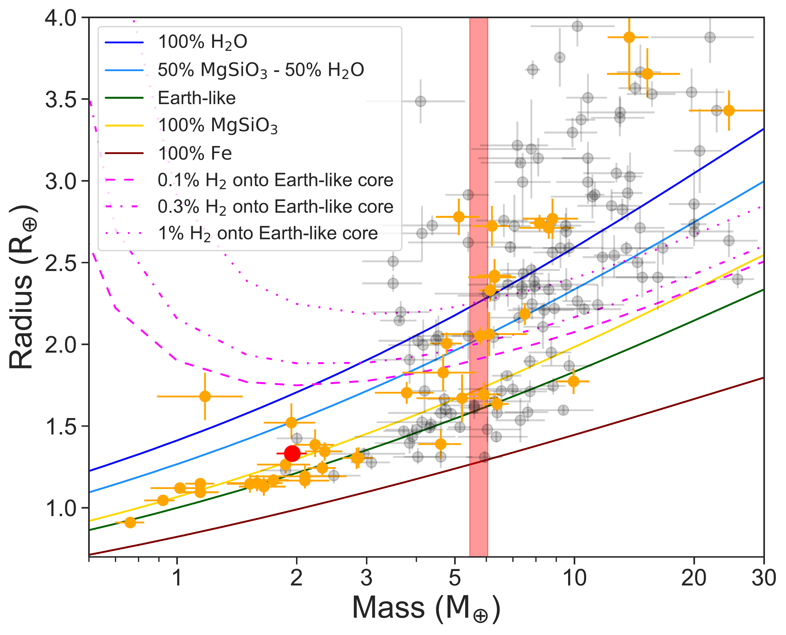
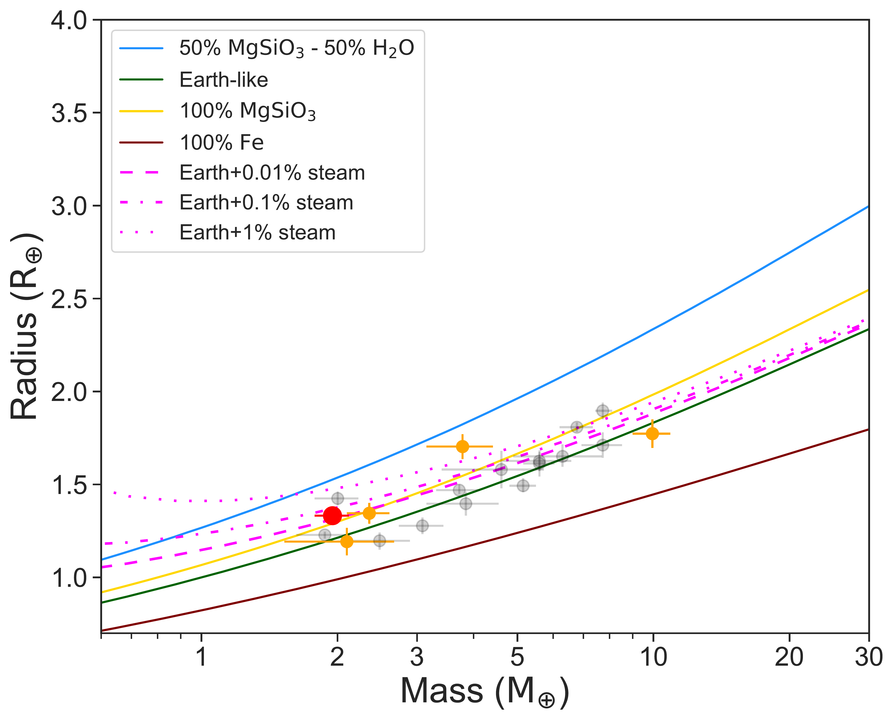
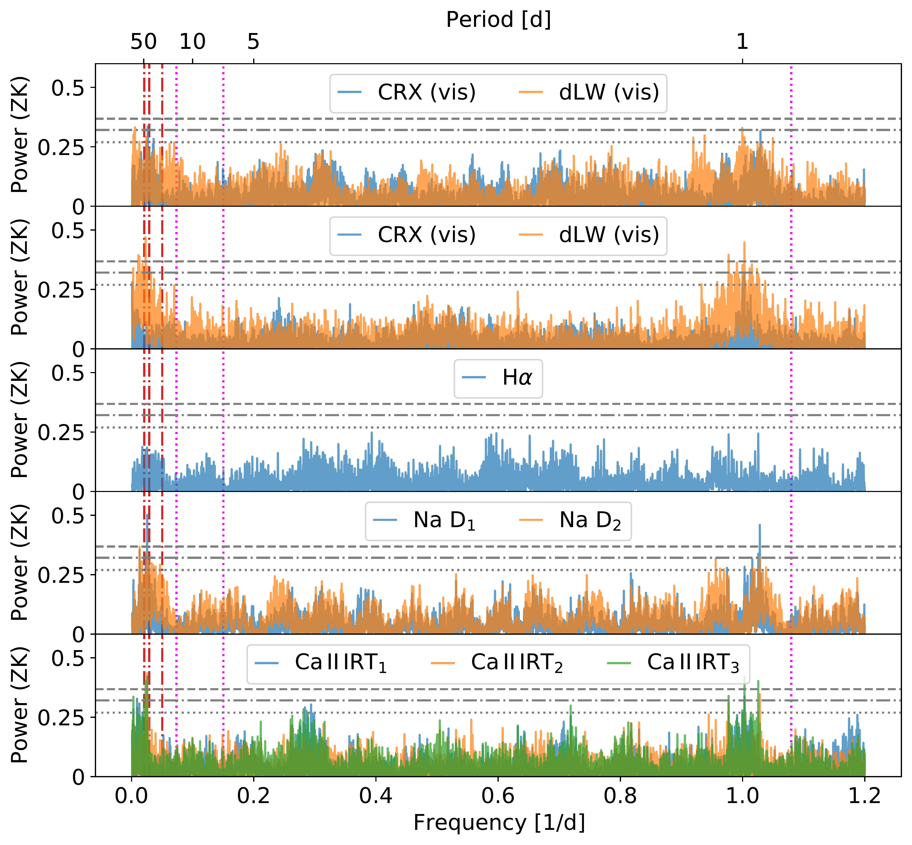

$\newcommand{\ensuremath}{}$
$\newcommand{\xspace}{}$
$\newcommand{\object}[1]{\texttt{#1}}$
$\newcommand{\farcs}{{.}''}$
$\newcommand{\farcm}{{.}'}$
$\newcommand{\arcsec}{''}$
$\newcommand{\arcmin}{'}$
$\newcommand{\ion}[2]{#1#2}$
$\newcommand{\textsc}[1]{\textrm{#1}}$
$\newcommand{\hl}[1]{\textrm{#1}}$
$\newcommand{\tstar}{GJ~806\xspace}$
$\newcommand{\tplanet}{GJ~806 b\xspace}$
$\newcommand{\pytransit}{\textsc{PyTransit}\xspace}$
$\newcommand{\ldtk}{\textsc{LDTk}\xspace}$
$\newcommand{\lh}{\ensuremath{\ell}}$
$\newcommand{\llh}{\ensuremath{\ln P}}$
$\newcommand{\iid}{i.i.d.\xspace}$
$\newcommand{\pvec}{\ensuremath{\boldsymbol{\theta}}\xspace}$
$\newcommand{\covmat}{\emth{\boldsymbol{\Sigma}}}$
$\newcommand{\cmat}{\ensuremath{\mathbf{K}}\xspace}$
$\newcommand{\flux}{\ensuremath{\mathbf{f}}\xspace}$
$\newcommand{\gcm}{\emth{\mathrm{g cm^{-3}}}}$
$\newcommand{\smass}{\emth{\mathrm{M_\star}}}$
$\newcommand{\srad}{\emth{\mathrm{R_\star}}}$
$\newcommand{\pmass}{\emth{\mathrm{M_P}}}$
$\newcommand{\prad}{\emth{\mathrm{R_P}}}$
$\newcommand{\rptrue}{\ensuremath{r_\mathrm{p,true}}\xspace}$
$\newcommand{\ktrue}{\ensuremath{k_\mathrm{true}}\xspace}$
$\newcommand{\kapp}{\ensuremath{k_\mathrm{app}}\xspace}$
$\newcommand{\teff}{\ensuremath{T_\mathrm{eff}}\xspace}$
$\newcommand{\teffh}{\ensuremath{T_\mathrm{eff,H}}\xspace}$
$\newcommand{\teffc}{\ensuremath{T_\mathrm{eff,C}}\xspace}$
$\newcommand{\pzep}{\ensuremath{t_\mathrm{0}}\xspace}$
$\newcommand{\pper}{\ensuremath{p}\xspace}$
$\newcommand{\prho}{\ensuremath{\rho_\star}\xspace}$
$\newcommand{\pimp}{\ensuremath{b}\xspace}$
$\newcommand{\psma}{\ensuremath{a}\xspace}$
$\newcommand{\pcref}{\ensuremath{c}\xspace}$
$\newcommand{\para}{\ensuremath{k_\mathrm{app}}\xspace}$
$\newcommand{\ptra}{\ensuremath{k_\mathrm{true}}\xspace}$
$\newcommand{\mjup}{\ensuremath{M_\mathrm{Jup}}\xspace}$
$\newcommand{\rjup}{\ensuremath{R_\mathrm{Jup}}\xspace}$
$\newcommand{\george}{\textsc{George}\xspace}$
$\newcommand{\ud}{\ensuremath{\mathrm{d}\xspace}}$
$\newcommand{\plato}{\textit{PLATO}\xspace}$
$\newcommand{\tess}{\textit{TESS}\xspace}$
$\newcommand{\corot}{\textit{CoRoT}\xspace}$
$\newcommand{\kepler}{\textit{Kepler}\xspace}$
$\newcommand{\ktwo}{\textit{K2}\xspace}$
$\newcommand{\tmodel}{\ensuremath{\mathcal{T}}\xspace}$
$\newcommand{\UP}[1]{\ensuremath{\mathcal{U}(#1)}\xspace}$
$\newcommand{\NP}[1]{\ensuremath{\mathcal{N}(#1)}\xspace}$
$\newcommand{\emth}[1]{\ensuremath{#1}\xspace}$
$\newcommand{\mlp}[1]{\textcolor{red}{#1}}$
$\newcommand{\mlpd}[2]{\sout{#1} \textcolor{red}{#2}}$
$\newcommand{\ikoma}{\textcolor{red}}$
$\newcommand{\ajm}[1]{\textcolor{green}{#1}}$
$\newcommand{\Msun}{\hbox{M_{\odot}}}$
$\newcommand{\Rsun}{\hbox{R_{\odot}}}$
$\newcommand{\Mjup}{\hbox{M_{\rm Jup}}}$
$\newcommand{\Rjup}{\hbox{R_{\rm Jup}}}$
$\newcommand{\Mearth}{\hbox{M_{\oplus}}}$
$\newcommand{\Rearth}{\hbox{R_{\oplus}}}$
$\newcommand{\Mnep}{\hbox{M_{\rm Nep}}}$
$\newcommand{\hd20}{HD~209458 b}$
$\newcommand{\gj34}{GJ~3470 b}$
$\newcommand{\hat11}{HAT-P-11 b}$
$\newcommand{\hep}{He^{+}}$
$\newcommand{\hes}{He~(1^{1}S)}$
$\newcommand{\het}{He~(2^{3}S)}$
$\newcommand{\mlr}{\dot M}$
$\newcommand{\lya}{Ly\alpha}$
$\newcommand{\earth}{\oplus}$
$\newcommand{\halpha}{H\alpha }$
$\newcommand{\gs}{g s^{-1}}$
$\newcommand{\kms}{km s^{-1}}$
$\newcommand{\rp}{R_{\rm P}}$

$\newcommand{\ensuremath}{}$
$\newcommand{\xspace}{}$
$\newcommand{\object}[1]{\texttt{#1}}$
$\newcommand{\farcs}{{.}''}$
$\newcommand{\farcm}{{.}'}$
$\newcommand{\arcsec}{''}$
$\newcommand{\arcmin}{'}$
$\newcommand{\ion}[2]{#1#2}$
$\newcommand{\textsc}[1]{\textrm{#1}}$
$\newcommand{\hl}[1]{\textrm{#1}}$
$\newcommand{\tstar}{GJ~806\xspace}$
$\newcommand{\tplanet}{GJ~806 b\xspace}$
$\newcommand{\pytransit}{\textsc{PyTransit}\xspace}$
$\newcommand{\ldtk}{\textsc{LDTk}\xspace}$
$\newcommand{\lh}{\ensuremath{\ell}}$
$\newcommand{\llh}{\ensuremath{\ln P}}$
$\newcommand{\iid}{i.i.d.\xspace}$
$\newcommand{\pvec}{\ensuremath{\boldsymbol{\theta}}\xspace}$
$\newcommand{\covmat}{\emth{\boldsymbol{\Sigma}}}$
$\newcommand{\cmat}{\ensuremath{\mathbf{K}}\xspace}$
$\newcommand{\flux}{\ensuremath{\mathbf{f}}\xspace}$
$\newcommand{\gcm}{\emth{\mathrm{g cm^{-3}}}}$
$\newcommand{\smass}{\emth{\mathrm{M_\star}}}$
$\newcommand{\srad}{\emth{\mathrm{R_\star}}}$
$\newcommand{\pmass}{\emth{\mathrm{M_P}}}$
$\newcommand{\prad}{\emth{\mathrm{R_P}}}$
$\newcommand{\rptrue}{\ensuremath{r_\mathrm{p,true}}\xspace}$
$\newcommand{\ktrue}{\ensuremath{k_\mathrm{true}}\xspace}$
$\newcommand{\kapp}{\ensuremath{k_\mathrm{app}}\xspace}$
$\newcommand{\teff}{\ensuremath{T_\mathrm{eff}}\xspace}$
$\newcommand{\teffh}{\ensuremath{T_\mathrm{eff,H}}\xspace}$
$\newcommand{\teffc}{\ensuremath{T_\mathrm{eff,C}}\xspace}$
$\newcommand{\pzep}{\ensuremath{t_\mathrm{0}}\xspace}$
$\newcommand{\pper}{\ensuremath{p}\xspace}$
$\newcommand{\prho}{\ensuremath{\rho_\star}\xspace}$
$\newcommand{\pimp}{\ensuremath{b}\xspace}$
$\newcommand{\psma}{\ensuremath{a}\xspace}$
$\newcommand{\pcref}{\ensuremath{c}\xspace}$
$\newcommand{\para}{\ensuremath{k_\mathrm{app}}\xspace}$
$\newcommand{\ptra}{\ensuremath{k_\mathrm{true}}\xspace}$
$\newcommand{\mjup}{\ensuremath{M_\mathrm{Jup}}\xspace}$
$\newcommand{\rjup}{\ensuremath{R_\mathrm{Jup}}\xspace}$
$\newcommand{\george}{\textsc{George}\xspace}$
$\newcommand{\ud}{\ensuremath{\mathrm{d}\xspace}}$
$\newcommand{\plato}{\textit{PLATO}\xspace}$
$\newcommand{\tess}{\textit{TESS}\xspace}$
$\newcommand{\corot}{\textit{CoRoT}\xspace}$
$\newcommand{\kepler}{\textit{Kepler}\xspace}$
$\newcommand{\ktwo}{\textit{K2}\xspace}$
$\newcommand{\tmodel}{\ensuremath{\mathcal{T}}\xspace}$
$\newcommand{\UP}[1]{\ensuremath{\mathcal{U}(#1)}\xspace}$
$\newcommand{\NP}[1]{\ensuremath{\mathcal{N}(#1)}\xspace}$
$\newcommand{\emth}[1]{\ensuremath{#1}\xspace}$
$\newcommand{\mlp}[1]{\textcolor{red}{#1}}$
$\newcommand{\mlpd}[2]{\sout{#1} \textcolor{red}{#2}}$
$\newcommand{\ikoma}{\textcolor{red}}$
$\newcommand{\ajm}[1]{\textcolor{green}{#1}}$
$\newcommand{\Msun}{\hbox{M_{\odot}}}$
$\newcommand{\Rsun}{\hbox{R_{\odot}}}$
$\newcommand{\Mjup}{\hbox{M_{\rm Jup}}}$
$\newcommand{\Rjup}{\hbox{R_{\rm Jup}}}$
$\newcommand{\Mearth}{\hbox{M_{\oplus}}}$
$\newcommand{\Rearth}{\hbox{R_{\oplus}}}$
$\newcommand{\Mnep}{\hbox{M_{\rm Nep}}}$
$\newcommand{\hd20}{HD~209458 b}$
$\newcommand{\gj34}{GJ~3470 b}$
$\newcommand{\hat11}{HAT-P-11 b}$
$\newcommand{\hep}{He^{+}}$
$\newcommand{\hes}{He~(1^{1}S)}$
$\newcommand{\het}{He~(2^{3}S)}$
$\newcommand{\mlr}{\dot M}$
$\newcommand{\lya}{Ly\alpha}$
$\newcommand{\earth}{\oplus}$
$\newcommand{\halpha}{H\alpha }$
$\newcommand{\gs}{g s^{-1}}$
$\newcommand{\kms}{km s^{-1}}$
$\newcommand{\rp}{R_{\rm P}}$

# GJ 806 (TOI-4481): A bright nearby multi-planetary system with a transiting hot, low-density super-Earth

<mark>Appeared on: 2023-01-17</mark> - _Under second review in A&A. This paper is NOT yet accepted, but it is made openly available to the community due to the approaching JWST deadline_

E. Palle, et al. -- incl., <mark>M. Pérez-Torres</mark>, <mark>R-P. Schwarz</mark>, <mark>T. Trifonov</mark>, <mark>R.D. Wells</mark>

**Abstract:** One of the main scientific goals of the * TESS* mission is the discovery of transiting small planets around the closest and brightest stars in the sky.Here, using data from the CARMENES, MAROON-X, and HIRES spectrographs, together with * TESS* , we report the discovery and mass determination of a planetary system around the M1.5 V star GJ 806 (TOI-4481).GJ 806 is a bright ( $V \approx$ 10.8 mag, $J \approx$ 7.3 mag) and nearby ( $d$ = 12 pc) M dwarf that hosts at least two planets.The innermost planet, GJ 806 b, is transiting and has an ultra-short orbital period of 0.93 d, a radius of $1.331\pm0.023 R_{\oplus}$ , a mass of $1.90\pm 0.17 M_{\oplus}$ , a mean density of $4.40 \pm 0.45$ g cm $^{-3}$ , and an equilibrium temperature of $940 \pm 10$ K.We detect a second, non-transiting, super-Earth planet in the system, GJ 806 c, with an orbital period of 6.6 d, a minimum mass of $5.80 \pm 0.30 M_{\oplus}$ , and an equilibrium temperature of $490 \pm 5$ K. The radial velocity data also shows evidence for a third periodicity at 13.6 d, although the current dataset does not provide sufficient evidence to unambiguously distinguish between a third super-Earth mass ( $M \sin i = 8.50\pm 0.45 M_{\oplus}$ ) planet or stellar activity. Additionally, we report one transit observation of GJ 806 b taken with CARMENES in search for a possible extended atmosphere of H or He, but we can only place upper limits to its existence. This is not surprising as our evolutionary models support the idea that any possible primordial H/He atmosphere that GJ 806 b might have had, would long have been lost. However, GJ 806 b's bulk density makes it likely that the planet hosts some type of volatile atmosphere.In fact, with a transmission spectroscopy metrics (TSM) of 44 and an emission spectroscopy metrics (ESM) of 24, GJ 806 b is to date the third-ranked terrestrial planet around an M dwarf suitable for transmission spectroscopy studies using * JWST* , and the most promising terrestrial planet for emission spectroscopy studies. GJ 806b is also an excellent target for the detection ofradio emission via star-planet interactions.

**Figure 13. -** Left: Generalized Lomb-Scargle (GLS) periodograms of the HIRES (top), CARMENES (middle) and the two MAROON-X channels (bottom) radial velocity time series. Vertical dotted lines mark the highest peaks at 13.6 d (magenta), 6.6 d (green) and 0.92 d (orange). The 10\%, 1\% and 0.1\% FAP levels are indicated by gray dotted, dash dotted, and dashed lines, respectively. Right: Window functions of the HIRES, CARMENES and MAROON-X channels time series. Vertical dotted lines mark the 13.6 d (magenta), 6.6 d (green) and 0.92 d (orange) periods.   (*fig:singleRvs*)

**Figure 17. -** Mass radius diagrams of all known planets (left) and ultra-short period planets only (right). Only planets with mass determination better than 30\% and radius determination better than 10\%, according to the TEPCat database \citep{Southworth2011} are shown. The orange dots represent the known planet orbiting around M dwarfs  ($T_{\rm eff} < 4000 \mathrm{K}$) and the grey dots represent those orbiting around other stellar types.
Overplotted are theoretical models for the planet's internal composition from \citet{Zeng2019}(left) and \citet{Turbet2020}(right). GJ 806b is marked with a red dot, while the radius band that GJ 806c occupies is shaded in red.
 (*fig:mrdiagram*)

**Figure 2. -** Generalized Lomb-Scargle (GLS) periodograms of the activity indices derived from \texttt{SERVAL} for the CARMENES data. In all panels, the broken magenta lines indicate the planetary periodicities of 0.96, 6.6 and 13.6 days, and the broken red lines mark the 19.9, 34.6 and 48.1 day possible rotation periods discussed here. In the top two panels, the GLS for the CRX and dLW indices, are given independently for the visible and infrared channel spectra. The 10\%, 1\% and 0.1\% FAP levels are indicated by gray dotted, dash dotted, and dashed horizontal lines, respectively. (*fig:actindex*)

