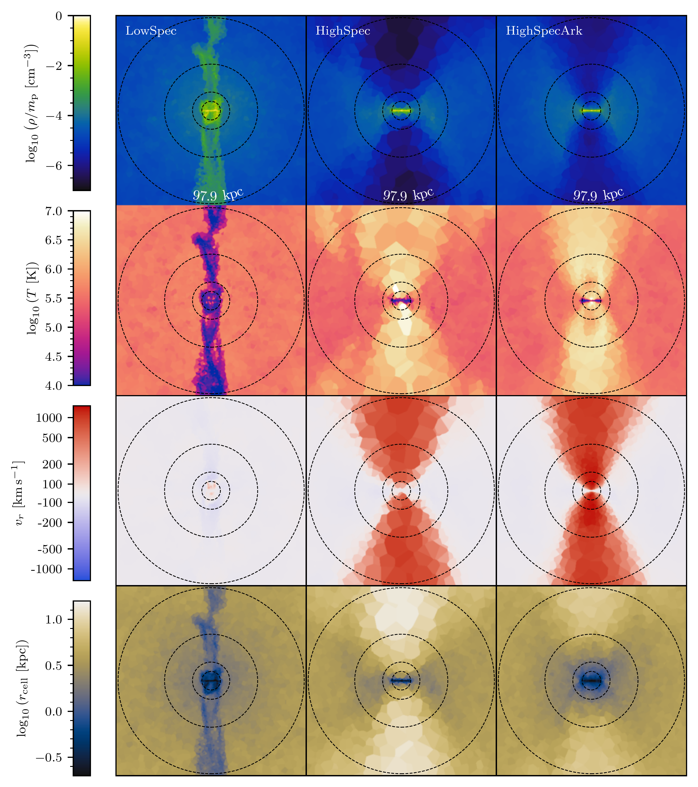
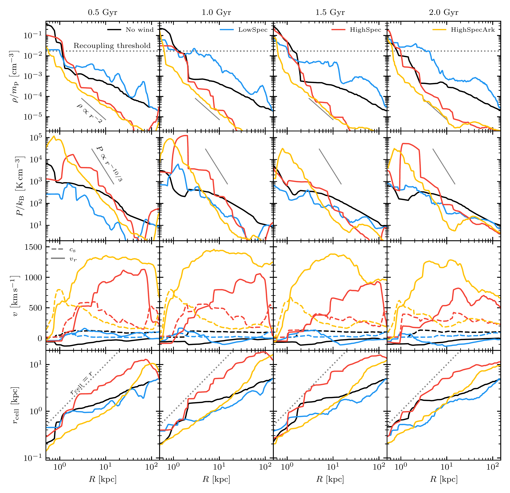
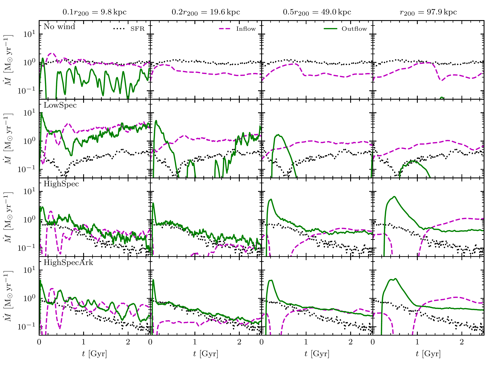

$\newcommand{\ensuremath}{}$
$\newcommand{\xspace}{}$
$\newcommand{\object}[1]{\texttt{#1}}$
$\newcommand{\farcs}{{.}''}$
$\newcommand{\farcm}{{.}'}$
$\newcommand{\arcsec}{''}$
$\newcommand{\arcmin}{'}$
$\newcommand{\ion}[2]{#1#2}$
$\newcommand{\textsc}[1]{\textrm{#1}}$
$\newcommand{\hl}[1]{\textrm{#1}}$
$\newcommand{\footnote}[1]{}$
$\newcommand{\kms}{\mathrm{km s^{-1}}}$
$\newcommand{\Msun}{\mathrm{M_\odot}}$
$\newcommand{\lowspec}{\textit{LowSpec}}$
$\newcommand{\highspec}{\textit{HighSpec}}$
$\newcommand{\highark}{\textit{HighSpecArk}}$
$\newcommand{\medark}{\textit{MedSpecArk}}$
$\newcommand{\subfive}{fiducial}$
$\newcommand{\thebibliography}{\DeclareRobustCommand{\VAN}[3]{##3}\VANthebibliography}$

$\newcommand{\ensuremath}{}$
$\newcommand{\xspace}{}$
$\newcommand{\object}[1]{\texttt{#1}}$
$\newcommand{\farcs}{{.}''}$
$\newcommand{\farcm}{{.}'}$
$\newcommand{\arcsec}{''}$
$\newcommand{\arcmin}{'}$
$\newcommand{\ion}[2]{#1#2}$
$\newcommand{\textsc}[1]{\textrm{#1}}$
$\newcommand{\hl}[1]{\textrm{#1}}$
$\newcommand{\footnote}[1]{}$
$\newcommand{\kms}{\mathrm{km s^{-1}}}$
$\newcommand{\Msun}{\mathrm{M_\odot}}$
$\newcommand{\lowspec}{\textit{LowSpec}}$
$\newcommand{\highspec}{\textit{HighSpec}}$
$\newcommand{\highark}{\textit{HighSpecArk}}$
$\newcommand{\medark}{\textit{MedSpecArk}}$
$\newcommand{\subfive}{fiducial}$
$\newcommand{\thebibliography}{\DeclareRobustCommand{\VAN}[3]{##3}\VANthebibliography}$

# Arkenstone I: A Novel Method for Robustly Capturing High Specific Energy Outflows In Cosmological Simulations

<mark>Appeared on: 2023-01-17</mark> - _Submitted to MNRAS, 26 pages, 15 figures_

<mark><mark>Matthew C. Smith</mark></mark>, et al. -- incl., <mark><mark>Yuan Li</mark></mark>

**Abstract:** $Arkenstone$ is a new model for multiphase, stellar feedback driven galactic winds designed for inclusion in coarse resolution cosmological simulations. In this first paper of a series, we describe the features that allow $Arkenstone$ to properly treat high specific energy wind components and demonstrate them using idealised non-cosmological simulations of a galaxy with a realistic CGM, using the $Arepo$ code. Hot, fast gas phases with low mass loadings are predicted to dominate the energy content of multiphase outflows. In order to treat the huge dynamic range of spatial scales involved in cosmological galaxy formation at feasible computational expense,cosmological volume simulations typically employ a Lagrangian code or else use adaptive mesh refinement with a quasi-Lagrangian refinement strategy.However, it is difficult to inject a high specific energy wind in a Lagrangian scheme without incurring artificial burstiness. Additionally, the low densities inherent to this type of flow result in poor spatial resolution. $Arkenstone$ addresses these issues with a novel scheme for coupling energy into the ISM/CGM transition region which also provides the necessary level of refinement at the base of the wind. In the absence of our improvements, we show that poor spatial resolution near the sonic point of a hot, fast outflow leads to an underestimation of gas acceleration as the wind propagates. We explore the different mechanisms by which low and high specific energy winds can regulate the SFR of galaxies. In future work, we will demonstrate other aspects of the $Arkenstone$ model.

**Figure 8. -** Slices through the domain for the $\subfive$  simulations at 1.5 Gyr.
The slices cut vertically through the galaxy and the wind. From left to right,
we show the simulations with the $\lowspec$ , $\highspec$  and $\highark$  models.
From top to bottom, we show gas density, temperature, radial velocity
and cell radius. The dashed circles indicate 0.1, 0.2, 0.5 and 1 $r_{200}$.
The $\lowspec$  wind produces a narrow column of cold, dense gas which is
already infalling by 1.5 Gyr, while a low altitude fountain is present.
The $\highspec$  and $\highark$  winds are fast, hot and of lower density
than the surrounding CGM. They fill a larger volume than the $\lowspec$ 
wind. The higher spatial resolution provided by the refinement scheme used
in $\highark$  is evident. (*fig:slice_subsonic_5mdisk*)

**Figure 11. -** For the fiducial simulations,
profiles of various quantities as a function of galactocentric radius
measured within a bicone of opening angle $10◦ee$ orientated along
the rotational axis of the disc/CGM. Different columns show different
times throughout the simulation. In the top row, we plot density.
The horizontal grey dotted line indicates the wind particle recoupling threshold
density. For reference, we indicate the $\rho \propto r^{-2}$ slope of the
asymptotic
\citetalias{Chevalier1985} solution (with arbitrary normalisation).
The second row shows pressure, with an indication of the $P \propto r^{-10/3}$
slope of \citetalias{Chevalier1985}.
The third row shows sound speed (dashed line) and radial
velocity (solid line).
The bottom row shows the cell radius.
In the $\highark$  simulation, the wind rapidly accelerates as it flows outwards,
passing through a sonic point within $\sim 1 \mathrm{kpc}$. The $\highspec$  simulation
has much coarser spatial resolution. The acceleration is much more gradual and the
sonic point does not occur until the galactocentric radius is resolved by several cells,
which occurs much further out.
 (*fig:profiles_subsonic_5mdisk*)

**Figure 9. -** SFR, mass inflow and outflow rates through spheres
at various radii for the $\subfive$  simulations. Rows from top to bottom
show the no wind, $\lowspec$ , $\highspec$  and $\highark$  simulations,
respectively.
Columns from left to right show measurements at 0.1, 0.2, 0.5 and
1 $r_{200}$, respectively. For a given simulation, we repeat the
SFR in each column for reference. The $\lowspec$  simulation
reduces the SFR significantly relative to the no wind case by
ejecting large quantities of the ISM. This material is kept circulating
in a low altitude fountain flow. By contrast, the $\highspec$  and $\highark$ 
simulations are far more efficient at suppressing inflows from the CGM. This
gradually leads to a reduction in SFR as the supply of star forming gas is
used up without replenishment. (*fig:mflows_subsonic_5mdisk*)

