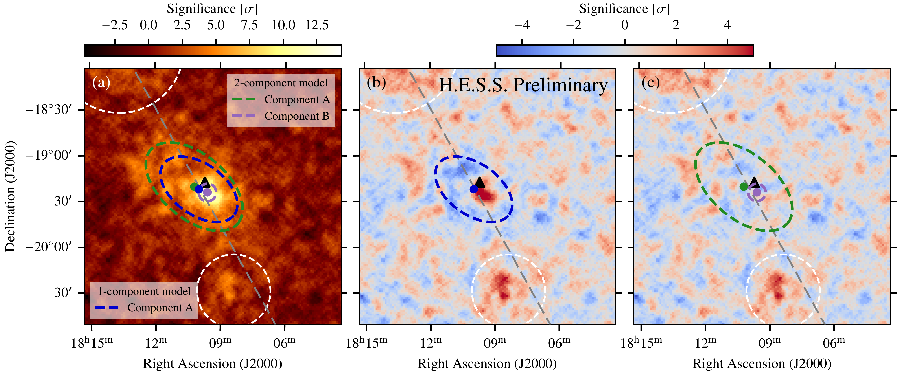
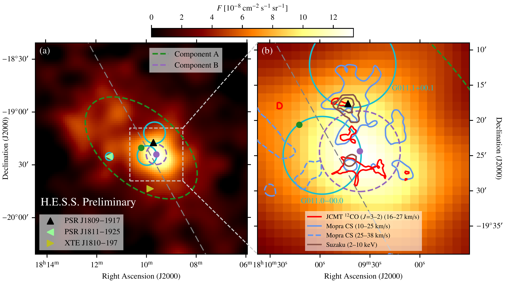
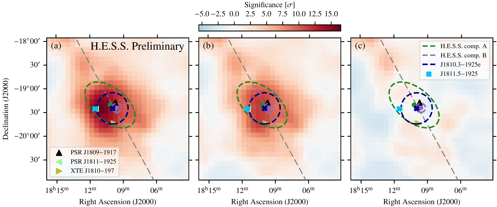

$\newcommand{\ensuremath}{}$
$\newcommand{\xspace}{}$
$\newcommand{\object}[1]{\texttt{#1}}$
$\newcommand{\farcs}{{.}''}$
$\newcommand{\farcm}{{.}'}$
$\newcommand{\arcsec}{''}$
$\newcommand{\arcmin}{'}$
$\newcommand{\ion}[2]{#1#2}$
$\newcommand{\textsc}[1]{\textrm{#1}}$
$\newcommand{\hl}[1]{\textrm{#1}}$
$\newcommand{\hess}{H.E.S.S.\xspace}$
$\newcommand{\fermilat}{\emph{Fermi}-LAT\xspace}$
$\newcommand{\gam}{\gamma\xspace}$
$\newcommand{\hessj}{HESS~J1809-193\xspace}$
$\newcommand{\psrj}{PSR~J1809-1917\xspace}$
$\newcommand{\psrjother}{PSR~J1811-1925\xspace}$
$\newcommand{\snrN}{G011.1+00.1\xspace}$
$\newcommand{\snrS}{G011.0-00.0\xspace}$
$\newcommand{\fermijten}{J1810.3-1925e\xspace}$
$\newcommand{\fermijeleven}{J1811.5-1925\xspace}$
$\newcommand{\}{NAT}$
$\newcommand{\@}{citea}$

$\newcommand{$\ensuremath$}{}$
$\newcommand{$\xspace$}{}$
$\newcommand{$\object$}[1]{\texttt{#1}}$
$\newcommand{$\farcs$}{{.}''}$
$\newcommand{$\farcm$}{{.}'}$
$\newcommand{$\arcsec$}{''}$
$\newcommand{$\arcmin$}{'}$
$\newcommand{$\ion$}[2]{#1#2}$
$\newcommand{$\textsc$}[1]{\textrm{#1}}$
$\newcommand{$\hl$}[1]{\textrm{#1}}$
$\newcommand{$\hess$}{H.E.S.S.$\xspace$}$
$\newcommand{$\fermilat$}{\emph{Fermi}-LAT$\xspace$}$
$\newcommand{$\gam$}{$\gam$ma$\xspace$}$
$\newcommand{$\hess$j}{HESS~J1809-193$\xspace$}$
$\newcommand{$\psrj$}{PSR~J1809-1917$\xspace$}$
$\newcommand{$\psrj$other}{PSR~J1811-1925$\xspace$}$
$\newcommand{$\snrN$}{G011.1+00.1$\xspace$}$
$\newcommand{$\snrS$}{G011.0-00.0$\xspace$}$
$\newcommand{$\fermijten$}{J1810.3-1925e$\xspace$}$
$\newcommand{$\fermijeleven$}{J1811.5-1925$\xspace$}$
$\newcommand{\}{NAT}$
$\newcommand{\@}{citea}$

#  --- a very-high-energy gamma-ray source in a fascinating environment

<mark>Appeared on: 2023-01-19</mark> - _6 pages, 5 figures. Proceedings of the 7th Heidelberg International Symposium on High-Energy Gamma-Ray Astronomy (Gamma2022)_

, V. Joshi, , J. Hinton,  and S. Funk,  for the $\hess$ Collaboration

**Abstract:** $\hess$jis one of the unidentified very-high-energy gamma-ray sources in the$\hess$Galactic Plane Survey (HGPS).  It is located in a rich environment, with an energetic pulsar and associated X-ray pulsar wind nebula, several supernova remnants, and molecular clouds in the vicinity.  Furthermore,$\hess$jwas recently detected at energies above 56 TeV with HAWC, which makes it a PeVatron candidate, that is, a source capable of accelerating cosmic rays up to PeV energies.  We present a new analysis of the TeV gamma-ray emission of$\hess$jwith$\hess$, based on improved analysis techniques.  We find that the emission is best described by two components with distinct morphologies and energy spectra.  We complement this study with an analysis of Fermi-LAT data in the same region.  Finally, taking into account further multi-wavelength data, we interpret our results both in a hadronic and leptonic framework.

**Figure 2. -** $\hess$ significance maps for $\hess$j.
    Panel (a) shows the pre-modelling map, whereas panels (b) and (c) show the residual significance map for the 1-component and the 2-component model, respectively.
    White dashed circles denote regions excluded from the analysis.
   (*fig:sign_maps_hess*)

**Figure 1. -** 
    Map showing the $\gam$-ray flux above \SI{0.27}{TeV} from $\hess$j.
    (a) full region.
    (b) zoom-in on core region.
    The position of $\psrj$ is marked with a black triangle, cyan circles denote the positions of SNRs.
    The green/purple dot and lines display the position and extent of the two components (A/B) of $\hess$j(cf. also Fig. \ref{fig:sign_maps_hess}).
    The grey dashed line marks the Galactic plane.
   (*fig:flux_maps*)

**Figure 3. -** 
    Significance maps for the $\fermilat$ analysis.
    (a) Pre-modelling map.
    (b) With $\fermijeleven$ in the model.
    (c) With $\fermijeleven$ and $\fermijten$ in the model.
    The two components of $\hess$j are displayed as well.
    The grey dashed line marks the Galactic plane.
   (*fig:sign_maps_fermi*)

