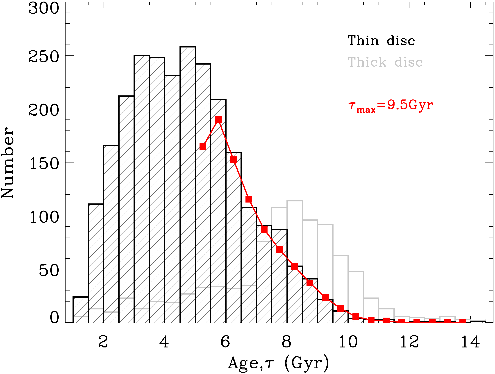
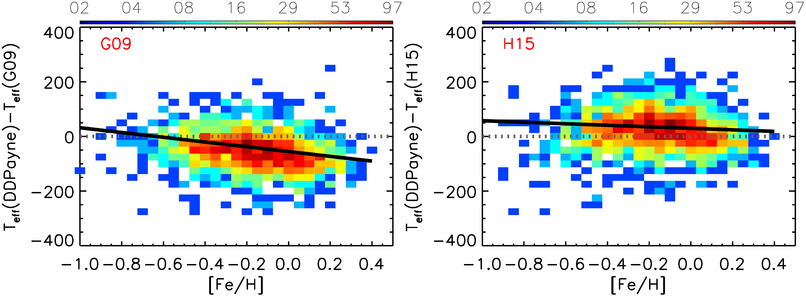
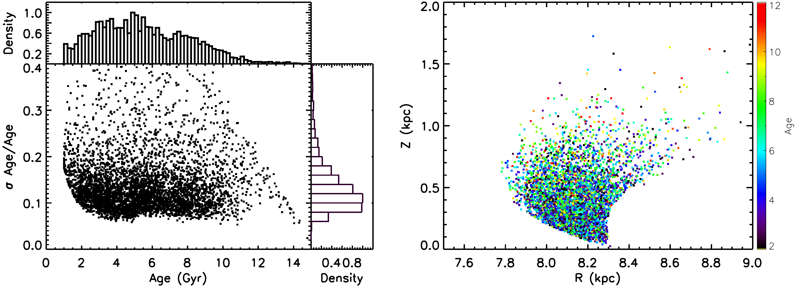

$\newcommand{\ensuremath}{}$
$\newcommand{\xspace}{}$
$\newcommand{\object}[1]{\texttt{#1}}$
$\newcommand{\farcs}{{.}''}$
$\newcommand{\farcm}{{.}'}$
$\newcommand{\arcsec}{''}$
$\newcommand{\arcmin}{'}$
$\newcommand{\ion}[2]{#1#2}$
$\newcommand{\textsc}[1]{\textrm{#1}}$
$\newcommand{\hl}[1]{\textrm{#1}}$
$\newcommand{\footnote}[1]{}$
$\newcommand{\kepler}[0]{\emph{Kepler}}$
$\newcommand{\gaia}[0]{\emph{Gaia}}$
$\newcommand{\mmode}[1]{\ifmmode{#1}\else{#1}\fi}$
$\newcommand{\Dnu}[0]{\mmode{\Delta\nu}}$
$\newcommand{\numax}[0]{\mmode{\nu_\text{max}}}$
$\newcommand{\Teff}[0]{\mmode{T_\text{eff}}~}$
$\newcommand{\liyg}[1]{{\color{orange} #1}}$
$\newcommand$
$\newcommand{\thebibliography}{\DeclareRobustCommand{\VAN}[3]{##3}\VANthebibliography}$

$\newcommand{\ensuremath}{}$
$\newcommand{\xspace}{}$
$\newcommand{\object}[1]{\texttt{#1}}$
$\newcommand{\farcs}{{.}''}$
$\newcommand{\farcm}{{.}'}$
$\newcommand{\arcsec}{''}$
$\newcommand{\arcmin}{'}$
$\newcommand{\ion}[2]{#1#2}$
$\newcommand{\textsc}[1]{\textrm{#1}}$
$\newcommand{\hl}[1]{\textrm{#1}}$
$\newcommand{\footnote}[1]{}$
$\newcommand{\kepler}[0]{\emph{Kepler}}$
$\newcommand{\gaia}[0]{\emph{Gaia}}$
$\newcommand{\mmode}[1]{\ifmmode{#1}\else{#1}\fi}$
$\newcommand{\Dnu}[0]{\mmode{\Delta\nu}}$
$\newcommand{\numax}[0]{\mmode{\nu_\text{max}}}$
$\newcommand{\Teff}[0]{\mmode{T_\text{eff}}~}$
$\newcommand{\liyg}[1]{{\color{orange} #1}}$
$\newcommand$
$\newcommand{\thebibliography}{\DeclareRobustCommand{\VAN}[3]{##3}\VANthebibliography}$

# Timing the formation of the Galactic thin disc with asteroseismic stellar ages

<mark>Appeared on: 2023-01-19</mark> - _17 pages, 13 figures, accepted by MNRAS_

Wu Yaqian, et al. -- incl., <mark><mark>Zhao Gang</mark></mark>, <mark><mark>Li Yaguang</mark></mark>

**Abstract:** The formation of the extended thin disc is the most spectacular event of our Galaxy in the past $\sim8$ Gyr. To unveil this process, obtaining precise and accurate stellar ages for a large sample of stars is essential although challenging.In this work, we present the asteroseismic age determination of 5306 red giant branch stars using $\kepler$ and LAMOST data, with a thorough examination of how the age determination is affected by the choice of different temperature scales and stellar models. Thanks to the high precision of the asteroseismic and spectroscopic parameters of our sample stars, we are able to achieve age determination with an average accuracy of 12 per cent. However, the age determination is sensitively dependent on the adopted temperature scale, as 50 K difference in effective temperature may cause larger than 10 per cent systematic uncertainty in the age estimates. Using the ages derived with the most plausible set of the temperature scale, we study the age distribution of the chemical thin disc stars, and present an estimate of the formation epoch of the first Galactic thin disc stars. We find that the first (oldest) thin disc stars have an age of $9.5^{+0.5(\rm rand.)+0.5(\rm sys.)}_{-0.4(\rm rand.)-0.3(\rm sys.)}$ Gyr, where the systematic uncertainties reflect ages estimated using different stellar evolutionary models. At this epoch, the Galactic thick disc was still forming stars, indicating there is a time window when both the thin and thick discs of our Galaxy were forming stars together. Moreover, we find that the first thin disc stars exhibit a broad distribution of Galactocentric radii, suggesting that the inner and outer thin discs began to form simultaneously.

**Figure 9. -** Age distribution histogram for the thin (black) and thick disc (grey) stars. The red line and squares represent the mock data set that best fits the the observed age histogram for determining the upper age bound of the thin disc stars (see main text). The fit suggests an upper bound of 9.5 Gyr for the intrinsic ages of the thin disc stars. (*fig6*)

**Figure 3. -** * left*: Differential temperature between the LAMOST DD-Payne estimates and the photometric estimates using the \citet{Gonz2009} temperature scale as a function of [Fe/H] with colour-coded stellar number density.
    The solid line in black shows a linear fit to the difference for the disc stars, and it yields a negative trend of $\Delta$Teff= -54.9690 - 86.8584$\times$[Fe/H]. * Right*: Same as the left panel, but for temperature difference between the LAMOST DD-Payne estimates and the photometric estimates using the \citet{Huang2015} temperature scale. A linear fit (black) is found to well reproduce the systematic trend for the disc stars: $\Delta$Teff= 29.8236 - 27.8769$\times$[Fe/H]. (*fig:fig2*)

**Figure 4. -** * Left*: Distributions of age estimates, as well as their error estimates, for the RGB sample stars. * Right*: Spatial distribution of the RGB sample stars with colour-coded ages in the $R$ and $Z$ plane. (*fig4*)

