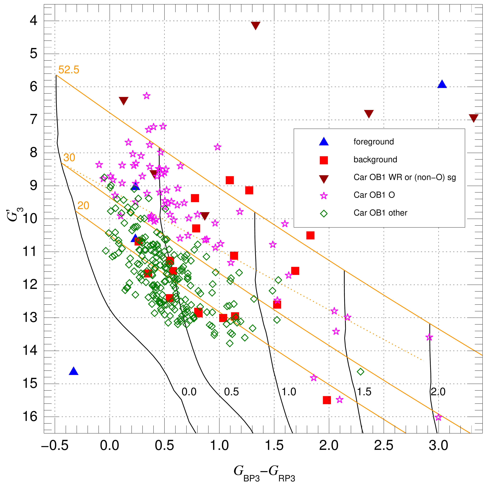
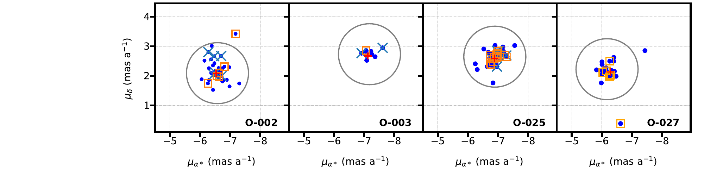
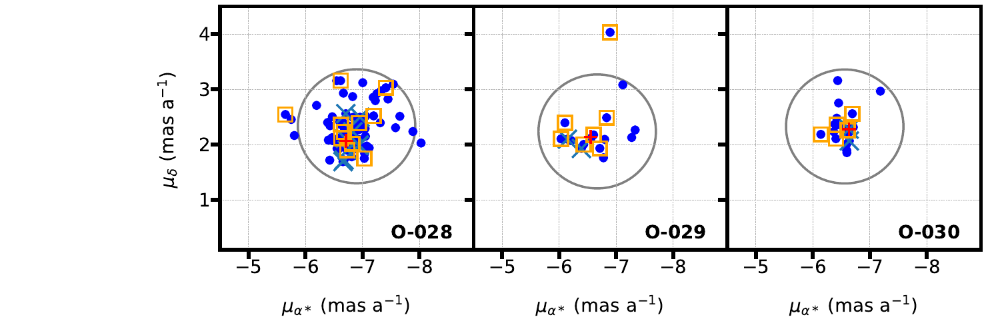
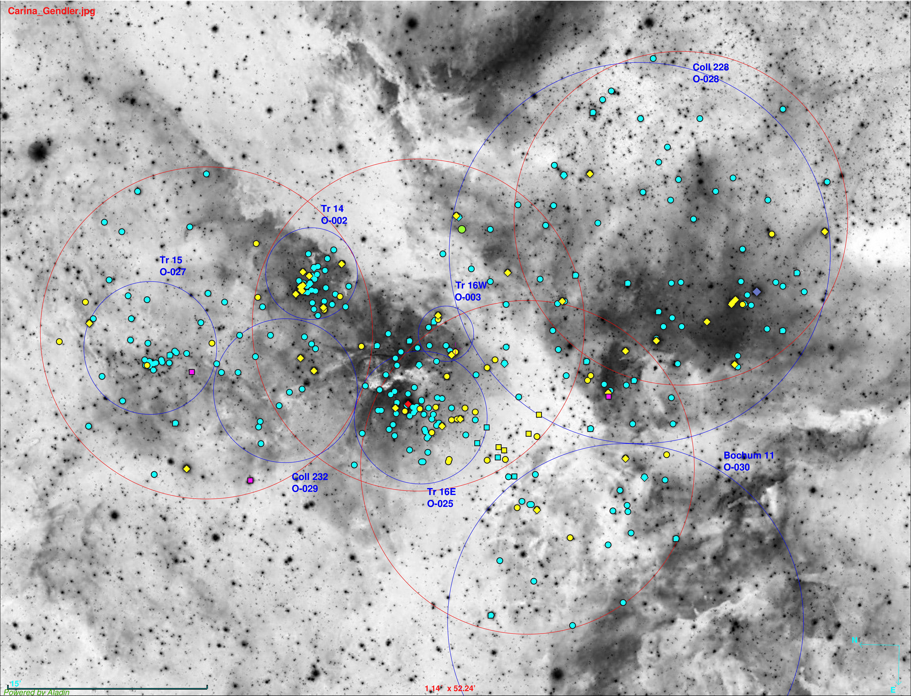

$\newcommand{\ensuremath}{}$
$\newcommand{\xspace}{}$
$\newcommand{\object}[1]{\texttt{#1}}$
$\newcommand{\farcs}{{.}''}$
$\newcommand{\farcm}{{.}'}$
$\newcommand{\arcsec}{''}$
$\newcommand{\arcmin}{'}$
$\newcommand{\ion}[2]{#1#2}$
$\newcommand{\textsc}[1]{\textrm{#1}}$
$\newcommand{\hl}[1]{\textrm{#1}}$
$\newcommand{\GG}{\mbox{G_3}}$
$\newcommand{\GGc}{\mbox{G^\prime_3}}$
$\newcommand{\BP}{\mbox{G_{\rm BP3}}}$
$\newcommand{\RP}{\mbox{G_{\rm RP3}}}$
$\newcommand{\BPRP}{\mbox{G_{\rm BP3}-G_{\rm RP3}}}$
$\newcommand{\pic}{\mbox{\varpi_{\rm c}}}$
$\newcommand{\mci}[1]{\multicolumn{1}{c}{#1}}$
$\newcommand{\VO}[1]{Villafranca~O-{#1}}$
$\newcommand{\EBV}{\mbox{E(4405-5495)}}$
$\newcommand{\RV}{\mbox{R_{5495}}}$
$\newcommand{\lili}{\mbox{LiLiMaRlin}}$
$\newcommand{\kms}{km s^{-1}}$
$\newcommand{\Teff}{\mbox{T_{\rm eff}}}$
$\newcommand{\bibname}{References}$

$\newcommand{$\ensuremath$}{}$
$\newcommand{$\xspace$}{}$
$\newcommand{$\object$}[1]{\texttt{#1}}$
$\newcommand{$\farcs$}{{.}''}$
$\newcommand{$\farcm$}{{.}'}$
$\newcommand{$\arcsec$}{''}$
$\newcommand{$\arcmin$}{'}$
$\newcommand{$\ion$}[2]{#1#2}$
$\newcommand{$\textsc$}[1]{\textrm{#1}}$
$\newcommand{$\hl$}[1]{\textrm{#1}}$
$\newcommand{$\GG$}{\mbox{G_3}}$
$\newcommand{$\GG$c}{\mbox{G^\prime_3}}$
$\newcommand{$\BP$}{\mbox{G_{\rm BP3}}}$
$\newcommand{$\RP$}{\mbox{G_{\rm RP3}}}$
$\newcommand{$\BP$RP}{\mbox{G_{\rm BP3}-G_{\rm RP3}}}$
$\newcommand{$\pic$}{\mbox{\varpi_{\rm c}}}$
$\newcommand{$\mci$}[1]{\multicolumn{1}{c}{#1}}$
$\newcommand{$\VO$}[1]{Villafranca~O-{#1}}$
$\newcommand{$\EBV$}{\mbox{E(4405-5495)}}$
$\newcommand{$\RV$}{\mbox{R_{5495}}}$
$\newcommand{$\lili$}{\mbox{LiLiMaRlin}}$
$\newcommand{$\kms$}{km s^{-1}}$
$\newcommand{$\Teff$}{\mbox{T_{\rm eff}}}$
$\newcommand{$\bibname$}{References}$

# Gaia-ESO Survey: massive stars in the Carina Nebula : I. A new census of OB stars

<mark>Appeared on: 2023-01-23</mark> - _Accepted for publication in A&A, 62 pages, 8 figures_

S. R. Berlanas, et al. -- incl., <mark><mark>A. Herrero</mark></mark>, <mark><mark>L. Mahy</mark></mark>, <mark><mark>M. Bergemann</mark></mark>

**Abstract:** The Carina Nebula is one of the major massive star-forming regions in the Galaxy. Its relatively nearby distance (2.35 kpc) makes it an ideal laboratory for the study of massive star formation, structure and evolution, both for individual stars and stellar systems.   Thanks to the high-quality spectra provided by Gaia-ESO survey and the LiLiMaRlin library, as well as Gaia EDR3 astrometry, a detailed and homogeneous spectroscopic characterization of its massive stellar content can be carried out.Our main objective is to spectroscopically characterize all massive members of the Carina Nebula in the Gaia-ESO survey footprint to provide an updated census of massive stars in the region and an updated estimate of the binary fraction of O stars.We perform accurate spectral classification by using an interactive code that compares spectra with spectral libraries of OB standards, as well as line-based classic methods. Membership is calculated using our own algorithm based on Gaia EDR3 astrometry. To check the correlation between the spectroscopic n-qualifier and the rotational velocity, we use the semi-automated tool for the line-broadening characterization of OB stars  which is based on a combined Fourier Transform and Goodness-of-fit methodology.The Gaia-ESO survey sample of massive OB stars in the Carina Nebula consists of 234 stars. The addition of brighter sources from the Galactic O-Star Spectroscopic Survey and additional sources from the literature allows us to create the most complete census of massive OB stars done so far in the region. It contains a total of   316 stars, being 18 of them in the background and four in the foreground. Of the 294 stellar systems in Car OB1, 74 are of O type, 214 are of non-supergiant B type and 6 are of WR or non-O supergiant (II to Ia) spectral class. We identify 20 spectroscopic binary systems with an O-star primary, of which 6 are reported for the first time, and another 18 with a B-star primary, of which 13 are new detections. The average observed double-lined binary fraction of O-type stars in the surveyed region is 0.35, which represents a lower limit. We find a good correlation between the spectroscopic n-qualifier and the projected rotational velocity of the stars. The fraction of candidate runaways among the stars with and without the n-qualifier is 4.4$\%$and 2.4$\%$, respectively, although non resolved double-lined binaries can be contaminating the fast rotators sample.

**Figure 3. -** First panel, see next page for the second one: {\it Gaia} EDR3 CMD for the stars with spectral types in this paper. Different symbols and colors are used to represent stars with parallaxes compatible with being (or otherwise assumed to be) in the foreground (4), in the background (18), or in Car OB1 (294). Of the Car OB1 stars, 6 are of Wolf-Rayet or non-O supergiant (II to Ia) spectral class, 74 are of O type, and 214 are of non-supergiant B type. Four of the \citet{Preietal21} stars are outside the frame towards the lower right due to their high extinction. Black lines show the average main sequence at a distance of 2.35 kpc with no extinction and with values of $\EBV$ of 0.5, 1.0, 1.5, and 2.0 (labelled) using the extinction law of \citet{Maizetal14a} with a value of $\RV$ of 4.5, which is typical of the region but with a large dispersion  \citep{MaizBarb18}. Solid orange lines show the $\RV$ = 4.5 extinction tracks for average MS stars of $\Teff$ of 52.5 kK, 30 kK, and 20 kK (labelled), respectively. The dotted orange line shows the $\RV$ = 3.0 extinction track for $\Teff$ = 30 kK. (*Gaia_CMD*)

**Figure 6. -** Proper motion distribution from Gaia EDR3 astrometry for all stars of our census in each assigned Villafranca group. Orange squares indicate those OB stars analyzed in this work that are rotating at $v\sin i$$\geq$ 200 km s$^{-1}$. Blue crosses represent identified binary systems. Circles represent group proper motion constraints, whose centers $\mu_{\alpha *,g}$  and  $\mu_{\delta,g}$ are those shown in Table \ref{pm_groups} in the central columns. For comparison, red plus symbols indicate group centers from Villafranca II and III works. Note that stars labelled as Car OB1 members are not included in the panels. (*pm_fast*)

**Figure 2. -** Negative image of the Great Carina Nebula by Robert Gendler and Stephane Guisard showing the location of the whole census of massive stars in the GES surveyed area presented in this work. Yellow and cyan colors indicate O and B-type stars, respectively. Green, red, purple and pink colors have been used to represent the sdO, LBV,  WR and RSG stars, respectively. Small filled-circles refer to the GES sample while rhombuses and squares refer to stars from GOSSS/LiLiMarlin and other works \citep[][]{smith06a,Alexetal16,Preietal21} not present in GES, respectively. Red circles indicate the observing GES pointings while the blue ones indicate the Villafranca groups: O-002 (Trumpler 14), O-003 (Trumpler 16 W), O-025 (Trumpler 16 E), O-027 (Trumpler 15), O-028 (Collinder 228), O-029 (Collinder 232), and O-030 (Bochum 11). The V-shaped extinction lane that dominates the appearance of the nebula is clearly seen crossing the image from top to bottom. (*carina*)

