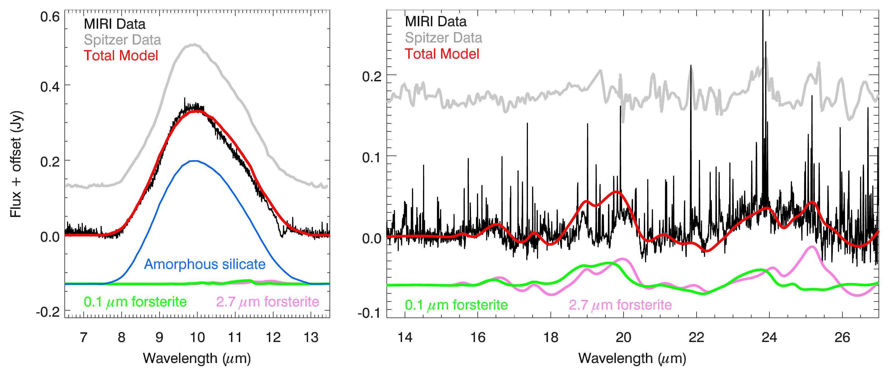
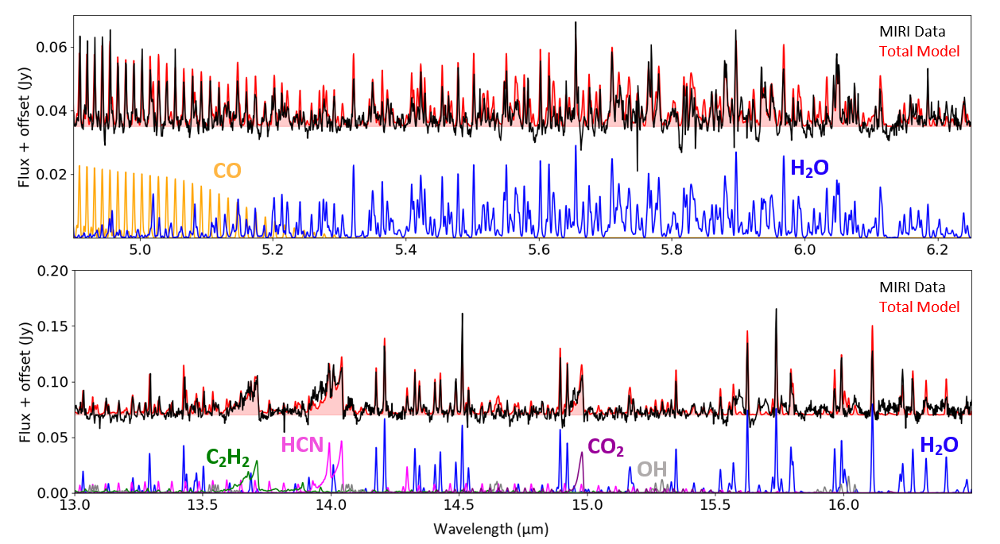
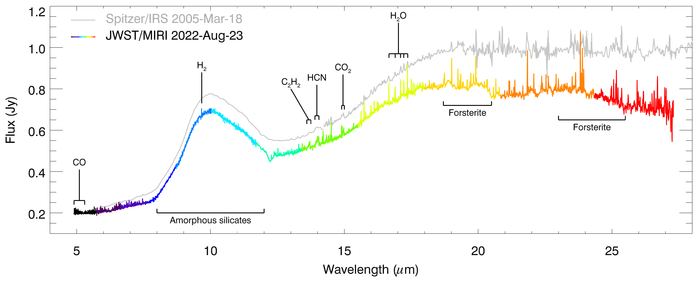

$\newcommand{\ensuremath}{}$
$\newcommand{\xspace}{}$
$\newcommand{\object}[1]{\texttt{#1}}$
$\newcommand{\farcs}{{.}''}$
$\newcommand{\farcm}{{.}'}$
$\newcommand{\arcsec}{''}$
$\newcommand{\arcmin}{'}$
$\newcommand{\ion}[2]{#1#2}$
$\newcommand{\textsc}[1]{\textrm{#1}}$
$\newcommand{\hl}[1]{\textrm{#1}}$
$\newcommand{\vdag}{(v)^\dagger}$
$\newcommand$
$\newcommand$
$\newcommand$
$\newcommand$
$\newcommand$
$\newcommand$

$\newcommand{$\ensuremath$}{}$
$\newcommand{$\xspace$}{}$
$\newcommand{$\object$}[1]{\texttt{#1}}$
$\newcommand{$\farcs$}{{.}''}$
$\newcommand{$\farcm$}{{.}'}$
$\newcommand{$\arcsec$}{''}$
$\newcommand{$\arcmin$}{'}$
$\newcommand{$\ion$}[2]{#1#2}$
$\newcommand{$\textsc$}[1]{\textrm{#1}}$
$\newcommand{$\hl$}[1]{\textrm{#1}}$
$\newcommand{$\vdag$}{(v)^\dagger}$
$\newcommand$
$\newcommand$
$\newcommand$
$\newcommand$
$\newcommand$
$\newcommand$

# JWST/MIRI Spectroscopy of the Disk of the Young Eruptive Star EX Lup in Quiescence

<mark>Appeared on: 2023-01-24</mark> - _9 pages, 4 figures, accepted for publication in ApJL_

\'Agnes K\'osp\'al, et al. -- incl., <mark>Lindsey Diehl</mark>, <mark>Jeroen Bouwman</mark>, <mark>Joel D. Green</mark>, <mark>Thomas Henning</mark>

**Abstract:** EX Lup is a low-mass pre-main sequence star that occasionally shows accretion-related outbursts. Here, we present JWST/MIRI medium resolution spectroscopy obtained for EX Lup fourteen years after its powerful outburst. EX Lup is now in quiescence and displays a Class II spectrum. We detect a forest of emission lines from molecules previously identified in infrared spectra of classical T Tauri disks:\ce{H2O}, OH,\ce{H2}, HCN,\ce{C2H2}, and\ce{CO2}. The detection of organic molecules demonstrates that they are back after disappearing during the large outburst. Spectral lines from water and OH are for the first time de-blended and will provide a much improved characterization of their distribution and density in the inner disk. The spectrum also shows broad emission bands from warm, sub-micron size amorphous silicate grains at 10 and 18$ \mu$m. During the outburst, in 2008, crystalline forsterite grains were annealed in the inner disk within 1 au, but their spectral signatures in the 10$\mu$m silicate band later disappeared. With JWST we re-discovered these crystals via their 19.0, 20.0, and 23.5$ \mu$m emission, whose strength implies that the particles are at$\sim$3 au from the star. This suggests that crystalline grains formed in 2008 were transported outwards and now approach the water snowline, where they may be incorporated into planetesimals. Containing several key tracers of planetesimal and planet formation, EX Lup is an ideal laboratory to study the effects of variable luminosity on the planet-forming material and may provide explanation for the observed high crystalline fraction in solar system comets.

**Figure 2. -** Continuum-subtracted JWST/MIRI spectrum of EX Lup with various dust models, and with the Spitzer/IRS quiescent spectrum from 2005. The model curves were shifted for clarity.\label{fig:dust} (*fig:dust*)

**Figure 3. -** Continuum-subtracted MIRI spectrum with slab models for the identification of molecular lines.\label{fig:slab_models} (*fig:slab_models*)

**Figure 1. -** JWST/MIRI MRS spectrum of EX Lup (color), shown together with an earlier Spitzer/IRS spectrum (gray), both taken in quiescence. The different colors mark the individual sub-bands of the JWST spectrum. We indicated some of the observed molecular and solid state features. We note that the spectrum contains hundreds of \ce{H2O} lines; we only marked a few of them as an illustration. The JWST spectrum shown here is available as Data behind the Figure.\label{fig:test_aper} (*fig:test_aper*)

