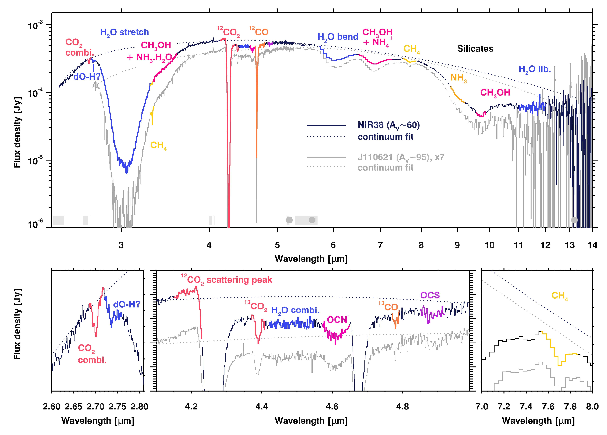
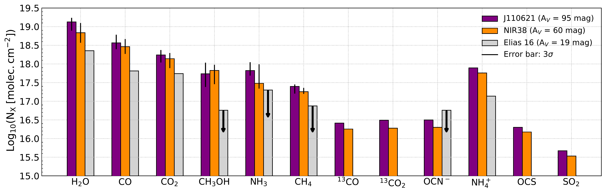
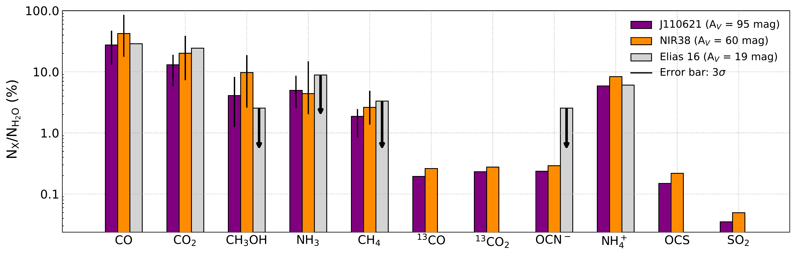
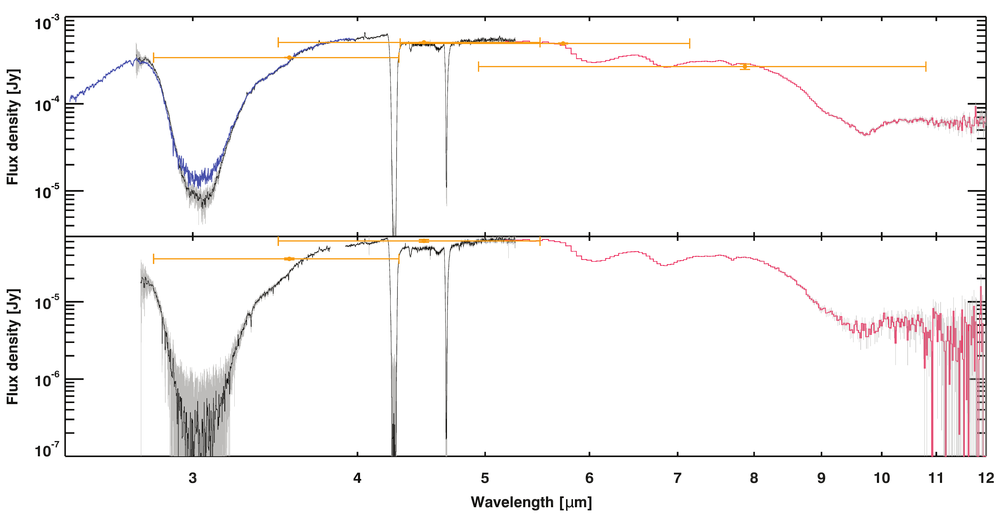

$\newcommand{\ensuremath}{}$
$\newcommand{\xspace}{}$
$\newcommand{\object}[1]{\texttt{#1}}$
$\newcommand{\farcs}{{.}''}$
$\newcommand{\farcm}{{.}'}$
$\newcommand{\arcsec}{''}$
$\newcommand{\arcmin}{'}$
$\newcommand{\ion}[2]{#1#2}$
$\newcommand{\textsc}[1]{\textrm{#1}}$
$\newcommand{\hl}[1]{\textrm{#1}}$
$\newcommand{\bibinfo}[2]{#2}$
$\newcommand{\eprint}[2][]{\url{#2}}$
$\newcommand{\tablenotes}$
$\newcommand{\cmark}{\textcolor{green}{\ding{51}}}$
$\newcommand{\xmark}{\textcolor{red}{\ding{55}}}$
$\newcommand{\ED}[1]{{\color{blue!50}\;ED: #1}}$
$\newcommand{\arraystretch}{1.3}$
$\newcommand{\arraystretch}{1.0}$
$\newcommand{\}{url}$
$\newcommand{\urlprefix}{URL }$
$\newcommand{\doiprefix}{DOI: }$

$\newcommand{$\ensuremath$}{}$
$\newcommand{$\xspace$}{}$
$\newcommand{$\object$}[1]{\texttt{#1}}$
$\newcommand{$\farcs$}{{.}''}$
$\newcommand{$\farcm$}{{.}'}$
$\newcommand{$\arcsec$}{''}$
$\newcommand{$\arcmin$}{'}$
$\newcommand{$\ion$}[2]{#1#2}$
$\newcommand{$\textsc$}[1]{\textrm{#1}}$
$\newcommand{$\hl$}[1]{\textrm{#1}}$
$\newcommand{$\bibinfo$}[2]{#2}$
$\newcommand{$\eprint$}[2][]{\url{#2}}$
$\newcommand{$\tablenotes$}$
$\newcommand{$\cmark$}{\textcolor{green}{\ding{51}}}$
$\newcommand{$\xmark$}{\textcolor{red}{\ding{55}}}$
$\newcommand{$\ED$}[1]{{\color{blue!50}\;ED: #1}}$
$\newcommand{$\arraystretch$}{1.3}$
$\newcommand{$\arraystretch$}{1.0}$
$\newcommand{\}{url}$
$\newcommand{$\urlprefix$}{URL }$
$\newcommand{$\doiprefix$}{DOI: }$

# An Ice Age JWST inventory of dense molecular cloud ices

<mark>Appeared on: 2023-01-24</mark> - _To appear in Nature Astronomy on January 23rd, 2023. 33 pages, 16 figures, 3 tables; includes extended and supplemental data sections. Part of the JWST Ice Age Early Release Science program's science enabling products. Enhanced spectra downloadable on Zenodo at the following DOI: 10.5281/zenodo.7501239_

M. K. McClure, et al. -- incl., <mark>G. Perotti</mark>, <mark>Z.L. Smith</mark>, <mark>W. A. Brown</mark>, <mark>Herma M. Cuppen</mark>, <mark>D.C. Lis</mark>, <mark>H.~Linnartz</mark>

**Abstract:** \bf{Icy grain mantles are the main reservoir of the volatile elements that link chemical processes in dark, interstellar clouds with the formation of planets and composition of their atmospheres. The initial ice composition is set in the cold, dense parts of molecular clouds, prior to the onset of star formation. With the exquisite sensitivity of JWST, this critical stage of ice evolution is now accessible for detailed study. Here we show the first results of the Early Release Science program "Ice Age" that reveal the rich composition of these dense cloud ices. Weak ices, including, $^{13}$CO$_2$, OCN$^-$, $^{13}$CO, OCS, and COMs functional groups are now detected along two pre-stellar lines of sight. The $^{12}$CO$_2$ ice profile indicates modest growth of the icy grains. Column densities of the major and minor ice species indicate that ices contribute between 2 and 19\% of the bulk budgets of the key C, O, N, and S elements. Our results suggest that the formation of simple and complex molecules could begin early in a water-ice rich environment.}

**Figure 1. -** \textbf{NIRSpec FS [NIRCam WFSS] and MIRI LRS spectra of NIR38 and J110621.} Top: Full NIRSpec FS and MIRI LRS spectra of NIR38
($A_V\sim60$, solid navy line) and J110621 ($A_V\sim95$, solid light gray line), with associated continuum fits (dotted lines). For NIR38, a preliminary NIRCam WFSS spectrum has been scaled to the NIRSpec spectrum at 3.8 $\mu$m and spliced in to cover the NIRSpec FS gap from 3.85--3.9 $\mu$m and extend the spectrum to 2.5 $\mu$m. Ice absorption features are color-coded according to species and labelled in the NIR38 spectrum. Wavelength regions used for the continuum fit are indicated by light gray bars (NIRSpec) and dark gray filled circles (MIRI) at the bottom of the top panel. Bottom: Zoom in on the weaker ice features and structure revealed by JWST. The potential dangling O-H feature is indicted by "dO-H", and the combination modes of CO$_2$ and H$_2$O by "combi." (*main_fig1*)

**Figure 4. -** \textbf{Barplots showing the derived ice column density for different species  towards NIR38 ($A_V \sim 60$ mag) and J110621 ($A_V \sim 95$ mag).}(Top) Column densities of the ice species identified in this work, compared to the literature values of Elias 16 ($A_V \sim 19$ mag)\cite{Knez2005}. The column densities of the major ice components are from the global \texttt{ENIIGMA} fit (best of n=112 models), and we use the values from the local fits for the minor ice components. Black arrows indicate upper limits and error bars are taken from the 3$\sigma$ confidence intervals. (Bottom) Relative column densities of the detected ices, normalized to H$_2$O ice. For the major ice components, we use the values from the global \texttt{ENIIGMA} fit, and for the minor ice components, we use the values from the local fits. Black arrows indicate upper limits and error bars are taken from the 3$\sigma$ confidence intervals. (*main_fig4*)

**Figure 2. -** \textbf{Data quality comparison for NIR38 and J110621.}(Top panel) Comparison of the NIRCam WFSS (blue), NIRSpec FS (black), and MIRI LRS FS (red) spectra of the $A_V=60$ background star. Error bars (gray) are 3$\sigma$, and in some regions are smaller than the thickness of the lines. Spitzer IRAC photometry (gold points) from the IPAC SEIP catalog is given for reference, with error bars and bandpass indicated. (Bottom panel) Comparison of NIRSpec FS and MIRI LRS FS data for the $A_V=95$ star. Colors are the same as in the top panel. (*main_fig2*)

