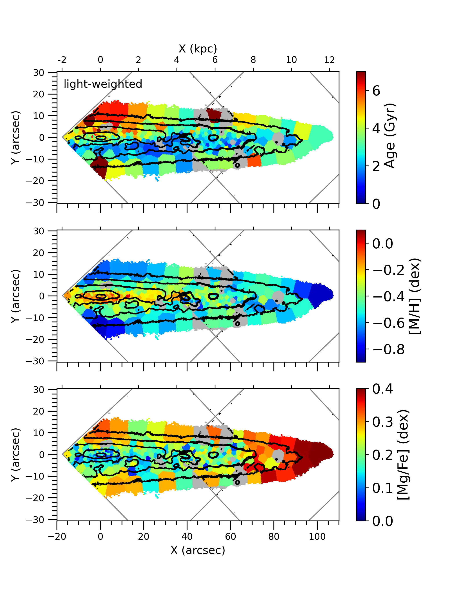
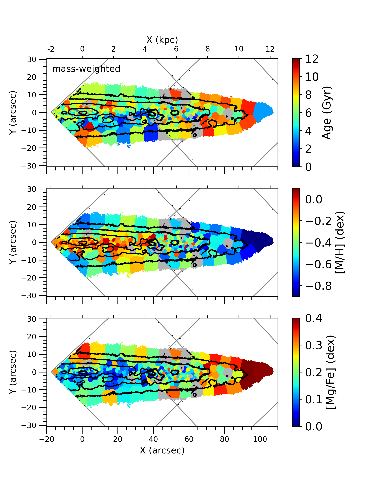
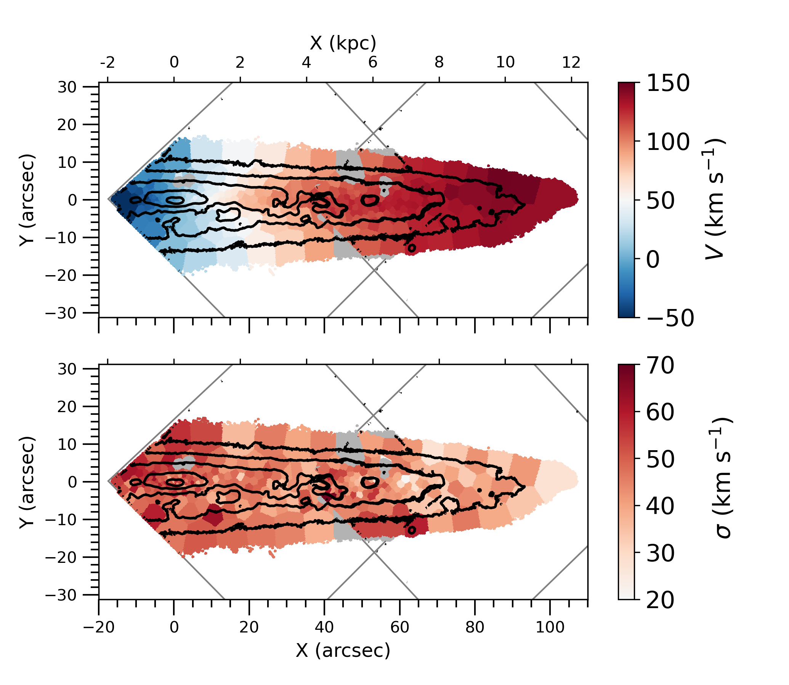
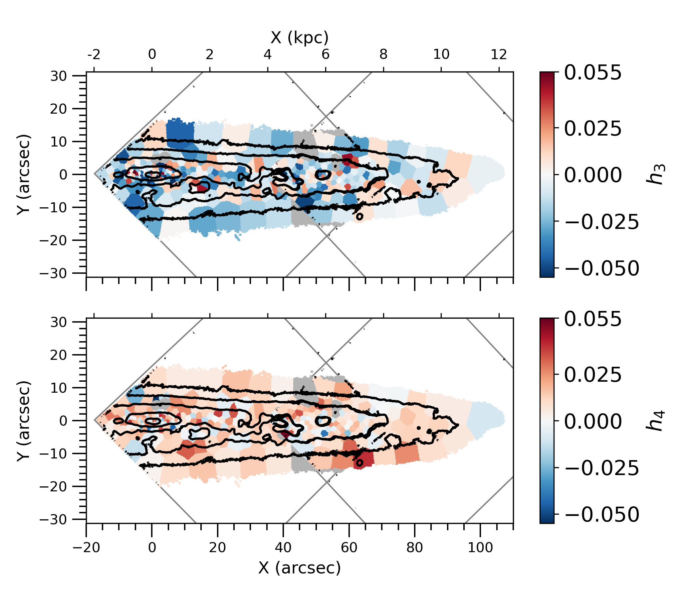
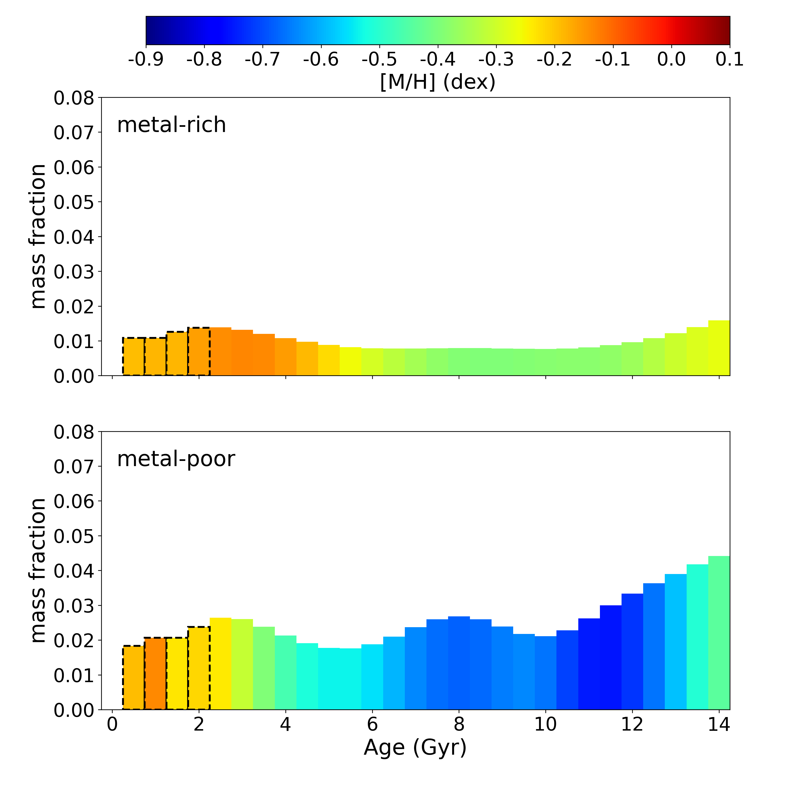
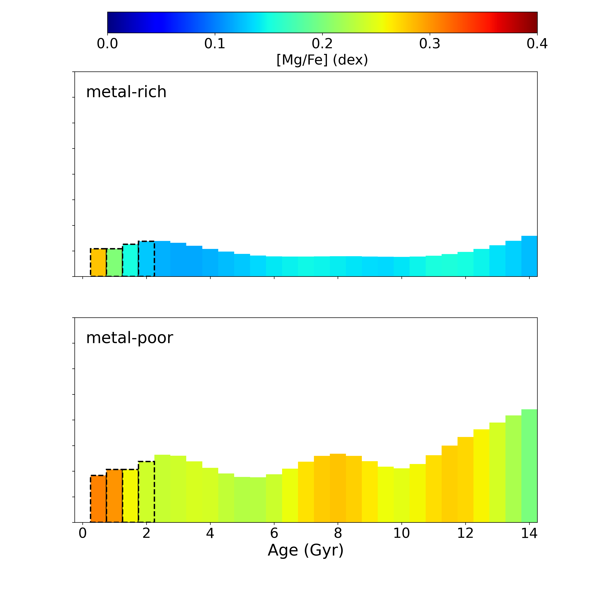

$\newcommand{\ensuremath}{}$
$\newcommand{\xspace}{}$
$\newcommand{\object}[1]{\texttt{#1}}$
$\newcommand{\farcs}{{.}''}$
$\newcommand{\farcm}{{.}'}$
$\newcommand{\arcsec}{''}$
$\newcommand{\arcmin}{'}$
$\newcommand{\ion}[2]{#1#2}$
$\newcommand{\textsc}[1]{\textrm{#1}}$
$\newcommand{\hl}[1]{\textrm{#1}}$
$\newcommand{\thebibliography}{\DeclareRobustCommand{\VAN}[3]{##3}\VANthebibliography}$

$\newcommand{\ensuremath}{}$
$\newcommand{\xspace}{}$
$\newcommand{\object}[1]{\texttt{#1}}$
$\newcommand{\farcs}{{.}''}$
$\newcommand{\farcm}{{.}'}$
$\newcommand{\arcsec}{''}$
$\newcommand{\arcmin}{'}$
$\newcommand{\ion}[2]{#1#2}$
$\newcommand{\textsc}[1]{\textrm{#1}}$
$\newcommand{\hl}[1]{\textrm{#1}}$
$\newcommand{\thebibliography}{\DeclareRobustCommand{\VAN}[3]{##3}\VANthebibliography}$

# The vertical structure of the spiral galaxy NGC 3501: first stages of the formation of a thin metal-rich disc

<mark>Appeared on: 2023-01-23</mark> - _15 pages, 12 figures. Accepted for publication in MNRAS_

<mark><mark>Natascha Sattler</mark></mark>, et al. -- incl., <mark><mark>Francesca Pinna</mark></mark>, <mark><mark>Nadine Neumayer</mark></mark>

**Abstract:** We trace the evolution of the edge-on spiral galaxy NGC 3501, making use of its stellar populations extracted from deep integral-field spectroscopy MUSE observations. We present stellar kinematic and population maps, as well as the star formation history, of the south-western half of the galaxy.The derived maps of the stellar line-of-sight velocity and velocity dispersion are quite regular, show disc-like rotation, and no other structural component of the galaxy.However, maps of the stellar populations exhibit structures in the mass-weighted and light-weighted age, total metallicity and [ Mg/Fe ] abundance.These maps indicate that NGC 3501 is a young galaxy, consisting mostly of stars with ages between 2 to 8 Gyr.Also, they show a thicker more extended structure that is metal-poor and $\alpha$ -rich, and another inner metal-rich and $\alpha$ -poor one with smaller radial extension.While previous studies revealed that NGC 3501 shows only one morphological disc component in its vertical structure, we divided the galaxy into two regions: an inner metal-rich midplane and a metal-poor thicker envelope.Comparing the star formation history of the inner thinner metal-rich disc and the thicker metal-poor disc,we see that the metal-rich component evolved more steadily, while the metal-poor one experienced several bursts of star formation.We propose this spiral galaxy is being observed in an early evolutionary phase, with a thicker disc already in place and an inner thin disc in an early formation stage. So we are probably witnessing the birth of a future massive thin disc, continuously growing embedded in a preexisting thicker disc. \

**Figure 7. -** Left: Stellar population maps showing the light-weighted age (top), total metallicity [M/H](middle) and [Mg/Fe]-abundance (bottom). Right: Stellar population maps showing the mass-weighted age (top), total metallicity [M/H](middle) and [Mg/Fe]-abundance (bottom). The approximate positions of the MUSE pointings are indicated by grey lines and the discarded bins are displayed in grey, while the isophotes are displayed in black.
     (*fig:pop*)

**Figure 6. -** Left: Stellar kinematic maps of the mean velocity $V$(upper panel) and velocity dispersion $\sigma$(bottom panel) of the stellar LOSVD. Right: Kinematic maps show values of $h_3$ and $h_4$ as results from the stellar kinematic pPXF fitting. The discarded bins are plotted in grey and the approximate positions of the MUSE pointings are indicated by grey lines, while the isophotes are displayed in black.
     (*fig:kin*)

**Figure 8. -** Star formation history in terms of the mean mass fraction (normalized to the galaxy mass in the region covered by our data) in the metal-poor (bottom) and metal-rich (top) components as a function of age. Age bins are color-coded by metallicity [M/H](left), and by [Mg/Fe](right). Black dashed edges mark age bins with [Mg/Fe] abundances that we do not consider totally reliable, because of difficulties in retrieving the [$\alpha$/Fe] for young stars as discussed in Appendix \ref{appendix:system_unc}.
     (*fig:metalpha*)

