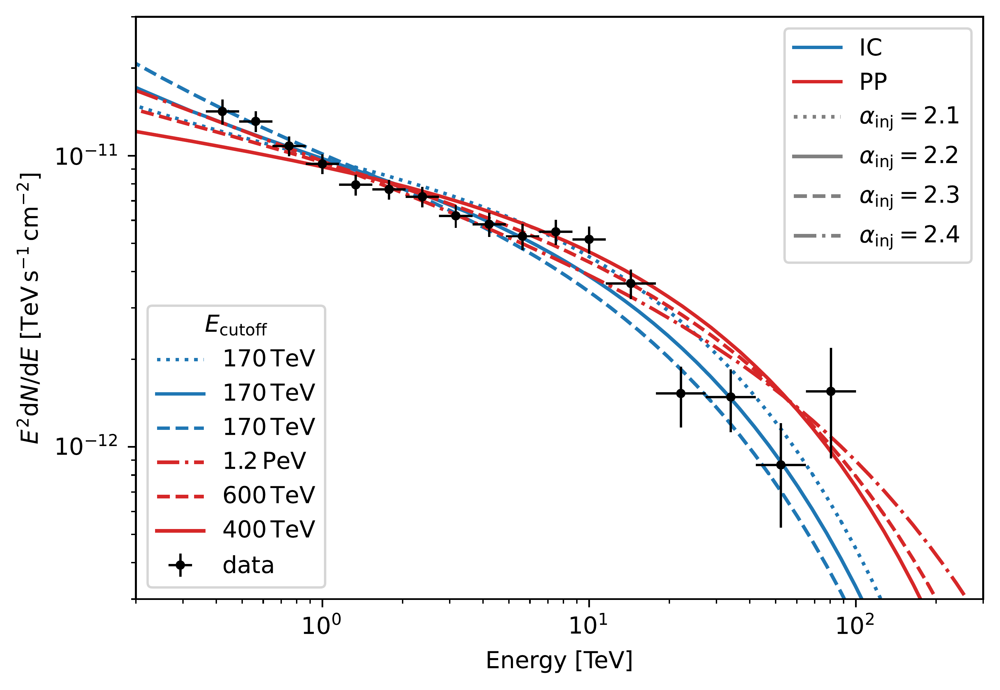
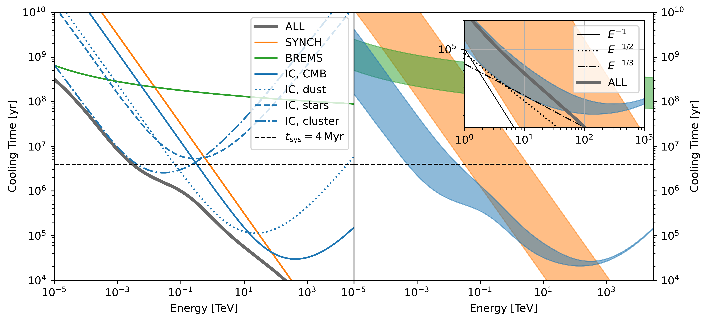

$\newcommand{\ensuremath}{}$
$\newcommand{\xspace}{}$
$\newcommand{\object}[1]{\texttt{#1}}$
$\newcommand{\farcs}{{.}''}$
$\newcommand{\farcm}{{.}'}$
$\newcommand{\arcsec}{''}$
$\newcommand{\arcmin}{'}$
$\newcommand{\ion}[2]{#1#2}$
$\newcommand{\textsc}[1]{\textrm{#1}}$
$\newcommand{\hl}[1]{\textrm{#1}}$
$\newcommand{\red}[1]{\textcolor{red}{#1}}$
$\newcommand{\blue}[1]{\textcolor{blue}{#1}}$
$\newcommand{\hess}{H.E.S.S.}$
$\newcommand{\src}{Westerlund~1}$
$\newcommand{\kms}{ \mathrm{km} \mathrm{s}^{-1}}$
$\newcommand{\Msyr}{ \mathrm{M}_\odot \mathrm{yr}^{-1}}$
$\newcommand{\ergs}{ \mathrm{erg} \mathrm{s}^{-1}}$
$\newcommand{\ergqcm}{ \mathrm{erg} \mathrm{cm}^{-3}}$
$\newcommand{\eVqcm}{ \mathrm{eV} \mathrm{cm}^{-3}}$
$\newcommand{\pqcm}{ \mathrm{cm}^{-3}}$
$\newcommand{\Msun}{ \mathrm{M}_\odot}$
$\newcommand{\Lw}{L_\mathrm{w}}$
$\newcommand{\arraystretch}{1.2}$

$\newcommand{$\ensuremath$}{}$
$\newcommand{$\xspace$}{}$
$\newcommand{$\object$}[1]{\texttt{#1}}$
$\newcommand{$\farcs$}{{.}''}$
$\newcommand{$\farcm$}{{.}'}$
$\newcommand{$\arcsec$}{''}$
$\newcommand{$\arcmin$}{'}$
$\newcommand{$\ion$}[2]{#1#2}$
$\newcommand{$\textsc$}[1]{\textrm{#1}}$
$\newcommand{$\hl$}[1]{\textrm{#1}}$
$\newcommand{$\red$}[1]{\textcolor{red}{#1}}$
$\newcommand{$\blue$}[1]{\textcolor{blue}{#1}}$
$\newcommand{$\hess$}{H.E.S.S.}$
$\newcommand{$\src$}{Westerlund~1}$
$\newcommand{$\kms$}{ \mathrm{km} \mathrm{s}^{-1}}$
$\newcommand{$\Msyr$}{ \mathrm{M}_\odot \mathrm{yr}^{-1}}$
$\newcommand{$\ergs$}{ \mathrm{erg} \mathrm{s}^{-1}}$
$\newcommand{$\ergqcm$}{ \mathrm{erg} \mathrm{cm}^{-3}}$
$\newcommand{$\eVqcm$}{ \mathrm{eV} \mathrm{cm}^{-3}}$
$\newcommand{$\pqcm$}{ \mathrm{cm}^{-3}}$
$\newcommand{$\Msun$}{ \mathrm{M}_\odot}$
$\newcommand{$\Lw$}{L_\mathrm{w}}$
$\newcommand{$\arraystretch$}{1.2}$

# 

<mark>Appeared on: 2023-01-26</mark> - _Accepted for publication in Astronomy & Astrophyics_

Lucia K. Härer, et al. -- incl., <mark><mark>Lars Mohrmann</mark></mark>

**Abstract:** Young massive star clusters (YMCs) have come increasingly into the focus of discussions on the origin of galactic cosmic rays (CRs). The proposition of CR acceleration inside superbubbles (SBs) blown by the strong winds of these clusters avoids issues faced by the standard paradigm of acceleration at supernova remnant shocks.We provide an interpretation of the latest TeV$\gamma$-ray observations   of the region around the YMC$\src$taken with the High Energy Stereoscopic System ($\hess$)   in terms of diffusive shock acceleration at the cluster wind termination shock, taking into account the spectrum and morphology of the emission. As$\src$is a prototypical example of a YMC, such a study is relevant to the general question about the role of YMCs for the Galactic CR population.We generate model$\gamma$-ray spectra, characterise particle propagation inside the SB based on the advection, diffusion, and cooling timescales, and constrain key parameters of the system. We consider hadronic emission from proton-proton interaction and subsequent pion decay and leptonic emission from inverse Compton scattering on all relevant photon fields, including the CMB, diffuse and dust-scattered starlight, and the photon field of$\src$itself. The effect of the magnetic field on cooling and propagation is discussed. Klein-Nishina effects are found to be important in determining the spectral evolution of the electron population.A leptonic origin of the bulk of the observed$\gamma$-rays is preferable. The model is energetically plausible, consistent with the presence of a strong shock, and allows for the observed energy-independent morphology. The hadronic model faces two main issues: confinement of particles to the emission region and an unrealistic energy requirement.

**Figure 3. -** The best models for the spectrum of HESS J1646$-$458 (data taken from \citetalias{Aharonian22}). Standard parameters are assumed (see Table \ref{tab:pars}). The injected particle spectrum is a power law with an exponential cut-off, where $\alpha_\mathrm{inj}$ is the index and $E_\mathrm{cutoff}$ the cut-off energy. The \texttt{GAMERA} library is used to calculate the cooled particle spectrum and $\gamma$-ray production. (*fig:hessband*)

**Figure 7. -** \textit{Left:} electron cooling times for the default case (see Table \ref{tab:pars}). The broad grey line is the sum of all the components shown in colour. For a description of the photon fields for IC scattering see the text. \textit{Right:} range of plausible cooling times for synchrotron radiation (orange), bremsstrahlung (green), and the sum of all IC components (blue), resulting from a cluster photon field energy density of $U_\mathrm{cl} = 3\mbox{--}180$\eVqcm$$, a density inside the superbubble of $n_\mathrm{int} = 0.02\mbox{--}0.1$\pqcm$$, an effective cluster temperature of $T_\mathrm{eff} = 10{,}000\mbox{--}50{,}000 $K, a magnetic field of $B = 1\mbox{--}10\mu$G, and an enhancement of the diffuse stellar and dust emission by a factor 1--3. The enhancement of the diffuse component is motivated by the proximity to the cluster and increased dust density in the region, compared to the standard ISM. The inset shows the behaviour in the TeV-band in more detail highlighting the loss-time scaling with energy. The default case (broad grey line) shows a behaviour that would require diffusion close to the Kraichnan regime ($D\sim E^{1/2}$) to reproduce energy-independent morphology. (*fig:tcool*)

**Figure 1. -** Map of HESS J1646$-$458 taken from \citetalias{Aharonian22}, overlayed with the termination shock position predicted for the parameters indicated in Eq. \ref{eq:rts}. The star marks the position of $\src$. The dashed grey line traces the galactic plane. (*fig:hess_w1*)

