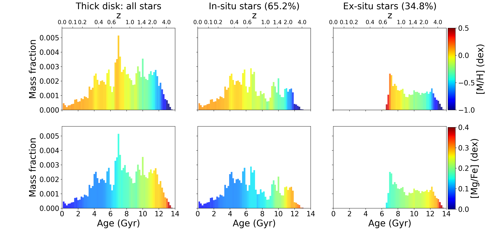

$\newcommand{\ensuremath}{}$
$\newcommand{\xspace}{}$
$\newcommand{\object}[1]{\texttt{#1}}$
$\newcommand{\farcs}{{.}''}$
$\newcommand{\farcm}{{.}'}$
$\newcommand{\arcsec}{''}$
$\newcommand{\arcmin}{'}$
$\newcommand{\ion}[2]{#1#2}$
$\newcommand{\textsc}[1]{\textrm{#1}}$
$\newcommand{\hl}[1]{\textrm{#1}}$

$\newcommand{\ensuremath}{}$
$\newcommand{\xspace}{}$
$\newcommand{\object}[1]{\texttt{#1}}$
$\newcommand{\farcs}{{.}''}$
$\newcommand{\farcm}{{.}'}$
$\newcommand{\arcsec}{''}$
$\newcommand{\arcmin}{'}$
$\newcommand{\ion}[2]{#1#2}$
$\newcommand{\textsc}[1]{\textrm{#1}}$
$\newcommand{\hl}[1]{\textrm{#1}}$

# The interplay ofinternal and external processesin the buildup of disk galaxies: thick-disk star formation historiesin AURIGA simulations

<mark>Appeared on: 2023-01-25</mark> - _3 pages, one figure, Proceedings IAU Symposium S373_

<mark><mark>Francesca Pinna</mark></mark>, Daniel Walo-Martín, Robert J. J. Grand

**Abstract:** Recent integral-field spectroscopy observations have revealed that thick- and thin-disk star-formation histories are regulated by the interplay of internal and external processes.We analyze stellar-population properties of 24 spiral galaxies from the AURIGA zoom-in cosmological simulations, to offer a more in-depth interpretation of observable properties.We present edge-on maps of stellar age, metallicity and [ Mg/Fe ] abundance,and we extract the star-formation and chemical-evolution histories of thin and thick disks. Both show signs of the interplay between internal chemical enrichment and gas and star accretion. Thick disks show particularly complex stellar populations, including an in-situ component, formed from both slowly enriched and accreted more pristine gas, and an additional significant fraction of ex-situ stars. \keywords{techniques: spectroscopic, galaxies: evolution, galaxies: structure}

**Figure 1. -** Star-formation history of the thick disk in AU5, color-coded by total metallicity (top panels) and [Mg/Fe] abundance (bottom panels). Left panels include all stars, while middle and right panels include respectively only stars formed in situ or ex situ, indicating their corresponding thick-disk mass fraction on top of each column.  (*fig3*)

