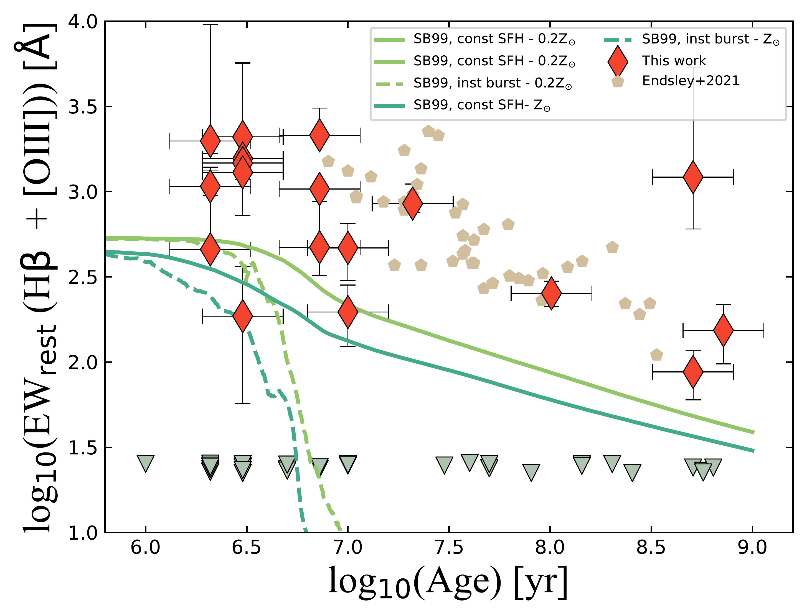
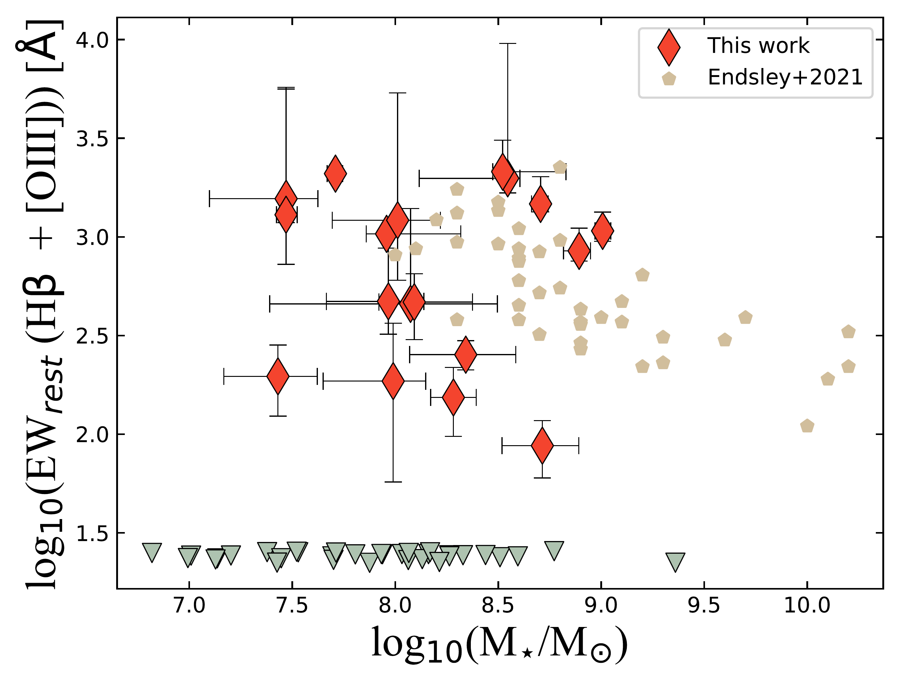
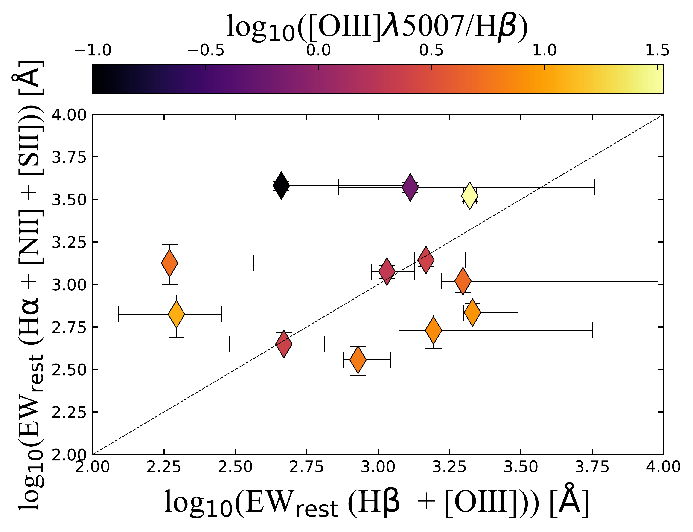

$\newcommand{\ensuremath}{}$
$\newcommand{\xspace}{}$
$\newcommand{\object}[1]{\texttt{#1}}$
$\newcommand{\farcs}{{.}''}$
$\newcommand{\farcm}{{.}'}$
$\newcommand{\arcsec}{''}$
$\newcommand{\arcmin}{'}$
$\newcommand{\ion}[2]{#1#2}$
$\newcommand{\textsc}[1]{\textrm{#1}}$
$\newcommand{\hl}[1]{\textrm{#1}}$
$\newcommand{\footnote}[1]{}$
$\newcommand{\gsim}{{\;\raise0.3ex\hbox{>\kern-0.75em\raise-1.1ex\hbox{\sim}}\;}}$

$\newcommand{\ensuremath}{}$
$\newcommand{\xspace}{}$
$\newcommand{\object}[1]{\texttt{#1}}$
$\newcommand{\farcs}{{.}''}$
$\newcommand{\farcm}{{.}'}$
$\newcommand{\arcsec}{''}$
$\newcommand{\arcmin}{'}$
$\newcommand{\ion}[2]{#1#2}$
$\newcommand{\textsc}[1]{\textrm{#1}}$
$\newcommand{\hl}[1]{\textrm{#1}}$
$\newcommand{\footnote}[1]{}$
$\newcommand{\gsim}{{\;\raise0.3ex\hbox{>\kern-0.75em\raise-1.1ex\hbox{\sim}}\;}}$

# Strong  (H$\beta$+[OIII]) and H$\alpha$ emitters at redshift $z \simeq 7 - 8$ unveiled with JWST/NIRCam and MIRI imaging in the Hubble eXtreme Deep Field (XDF)

<mark>Appeared on: 2023-01-25</mark> - _15 pages, 9 figures. Submitted to ApJ_

P. Rinaldi, et al. -- incl., <mark><mark>F. Walter</mark></mark>, <mark><mark>S. Bosman</mark></mark>, <mark><mark>R. Meyer</mark></mark>, <mark><mark>M. Guedel</mark></mark>

**Abstract:** The $_JWST_$ is revolutionizing the study of high-redshift galaxies by providing for the first time a high-sensitivity view of the early Universe at infrared wavelengths, both with its Near Infrared Camera (NIRCam) and Mid Infrared Instrument (MIRI). In this paper we make use of medium and broad-band NIRCam imaging, as well as ultra-deep MIRI $5.6 \rm \mu m$ imaging, in the Hubble eXtreme Deep Field (XDF) to identify prominent line emitters at $z\simeq 7-8$ . Out of a total of 58 galaxies at $z\simeq 7-8$ , we find 18 robust candidates ( $\simeq$ 31 \% ) for prominent (H $\beta$ + [ OIII ] ) emitters, based on their enhanced fluxes in the F430M and F444W filters, with rest-frame EW(H $\beta$ + [ OIII ] ) $\simeq 87 - 2100   \rm Å$ .  Among these emitters, 16 lie on the MIRI coverage area and 12 show a clear flux excess at $5.6   \rm \mu m$ , indicating the simultaneous presence of a prominent H $\alpha$ emission line with rest-frame EW(H $\alpha$ ) $\simeq 200-3000   \rm Å$ . This is the first time that  H $\alpha$ emission can be detected in individual galaxies at $z>7$ . The H $\alpha$ line, when present,  allows us to separate the  contributions of the H $\beta$ and [ OIII ] emission lines to the (H $\beta$ + [ OIII ] ) complex and derive H $\alpha$ -based star formation rates (SFRs). We find that in some cases [ OIII ] /H $\beta > 1$ , suggesting low metallicities, but a few have [ OIII ] /H $\beta < 1$ , so the NIRCam flux excess is mainly driven by H $\beta$ . The vast majority of prominent line emitters are very young starbursts or galaxies on their way to/from the starburst cloud. They make for a cosmic SFR density $\rm log_{10}(\rho_{SFR_{H\alpha}}/ \rm M_\odot   yr^{-1}   Mpc^{-3}) \simeq -2.35$ , which is about a third of the total value at $z\simeq 7-8$ . Therefore, the strong H $\alpha$ emitters likely had an important role in reionization.

**Figure 1. -** Age versus (H$\beta$ + [OIII]) rest-frame EW. The gray triangles refer to the upper limits we estimated for all those galaxies we classified as “non-emitters” during our selection. We also report data points from  ([Endsley, et. al (2021)]())  to make a comparison with the recent literature at high redshift. The curves refer to the evolution of the H$\beta$ rest-frame EW as a function of the age. We plot these tracks for the two metallicty (solar and sub-solar) we have considered in our work and for two different SFHs. A clear anti-correlation between rest-frame EW and age is evident in this plot, as found at lower redshifts from  ([Reddy, Shapley and Sanders (2018)]()) . The same has been found in  ([Endsley, et. al (2021)]())  as well. (*Fig_EWage*)

**Figure 2. -** Stellar mass versus (H$\beta$ + [OIII]) rest-frame EW. The gray triangles refer to the upper limits we estimated for all those galaxies we classified as “non-emitters” during our selection. Also in this case, we report data points from  ([Endsley, et. al (2021)]())  to make a comparison with the recent literature at high redshift. The rest-frame EW broadly anti-correlates with stellar mass, similarly to what has been reported by  ([Reddy, Shapley and Sanders (2018)]())  and  ([Endsley, et. al (2021)]())  at lower redshifts. (*Fig_EWstm*)

**Figure 3. -** (H$\beta$ + [OIII]) rest-frame EW versus (H$\alpha$ + [NII] + [SII]) rest-frame EW. Here we colour-coded our data points for the [OIII]$\lambda$5007/H$\beta$ flux ratio. There are some data points there are well above the identity line and show a [OIII]$\lambda$5007/H$\beta$ which is dominated by H$\beta$. However, there are a few galaxies that lie above the identity line that show [OIII]$\lambda$5007/H$\beta$$>$ 1 which can be explained by a non-negligible dust extinction.  (*Fig_6*)

