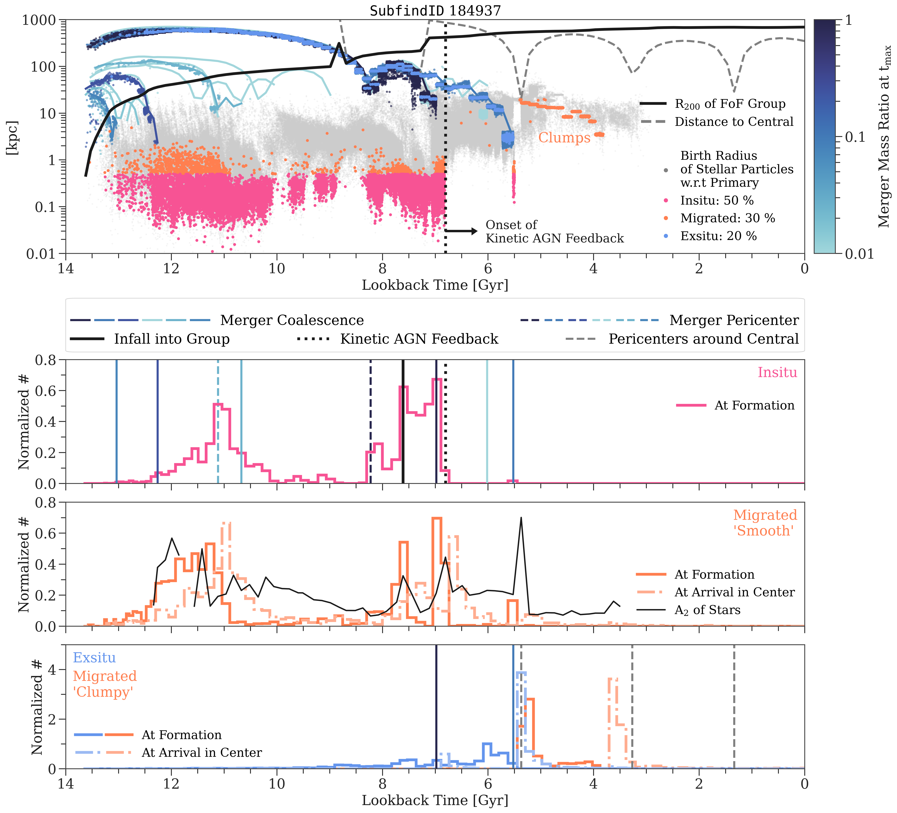

$\newcommand{\ensuremath}{}$
$\newcommand{\xspace}{}$
$\newcommand{\object}[1]{\texttt{#1}}$
$\newcommand{\farcs}{{.}''}$
$\newcommand{\farcm}{{.}'}$
$\newcommand{\arcsec}{''}$
$\newcommand{\arcmin}{'}$
$\newcommand{\ion}[2]{#1#2}$
$\newcommand{\textsc}[1]{\textrm{#1}}$
$\newcommand{\hl}[1]{\textrm{#1}}$
$\newcommand{\thebibliography}{\DeclareRobustCommand{\VAN}[3]{##3}\VANthebibliography}$
$\newcommand{\thebibliography}{\DeclareRobustCommand{\VAN}[3]{##3}\VANthebibliography}$
$\newcommand{\thebibliography}{\DeclareRobustCommand{\VAN}[3]{##3}\VANthebibliography}$

$\newcommand{$\ensuremath$}{}$
$\newcommand{$\xspace$}{}$
$\newcommand{$\object$}[1]{\texttt{#1}}$
$\newcommand{$\farcs$}{{.}''}$
$\newcommand{$\farcm$}{{.}'}$
$\newcommand{$\arcsec$}{''}$
$\newcommand{$\arcmin$}{'}$
$\newcommand{$\ion$}[2]{#1#2}$
$\newcommand{$\textsc$}[1]{\textrm{#1}}$
$\newcommand{$\hl$}[1]{\textrm{#1}}$
$\newcommand{$\thebibliography$}{\DeclareRobustCommand{\VAN}[3]{##3}\VANthebibliography}$
$\newcommand{$\thebibliography$}{\DeclareRobustCommand{\VAN}[3]{##3}\VANthebibliography}$
$\newcommand{$\thebibliography$}{\DeclareRobustCommand{\VAN}[3]{##3}\VANthebibliography}$

# The Origin of Stars in the Inner 500 Parsecs in TNG50 Galaxies

<mark>Appeared on: 2023-01-31</mark> - _24 pages, 13 Figures, published in MNRAS_

Alina Boecker, et al. -- incl., <mark><mark>Nadine Neumayer</mark></mark>, <mark><mark>Annalisa Pillepich</mark></mark>, <mark><mark>Neige Frankel</mark></mark>, <mark><mark>Lars Hernquist</mark></mark>

**Abstract:** \noindentWe investigate the origin of stars in the innermost 500 pc of galaxies spanning stellar masses of$5\times10^{8-12} \mathrm{M}_{\odot}$at$\mathrm{z=0}$using the cosmological magnetohydrodynamical TNG50 simulation. Three different origins of stars comprise galactic centers: 1) in-situ (born in the center), 2) migrated (born elsewhere in the galaxy and ultimately moved to the center), 3) ex-situ (accreted from other galaxies). In-situ and migrated stars dominate the central stellar mass budget on average with 73\%and 23\%respectively. The ex-situ fraction rises above 1\%for galaxies$\gtrsim10^{11} \mathrm{M}_{\odot}$. Yet, only 9\%of all galaxies exhibit no ex-situ stars in their centers and the scatter of ex-situ mass is significant ($4-6 \mathrm{dex}$). Migrated stars predominantly originate closely from the center ($1-2 \mathrm{kpc}$), but if they travelled together in clumps distances reach$\sim10 \mathrm{kpc}$. Central and satellite galaxies possess similar amounts and origins of central stars. Star forming galaxies ($\gtrsim10^{10} \mathrm{M}_{\odot}$) have on average more ex-situ mass in their centers than quenched ones. We predict readily observable stellar population and dynamical properties: 1) migrated stars are distinctly young ($\sim2 \mathrm{Gyr}$) and rotationally supported, especially for Milky Way mass galaxies, 2) in-situ stars are most metal-rich and older than migrated stars, 3) ex-situ stars are on random motion dominated orbits and typically the oldest, most metal-poor and$\alpha$-enhanced population. We demonstrate that the interaction history with other galaxies leads to diverse pathways of building up galaxy centers in a$\Lambda$CDM universe. Our work highlights the necessity for cosmological context in formation scenarios of central galactic components and the potential to use galaxy centers as tracers of overall galaxy assembly.

**Figure 24. -** \textbf{Central (500 pc) assembly history of an individual galaxy (\texttt{SubfindID} 184937) in TNG50 with a total stellar mass of}$\mathbf{10^{10.8} M_{\odot}}.$\textbf{This galaxy encompasses many mechanisms that can shape the stellar mass build-up in the center of galaxies in a}$\mathbf{\Lambda}$\textbf{CDM cosmology.}\textit{Top panel}: Points show all individual stellar particles that belong to that galaxy at $\mathrm{z}=0$. Their distance at the time of birth is shown with respect to their current host in the case of in-situ formed stars (\textit{light gray}: all in-situ particles, \textit{\textcolor{insitu}{pink}}: central in-situ stars only, \textit{\textcolor{migrated}{orange}}: central migrated stars only). In the case of the ex-situ formed stars the distance is shown with respect to their future host galaxy at the time of birth (\textit{color-coded according to the colorbar}: all ex-situ stars, \textit{\textcolor{exsitu}{blue}}: central ex-situ stars only). The distance to individual satellite galaxies (only with maximum stellar masses above $10^{6} \mathrm{M}_{\odot}$) that will merge with the primary at some point are shown with thinner solid lines. Their coloring also follows the colorbar, which visualizes the merger mass ratio taken at the time $\mathrm{t}_{\mathrm{max}}$, when the secondary galaxy reaches maximum stellar mass. The thick black solid line shows the radius of the FoF Group the galaxy belongs to at a given lookback time (represented as $\mathrm{R}_{200}$, where the group's density is 200 times the critical density of the Universe). The thick gray dashed line shows the distance between the individual galaxy and the central galaxy of the FoF group it belongs to. Approximately 7 Gyr ago the galaxy fell into another group and became a satellite galaxy. Before that it was the central of its own FoF group. The vertical black dotted line represents the time the kinetic AGN feedback starts to take effect, which quenches the center. This galaxy has 50\% in-situ, 30\% migrated (of which only 9\% are 'smoothly' migrated and the rest comes from migrated clumps) and 20\% ex-situ stars in its center. \textit{Bottom panel}: Histograms of formation times of \textcolor{insitu}{in-situ}(\textit{top}), formation (\textit{solid}) and arrival (\textit{dashed-dotted}) times at the center for \textcolor{migrated}{`smoothly' migrated}(\textit{middle}) as well as \textcolor{exsitu}{ex-situ} and \textcolor{migrated}{`clumpy' migrated}(\textit{bottom}) stars. Additionally, in the panel for the in-situ stars, we mark the time of coalescence for the six most massive mergers of this galaxy with thin blue colored solid lines. According to the colorbar of the top panel, a darker blue means a higher merger mass ratio. Pericenter passages for two mergers are shown by thin dashed lines following the same colorcode. The approximate time of the galaxy falling into its $\mathrm{z}=0$ FoF group is shown by the thick black solid line and the onset of the kinetic AGN feedback is shown as the black dotted line. In the panel for the `smoothly' migrated stars we also show the A$_2$ mode of the stars for a given lookback time (see Appendix \protect\ref{sec: galprops} for a definition). In the panel for the ex-situ and `clumpy' migrated stars, we show the time of coalescence of the two mergers that deposited ex-situ stars in the galaxy's center (\textit{blue solid lines}) as well as the three pericenter passages of the galaxy around its central galaxy after it became a satellite (\textit{gray dashed lines}).  (*fig: assembly*)

**Figure 39. -** \textbf{Central (500 pc) assembly history of an individual galaxy (\texttt{SubfindID} 184937) in TNG50 with a total stellar mass of}$\mathbf{10^{10.8} M_{\odot}}.$\textbf{This galaxy encompasses many mechanisms that can shape the stellar mass build-up in the center of galaxies in a}$\mathbf{\Lambda}$\textbf{CDM cosmology.}\textit{Top panel}: Points show all individual stellar particles that belong to that galaxy at $\mathrm{z}=0$. Their distance at the time of birth is shown with respect to their current host in the case of in-situ formed stars (\textit{light gray}: all in-situ particles, \textit{\textcolor{insitu}{pink}}: central in-situ stars only, \textit{\textcolor{migrated}{orange}}: central migrated stars only). In the case of the ex-situ formed stars the distance is shown with respect to their future host galaxy at the time of birth (\textit{color-coded according to the colorbar}: all ex-situ stars, \textit{\textcolor{exsitu}{blue}}: central ex-situ stars only). The distance to individual satellite galaxies (only with maximum stellar masses above $10^{6} \mathrm{M}_{\odot}$) that will merge with the primary at some point are shown with thinner solid lines. Their coloring also follows the colorbar, which visualizes the merger mass ratio taken at the time $\mathrm{t}_{\mathrm{max}}$, when the secondary galaxy reaches maximum stellar mass. The thick black solid line shows the radius of the FoF Group the galaxy belongs to at a given lookback time (represented as $\mathrm{R}_{200}$, where the group's density is 200 times the critical density of the Universe). The thick gray dashed line shows the distance between the individual galaxy and the central galaxy of the FoF group it belongs to. Approximately 7 Gyr ago the galaxy fell into another group and became a satellite galaxy. Before that it was the central of its own FoF group. The vertical black dotted line represents the time the kinetic AGN feedback starts to take effect, which quenches the center. This galaxy has 50\% in-situ, 30\% migrated (of which only 9\% are 'smoothly' migrated and the rest comes from migrated clumps) and 20\% ex-situ stars in its center. \textit{Bottom panel}: Histograms of formation times of \textcolor{insitu}{in-situ}(\textit{top}), formation (\textit{solid}) and arrival (\textit{dashed-dotted}) times at the center for \textcolor{migrated}{`smoothly' migrated}(\textit{middle}) as well as \textcolor{exsitu}{ex-situ} and \textcolor{migrated}{`clumpy' migrated}(\textit{bottom}) stars. Additionally, in the panel for the in-situ stars, we mark the time of coalescence for the six most massive mergers of this galaxy with thin blue colored solid lines. According to the colorbar of the top panel, a darker blue means a higher merger mass ratio. Pericenter passages for two mergers are shown by thin dashed lines following the same colorcode. The approximate time of the galaxy falling into its $\mathrm{z}=0$ FoF group is shown by the thick black solid line and the onset of the kinetic AGN feedback is shown as the black dotted line. In the panel for the `smoothly' migrated stars we also show the A$_2$ mode of the stars for a given lookback time (see Appendix \protect\ref{sec: galprops} for a definition). In the panel for the ex-situ and `clumpy' migrated stars, we show the time of coalescence of the two mergers that deposited ex-situ stars in the galaxy's center (\textit{blue solid lines}) as well as the three pericenter passages of the galaxy around its central galaxy after it became a satellite (\textit{gray dashed lines}).  (*fig: assembly*)

**Figure 54. -** \textbf{Central (500 pc) assembly history of an individual galaxy (\texttt{SubfindID} 184937) in TNG50 with a total stellar mass of}$\mathbf{10^{10.8} M_{\odot}}.$\textbf{This galaxy encompasses many mechanisms that can shape the stellar mass build-up in the center of galaxies in a}$\mathbf{\Lambda}$\textbf{CDM cosmology.}\textit{Top panel}: Points show all individual stellar particles that belong to that galaxy at $\mathrm{z}=0$. Their distance at the time of birth is shown with respect to their current host in the case of in-situ formed stars (\textit{light gray}: all in-situ particles, \textit{\textcolor{insitu}{pink}}: central in-situ stars only, \textit{\textcolor{migrated}{orange}}: central migrated stars only). In the case of the ex-situ formed stars the distance is shown with respect to their future host galaxy at the time of birth (\textit{color-coded according to the colorbar}: all ex-situ stars, \textit{\textcolor{exsitu}{blue}}: central ex-situ stars only). The distance to individual satellite galaxies (only with maximum stellar masses above $10^{6} \mathrm{M}_{\odot}$) that will merge with the primary at some point are shown with thinner solid lines. Their coloring also follows the colorbar, which visualizes the merger mass ratio taken at the time $\mathrm{t}_{\mathrm{max}}$, when the secondary galaxy reaches maximum stellar mass. The thick black solid line shows the radius of the FoF Group the galaxy belongs to at a given lookback time (represented as $\mathrm{R}_{200}$, where the group's density is 200 times the critical density of the Universe). The thick gray dashed line shows the distance between the individual galaxy and the central galaxy of the FoF group it belongs to. Approximately 7 Gyr ago the galaxy fell into another group and became a satellite galaxy. Before that it was the central of its own FoF group. The vertical black dotted line represents the time the kinetic AGN feedback starts to take effect, which quenches the center. This galaxy has 50\% in-situ, 30\% migrated (of which only 9\% are 'smoothly' migrated and the rest comes from migrated clumps) and 20\% ex-situ stars in its center. \textit{Bottom panel}: Histograms of formation times of \textcolor{insitu}{in-situ}(\textit{top}), formation (\textit{solid}) and arrival (\textit{dashed-dotted}) times at the center for \textcolor{migrated}{`smoothly' migrated}(\textit{middle}) as well as \textcolor{exsitu}{ex-situ} and \textcolor{migrated}{`clumpy' migrated}(\textit{bottom}) stars. Additionally, in the panel for the in-situ stars, we mark the time of coalescence for the six most massive mergers of this galaxy with thin blue colored solid lines. According to the colorbar of the top panel, a darker blue means a higher merger mass ratio. Pericenter passages for two mergers are shown by thin dashed lines following the same colorcode. The approximate time of the galaxy falling into its $\mathrm{z}=0$ FoF group is shown by the thick black solid line and the onset of the kinetic AGN feedback is shown as the black dotted line. In the panel for the `smoothly' migrated stars we also show the A$_2$ mode of the stars for a given lookback time (see Appendix \protect\ref{sec: galprops} for a definition). In the panel for the ex-situ and `clumpy' migrated stars, we show the time of coalescence of the two mergers that deposited ex-situ stars in the galaxy's center (\textit{blue solid lines}) as well as the three pericenter passages of the galaxy around its central galaxy after it became a satellite (\textit{gray dashed lines}).  (*fig: assembly*)

