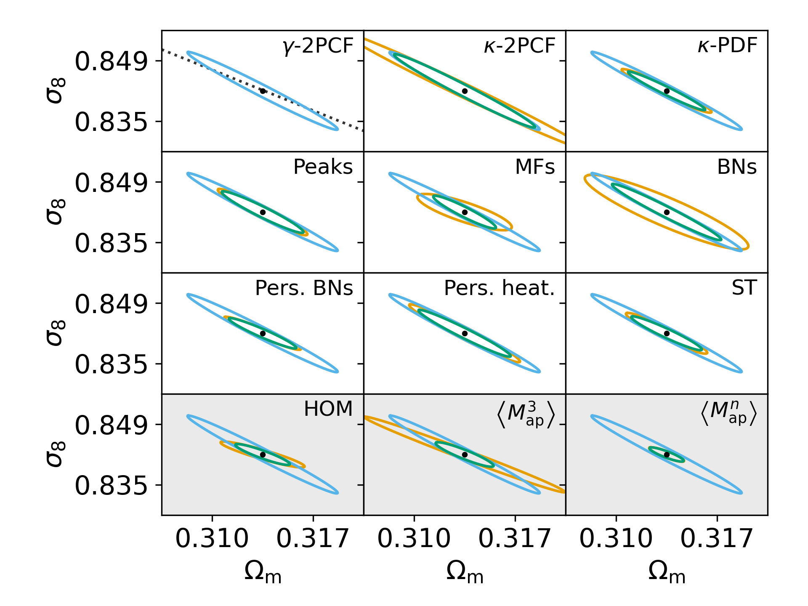
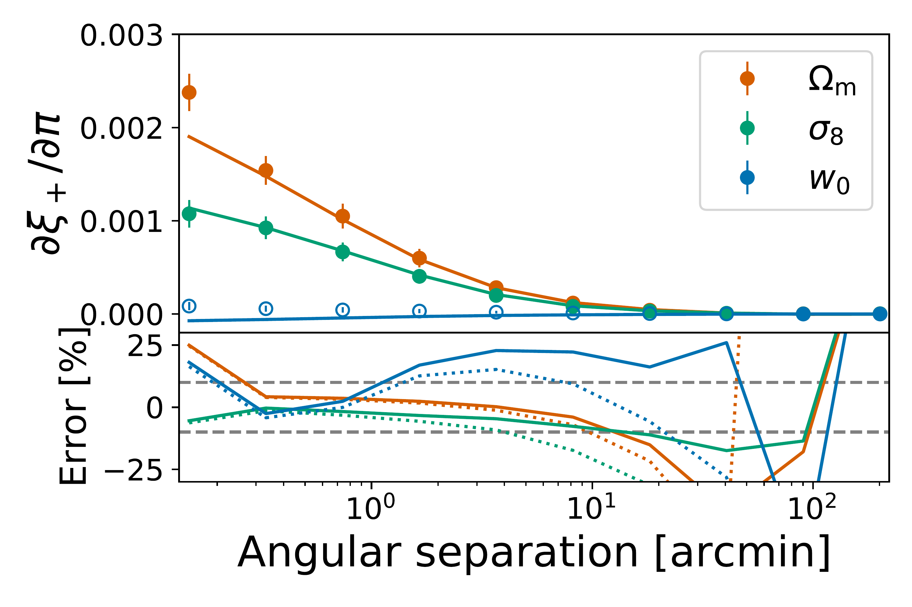
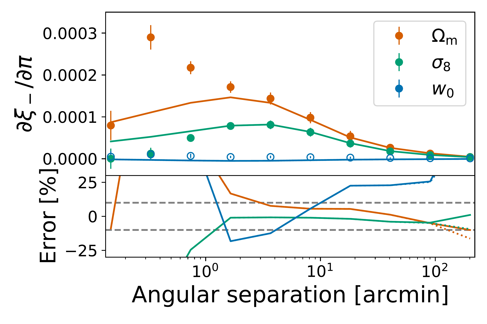
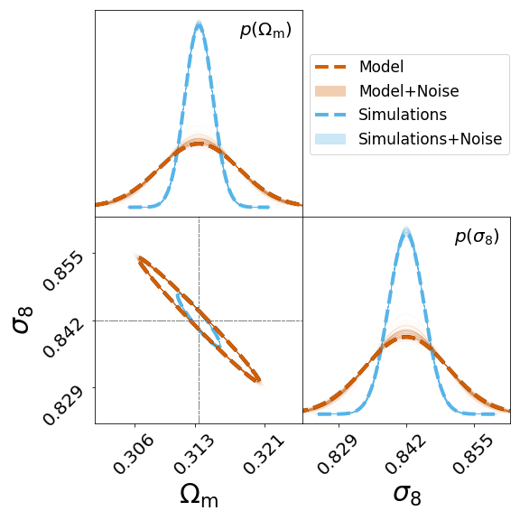
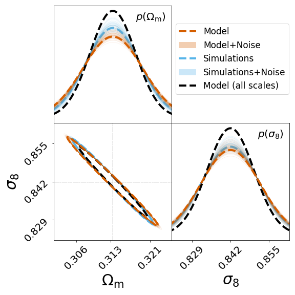
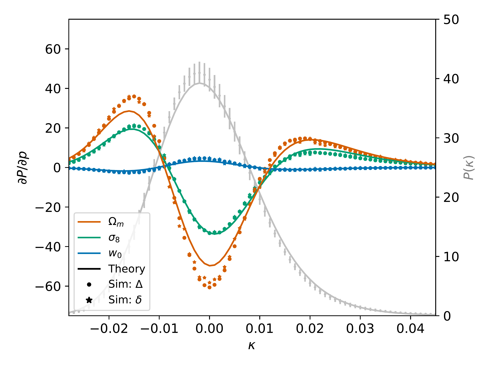
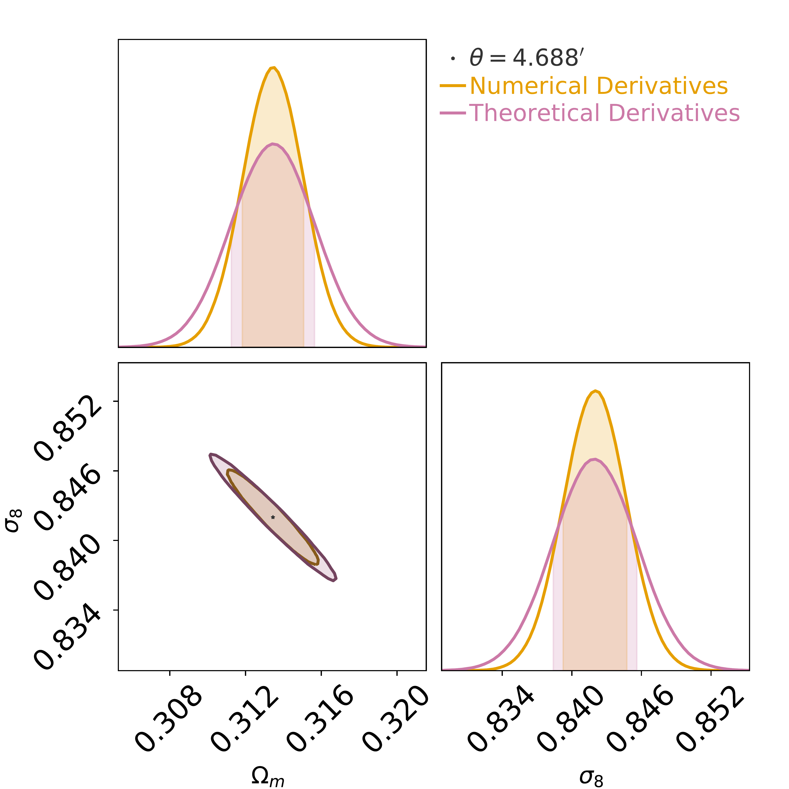

$\newcommand{\ensuremath}{}$
$\newcommand{\xspace}{}$
$\newcommand{\object}[1]{\texttt{#1}}$
$\newcommand{\farcs}{{.}''}$
$\newcommand{\farcm}{{.}'}$
$\newcommand{\arcsec}{''}$
$\newcommand{\arcmin}{'}$
$\newcommand{\ion}[2]{#1#2}$
$\newcommand{\textsc}[1]{\textrm{#1}}$
$\newcommand{\hl}[1]{\textrm{#1}}$
$\newcommand{\footnote}[1]{}$
$\newcommand{\astroang}[1]{\ang[angle-symbol-over-decimal]{#1}}$
$\newcommand{\assign}[1]{\textcolor{red}{[#1]}}$
$\newcommand{\inprogress}[1]{\textcolor[rgb]{1,0.5,0}{[#1]}}$
$\newcommand{\done}[1]$
$\newcommand{\help}[1]{\textcolor{magenta}{[{\bf HELP!: #1}]}}$
$\newcommand{\nico}[1]{\textcolor{red}{[nico: #1]}}$
$\newcommand{\lucas}[1]{\textcolor{gray}{[lucas: #1]}}$
$\newcommand{\laila}[1]{\textcolor{magenta}{[laila: #1]}}$
$\newcommand{\cora}[1]{\textcolor{purple}{[cora: #1]}}$
$\newcommand{\vincenzo}[1]{\textcolor{cyan}{[vincenzo: #1]}}$
$\newcommand{\aoife}[1]{\textcolor{teal}{[aoife: #1]}}$
$\newcommand{\Sandrine}[1]{\textcolor{violet}{[Sandrine C.: #1]}}$
$\newcommand{\SP}[1]{\textcolor{teal}{[Sandrine P.: #1]}}$
$\newcommand{\ismael}[1]{\textcolor{brown}{[ismael: #1]}}$
$\newcommand{\sven}[1]{\textcolor{orange}{[sven: #1]}}$
$\newcommand{\simone}[1]{\textcolor{olive}{[Simone: #1]}}$
$\newcommand{\sihao}[1]{\textcolor{olive}{[sihao: #1]}}$
$\newcommand{\cgiocoli}[1]{\textbf{\textcolor{brilliantlavender}{[cgiocoli: #1]}}}$
$\newcommand{\MapMapMap}{\expval{\Map^3}}$
$\newcommand{\Mapn}{\expval{\Map^n}}$
$\newcommand{\varthetavec}{\vb*{\vartheta}}$
$\newcommand{\thetavec}{\vb*{\theta}}$
$\newcommand{\Map}{M_\mathrm{ap}}$
$\newcommand{\MapMap}{\expval{\Map^2}}$
$\newcommand{\ellvec}{\vb*{\ell}}$
$\newcommand{\orcid}[1]$

$\newcommand{\ensuremath}{}$
$\newcommand{\xspace}{}$
$\newcommand{\object}[1]{\texttt{#1}}$
$\newcommand{\farcs}{{.}''}$
$\newcommand{\farcm}{{.}'}$
$\newcommand{\arcsec}{''}$
$\newcommand{\arcmin}{'}$
$\newcommand{\ion}[2]{#1#2}$
$\newcommand{\textsc}[1]{\textrm{#1}}$
$\newcommand{\hl}[1]{\textrm{#1}}$
$\newcommand{\footnote}[1]{}$
$\newcommand{\astroang}[1]{\ang[angle-symbol-over-decimal]{#1}}$
$\newcommand{\assign}[1]{\textcolor{red}{[#1]}}$
$\newcommand{\inprogress}[1]{\textcolor[rgb]{1,0.5,0}{[#1]}}$
$\newcommand{\done}[1]$
$\newcommand{\help}[1]{\textcolor{magenta}{[{\bf HELP!: #1}]}}$
$\newcommand{\nico}[1]{\textcolor{red}{[nico: #1]}}$
$\newcommand{\lucas}[1]{\textcolor{gray}{[lucas: #1]}}$
$\newcommand{\laila}[1]{\textcolor{magenta}{[laila: #1]}}$
$\newcommand{\cora}[1]{\textcolor{purple}{[cora: #1]}}$
$\newcommand{\vincenzo}[1]{\textcolor{cyan}{[vincenzo: #1]}}$
$\newcommand{\aoife}[1]{\textcolor{teal}{[aoife: #1]}}$
$\newcommand{\Sandrine}[1]{\textcolor{violet}{[Sandrine C.: #1]}}$
$\newcommand{\SP}[1]{\textcolor{teal}{[Sandrine P.: #1]}}$
$\newcommand{\ismael}[1]{\textcolor{brown}{[ismael: #1]}}$
$\newcommand{\sven}[1]{\textcolor{orange}{[sven: #1]}}$
$\newcommand{\simone}[1]{\textcolor{olive}{[Simone: #1]}}$
$\newcommand{\sihao}[1]{\textcolor{olive}{[sihao: #1]}}$
$\newcommand{\cgiocoli}[1]{\textbf{\textcolor{brilliantlavender}{[cgiocoli: #1]}}}$
$\newcommand{\MapMapMap}{\expval{\Map^3}}$
$\newcommand{\Mapn}{\expval{\Map^n}}$
$\newcommand{\varthetavec}{\vb*{\vartheta}}$
$\newcommand{\thetavec}{\vb*{\theta}}$
$\newcommand{\Map}{M_\mathrm{ap}}$
$\newcommand{\MapMap}{\expval{\Map^2}}$
$\newcommand{\ellvec}{\vb*{\ell}}$
$\newcommand{\orcid}[1]$

# $\Euclid$ Preparation XXIX: Forecasts for $10$ different higher-order weak lensing statistics

<mark>Appeared on: 2023-01-30</mark> - _33 pages, 24 figures, main results in Fig. 19 & Table 5, submitted to A&A_

Euclid Collaboration, et al. -- incl., <mark><mark>E. Franceschi</mark></mark>, <mark><mark>K. Jahnke</mark></mark>, <mark><mark>M. Schirmer</mark></mark>

**Abstract:** Recent cosmic shear studies have shown that higher-order statistics (HOS) developed by independent teams now outperform standard two-point estimators in terms of statistical precision thanks to their sensitivity to the non-Gaussian features of large-scale structure. The aim of the Higher-Order Weak Lensing Statistics (HOWLS) project is to assess, compare, and combine the constraining power of $10$ different HOS on a common set of $\Euclid$ -like mocks, derived from N-body simulations. In this first paper of the HOWLS series we compute the non-tomographic ( $\Omega_{\rm m}$ , $\sigma_8$ ) Fisher information for one-point probability distribution function, peak counts, Minkowski functionals, Betti numbers, persistent homology Betti numbers and heatmap, and scattering transform coefficients, and compare them to the shear and convergence two-point correlation functions in the absence of any systematic bias. We also include forecasts for three implementations of higher-order moments, but these cannot be robustly interpreted as the Gaussian likelihood assumption breaks down for these statistics. Taken individually, we find that each HOS outperforms the two-point statistics by a factor of around $2$ in the precision of the forecasts with some variations across statistics and cosmological parameters. When combining all the HOS, this increases to a $4.5$ times improvement, highlighting the immense potential of HOS for cosmic shear cosmological analyses with $\Euclid$ . The data used in this analysis are publicly released with the paper.

**Figure 10. -** Individual Fisher forecasts in the $\sigma_8$-$\Omega_{\rm m}$ plane for a non-tomographic \Euclid-like survey for the $11$ statistics (orange) and $\gamma$-2PCF (blue), as well as their combination (green). The corresponding marginalized precision on CPs can be found in Table \ref{tab:forecasts}. The black dashed line in the first quadrant indicates constant $S_8=\sigma_8\sqrt{\Omega_{\rm m}/0.3}$. The bottom row with the grey shaded backgrounds displays probes that are not Gaussian distributed and cannot be robustly interpreted with Fisher forecasts. The abbreviated name of each summary statistic is displayed in the top-right part of each panel: $\gamma$-2PCF and $\kappa$-2PCF for the shear and convergence two-point correlation functions, $\kappa$-PDF for the convergence one-point probability distribution, peaks for aperture mass peak counts, MFs for convergence Minkowski functionals, BNs for convergence Betti numbers, pers. BNs and pers. heat. for aperture mass persistent homology Betti numbers and heatmap, ST for convergence scattering transform coefficients, HOM for higher-order convergence moments, and $\MapMapMap$ and $\Mapn$ for third and $n$-th order aperture mass moments. (*fig:Fishall*)

**Figure 9. -** _Upper row:_ A comparison of the derivatives of the $\gamma$-2PCF as predicted from theory (solid lines) and as measured from the DUSTGRAIN-*pathfinder* simulations (dots). The errorbars are scaled to a single line-of-sight in the DUSTGRAIN-*pathfinder* ensemble. The shaded regions display the scales that were discarded from the Fisher analysis presented in this work. In the lower panel we plot the relative deviation between the measured quantities and the theoretical predictions when accounting for (solid lines) or neglecting (dotted lines) finite field effects. The grey dashed lines display the 10 per cent errorband. _Lower row:_ A comparison of the Fisher forecast using the theoretical model (orange dashed) or the simulation measurements (blue dashed). The thin solid lines correspond to simulated analyses that are used to test the stability of the ellipses given the numerical noise in the derivatives. For the panel on the left we use all available scales on the $\gamma$-2PCF while for the figure on the right only the scales with realistic numerical derivatives (i.e. removing the grey shaded area of the upper panel) are included in the forecast. In the figure on the right we show for reference again the constraints of the theoretical model with all scales included. (*fig:biasnoise_gamma2pcf*)

**Figure 2. -** _Top:_ The overall shape of the lensing $\kappa$-PDF, smoothed with a top-hat filter of radius \ang{;4.69;} and including shape noise. The fiducial cosmology is shown in grey as predicted from large deviation theory (line) and measured in the DUSTGRAIN-*pathfinder* simulations (data points with error bars indicating the standard deviation across the 256 realisations). Derivatives of the $\kappa$-PDF with respect to the CPs are shown in colour, with theoretical predictions using non-linear variances predicted by Halofit shown as solid lines. The markers represent the derivatives obtained from the simulations using finite differences based on larger/smaller increments (points/stars). {_Bottom:_} Fisher forecast constraints on $\Omega_{\rm m}$ and $\sigma_8$ for a _Euclid_-like survey from the $\kappa$-PDF shown above. Numerically measured (orange) and theoretically predicted (pink) derivatives find good agreement, with differences in the final $1\sigma$ parameter constraints of approximately $20\%$. (*fig:PDF_dustgrain_theory*)

