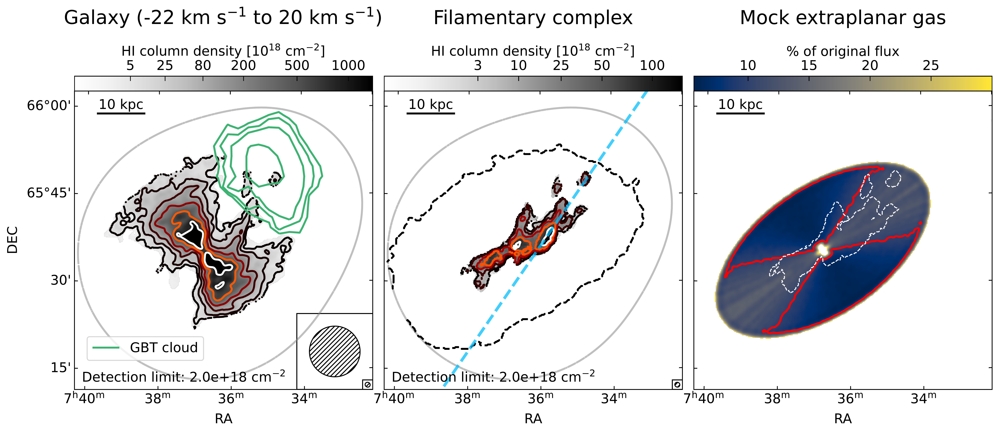
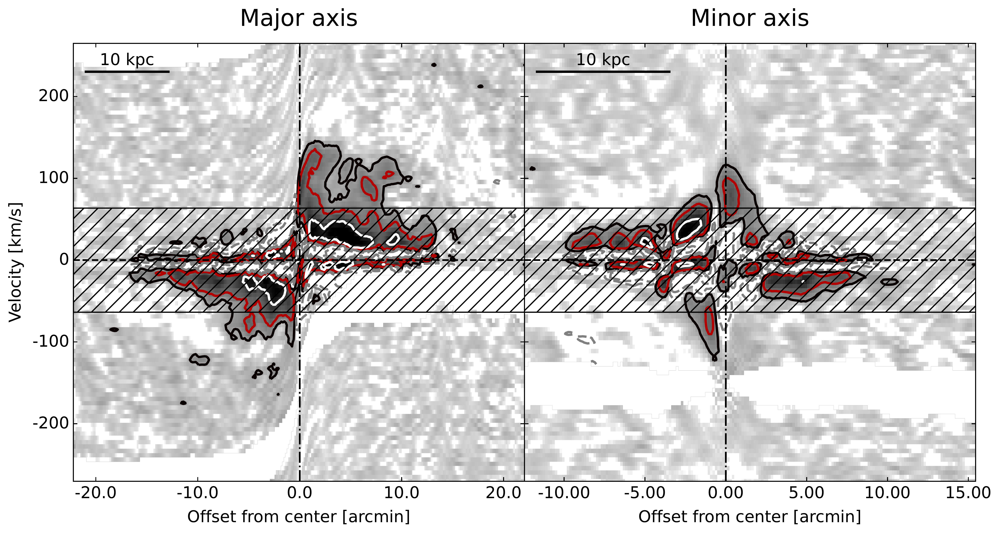

$\newcommand{\ensuremath}{}$
$\newcommand{\xspace}{}$
$\newcommand{\object}[1]{\texttt{#1}}$
$\newcommand{\farcs}{{.}''}$
$\newcommand{\farcm}{{.}'}$
$\newcommand{\arcsec}{''}$
$\newcommand{\arcmin}{'}$
$\newcommand{\ion}[2]{#1#2}$
$\newcommand{\textsc}[1]{\textrm{#1}}$
$\newcommand{\hl}[1]{\textrm{#1}}$

$\newcommand{\ensuremath}{}$
$\newcommand{\xspace}{}$
$\newcommand{\object}[1]{\texttt{#1}}$
$\newcommand{\farcs}{{.}''}$
$\newcommand{\farcm}{{.}'}$
$\newcommand{\arcsec}{''}$
$\newcommand{\arcmin}{'}$
$\newcommand{\ion}[2]{#1#2}$
$\newcommand{\textsc}[1]{\textrm{#1}}$
$\newcommand{\hl}[1]{\textrm{#1}}$

# Extended neutral hydrogen filamentary network in NGC 2403

<mark>Appeared on: 2023-01-31</mark> - __

Simone Veronese, W. J. G. de Blok, <mark>F. Walter</mark>

**Abstract:** We present new neutral hydrogen (H {\sc i} ) observations of the nearby galaxy NGC 2403 to determine the nature of a low-column density cloud that was detected earlier by the Green Bank Telescope. \\ We find that this cloud is the tip of a complex of filaments of extraplanar gas that is coincident with the thin disk. The total H {\sc i} mass of the complex is $2\times10^{7}\text{ M}_\odot$ or 0.6 \% of the total H {\sc i} mass of the galaxy. The main structure, previously referred to as the 8-kpc filament, is now seen to be even more extended, along a 20 kpc stream. \\ The kinematics and morphological properties of the filaments are unlikely to be the result of outflows related to galactic fountains. It is more likely that the 20 kpc filament is related to a recent galaxy interaction. In this context, a $\sim$ 50 kpc long stellar stream has been recently detected connecting NGC 2403 with the nearby dwarf satellite DDO 44. Intriguingly, the southern tip of this stream overlaps with that of 20 kpc H {\sc i} filament. \\ We conclude that the H {\sc i} anomalies in NGC 2403 are the result of a recent ( $\sim2\text{ Gyr}$ ) interaction with DDO 44 leading to the observed filamentary complex.

**Figure 2. -** Channel maps of the data cube with both new and archival observations where we show only every second channel. The colour-scale contours correspond to 2 $\times$(1, 4, 16, 64) $\times$ 10\textsuperscript{18} cm\textsuperscript{-2}, where $2\times10^{18}$ cm\textsuperscript{-2} is the $3\sigma$ 1-channel column density limit. The thick contour levels indicate the significant emission identified by the SoFiA source finder. Most of the low-level structures shown in thin contours are noise or mosaicking artefacts. The dashed grey contours denote the column density of $-$2 $\times$ 10\textsuperscript{18} cm\textsuperscript{-2}. The egg-shape borders are due to the 20\% cut-off threshold of the primary beam response. At the bottom we report the line-of-sight velocity (w.r.t. the systemic velocity 133.2 km s$^{-1}$) in each channel. The filamentary detections, labelled with coloured arrows, are evident between $-$59 km s$^{-1}$ and 47 km s$^{-1}$. (*fig:chanmap*)

**Figure 4. -** _Left panel_: primary beam corrected H {\sc i} column density map of NGC 2403 (in reversed grey-scale colormap) overlaid with the GBT cloud candidate (green) from  ([de Blok, et. al (2014)](https://ui.adsabs.harvard.edu/abs/2014A&A...569A..68D)) . The map was produced by integrating over the channels from $-22$ km s$^{-1}$ to 20 km s$^{-1}$ w.r.t. the systemic velocity. This range corresponds to the one used by  ([de Blok, et. al (2014)](https://ui.adsabs.harvard.edu/abs/2014A&A...569A..68D))  to compute the candidate GBT cloud moment 0 map. Grey-scale contour levels are from 5 $\times$ 10\textsuperscript{18} cm\textsuperscript{-2} to 1 $\times$ 10\textsuperscript{21} cm\textsuperscript{-2}. The $3\sigma$ 1-channel column density limit is reported at the bottom. The beam of the interferometric data for both the GBT and our VLA observations is shown in the bottom right. The green contours, instead, define the (6.25, 12.5, 25, 62.5) × 10\textsuperscript{17} cm\textsuperscript{-2} column density in the GBT data. The light-grey line denotes the 20\% cut-off threshold of the primary beam response. _Central panel_: primary beam corrected H {\sc i} column density map of the anomalous-velocity gas. Grey-scale contour levels are (3, 10, 25, 50, 100) $\times$ 10\textsuperscript{18} cm\textsuperscript{-2} column density. The spatial scale is the same as in the left panel, as well as the definition of the light grey line. We indicate the galaxy edge with the dashed-black contour. The light blue dashed line represents the path along which the position-velocity slice has been extracted (see Fig. \ref{fig:filpv}). _Right panel_: Illustrative example of the selection effect introduced by the shuffle procedure (see discussion in section \ref{sec:disk}). The map shows the fraction of the original extraplanar flux density of a mock galaxy we were able to recover and the red contour encloses the region where we are severely affected by selection effect, i.e., where more than 90\% of the original flux density is lost. The blanked bits in the centre denote the region where the result is unreliable because of the steep gradient in velocity. The dashed white contours are, instead, the region occupied by the observed filamentary complex. (*fig:filmap*)

**Figure 3. -** Position-velocity diagram along the major axis (left panel) and minor axis (right panel) through a beam-wide slice of the shuffled data cube without the thin disk removal. The emission is mapped with a reversed grey-scale and we overlaid the 2 $\times$(1, 3, 9) $\times10^{18}$ cm\textsuperscript{-2} levels with grey-scale contours. The blanked area in the top-left and blanked stripe in the bottom are the result of the Milky Way filtering. The grey dashed lines denote the column density of $-3\sigma$. The channels between $\pm$ 65 km s$^{-1}$ with the residual thin disk and diffuse extraplanar emission are highlighted with the hatched area. They were not used for the computation of the moment map shown in the central panel of Fig. \ref{fig:filmap}. (*fig:shufflepv*)

