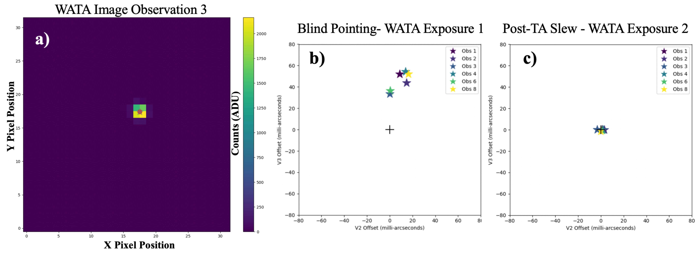
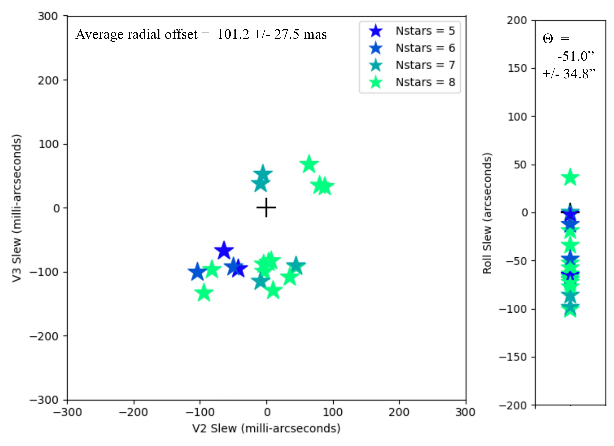
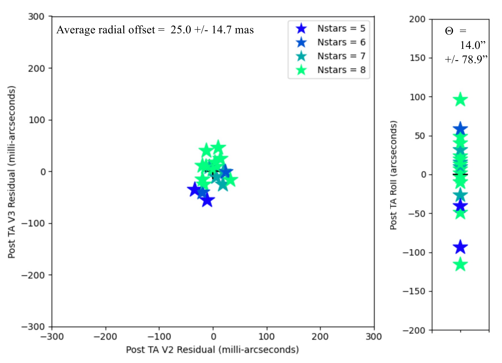

$\newcommand{\ensuremath}{}$
$\newcommand{\xspace}{}$
$\newcommand{\object}[1]{\texttt{#1}}$
$\newcommand{\farcs}{{.}''}$
$\newcommand{\farcm}{{.}'}$
$\newcommand{\arcsec}{''}$
$\newcommand{\arcmin}{'}$
$\newcommand{\ion}[2]{#1#2}$
$\newcommand{\textsc}[1]{\textrm{#1}}$
$\newcommand{\hl}[1]{\textrm{#1}}$
$\newcommand{\vdag}{(v)^\dagger}$
$\newcommand$
$\newcommand$
$\newcommand{\lta}{\lesssim}$
$\newcommand{\gta}{\gtrsim}$
$\newcommand{\coone}{\rm ^{12}CO(1-0)}$
$\newcommand{\cotwo}{\rm ^{12}CO(2-1)}$
$\newcommand{\one}{\rm (1-0)}$
$\newcommand{\two}{\rm (2-1)}$
$\newcommand{\ione}{I_{10}}$
$\newcommand{\itwo}{I_{21}}$
$\newcommand{\nhico}{X_{CO}}$
$\newcommand{\CO}{^{12}CO }$
$\newcommand{\COe}{CO(1-0)}$
$\newcommand{\COz}{CO(2-1) }$
$\newcommand{\solm}{M_{\odot}}$
$\newcommand{\solms}{ {\rm M_{\odot}/pc^2}}$
$\newcommand{\rsol}{R_{\odot}}$
$\newcommand{\rf}{\par\noindent\hangindent 15pt  }$
$\newcommand{\ea}{et al.}$
$\newcommand{\kkms}{ {\rm K} {\rm km} {\rm s}^{-1}}$
$\newcommand{\kms}{ {\rm km} {\rm s}^{-1}}$
$\newcommand{\gyr}{ {\rm Gyr}}$
$\newcommand{\myr}{ {\rm Myr}}$
$\newcommand{\yr}{ {\rm yr}}$
$\newcommand{\s}{ {\rm s}}$
$\newcommand{\pc}{ {\rm pc}}$
$\newcommand{\kpc}{ {\rm kpc}}$
$\newcommand{\mpc}{ {\rm Mpc}}$
$\newcommand{\m}{ {\rm m}}$
$\newcommand{\km}{ {\rm km}}$
$\newcommand{\ergs}{ {\rm erg} {\rm s}^{-1}}$
$\newcommand{\ergsmic}{ {\rm erg} {\rm cm}^{-2} {\rm s}^{-1} {\mu{\rm m}}^{-1}}$
$\newcommand{\cm}{ {\rm cm}^{-2}}$
$\newcommand{\mm}{ {\rm mm}}$
$\newcommand{\mum}{ {\mu{\rm m}}}$
$\newcommand{\kev}{ {\rm keV}}$
$\newcommand{\ev}{ {\rm eV}}$
$\newcommand{\jy}{ {\rm Jy}}$
$\newcommand{\mjy}{ {\rm mJy}}$
$\newcommand{\msun}{ {\rm M_{\odot}}}$
$\newcommand{\lsun}{ {\rm L_{\odot}}}$
$\newcommand{\dg}{^{\circ}}$
$\newcommand{\sqas}{\Box ^{\prime\prime}}$
$\newcommand{\as}{^{\prime\prime}}$
$\newcommand{\am}{^{\prime}}$
$\newcommand{\bdm}{\begin{displaymath}}$
$\newcommand{\edm}{\end{displaymath}}$
$\newcommand{\beq}{\begin{equation}}$
$\newcommand{\eeq}{\end{equation}}$
$\newcommand{\bit}{\begin{itemize}}$
$\newcommand{\eit}{\end{itemize}}$
$\newcommand{\ben}{\begin{enumerate}}$
$\newcommand{\een}{\end{enumerate}}$
$\newcommand{\bfi}{\begin{figure}[htb]}$
$\newcommand{\bpfi}{\begin{figure}[p]}$
$\newcommand{\lbol}{\rm L_{Bol}}$
$\newcommand{\llyc}{\rm L_{Lyc}}$
$\newcommand{\lk}{\rm L_K}$
$\newcommand{\av}{\rm A_V}$
$\newcommand{\mv}{\rm M_V}$
$\newcommand{\mb}{\rm M_B}$
$\newcommand{\htwo}{\rm H_2}$
$\newcommand{\fetwo}{\rm[Fe II]}$
$\newcommand{\lir}{\rm L_{IR}}$
$\newcommand{\brg}{\rm Br\gamma}$
$\newcommand{\ha}{\rm H\alpha}$
$\newcommand{\hb}{\rm H\beta}$
$\newcommand{\hel}{\rm He I}$
$\newcommand{\paa}{\rm Pa\alpha}$
$\newcommand{\mhtwo}{M_{\rm H_2}}$
$\newcommand{\htwoline}{\rm H_2 (1-0) S1}$
$\begin{document}$
$\title{In-orbit Performance of the Near-Infrared Spectrograph NIRSpec on the James Webb Space Telescope}$
$\author[0000-0002-5666-7782]{T. Böker}$
$\affiliation{European Space Agency, c/o STScI, 3700 San Martin Drive, Baltimore, MD 21218, USA}$
$\author[0000-0002-6881-0574]{T. L. Beck}$
$\affiliation{Space Telescope Science Institute, 3700 San Martin Drive, Baltimore, MD 21218, USA}$
$\author[0000-0001-7058-1726]{S. M. Birkmann}$
$\affiliation{European Space Agency, c/o STScI, 3700 San Martin Drive, Baltimore, MD 21218, USA}$
$\author[0000-0002-9262-7155]{G. Giardino}$
$\affiliation{ATG Europe for the European Space Agency, ESTEC, Noordwijk, The Netherlands}$
$\author[0000-0002-4834-369X]{C. Keyes}$
$\affiliation{Space Telescope Science Institute, 3700 San Martin Drive, Baltimore, MD 21218, USA}$
$\author[0000-0002-5320-2568]{N. Kumari}$
$\affiliation{AURA for the European Space Agency,$
$Space Telescope Science Institute, 3700 San Martin Drive, Baltimore, MD 21218, USA}$
$\author{J. Muzerolle}$
$\affiliation{Space Telescope Science Institute, 3700 San Martin Drive, Baltimore, MD 21218, USA}$
$\author[0000-0002-7028-5588]{T. Rawle}$
$\affiliation{European Space Agency, c/o STScI, 3700 San Martin Drive, Baltimore, MD 21218, USA}$
$\author[0000-0002-6091-7924]{P. Zeidler}$
$\affiliation{AURA for the European Space Agency,$
$Space Telescope Science Institute, 3700 San Martin Drive, Baltimore, MD 21218, USA}$
$\author{Y. Abul-Huda}$
$\affiliation{Space Telescope Science Institute, 3700 San Martin Drive, Baltimore, MD 21218, USA}$
$\author[0000-0003-2896-4138]{C. Alves de Oliveira}$
$\affiliation{European Space Agency, ESAC, Villanueva de la Cañada, E-28692 Madrid, Spain}$
$\author[0000-0001-7997-1640]{S. Arribas}$
$\affiliation{Centro de Astrobiología (CAB), CSIC–INTA, Cra. de Ajalvir Km.~4, 28850- Torrejón de Ardoz, Madrid, Spain}$
$\author[0000-0002-7722-6900]{K. Bechtold}$
$\affiliation{Space Telescope Science Institute, 3700 San Martin Drive, Baltimore, MD 21218, USA}$
$\author[0000-0003-0883-2226]{R. Bhatawdekar}$
$\affiliation{European Space Agency, ESTEC, Keplerlaan 1, 2201 AZ Noordwijk, The Netherlands}$
$\author[0000-0001-8470-7094]{N. Bonaventura}$
$\affiliation{Cosmic Dawn Center (DAWN), Niels Bohr Institute, University of Copenhagen, Jagtvej 128, DK-2200, Denmark}$
$\author{A. J. Bunker}$
$\affiliation{Department of Physics, University of Oxford, Denys Wilkinson Building, Keble Road, Oxford, OX1 3RH, UK}$
$\author[0000-0002-0450-7306]{A. J. Cameron}$
$\affiliation{Department of Physics, University of Oxford, Denys Wilkinson Building, Keble Road, Oxford, OX1 3RH, UK}$
$\author[0000-0002-6719-380X]{S. Carniani}$
$\affiliation{Scuola Normale Superiore, Piazza dei Cavalieri 7, I-56126 Pisa, Italy}$
$\author[0000-0003-3458-2275]{S. Charlot}$
$\affiliation{Sorbonne Université, UPMC-CNRS, UMR7095, Institut d'Astrophysique de Paris, F-75014 Paris, France}$
$\author[0000-0002-2678-2560]{M. Curti}$
$\affiliation{Cavendish Laboratory, University of Cambridge, 19 J. J. Thomson Ave., Cambridge CB3 0HE, UK}$
$\affiliation{Kavli Institute for Cosmology, University of Cambridge, Madingley Road, Cambridge CB3 0HA, UK}$
$\author[0000-0001-9513-1449]{N. Espinoza}$
$\affiliation{Space Telescope Science Institute, 3700 San Martin Drive, Baltimore, MD 21218, USA}$
$\affiliation{Department of Physics \& Astronomy, Johns Hopkins University, Baltimore, MD 21218, USA}$
$\author[0000-0001-8895-0606]{P. Ferruit}$
$\affiliation{European Space Agency, ESAC, Villanueva de la Cañada, E-28692 Madrid, Spain}$
$\author[0000-0002-8871-3027]{M. Franx}$
$\affiliation{Leiden Observatory, Leiden University, PO Box 9513, 2300RA Leiden, The Netherlands}$
$\author[0000-0002-6780-2441]{P. Jakobsen}$
$\affiliation{Cosmic Dawn Center (DAWN), Niels Bohr Institute, University of Copenhagen, Jagtvej 128, DK-2200, Denmark}$
$\author{D. Karakla}$
$\affiliation{Space Telescope Science Institute, 3700 San Martin Drive, Baltimore, MD 21218, USA}$
$\author[0000-0003-1016-9283]{ M.~López-Caniego}$
$\affiliation{Aurora Technology for the European Space Agency, Villanueva de la Cañada, E-28692 Madrid, Spain.}$
$\affiliation{Universidad Europea de Madrid, 28670, Madrid, Spain.}$
$\author[0000-0002-4034-0080]{N. Lützgendorf}$
$\affiliation{European Space Agency, c/o STScI, 3700 San Martin Drive, Baltimore, MD 21218, USA}$
$\author[0000-0002-4985-3819]{R. Maiolino}$
$\affiliation{Cavendish Laboratory, University of Cambridge, 19 J. J. Thomson Ave., Cambridge CB3 0HE, UK}$
$\affiliation{Kavli Institute for Cosmology, University of Cambridge, Madingley Road, Cambridge CB3 0HA, UK}$
$\author[0000-0003-0192-6887]{E. Manjavacas}$
$\affiliation{AURA for the European Space Agency,$
$Space Telescope Science Institute, 3700 San Martin Drive, Baltimore, MD 21218, USA}$
$\author[0000-0001-5788-5258]{A. P. Marston}$
$\affiliation{European Space Agency, ESAC, Villanueva de la Cañada, E-28692 Madrid, Spain}$
$\author{S. H. Moseley}$
$\affiliation{Quantum Circuits, Inc., New Haven, Connecticut, USA}$
$\author[0000-0002-3471-981X]{P. Ogle}$
$\affiliation{Space Telescope Science Institute, 3700 San Martin Drive, Baltimore, MD 21218, USA}$
$\author[0000-0002-0362-5941]{M. Perna}$
$\affiliation{Centro de Astrobiología (CAB), CSIC–INTA, Cra. de Ajalvir Km.~4, 28850- Torrejón de Ardoz, Madrid, Spain}$
$\author[0000-0003-2314-3453]{M. Peña-Guerrero}$
$\affiliation{Space Telescope Science Institute, 3700 San Martin Drive, Baltimore, MD 21218, USA}$
$\author{N. Pirzkal}$
$\affiliation{AURA for the European Space Agency,$
$Space Telescope Science Institute, 3700 San Martin Drive, Baltimore, MD 21218, USA}$
$\author[0000-0002-2509-3878]{R. Plesha}$
$\affiliation{Space Telescope Science Institute, 3700 San Martin Drive, Baltimore, MD 21218, USA}$
$\author[0000-0001-7617-5665]{C. R. Proffitt}$
$\affiliation{Space Telescope Science Institute, 3700 San Martin Drive, Baltimore, MD 21218, USA}$
$\author[0000-0003-2662-6821]{B. J. Rauscher}$
$\affiliation{NASA Goddard Space Flight Center, Observational Cosmology Laboratory, Greenbelt, USA}$
$\author{H.-W. Rix }$
$\affiliation{Max-Planck Institute for Astronomy, Königstuhl 17, 69117 Heidelberg, Germany}$
$\author[0000-0001-5171-3930]{B. Rodríguez del Pino}$
$\affiliation{Centro de Astrobiología (CAB), CSIC–INTA, Cra. de Ajalvir Km.~4, 28850- Torrejón de Ardoz, Madrid, Spain}$
$\author{Z. Rustamkulov}$
$\affil{Department of Earth \& Planetary Sciences, Johns Hopkins University, Baltimore, MD 21218, USA}$
$\author[0000-0003-2954-7643]{E. Sabbi}$
$\affiliation{Space Telescope Science Institute, 3700 San Martin Drive, Baltimore, MD 21218, USA}$
$\author[0000-0001-6050-7645]{D. K. Sing}$
$\affil{Department of Physics \& Astronomy, Johns Hopkins University, Baltimore, MD 21218, USA}$
$\affil{Department of Earth \& Planetary Sciences, Johns Hopkins University, Baltimore, MD 21218, USA}$
$\author{M. Sirianni}$
$\affiliation{European Space Agency, c/o STScI, 3700 San Martin Drive, Baltimore, MD 21218, USA}$
$\author{M. te Plate}$
$\affiliation{European Space Agency, c/o STScI, 3700 San Martin Drive, Baltimore, MD 21218, USA}$
$\author[0000-0001-7130-2880]{L. Úbeda}$
$\affiliation{Space Telescope Science Institute, 3700 San Martin Drive, Baltimore, MD 21218, USA}$
$\author[0000-0002-6570-4776]{G. M. Wahlgren}$
$\affiliation{Space Telescope Science Institute, 3700 San Martin Drive, Baltimore, MD 21218, USA}$
$\author{E. Wislowski}$
$\affiliation{Space Telescope Science Institute, 3700 San Martin Drive, Baltimore, MD 21218, USA}$
$\author{R. Wu}$
$\affiliation{Space Telescope Science Institute, 3700 San Martin Drive, Baltimore, MD 21218, USA}$
$\author[0000-0002-4201-7367]{Chris J. Willott}$
$\affil{NRC Herzberg, 5071 West Saanich Rd, Victoria, BC V9E 2E7, Canada}$
$\begin{abstract}$
$The Near-Infrared Spectrograph (NIRSpec) is one of the four focal plane instruments on the James Webb Space Telescope. In this paper, we summarize the in-orbit performance of NIRSpec, as derived from data collected during its commissioning campaign and the first few months of nominal science operations. More specifically, we discuss the performance of some critical hardware components such as the two NIRSpec Hawaii-2RG (H2RG) detectors, wheel mechanisms, and the micro-shutter array. We also summarize the accuracy of the two target acquisition procedures used to accurately place science targets into the slit apertures, discuss the current status of the spectrophotometric and wavelength calibration of NIRSpec spectra, and new the 'as measured' sensitivity in all NIRSpec science modes. Finally, we point out a few important considerations for the preparation of NIRSpec science programs.$
$\end{abstract}$
$\keywords{Instrumentation: spectrographs - Space vehicles: instruments}$
$\n\end{document}\end{figure}}\end{figure}}\end{enumerate}}\end{itemize}}\end{equation}}\end{displaymath}}$
$\newcommand{\edm}{\end{displaymath}}$
$\newcommand{\beq}{\begin{equation}}$
$\newcommand{\eeq}{\end{equation}}$
$\newcommand{\bit}{\begin{itemize}}$
$\newcommand{\eit}{\end{itemize}}$
$\newcommand{\ben}{\begin{enumerate}}$
$\newcommand{\een}{\end{enumerate}}$
$\newcommand{\bfi}{\begin{figure}[htb]}$
$\newcommand{\bpfi}{\begin{figure}[p]}$
$\newcommand{\lbol}{\rm L_{Bol}}$
$\newcommand{\llyc}{\rm L_{Lyc}}$
$\newcommand{\lk}{\rm L_K}$
$\newcommand{\av}{\rm A_V}$
$\newcommand{\mv}{\rm M_V}$
$\newcommand{\mb}{\rm M_B}$
$\newcommand{\htwo}{\rm H_2}$
$\newcommand{\fetwo}{\rm[Fe II]}$
$\newcommand{\lir}{\rm L_{IR}}$
$\newcommand{\brg}{\rm Br\gamma}$
$\newcommand{\ha}{\rm H\alpha}$
$\newcommand{\hb}{\rm H\beta}$
$\newcommand{\hel}{\rm He I}$
$\newcommand{\paa}{\rm Pa\alpha}$
$\newcommand{\mhtwo}{M_{\rm H_2}}$
$\newcommand{\htwoline}{\rm H_2 (1-0) S1}$
$\begin{document}$
$\title{In-orbit Performance of the Near-Infrared Spectrograph NIRSpec on the James Webb Space Telescope}$
$\author[0000-0002-5666-7782]{T. Böker}$
$\affiliation{European Space Agency, c/o STScI, 3700 San Martin Drive, Baltimore, MD 21218, USA}$
$\author[0000-0002-6881-0574]{T. L. Beck}$
$\affiliation{Space Telescope Science Institute, 3700 San Martin Drive, Baltimore, MD 21218, USA}$
$\author[0000-0001-7058-1726]{S. M. Birkmann}$
$\affiliation{European Space Agency, c/o STScI, 3700 San Martin Drive, Baltimore, MD 21218, USA}$
$\author[0000-0002-9262-7155]{G. Giardino}$
$\affiliation{ATG Europe for the European Space Agency, ESTEC, Noordwijk, The Netherlands}$
$\author[0000-0002-4834-369X]{C. Keyes}$
$\affiliation{Space Telescope Science Institute, 3700 San Martin Drive, Baltimore, MD 21218, USA}$
$\author[0000-0002-5320-2568]{N. Kumari}$
$\affiliation{AURA for the European Space Agency,$
$Space Telescope Science Institute, 3700 San Martin Drive, Baltimore, MD 21218, USA}$
$\author{J. Muzerolle}$
$\affiliation{Space Telescope Science Institute, 3700 San Martin Drive, Baltimore, MD 21218, USA}$
$\author[0000-0002-7028-5588]{T. Rawle}$
$\affiliation{European Space Agency, c/o STScI, 3700 San Martin Drive, Baltimore, MD 21218, USA}$
$\author[0000-0002-6091-7924]{P. Zeidler}$
$\affiliation{AURA for the European Space Agency,$
$Space Telescope Science Institute, 3700 San Martin Drive, Baltimore, MD 21218, USA}$
$\author{Y. Abul-Huda}$
$\affiliation{Space Telescope Science Institute, 3700 San Martin Drive, Baltimore, MD 21218, USA}$
$\author[0000-0003-2896-4138]{C. Alves de Oliveira}$
$\affiliation{European Space Agency, ESAC, Villanueva de la Cañada, E-28692 Madrid, Spain}$
$\author[0000-0001-7997-1640]{S. Arribas}$
$\affiliation{Centro de Astrobiología (CAB), CSIC–INTA, Cra. de Ajalvir Km.~4, 28850- Torrejón de Ardoz, Madrid, Spain}$
$\author[0000-0002-7722-6900]{K. Bechtold}$
$\affiliation{Space Telescope Science Institute, 3700 San Martin Drive, Baltimore, MD 21218, USA}$
$\author[0000-0003-0883-2226]{R. Bhatawdekar}$
$\affiliation{European Space Agency, ESTEC, Keplerlaan 1, 2201 AZ Noordwijk, The Netherlands}$
$\author[0000-0001-8470-7094]{N. Bonaventura}$
$\affiliation{Cosmic Dawn Center (DAWN), Niels Bohr Institute, University of Copenhagen, Jagtvej 128, DK-2200, Denmark}$
$\author{A. J. Bunker}$
$\affiliation{Department of Physics, University of Oxford, Denys Wilkinson Building, Keble Road, Oxford, OX1 3RH, UK}$
$\author[0000-0002-0450-7306]{A. J. Cameron}$
$\affiliation{Department of Physics, University of Oxford, Denys Wilkinson Building, Keble Road, Oxford, OX1 3RH, UK}$
$\author[0000-0002-6719-380X]{S. Carniani}$
$\affiliation{Scuola Normale Superiore, Piazza dei Cavalieri 7, I-56126 Pisa, Italy}$
$\author[0000-0003-3458-2275]{S. Charlot}$
$\affiliation{Sorbonne Université, UPMC-CNRS, UMR7095, Institut d'Astrophysique de Paris, F-75014 Paris, France}$
$\author[0000-0002-2678-2560]{M. Curti}$
$\affiliation{Cavendish Laboratory, University of Cambridge, 19 J. J. Thomson Ave., Cambridge CB3 0HE, UK}$
$\affiliation{Kavli Institute for Cosmology, University of Cambridge, Madingley Road, Cambridge CB3 0HA, UK}$
$\author[0000-0001-9513-1449]{N. Espinoza}$
$\affiliation{Space Telescope Science Institute, 3700 San Martin Drive, Baltimore, MD 21218, USA}$
$\affiliation{Department of Physics \& Astronomy, Johns Hopkins University, Baltimore, MD 21218, USA}$
$\author[0000-0001-8895-0606]{P. Ferruit}$
$\affiliation{European Space Agency, ESAC, Villanueva de la Cañada, E-28692 Madrid, Spain}$
$\author[0000-0002-8871-3027]{M. Franx}$
$\affiliation{Leiden Observatory, Leiden University, PO Box 9513, 2300RA Leiden, The Netherlands}$
$\author[0000-0002-6780-2441]{P. Jakobsen}$
$\affiliation{Cosmic Dawn Center (DAWN), Niels Bohr Institute, University of Copenhagen, Jagtvej 128, DK-2200, Denmark}$
$\author{D. Karakla}$
$\affiliation{Space Telescope Science Institute, 3700 San Martin Drive, Baltimore, MD 21218, USA}$
$\author[0000-0003-1016-9283]{ M.~López-Caniego}$
$\affiliation{Aurora Technology for the European Space Agency, Villanueva de la Cañada, E-28692 Madrid, Spain.}$
$\affiliation{Universidad Europea de Madrid, 28670, Madrid, Spain.}$
$\author[0000-0002-4034-0080]{N. Lützgendorf}$
$\affiliation{European Space Agency, c/o STScI, 3700 San Martin Drive, Baltimore, MD 21218, USA}$
$\author[0000-0002-4985-3819]{R. Maiolino}$
$\affiliation{Cavendish Laboratory, University of Cambridge, 19 J. J. Thomson Ave., Cambridge CB3 0HE, UK}$
$\affiliation{Kavli Institute for Cosmology, University of Cambridge, Madingley Road, Cambridge CB3 0HA, UK}$
$\author[0000-0003-0192-6887]{E. Manjavacas}$
$\affiliation{AURA for the European Space Agency,$
$Space Telescope Science Institute, 3700 San Martin Drive, Baltimore, MD 21218, USA}$
$\author[0000-0001-5788-5258]{A. P. Marston}$
$\affiliation{European Space Agency, ESAC, Villanueva de la Cañada, E-28692 Madrid, Spain}$
$\author{S. H. Moseley}$
$\affiliation{Quantum Circuits, Inc., New Haven, Connecticut, USA}$
$\author[0000-0002-3471-981X]{P. Ogle}$
$\affiliation{Space Telescope Science Institute, 3700 San Martin Drive, Baltimore, MD 21218, USA}$
$\author[0000-0002-0362-5941]{M. Perna}$
$\affiliation{Centro de Astrobiología (CAB), CSIC–INTA, Cra. de Ajalvir Km.~4, 28850- Torrejón de Ardoz, Madrid, Spain}$
$\author[0000-0003-2314-3453]{M. Peña-Guerrero}$
$\affiliation{Space Telescope Science Institute, 3700 San Martin Drive, Baltimore, MD 21218, USA}$
$\author{N. Pirzkal}$
$\affiliation{AURA for the European Space Agency,$
$Space Telescope Science Institute, 3700 San Martin Drive, Baltimore, MD 21218, USA}$
$\author[0000-0002-2509-3878]{R. Plesha}$
$\affiliation{Space Telescope Science Institute, 3700 San Martin Drive, Baltimore, MD 21218, USA}$
$\author[0000-0001-7617-5665]{C. R. Proffitt}$
$\affiliation{Space Telescope Science Institute, 3700 San Martin Drive, Baltimore, MD 21218, USA}$
$\author[0000-0003-2662-6821]{B. J. Rauscher}$
$\affiliation{NASA Goddard Space Flight Center, Observational Cosmology Laboratory, Greenbelt, USA}$
$\author{H.-W. Rix }$
$\affiliation{Max-Planck Institute for Astronomy, Königstuhl 17, 69117 Heidelberg, Germany}$
$\author[0000-0001-5171-3930]{B. Rodríguez del Pino}$
$\affiliation{Centro de Astrobiología (CAB), CSIC–INTA, Cra. de Ajalvir Km.~4, 28850- Torrejón de Ardoz, Madrid, Spain}$
$\author{Z. Rustamkulov}$
$\affil{Department of Earth \& Planetary Sciences, Johns Hopkins University, Baltimore, MD 21218, USA}$
$\author[0000-0003-2954-7643]{E. Sabbi}$
$\affiliation{Space Telescope Science Institute, 3700 San Martin Drive, Baltimore, MD 21218, USA}$
$\author[0000-0001-6050-7645]{D. K. Sing}$
$\affil{Department of Physics \& Astronomy, Johns Hopkins University, Baltimore, MD 21218, USA}$
$\affil{Department of Earth \& Planetary Sciences, Johns Hopkins University, Baltimore, MD 21218, USA}$
$\author{M. Sirianni}$
$\affiliation{European Space Agency, c/o STScI, 3700 San Martin Drive, Baltimore, MD 21218, USA}$
$\author{M. te Plate}$
$\affiliation{European Space Agency, c/o STScI, 3700 San Martin Drive, Baltimore, MD 21218, USA}$
$\author[0000-0001-7130-2880]{L. Úbeda}$
$\affiliation{Space Telescope Science Institute, 3700 San Martin Drive, Baltimore, MD 21218, USA}$
$\author[0000-0002-6570-4776]{G. M. Wahlgren}$
$\affiliation{Space Telescope Science Institute, 3700 San Martin Drive, Baltimore, MD 21218, USA}$
$\author{E. Wislowski}$
$\affiliation{Space Telescope Science Institute, 3700 San Martin Drive, Baltimore, MD 21218, USA}$
$\author{R. Wu}$
$\affiliation{Space Telescope Science Institute, 3700 San Martin Drive, Baltimore, MD 21218, USA}$
$\author[0000-0002-4201-7367]{Chris J. Willott}$
$\affil{NRC Herzberg, 5071 West Saanich Rd, Victoria, BC V9E 2E7, Canada}$
$\begin{abstract}$
$The Near-Infrared Spectrograph (NIRSpec) is one of the four focal plane instruments on the James Webb Space Telescope. In this paper, we summarize the in-orbit performance of NIRSpec, as derived from data collected during its commissioning campaign and the first few months of nominal science operations. More specifically, we discuss the performance of some critical hardware components such as the two NIRSpec Hawaii-2RG (H2RG) detectors, wheel mechanisms, and the micro-shutter array. We also summarize the accuracy of the two target acquisition procedures used to accurately place science targets into the slit apertures, discuss the current status of the spectrophotometric and wavelength calibration of NIRSpec spectra, and new the 'as measured' sensitivity in all NIRSpec science modes. Finally, we point out a few important considerations for the preparation of NIRSpec science programs.$
$\end{abstract}$
$\keywords{Instrumentation: spectrographs - Space vehicles: instruments}$
$\n\end{document}\end{figure}}\end{figure}}\end{enumerate}}\end{itemize}}\end{equation}}$
$\newcommand{\eeq}{\end{equation}}$
$\newcommand{\bit}{\begin{itemize}}$
$\newcommand{\eit}{\end{itemize}}$
$\newcommand{\ben}{\begin{enumerate}}$
$\newcommand{\een}{\end{enumerate}}$
$\newcommand{\bfi}{\begin{figure}[htb]}$
$\newcommand{\bpfi}{\begin{figure}[p]}$
$\newcommand{\lbol}{\rm L_{Bol}}$
$\newcommand{\llyc}{\rm L_{Lyc}}$
$\newcommand{\lk}{\rm L_K}$
$\newcommand{\av}{\rm A_V}$
$\newcommand{\mv}{\rm M_V}$
$\newcommand{\mb}{\rm M_B}$
$\newcommand{\htwo}{\rm H_2}$
$\newcommand{\fetwo}{\rm[Fe II]}$
$\newcommand{\lir}{\rm L_{IR}}$
$\newcommand{\brg}{\rm Br\gamma}$
$\newcommand{\ha}{\rm H\alpha}$
$\newcommand{\hb}{\rm H\beta}$
$\newcommand{\hel}{\rm He I}$
$\newcommand{\paa}{\rm Pa\alpha}$
$\newcommand{\mhtwo}{M_{\rm H_2}}$
$\newcommand{\htwoline}{\rm H_2 (1-0) S1}$
$\begin{document}$
$\title{In-orbit Performance of the Near-Infrared Spectrograph NIRSpec on the James Webb Space Telescope}$
$\author[0000-0002-5666-7782]{T. Böker}$
$\affiliation{European Space Agency, c/o STScI, 3700 San Martin Drive, Baltimore, MD 21218, USA}$
$\author[0000-0002-6881-0574]{T. L. Beck}$
$\affiliation{Space Telescope Science Institute, 3700 San Martin Drive, Baltimore, MD 21218, USA}$
$\author[0000-0001-7058-1726]{S. M. Birkmann}$
$\affiliation{European Space Agency, c/o STScI, 3700 San Martin Drive, Baltimore, MD 21218, USA}$
$\author[0000-0002-9262-7155]{G. Giardino}$
$\affiliation{ATG Europe for the European Space Agency, ESTEC, Noordwijk, The Netherlands}$
$\author[0000-0002-4834-369X]{C. Keyes}$
$\affiliation{Space Telescope Science Institute, 3700 San Martin Drive, Baltimore, MD 21218, USA}$
$\author[0000-0002-5320-2568]{N. Kumari}$
$\affiliation{AURA for the European Space Agency,$
$Space Telescope Science Institute, 3700 San Martin Drive, Baltimore, MD 21218, USA}$
$\author{J. Muzerolle}$
$\affiliation{Space Telescope Science Institute, 3700 San Martin Drive, Baltimore, MD 21218, USA}$
$\author[0000-0002-7028-5588]{T. Rawle}$
$\affiliation{European Space Agency, c/o STScI, 3700 San Martin Drive, Baltimore, MD 21218, USA}$
$\author[0000-0002-6091-7924]{P. Zeidler}$
$\affiliation{AURA for the European Space Agency,$
$Space Telescope Science Institute, 3700 San Martin Drive, Baltimore, MD 21218, USA}$
$\author{Y. Abul-Huda}$
$\affiliation{Space Telescope Science Institute, 3700 San Martin Drive, Baltimore, MD 21218, USA}$
$\author[0000-0003-2896-4138]{C. Alves de Oliveira}$
$\affiliation{European Space Agency, ESAC, Villanueva de la Cañada, E-28692 Madrid, Spain}$
$\author[0000-0001-7997-1640]{S. Arribas}$
$\affiliation{Centro de Astrobiología (CAB), CSIC–INTA, Cra. de Ajalvir Km.~4, 28850- Torrejón de Ardoz, Madrid, Spain}$
$\author[0000-0002-7722-6900]{K. Bechtold}$
$\affiliation{Space Telescope Science Institute, 3700 San Martin Drive, Baltimore, MD 21218, USA}$
$\author[0000-0003-0883-2226]{R. Bhatawdekar}$
$\affiliation{European Space Agency, ESTEC, Keplerlaan 1, 2201 AZ Noordwijk, The Netherlands}$
$\author[0000-0001-8470-7094]{N. Bonaventura}$
$\affiliation{Cosmic Dawn Center (DAWN), Niels Bohr Institute, University of Copenhagen, Jagtvej 128, DK-2200, Denmark}$
$\author{A. J. Bunker}$
$\affiliation{Department of Physics, University of Oxford, Denys Wilkinson Building, Keble Road, Oxford, OX1 3RH, UK}$
$\author[0000-0002-0450-7306]{A. J. Cameron}$
$\affiliation{Department of Physics, University of Oxford, Denys Wilkinson Building, Keble Road, Oxford, OX1 3RH, UK}$
$\author[0000-0002-6719-380X]{S. Carniani}$
$\affiliation{Scuola Normale Superiore, Piazza dei Cavalieri 7, I-56126 Pisa, Italy}$
$\author[0000-0003-3458-2275]{S. Charlot}$
$\affiliation{Sorbonne Université, UPMC-CNRS, UMR7095, Institut d'Astrophysique de Paris, F-75014 Paris, France}$
$\author[0000-0002-2678-2560]{M. Curti}$
$\affiliation{Cavendish Laboratory, University of Cambridge, 19 J. J. Thomson Ave., Cambridge CB3 0HE, UK}$
$\affiliation{Kavli Institute for Cosmology, University of Cambridge, Madingley Road, Cambridge CB3 0HA, UK}$
$\author[0000-0001-9513-1449]{N. Espinoza}$
$\affiliation{Space Telescope Science Institute, 3700 San Martin Drive, Baltimore, MD 21218, USA}$
$\affiliation{Department of Physics \& Astronomy, Johns Hopkins University, Baltimore, MD 21218, USA}$
$\author[0000-0001-8895-0606]{P. Ferruit}$
$\affiliation{European Space Agency, ESAC, Villanueva de la Cañada, E-28692 Madrid, Spain}$
$\author[0000-0002-8871-3027]{M. Franx}$
$\affiliation{Leiden Observatory, Leiden University, PO Box 9513, 2300RA Leiden, The Netherlands}$
$\author[0000-0002-6780-2441]{P. Jakobsen}$
$\affiliation{Cosmic Dawn Center (DAWN), Niels Bohr Institute, University of Copenhagen, Jagtvej 128, DK-2200, Denmark}$
$\author{D. Karakla}$
$\affiliation{Space Telescope Science Institute, 3700 San Martin Drive, Baltimore, MD 21218, USA}$
$\author[0000-0003-1016-9283]{ M.~López-Caniego}$
$\affiliation{Aurora Technology for the European Space Agency, Villanueva de la Cañada, E-28692 Madrid, Spain.}$
$\affiliation{Universidad Europea de Madrid, 28670, Madrid, Spain.}$
$\author[0000-0002-4034-0080]{N. Lützgendorf}$
$\affiliation{European Space Agency, c/o STScI, 3700 San Martin Drive, Baltimore, MD 21218, USA}$
$\author[0000-0002-4985-3819]{R. Maiolino}$
$\affiliation{Cavendish Laboratory, University of Cambridge, 19 J. J. Thomson Ave., Cambridge CB3 0HE, UK}$
$\affiliation{Kavli Institute for Cosmology, University of Cambridge, Madingley Road, Cambridge CB3 0HA, UK}$
$\author[0000-0003-0192-6887]{E. Manjavacas}$
$\affiliation{AURA for the European Space Agency,$
$Space Telescope Science Institute, 3700 San Martin Drive, Baltimore, MD 21218, USA}$
$\author[0000-0001-5788-5258]{A. P. Marston}$
$\affiliation{European Space Agency, ESAC, Villanueva de la Cañada, E-28692 Madrid, Spain}$
$\author{S. H. Moseley}$
$\affiliation{Quantum Circuits, Inc., New Haven, Connecticut, USA}$
$\author[0000-0002-3471-981X]{P. Ogle}$
$\affiliation{Space Telescope Science Institute, 3700 San Martin Drive, Baltimore, MD 21218, USA}$
$\author[0000-0002-0362-5941]{M. Perna}$
$\affiliation{Centro de Astrobiología (CAB), CSIC–INTA, Cra. de Ajalvir Km.~4, 28850- Torrejón de Ardoz, Madrid, Spain}$
$\author[0000-0003-2314-3453]{M. Peña-Guerrero}$
$\affiliation{Space Telescope Science Institute, 3700 San Martin Drive, Baltimore, MD 21218, USA}$
$\author{N. Pirzkal}$
$\affiliation{AURA for the European Space Agency,$
$Space Telescope Science Institute, 3700 San Martin Drive, Baltimore, MD 21218, USA}$
$\author[0000-0002-2509-3878]{R. Plesha}$
$\affiliation{Space Telescope Science Institute, 3700 San Martin Drive, Baltimore, MD 21218, USA}$
$\author[0000-0001-7617-5665]{C. R. Proffitt}$
$\affiliation{Space Telescope Science Institute, 3700 San Martin Drive, Baltimore, MD 21218, USA}$
$\author[0000-0003-2662-6821]{B. J. Rauscher}$
$\affiliation{NASA Goddard Space Flight Center, Observational Cosmology Laboratory, Greenbelt, USA}$
$\author{H.-W. Rix }$
$\affiliation{Max-Planck Institute for Astronomy, Königstuhl 17, 69117 Heidelberg, Germany}$
$\author[0000-0001-5171-3930]{B. Rodríguez del Pino}$
$\affiliation{Centro de Astrobiología (CAB), CSIC–INTA, Cra. de Ajalvir Km.~4, 28850- Torrejón de Ardoz, Madrid, Spain}$
$\author{Z. Rustamkulov}$
$\affil{Department of Earth \& Planetary Sciences, Johns Hopkins University, Baltimore, MD 21218, USA}$
$\author[0000-0003-2954-7643]{E. Sabbi}$
$\affiliation{Space Telescope Science Institute, 3700 San Martin Drive, Baltimore, MD 21218, USA}$
$\author[0000-0001-6050-7645]{D. K. Sing}$
$\affil{Department of Physics \& Astronomy, Johns Hopkins University, Baltimore, MD 21218, USA}$
$\affil{Department of Earth \& Planetary Sciences, Johns Hopkins University, Baltimore, MD 21218, USA}$
$\author{M. Sirianni}$
$\affiliation{European Space Agency, c/o STScI, 3700 San Martin Drive, Baltimore, MD 21218, USA}$
$\author{M. te Plate}$
$\affiliation{European Space Agency, c/o STScI, 3700 San Martin Drive, Baltimore, MD 21218, USA}$
$\author[0000-0001-7130-2880]{L. Úbeda}$
$\affiliation{Space Telescope Science Institute, 3700 San Martin Drive, Baltimore, MD 21218, USA}$
$\author[0000-0002-6570-4776]{G. M. Wahlgren}$
$\affiliation{Space Telescope Science Institute, 3700 San Martin Drive, Baltimore, MD 21218, USA}$
$\author{E. Wislowski}$
$\affiliation{Space Telescope Science Institute, 3700 San Martin Drive, Baltimore, MD 21218, USA}$
$\author{R. Wu}$
$\affiliation{Space Telescope Science Institute, 3700 San Martin Drive, Baltimore, MD 21218, USA}$
$\author[0000-0002-4201-7367]{Chris J. Willott}$
$\affil{NRC Herzberg, 5071 West Saanich Rd, Victoria, BC V9E 2E7, Canada}$
$\begin{abstract}$
$The Near-Infrared Spectrograph (NIRSpec) is one of the four focal plane instruments on the James Webb Space Telescope. In this paper, we summarize the in-orbit performance of NIRSpec, as derived from data collected during its commissioning campaign and the first few months of nominal science operations. More specifically, we discuss the performance of some critical hardware components such as the two NIRSpec Hawaii-2RG (H2RG) detectors, wheel mechanisms, and the micro-shutter array. We also summarize the accuracy of the two target acquisition procedures used to accurately place science targets into the slit apertures, discuss the current status of the spectrophotometric and wavelength calibration of NIRSpec spectra, and new the 'as measured' sensitivity in all NIRSpec science modes. Finally, we point out a few important considerations for the preparation of NIRSpec science programs.$
$\end{abstract}$
$\keywords{Instrumentation: spectrographs - Space vehicles: instruments}$
$\n\end{document}\end{figure}}\end{figure}}\end{enumerate}}\end{itemize}}$
$\newcommand{\eit}{\end{itemize}}$
$\newcommand{\ben}{\begin{enumerate}}$
$\newcommand{\een}{\end{enumerate}}$
$\newcommand{\bfi}{\begin{figure}[htb]}$
$\newcommand{\bpfi}{\begin{figure}[p]}$
$\newcommand{\lbol}{\rm L_{Bol}}$
$\newcommand{\llyc}{\rm L_{Lyc}}$
$\newcommand{\lk}{\rm L_K}$
$\newcommand{\av}{\rm A_V}$
$\newcommand{\mv}{\rm M_V}$
$\newcommand{\mb}{\rm M_B}$
$\newcommand{\htwo}{\rm H_2}$
$\newcommand{\fetwo}{\rm[Fe II]}$
$\newcommand{\lir}{\rm L_{IR}}$
$\newcommand{\brg}{\rm Br\gamma}$
$\newcommand{\ha}{\rm H\alpha}$
$\newcommand{\hb}{\rm H\beta}$
$\newcommand{\hel}{\rm He I}$
$\newcommand{\paa}{\rm Pa\alpha}$
$\newcommand{\mhtwo}{M_{\rm H_2}}$
$\newcommand{\htwoline}{\rm H_2 (1-0) S1}$
$\begin{document}$
$\title{In-orbit Performance of the Near-Infrared Spectrograph NIRSpec on the James Webb Space Telescope}$
$\author[0000-0002-5666-7782]{T. Böker}$
$\affiliation{European Space Agency, c/o STScI, 3700 San Martin Drive, Baltimore, MD 21218, USA}$
$\author[0000-0002-6881-0574]{T. L. Beck}$
$\affiliation{Space Telescope Science Institute, 3700 San Martin Drive, Baltimore, MD 21218, USA}$
$\author[0000-0001-7058-1726]{S. M. Birkmann}$
$\affiliation{European Space Agency, c/o STScI, 3700 San Martin Drive, Baltimore, MD 21218, USA}$
$\author[0000-0002-9262-7155]{G. Giardino}$
$\affiliation{ATG Europe for the European Space Agency, ESTEC, Noordwijk, The Netherlands}$
$\author[0000-0002-4834-369X]{C. Keyes}$
$\affiliation{Space Telescope Science Institute, 3700 San Martin Drive, Baltimore, MD 21218, USA}$
$\author[0000-0002-5320-2568]{N. Kumari}$
$\affiliation{AURA for the European Space Agency,$
$Space Telescope Science Institute, 3700 San Martin Drive, Baltimore, MD 21218, USA}$
$\author{J. Muzerolle}$
$\affiliation{Space Telescope Science Institute, 3700 San Martin Drive, Baltimore, MD 21218, USA}$
$\author[0000-0002-7028-5588]{T. Rawle}$
$\affiliation{European Space Agency, c/o STScI, 3700 San Martin Drive, Baltimore, MD 21218, USA}$
$\author[0000-0002-6091-7924]{P. Zeidler}$
$\affiliation{AURA for the European Space Agency,$
$Space Telescope Science Institute, 3700 San Martin Drive, Baltimore, MD 21218, USA}$
$\author{Y. Abul-Huda}$
$\affiliation{Space Telescope Science Institute, 3700 San Martin Drive, Baltimore, MD 21218, USA}$
$\author[0000-0003-2896-4138]{C. Alves de Oliveira}$
$\affiliation{European Space Agency, ESAC, Villanueva de la Cañada, E-28692 Madrid, Spain}$
$\author[0000-0001-7997-1640]{S. Arribas}$
$\affiliation{Centro de Astrobiología (CAB), CSIC–INTA, Cra. de Ajalvir Km.~4, 28850- Torrejón de Ardoz, Madrid, Spain}$
$\author[0000-0002-7722-6900]{K. Bechtold}$
$\affiliation{Space Telescope Science Institute, 3700 San Martin Drive, Baltimore, MD 21218, USA}$
$\author[0000-0003-0883-2226]{R. Bhatawdekar}$
$\affiliation{European Space Agency, ESTEC, Keplerlaan 1, 2201 AZ Noordwijk, The Netherlands}$
$\author[0000-0001-8470-7094]{N. Bonaventura}$
$\affiliation{Cosmic Dawn Center (DAWN), Niels Bohr Institute, University of Copenhagen, Jagtvej 128, DK-2200, Denmark}$
$\author{A. J. Bunker}$
$\affiliation{Department of Physics, University of Oxford, Denys Wilkinson Building, Keble Road, Oxford, OX1 3RH, UK}$
$\author[0000-0002-0450-7306]{A. J. Cameron}$
$\affiliation{Department of Physics, University of Oxford, Denys Wilkinson Building, Keble Road, Oxford, OX1 3RH, UK}$
$\author[0000-0002-6719-380X]{S. Carniani}$
$\affiliation{Scuola Normale Superiore, Piazza dei Cavalieri 7, I-56126 Pisa, Italy}$
$\author[0000-0003-3458-2275]{S. Charlot}$
$\affiliation{Sorbonne Université, UPMC-CNRS, UMR7095, Institut d'Astrophysique de Paris, F-75014 Paris, France}$
$\author[0000-0002-2678-2560]{M. Curti}$
$\affiliation{Cavendish Laboratory, University of Cambridge, 19 J. J. Thomson Ave., Cambridge CB3 0HE, UK}$
$\affiliation{Kavli Institute for Cosmology, University of Cambridge, Madingley Road, Cambridge CB3 0HA, UK}$
$\author[0000-0001-9513-1449]{N. Espinoza}$
$\affiliation{Space Telescope Science Institute, 3700 San Martin Drive, Baltimore, MD 21218, USA}$
$\affiliation{Department of Physics \& Astronomy, Johns Hopkins University, Baltimore, MD 21218, USA}$
$\author[0000-0001-8895-0606]{P. Ferruit}$
$\affiliation{European Space Agency, ESAC, Villanueva de la Cañada, E-28692 Madrid, Spain}$
$\author[0000-0002-8871-3027]{M. Franx}$
$\affiliation{Leiden Observatory, Leiden University, PO Box 9513, 2300RA Leiden, The Netherlands}$
$\author[0000-0002-6780-2441]{P. Jakobsen}$
$\affiliation{Cosmic Dawn Center (DAWN), Niels Bohr Institute, University of Copenhagen, Jagtvej 128, DK-2200, Denmark}$
$\author{D. Karakla}$
$\affiliation{Space Telescope Science Institute, 3700 San Martin Drive, Baltimore, MD 21218, USA}$
$\author[0000-0003-1016-9283]{ M.~López-Caniego}$
$\affiliation{Aurora Technology for the European Space Agency, Villanueva de la Cañada, E-28692 Madrid, Spain.}$
$\affiliation{Universidad Europea de Madrid, 28670, Madrid, Spain.}$
$\author[0000-0002-4034-0080]{N. Lützgendorf}$
$\affiliation{European Space Agency, c/o STScI, 3700 San Martin Drive, Baltimore, MD 21218, USA}$
$\author[0000-0002-4985-3819]{R. Maiolino}$
$\affiliation{Cavendish Laboratory, University of Cambridge, 19 J. J. Thomson Ave., Cambridge CB3 0HE, UK}$
$\affiliation{Kavli Institute for Cosmology, University of Cambridge, Madingley Road, Cambridge CB3 0HA, UK}$
$\author[0000-0003-0192-6887]{E. Manjavacas}$
$\affiliation{AURA for the European Space Agency,$
$Space Telescope Science Institute, 3700 San Martin Drive, Baltimore, MD 21218, USA}$
$\author[0000-0001-5788-5258]{A. P. Marston}$
$\affiliation{European Space Agency, ESAC, Villanueva de la Cañada, E-28692 Madrid, Spain}$
$\author{S. H. Moseley}$
$\affiliation{Quantum Circuits, Inc., New Haven, Connecticut, USA}$
$\author[0000-0002-3471-981X]{P. Ogle}$
$\affiliation{Space Telescope Science Institute, 3700 San Martin Drive, Baltimore, MD 21218, USA}$
$\author[0000-0002-0362-5941]{M. Perna}$
$\affiliation{Centro de Astrobiología (CAB), CSIC–INTA, Cra. de Ajalvir Km.~4, 28850- Torrejón de Ardoz, Madrid, Spain}$
$\author[0000-0003-2314-3453]{M. Peña-Guerrero}$
$\affiliation{Space Telescope Science Institute, 3700 San Martin Drive, Baltimore, MD 21218, USA}$
$\author{N. Pirzkal}$
$\affiliation{AURA for the European Space Agency,$
$Space Telescope Science Institute, 3700 San Martin Drive, Baltimore, MD 21218, USA}$
$\author[0000-0002-2509-3878]{R. Plesha}$
$\affiliation{Space Telescope Science Institute, 3700 San Martin Drive, Baltimore, MD 21218, USA}$
$\author[0000-0001-7617-5665]{C. R. Proffitt}$
$\affiliation{Space Telescope Science Institute, 3700 San Martin Drive, Baltimore, MD 21218, USA}$
$\author[0000-0003-2662-6821]{B. J. Rauscher}$
$\affiliation{NASA Goddard Space Flight Center, Observational Cosmology Laboratory, Greenbelt, USA}$
$\author{H.-W. Rix }$
$\affiliation{Max-Planck Institute for Astronomy, Königstuhl 17, 69117 Heidelberg, Germany}$
$\author[0000-0001-5171-3930]{B. Rodríguez del Pino}$
$\affiliation{Centro de Astrobiología (CAB), CSIC–INTA, Cra. de Ajalvir Km.~4, 28850- Torrejón de Ardoz, Madrid, Spain}$
$\author{Z. Rustamkulov}$
$\affil{Department of Earth \& Planetary Sciences, Johns Hopkins University, Baltimore, MD 21218, USA}$
$\author[0000-0003-2954-7643]{E. Sabbi}$
$\affiliation{Space Telescope Science Institute, 3700 San Martin Drive, Baltimore, MD 21218, USA}$
$\author[0000-0001-6050-7645]{D. K. Sing}$
$\affil{Department of Physics \& Astronomy, Johns Hopkins University, Baltimore, MD 21218, USA}$
$\affil{Department of Earth \& Planetary Sciences, Johns Hopkins University, Baltimore, MD 21218, USA}$
$\author{M. Sirianni}$
$\affiliation{European Space Agency, c/o STScI, 3700 San Martin Drive, Baltimore, MD 21218, USA}$
$\author{M. te Plate}$
$\affiliation{European Space Agency, c/o STScI, 3700 San Martin Drive, Baltimore, MD 21218, USA}$
$\author[0000-0001-7130-2880]{L. Úbeda}$
$\affiliation{Space Telescope Science Institute, 3700 San Martin Drive, Baltimore, MD 21218, USA}$
$\author[0000-0002-6570-4776]{G. M. Wahlgren}$
$\affiliation{Space Telescope Science Institute, 3700 San Martin Drive, Baltimore, MD 21218, USA}$
$\author{E. Wislowski}$
$\affiliation{Space Telescope Science Institute, 3700 San Martin Drive, Baltimore, MD 21218, USA}$
$\author{R. Wu}$
$\affiliation{Space Telescope Science Institute, 3700 San Martin Drive, Baltimore, MD 21218, USA}$
$\author[0000-0002-4201-7367]{Chris J. Willott}$
$\affil{NRC Herzberg, 5071 West Saanich Rd, Victoria, BC V9E 2E7, Canada}$
$\begin{abstract}$
$The Near-Infrared Spectrograph (NIRSpec) is one of the four focal plane instruments on the James Webb Space Telescope. In this paper, we summarize the in-orbit performance of NIRSpec, as derived from data collected during its commissioning campaign and the first few months of nominal science operations. More specifically, we discuss the performance of some critical hardware components such as the two NIRSpec Hawaii-2RG (H2RG) detectors, wheel mechanisms, and the micro-shutter array. We also summarize the accuracy of the two target acquisition procedures used to accurately place science targets into the slit apertures, discuss the current status of the spectrophotometric and wavelength calibration of NIRSpec spectra, and new the 'as measured' sensitivity in all NIRSpec science modes. Finally, we point out a few important considerations for the preparation of NIRSpec science programs.$
$\end{abstract}$
$\keywords{Instrumentation: spectrographs - Space vehicles: instruments}$
$\n\end{document}\end{figure}}\end{figure}}\end{enumerate}}$
$\newcommand{\een}{\end{enumerate}}$
$\newcommand{\bfi}{\begin{figure}[htb]}$
$\newcommand{\bpfi}{\begin{figure}[p]}$
$\newcommand{\lbol}{\rm L_{Bol}}$
$\newcommand{\llyc}{\rm L_{Lyc}}$
$\newcommand{\lk}{\rm L_K}$
$\newcommand{\av}{\rm A_V}$
$\newcommand{\mv}{\rm M_V}$
$\newcommand{\mb}{\rm M_B}$
$\newcommand{\htwo}{\rm H_2}$
$\newcommand{\fetwo}{\rm[Fe II]}$
$\newcommand{\lir}{\rm L_{IR}}$
$\newcommand{\brg}{\rm Br\gamma}$
$\newcommand{\ha}{\rm H\alpha}$
$\newcommand{\hb}{\rm H\beta}$
$\newcommand{\hel}{\rm He I}$
$\newcommand{\paa}{\rm Pa\alpha}$
$\newcommand{\mhtwo}{M_{\rm H_2}}$
$\newcommand{\htwoline}{\rm H_2 (1-0) S1}$
$\begin{document}$
$\title{In-orbit Performance of the Near-Infrared Spectrograph NIRSpec on the James Webb Space Telescope}$
$\author[0000-0002-5666-7782]{T. Böker}$
$\affiliation{European Space Agency, c/o STScI, 3700 San Martin Drive, Baltimore, MD 21218, USA}$
$\author[0000-0002-6881-0574]{T. L. Beck}$
$\affiliation{Space Telescope Science Institute, 3700 San Martin Drive, Baltimore, MD 21218, USA}$
$\author[0000-0001-7058-1726]{S. M. Birkmann}$
$\affiliation{European Space Agency, c/o STScI, 3700 San Martin Drive, Baltimore, MD 21218, USA}$
$\author[0000-0002-9262-7155]{G. Giardino}$
$\affiliation{ATG Europe for the European Space Agency, ESTEC, Noordwijk, The Netherlands}$
$\author[0000-0002-4834-369X]{C. Keyes}$
$\affiliation{Space Telescope Science Institute, 3700 San Martin Drive, Baltimore, MD 21218, USA}$
$\author[0000-0002-5320-2568]{N. Kumari}$
$\affiliation{AURA for the European Space Agency,$
$Space Telescope Science Institute, 3700 San Martin Drive, Baltimore, MD 21218, USA}$
$\author{J. Muzerolle}$
$\affiliation{Space Telescope Science Institute, 3700 San Martin Drive, Baltimore, MD 21218, USA}$
$\author[0000-0002-7028-5588]{T. Rawle}$
$\affiliation{European Space Agency, c/o STScI, 3700 San Martin Drive, Baltimore, MD 21218, USA}$
$\author[0000-0002-6091-7924]{P. Zeidler}$
$\affiliation{AURA for the European Space Agency,$
$Space Telescope Science Institute, 3700 San Martin Drive, Baltimore, MD 21218, USA}$
$\author{Y. Abul-Huda}$
$\affiliation{Space Telescope Science Institute, 3700 San Martin Drive, Baltimore, MD 21218, USA}$
$\author[0000-0003-2896-4138]{C. Alves de Oliveira}$
$\affiliation{European Space Agency, ESAC, Villanueva de la Cañada, E-28692 Madrid, Spain}$
$\author[0000-0001-7997-1640]{S. Arribas}$
$\affiliation{Centro de Astrobiología (CAB), CSIC–INTA, Cra. de Ajalvir Km.~4, 28850- Torrejón de Ardoz, Madrid, Spain}$
$\author[0000-0002-7722-6900]{K. Bechtold}$
$\affiliation{Space Telescope Science Institute, 3700 San Martin Drive, Baltimore, MD 21218, USA}$
$\author[0000-0003-0883-2226]{R. Bhatawdekar}$
$\affiliation{European Space Agency, ESTEC, Keplerlaan 1, 2201 AZ Noordwijk, The Netherlands}$
$\author[0000-0001-8470-7094]{N. Bonaventura}$
$\affiliation{Cosmic Dawn Center (DAWN), Niels Bohr Institute, University of Copenhagen, Jagtvej 128, DK-2200, Denmark}$
$\author{A. J. Bunker}$
$\affiliation{Department of Physics, University of Oxford, Denys Wilkinson Building, Keble Road, Oxford, OX1 3RH, UK}$
$\author[0000-0002-0450-7306]{A. J. Cameron}$
$\affiliation{Department of Physics, University of Oxford, Denys Wilkinson Building, Keble Road, Oxford, OX1 3RH, UK}$
$\author[0000-0002-6719-380X]{S. Carniani}$
$\affiliation{Scuola Normale Superiore, Piazza dei Cavalieri 7, I-56126 Pisa, Italy}$
$\author[0000-0003-3458-2275]{S. Charlot}$
$\affiliation{Sorbonne Université, UPMC-CNRS, UMR7095, Institut d'Astrophysique de Paris, F-75014 Paris, France}$
$\author[0000-0002-2678-2560]{M. Curti}$
$\affiliation{Cavendish Laboratory, University of Cambridge, 19 J. J. Thomson Ave., Cambridge CB3 0HE, UK}$
$\affiliation{Kavli Institute for Cosmology, University of Cambridge, Madingley Road, Cambridge CB3 0HA, UK}$
$\author[0000-0001-9513-1449]{N. Espinoza}$
$\affiliation{Space Telescope Science Institute, 3700 San Martin Drive, Baltimore, MD 21218, USA}$
$\affiliation{Department of Physics \& Astronomy, Johns Hopkins University, Baltimore, MD 21218, USA}$
$\author[0000-0001-8895-0606]{P. Ferruit}$
$\affiliation{European Space Agency, ESAC, Villanueva de la Cañada, E-28692 Madrid, Spain}$
$\author[0000-0002-8871-3027]{M. Franx}$
$\affiliation{Leiden Observatory, Leiden University, PO Box 9513, 2300RA Leiden, The Netherlands}$
$\author[0000-0002-6780-2441]{P. Jakobsen}$
$\affiliation{Cosmic Dawn Center (DAWN), Niels Bohr Institute, University of Copenhagen, Jagtvej 128, DK-2200, Denmark}$
$\author{D. Karakla}$
$\affiliation{Space Telescope Science Institute, 3700 San Martin Drive, Baltimore, MD 21218, USA}$
$\author[0000-0003-1016-9283]{ M.~López-Caniego}$
$\affiliation{Aurora Technology for the European Space Agency, Villanueva de la Cañada, E-28692 Madrid, Spain.}$
$\affiliation{Universidad Europea de Madrid, 28670, Madrid, Spain.}$
$\author[0000-0002-4034-0080]{N. Lützgendorf}$
$\affiliation{European Space Agency, c/o STScI, 3700 San Martin Drive, Baltimore, MD 21218, USA}$
$\author[0000-0002-4985-3819]{R. Maiolino}$
$\affiliation{Cavendish Laboratory, University of Cambridge, 19 J. J. Thomson Ave., Cambridge CB3 0HE, UK}$
$\affiliation{Kavli Institute for Cosmology, University of Cambridge, Madingley Road, Cambridge CB3 0HA, UK}$
$\author[0000-0003-0192-6887]{E. Manjavacas}$
$\affiliation{AURA for the European Space Agency,$
$Space Telescope Science Institute, 3700 San Martin Drive, Baltimore, MD 21218, USA}$
$\author[0000-0001-5788-5258]{A. P. Marston}$
$\affiliation{European Space Agency, ESAC, Villanueva de la Cañada, E-28692 Madrid, Spain}$
$\author{S. H. Moseley}$
$\affiliation{Quantum Circuits, Inc., New Haven, Connecticut, USA}$
$\author[0000-0002-3471-981X]{P. Ogle}$
$\affiliation{Space Telescope Science Institute, 3700 San Martin Drive, Baltimore, MD 21218, USA}$
$\author[0000-0002-0362-5941]{M. Perna}$
$\affiliation{Centro de Astrobiología (CAB), CSIC–INTA, Cra. de Ajalvir Km.~4, 28850- Torrejón de Ardoz, Madrid, Spain}$
$\author[0000-0003-2314-3453]{M. Peña-Guerrero}$
$\affiliation{Space Telescope Science Institute, 3700 San Martin Drive, Baltimore, MD 21218, USA}$
$\author{N. Pirzkal}$
$\affiliation{AURA for the European Space Agency,$
$Space Telescope Science Institute, 3700 San Martin Drive, Baltimore, MD 21218, USA}$
$\author[0000-0002-2509-3878]{R. Plesha}$
$\affiliation{Space Telescope Science Institute, 3700 San Martin Drive, Baltimore, MD 21218, USA}$
$\author[0000-0001-7617-5665]{C. R. Proffitt}$
$\affiliation{Space Telescope Science Institute, 3700 San Martin Drive, Baltimore, MD 21218, USA}$
$\author[0000-0003-2662-6821]{B. J. Rauscher}$
$\affiliation{NASA Goddard Space Flight Center, Observational Cosmology Laboratory, Greenbelt, USA}$
$\author{H.-W. Rix }$
$\affiliation{Max-Planck Institute for Astronomy, Königstuhl 17, 69117 Heidelberg, Germany}$
$\author[0000-0001-5171-3930]{B. Rodríguez del Pino}$
$\affiliation{Centro de Astrobiología (CAB), CSIC–INTA, Cra. de Ajalvir Km.~4, 28850- Torrejón de Ardoz, Madrid, Spain}$
$\author{Z. Rustamkulov}$
$\affil{Department of Earth \& Planetary Sciences, Johns Hopkins University, Baltimore, MD 21218, USA}$
$\author[0000-0003-2954-7643]{E. Sabbi}$
$\affiliation{Space Telescope Science Institute, 3700 San Martin Drive, Baltimore, MD 21218, USA}$
$\author[0000-0001-6050-7645]{D. K. Sing}$
$\affil{Department of Physics \& Astronomy, Johns Hopkins University, Baltimore, MD 21218, USA}$
$\affil{Department of Earth \& Planetary Sciences, Johns Hopkins University, Baltimore, MD 21218, USA}$
$\author{M. Sirianni}$
$\affiliation{European Space Agency, c/o STScI, 3700 San Martin Drive, Baltimore, MD 21218, USA}$
$\author{M. te Plate}$
$\affiliation{European Space Agency, c/o STScI, 3700 San Martin Drive, Baltimore, MD 21218, USA}$
$\author[0000-0001-7130-2880]{L. Úbeda}$
$\affiliation{Space Telescope Science Institute, 3700 San Martin Drive, Baltimore, MD 21218, USA}$
$\author[0000-0002-6570-4776]{G. M. Wahlgren}$
$\affiliation{Space Telescope Science Institute, 3700 San Martin Drive, Baltimore, MD 21218, USA}$
$\author{E. Wislowski}$
$\affiliation{Space Telescope Science Institute, 3700 San Martin Drive, Baltimore, MD 21218, USA}$
$\author{R. Wu}$
$\affiliation{Space Telescope Science Institute, 3700 San Martin Drive, Baltimore, MD 21218, USA}$
$\author[0000-0002-4201-7367]{Chris J. Willott}$
$\affil{NRC Herzberg, 5071 West Saanich Rd, Victoria, BC V9E 2E7, Canada}$
$\begin{abstract}$
$The Near-Infrared Spectrograph (NIRSpec) is one of the four focal plane instruments on the James Webb Space Telescope. In this paper, we summarize the in-orbit performance of NIRSpec, as derived from data collected during its commissioning campaign and the first few months of nominal science operations. More specifically, we discuss the performance of some critical hardware components such as the two NIRSpec Hawaii-2RG (H2RG) detectors, wheel mechanisms, and the micro-shutter array. We also summarize the accuracy of the two target acquisition procedures used to accurately place science targets into the slit apertures, discuss the current status of the spectrophotometric and wavelength calibration of NIRSpec spectra, and new the 'as measured' sensitivity in all NIRSpec science modes. Finally, we point out a few important considerations for the preparation of NIRSpec science programs.$
$\end{abstract}$
$\keywords{Instrumentation: spectrographs - Space vehicles: instruments}$
$\n\end{document}\end{figure}}\end{figure}}$
$\newcommand{\bpfi}{\begin{figure}[p]}$
$\newcommand{\lbol}{\rm L_{Bol}}$
$\newcommand{\llyc}{\rm L_{Lyc}}$
$\newcommand{\lk}{\rm L_K}$
$\newcommand{\av}{\rm A_V}$
$\newcommand{\mv}{\rm M_V}$
$\newcommand{\mb}{\rm M_B}$
$\newcommand{\htwo}{\rm H_2}$
$\newcommand{\fetwo}{\rm[Fe II]}$
$\newcommand{\lir}{\rm L_{IR}}$
$\newcommand{\brg}{\rm Br\gamma}$
$\newcommand{\ha}{\rm H\alpha}$
$\newcommand{\hb}{\rm H\beta}$
$\newcommand{\hel}{\rm He I}$
$\newcommand{\paa}{\rm Pa\alpha}$
$\newcommand{\mhtwo}{M_{\rm H_2}}$
$\newcommand{\htwoline}{\rm H_2 (1-0) S1}$
$\begin{document}$
$\title{In-orbit Performance of the Near-Infrared Spectrograph NIRSpec on the James Webb Space Telescope}$
$\author[0000-0002-5666-7782]{T. Böker}$
$\affiliation{European Space Agency, c/o STScI, 3700 San Martin Drive, Baltimore, MD 21218, USA}$
$\author[0000-0002-6881-0574]{T. L. Beck}$
$\affiliation{Space Telescope Science Institute, 3700 San Martin Drive, Baltimore, MD 21218, USA}$
$\author[0000-0001-7058-1726]{S. M. Birkmann}$
$\affiliation{European Space Agency, c/o STScI, 3700 San Martin Drive, Baltimore, MD 21218, USA}$
$\author[0000-0002-9262-7155]{G. Giardino}$
$\affiliation{ATG Europe for the European Space Agency, ESTEC, Noordwijk, The Netherlands}$
$\author[0000-0002-4834-369X]{C. Keyes}$
$\affiliation{Space Telescope Science Institute, 3700 San Martin Drive, Baltimore, MD 21218, USA}$
$\author[0000-0002-5320-2568]{N. Kumari}$
$\affiliation{AURA for the European Space Agency,$
$Space Telescope Science Institute, 3700 San Martin Drive, Baltimore, MD 21218, USA}$
$\author{J. Muzerolle}$
$\affiliation{Space Telescope Science Institute, 3700 San Martin Drive, Baltimore, MD 21218, USA}$
$\author[0000-0002-7028-5588]{T. Rawle}$
$\affiliation{European Space Agency, c/o STScI, 3700 San Martin Drive, Baltimore, MD 21218, USA}$
$\author[0000-0002-6091-7924]{P. Zeidler}$
$\affiliation{AURA for the European Space Agency,$
$Space Telescope Science Institute, 3700 San Martin Drive, Baltimore, MD 21218, USA}$
$\author{Y. Abul-Huda}$
$\affiliation{Space Telescope Science Institute, 3700 San Martin Drive, Baltimore, MD 21218, USA}$
$\author[0000-0003-2896-4138]{C. Alves de Oliveira}$
$\affiliation{European Space Agency, ESAC, Villanueva de la Cañada, E-28692 Madrid, Spain}$
$\author[0000-0001-7997-1640]{S. Arribas}$
$\affiliation{Centro de Astrobiología (CAB), CSIC–INTA, Cra. de Ajalvir Km.~4, 28850- Torrejón de Ardoz, Madrid, Spain}$
$\author[0000-0002-7722-6900]{K. Bechtold}$
$\affiliation{Space Telescope Science Institute, 3700 San Martin Drive, Baltimore, MD 21218, USA}$
$\author[0000-0003-0883-2226]{R. Bhatawdekar}$
$\affiliation{European Space Agency, ESTEC, Keplerlaan 1, 2201 AZ Noordwijk, The Netherlands}$
$\author[0000-0001-8470-7094]{N. Bonaventura}$
$\affiliation{Cosmic Dawn Center (DAWN), Niels Bohr Institute, University of Copenhagen, Jagtvej 128, DK-2200, Denmark}$
$\author{A. J. Bunker}$
$\affiliation{Department of Physics, University of Oxford, Denys Wilkinson Building, Keble Road, Oxford, OX1 3RH, UK}$
$\author[0000-0002-0450-7306]{A. J. Cameron}$
$\affiliation{Department of Physics, University of Oxford, Denys Wilkinson Building, Keble Road, Oxford, OX1 3RH, UK}$
$\author[0000-0002-6719-380X]{S. Carniani}$
$\affiliation{Scuola Normale Superiore, Piazza dei Cavalieri 7, I-56126 Pisa, Italy}$
$\author[0000-0003-3458-2275]{S. Charlot}$
$\affiliation{Sorbonne Université, UPMC-CNRS, UMR7095, Institut d'Astrophysique de Paris, F-75014 Paris, France}$
$\author[0000-0002-2678-2560]{M. Curti}$
$\affiliation{Cavendish Laboratory, University of Cambridge, 19 J. J. Thomson Ave., Cambridge CB3 0HE, UK}$
$\affiliation{Kavli Institute for Cosmology, University of Cambridge, Madingley Road, Cambridge CB3 0HA, UK}$
$\author[0000-0001-9513-1449]{N. Espinoza}$
$\affiliation{Space Telescope Science Institute, 3700 San Martin Drive, Baltimore, MD 21218, USA}$
$\affiliation{Department of Physics \& Astronomy, Johns Hopkins University, Baltimore, MD 21218, USA}$
$\author[0000-0001-8895-0606]{P. Ferruit}$
$\affiliation{European Space Agency, ESAC, Villanueva de la Cañada, E-28692 Madrid, Spain}$
$\author[0000-0002-8871-3027]{M. Franx}$
$\affiliation{Leiden Observatory, Leiden University, PO Box 9513, 2300RA Leiden, The Netherlands}$
$\author[0000-0002-6780-2441]{P. Jakobsen}$
$\affiliation{Cosmic Dawn Center (DAWN), Niels Bohr Institute, University of Copenhagen, Jagtvej 128, DK-2200, Denmark}$
$\author{D. Karakla}$
$\affiliation{Space Telescope Science Institute, 3700 San Martin Drive, Baltimore, MD 21218, USA}$
$\author[0000-0003-1016-9283]{ M.~López-Caniego}$
$\affiliation{Aurora Technology for the European Space Agency, Villanueva de la Cañada, E-28692 Madrid, Spain.}$
$\affiliation{Universidad Europea de Madrid, 28670, Madrid, Spain.}$
$\author[0000-0002-4034-0080]{N. Lützgendorf}$
$\affiliation{European Space Agency, c/o STScI, 3700 San Martin Drive, Baltimore, MD 21218, USA}$
$\author[0000-0002-4985-3819]{R. Maiolino}$
$\affiliation{Cavendish Laboratory, University of Cambridge, 19 J. J. Thomson Ave., Cambridge CB3 0HE, UK}$
$\affiliation{Kavli Institute for Cosmology, University of Cambridge, Madingley Road, Cambridge CB3 0HA, UK}$
$\author[0000-0003-0192-6887]{E. Manjavacas}$
$\affiliation{AURA for the European Space Agency,$
$Space Telescope Science Institute, 3700 San Martin Drive, Baltimore, MD 21218, USA}$
$\author[0000-0001-5788-5258]{A. P. Marston}$
$\affiliation{European Space Agency, ESAC, Villanueva de la Cañada, E-28692 Madrid, Spain}$
$\author{S. H. Moseley}$
$\affiliation{Quantum Circuits, Inc., New Haven, Connecticut, USA}$
$\author[0000-0002-3471-981X]{P. Ogle}$
$\affiliation{Space Telescope Science Institute, 3700 San Martin Drive, Baltimore, MD 21218, USA}$
$\author[0000-0002-0362-5941]{M. Perna}$
$\affiliation{Centro de Astrobiología (CAB), CSIC–INTA, Cra. de Ajalvir Km.~4, 28850- Torrejón de Ardoz, Madrid, Spain}$
$\author[0000-0003-2314-3453]{M. Peña-Guerrero}$
$\affiliation{Space Telescope Science Institute, 3700 San Martin Drive, Baltimore, MD 21218, USA}$
$\author{N. Pirzkal}$
$\affiliation{AURA for the European Space Agency,$
$Space Telescope Science Institute, 3700 San Martin Drive, Baltimore, MD 21218, USA}$
$\author[0000-0002-2509-3878]{R. Plesha}$
$\affiliation{Space Telescope Science Institute, 3700 San Martin Drive, Baltimore, MD 21218, USA}$
$\author[0000-0001-7617-5665]{C. R. Proffitt}$
$\affiliation{Space Telescope Science Institute, 3700 San Martin Drive, Baltimore, MD 21218, USA}$
$\author[0000-0003-2662-6821]{B. J. Rauscher}$
$\affiliation{NASA Goddard Space Flight Center, Observational Cosmology Laboratory, Greenbelt, USA}$
$\author{H.-W. Rix }$
$\affiliation{Max-Planck Institute for Astronomy, Königstuhl 17, 69117 Heidelberg, Germany}$
$\author[0000-0001-5171-3930]{B. Rodríguez del Pino}$
$\affiliation{Centro de Astrobiología (CAB), CSIC–INTA, Cra. de Ajalvir Km.~4, 28850- Torrejón de Ardoz, Madrid, Spain}$
$\author{Z. Rustamkulov}$
$\affil{Department of Earth \& Planetary Sciences, Johns Hopkins University, Baltimore, MD 21218, USA}$
$\author[0000-0003-2954-7643]{E. Sabbi}$
$\affiliation{Space Telescope Science Institute, 3700 San Martin Drive, Baltimore, MD 21218, USA}$
$\author[0000-0001-6050-7645]{D. K. Sing}$
$\affil{Department of Physics \& Astronomy, Johns Hopkins University, Baltimore, MD 21218, USA}$
$\affil{Department of Earth \& Planetary Sciences, Johns Hopkins University, Baltimore, MD 21218, USA}$
$\author{M. Sirianni}$
$\affiliation{European Space Agency, c/o STScI, 3700 San Martin Drive, Baltimore, MD 21218, USA}$
$\author{M. te Plate}$
$\affiliation{European Space Agency, c/o STScI, 3700 San Martin Drive, Baltimore, MD 21218, USA}$
$\author[0000-0001-7130-2880]{L. Úbeda}$
$\affiliation{Space Telescope Science Institute, 3700 San Martin Drive, Baltimore, MD 21218, USA}$
$\author[0000-0002-6570-4776]{G. M. Wahlgren}$
$\affiliation{Space Telescope Science Institute, 3700 San Martin Drive, Baltimore, MD 21218, USA}$
$\author{E. Wislowski}$
$\affiliation{Space Telescope Science Institute, 3700 San Martin Drive, Baltimore, MD 21218, USA}$
$\author{R. Wu}$
$\affiliation{Space Telescope Science Institute, 3700 San Martin Drive, Baltimore, MD 21218, USA}$
$\author[0000-0002-4201-7367]{Chris J. Willott}$
$\affil{NRC Herzberg, 5071 West Saanich Rd, Victoria, BC V9E 2E7, Canada}$
$\begin{abstract}$
$The Near-Infrared Spectrograph (NIRSpec) is one of the four focal plane instruments on the James Webb Space Telescope. In this paper, we summarize the in-orbit performance of NIRSpec, as derived from data collected during its commissioning campaign and the first few months of nominal science operations. More specifically, we discuss the performance of some critical hardware components such as the two NIRSpec Hawaii-2RG (H2RG) detectors, wheel mechanisms, and the micro-shutter array. We also summarize the accuracy of the two target acquisition procedures used to accurately place science targets into the slit apertures, discuss the current status of the spectrophotometric and wavelength calibration of NIRSpec spectra, and new the 'as measured' sensitivity in all NIRSpec science modes. Finally, we point out a few important considerations for the preparation of NIRSpec science programs.$
$\end{abstract}$
$\keywords{Instrumentation: spectrographs - Space vehicles: instruments}$
$\n\end{document}\end{figure}}$
$\newcommand{\lbol}{\rm L_{Bol}}$
$\newcommand{\llyc}{\rm L_{Lyc}}$
$\newcommand{\lk}{\rm L_K}$
$\newcommand{\av}{\rm A_V}$
$\newcommand{\mv}{\rm M_V}$
$\newcommand{\mb}{\rm M_B}$
$\newcommand{\htwo}{\rm H_2}$
$\newcommand{\fetwo}{\rm[Fe II]}$
$\newcommand{\lir}{\rm L_{IR}}$
$\newcommand{\brg}{\rm Br\gamma}$
$\newcommand{\ha}{\rm H\alpha}$
$\newcommand{\hb}{\rm H\beta}$
$\newcommand{\hel}{\rm He I}$
$\newcommand{\paa}{\rm Pa\alpha}$
$\newcommand{\mhtwo}{M_{\rm H_2}}$
$\newcommand{\htwoline}{\rm H_2 (1-0) S1}$
$\newcommand{\arraystretch}{1.2}$
$\newcommand{\arraystretch}{1.2}$
$\newcommand{\arraystretch}{1.2}$
$\newcommand{\arraystretch}{1.2}$

$\newcommand{\ensuremath}{}$
$\newcommand{\xspace}{}$
$\newcommand{\object}[1]{\texttt{#1}}$
$\newcommand{\farcs}{{.}''}$
$\newcommand{\farcm}{{.}'}$
$\newcommand{\arcsec}{''}$
$\newcommand{\arcmin}{'}$
$\newcommand{\ion}[2]{#1#2}$
$\newcommand{\textsc}[1]{\textrm{#1}}$
$\newcommand{\hl}[1]{\textrm{#1}}$
$\newcommand{\vdag}{(v)^\dagger}$
$\newcommand$
$\newcommand$
$\newcommand{\lta}{\lesssim}$
$\newcommand{\gta}{\gtrsim}$
$\newcommand{\coone}{\rm ^{12}CO(1-0)}$
$\newcommand{\cotwo}{\rm ^{12}CO(2-1)}$
$\newcommand{\one}{\rm (1-0)}$
$\newcommand{\two}{\rm (2-1)}$
$\newcommand{\ione}{I_{10}}$
$\newcommand{\itwo}{I_{21}}$
$\newcommand{\nhico}{X_{CO}}$
$\newcommand{\CO}{^{12}CO }$
$\newcommand{\COe}{CO(1-0)}$
$\newcommand{\COz}{CO(2-1) }$
$\newcommand{\solm}{M_{\odot}}$
$\newcommand{\solms}{ {\rm M_{\odot}/pc^2}}$
$\newcommand{\rsol}{R_{\odot}}$
$\newcommand{\rf}{\par\noindent\hangindent 15pt  }$
$\newcommand{\ea}{et al.}$
$\newcommand{\kkms}{ {\rm K} {\rm km} {\rm s}^{-1}}$
$\newcommand{\kms}{ {\rm km} {\rm s}^{-1}}$
$\newcommand{\gyr}{ {\rm Gyr}}$
$\newcommand{\myr}{ {\rm Myr}}$
$\newcommand{\yr}{ {\rm yr}}$
$\newcommand{\s}{ {\rm s}}$
$\newcommand{\pc}{ {\rm pc}}$
$\newcommand{\kpc}{ {\rm kpc}}$
$\newcommand{\mpc}{ {\rm Mpc}}$
$\newcommand{\m}{ {\rm m}}$
$\newcommand{\km}{ {\rm km}}$
$\newcommand{\ergs}{ {\rm erg} {\rm s}^{-1}}$
$\newcommand{\ergsmic}{ {\rm erg} {\rm cm}^{-2} {\rm s}^{-1} {\mu{\rm m}}^{-1}}$
$\newcommand{\cm}{ {\rm cm}^{-2}}$
$\newcommand{\mm}{ {\rm mm}}$
$\newcommand{\mum}{ {\mu{\rm m}}}$
$\newcommand{\kev}{ {\rm keV}}$
$\newcommand{\ev}{ {\rm eV}}$
$\newcommand{\jy}{ {\rm Jy}}$
$\newcommand{\mjy}{ {\rm mJy}}$
$\newcommand{\msun}{ {\rm M_{\odot}}}$
$\newcommand{\lsun}{ {\rm L_{\odot}}}$
$\newcommand{\dg}{^{\circ}}$
$\newcommand{\sqas}{\Box ^{\prime\prime}}$
$\newcommand{\as}{^{\prime\prime}}$
$\newcommand{\am}{^{\prime}}$
$\newcommand{\bdm}{\begin{displaymath}}$
$\newcommand{\edm}{\end{displaymath}}$
$\newcommand{\beq}{\begin{equation}}$
$\newcommand{\eeq}{\end{equation}}$
$\newcommand{\bit}{\begin{itemize}}$
$\newcommand{\eit}{\end{itemize}}$
$\newcommand{\ben}{\begin{enumerate}}$
$\newcommand{\een}{\end{enumerate}}$
$\newcommand{\bfi}{\begin{figure}[htb]}$
$\newcommand{\bpfi}{\begin{figure}[p]}$
$\newcommand{\lbol}{\rm L_{Bol}}$
$\newcommand{\llyc}{\rm L_{Lyc}}$
$\newcommand{\lk}{\rm L_K}$
$\newcommand{\av}{\rm A_V}$
$\newcommand{\mv}{\rm M_V}$
$\newcommand{\mb}{\rm M_B}$
$\newcommand{\htwo}{\rm H_2}$
$\newcommand{\fetwo}{\rm[Fe II]}$
$\newcommand{\lir}{\rm L_{IR}}$
$\newcommand{\brg}{\rm Br\gamma}$
$\newcommand{\ha}{\rm H\alpha}$
$\newcommand{\hb}{\rm H\beta}$
$\newcommand{\hel}{\rm He I}$
$\newcommand{\paa}{\rm Pa\alpha}$
$\newcommand{\mhtwo}{M_{\rm H_2}}$
$\newcommand{\htwoline}{\rm H_2 (1-0) S1}$
$\begin{document}$
$\title{In-orbit Performance of the Near-Infrared Spectrograph NIRSpec on the James Webb Space Telescope}$
$\author[0000-0002-5666-7782]{T. Böker}$
$\affiliation{European Space Agency, c/o STScI, 3700 San Martin Drive, Baltimore, MD 21218, USA}$
$\author[0000-0002-6881-0574]{T. L. Beck}$
$\affiliation{Space Telescope Science Institute, 3700 San Martin Drive, Baltimore, MD 21218, USA}$
$\author[0000-0001-7058-1726]{S. M. Birkmann}$
$\affiliation{European Space Agency, c/o STScI, 3700 San Martin Drive, Baltimore, MD 21218, USA}$
$\author[0000-0002-9262-7155]{G. Giardino}$
$\affiliation{ATG Europe for the European Space Agency, ESTEC, Noordwijk, The Netherlands}$
$\author[0000-0002-4834-369X]{C. Keyes}$
$\affiliation{Space Telescope Science Institute, 3700 San Martin Drive, Baltimore, MD 21218, USA}$
$\author[0000-0002-5320-2568]{N. Kumari}$
$\affiliation{AURA for the European Space Agency,$
$Space Telescope Science Institute, 3700 San Martin Drive, Baltimore, MD 21218, USA}$
$\author{J. Muzerolle}$
$\affiliation{Space Telescope Science Institute, 3700 San Martin Drive, Baltimore, MD 21218, USA}$
$\author[0000-0002-7028-5588]{T. Rawle}$
$\affiliation{European Space Agency, c/o STScI, 3700 San Martin Drive, Baltimore, MD 21218, USA}$
$\author[0000-0002-6091-7924]{P. Zeidler}$
$\affiliation{AURA for the European Space Agency,$
$Space Telescope Science Institute, 3700 San Martin Drive, Baltimore, MD 21218, USA}$
$\author{Y. Abul-Huda}$
$\affiliation{Space Telescope Science Institute, 3700 San Martin Drive, Baltimore, MD 21218, USA}$
$\author[0000-0003-2896-4138]{C. Alves de Oliveira}$
$\affiliation{European Space Agency, ESAC, Villanueva de la Cañada, E-28692 Madrid, Spain}$
$\author[0000-0001-7997-1640]{S. Arribas}$
$\affiliation{Centro de Astrobiología (CAB), CSIC–INTA, Cra. de Ajalvir Km.~4, 28850- Torrejón de Ardoz, Madrid, Spain}$
$\author[0000-0002-7722-6900]{K. Bechtold}$
$\affiliation{Space Telescope Science Institute, 3700 San Martin Drive, Baltimore, MD 21218, USA}$
$\author[0000-0003-0883-2226]{R. Bhatawdekar}$
$\affiliation{European Space Agency, ESTEC, Keplerlaan 1, 2201 AZ Noordwijk, The Netherlands}$
$\author[0000-0001-8470-7094]{N. Bonaventura}$
$\affiliation{Cosmic Dawn Center (DAWN), Niels Bohr Institute, University of Copenhagen, Jagtvej 128, DK-2200, Denmark}$
$\author{A. J. Bunker}$
$\affiliation{Department of Physics, University of Oxford, Denys Wilkinson Building, Keble Road, Oxford, OX1 3RH, UK}$
$\author[0000-0002-0450-7306]{A. J. Cameron}$
$\affiliation{Department of Physics, University of Oxford, Denys Wilkinson Building, Keble Road, Oxford, OX1 3RH, UK}$
$\author[0000-0002-6719-380X]{S. Carniani}$
$\affiliation{Scuola Normale Superiore, Piazza dei Cavalieri 7, I-56126 Pisa, Italy}$
$\author[0000-0003-3458-2275]{S. Charlot}$
$\affiliation{Sorbonne Université, UPMC-CNRS, UMR7095, Institut d'Astrophysique de Paris, F-75014 Paris, France}$
$\author[0000-0002-2678-2560]{M. Curti}$
$\affiliation{Cavendish Laboratory, University of Cambridge, 19 J. J. Thomson Ave., Cambridge CB3 0HE, UK}$
$\affiliation{Kavli Institute for Cosmology, University of Cambridge, Madingley Road, Cambridge CB3 0HA, UK}$
$\author[0000-0001-9513-1449]{N. Espinoza}$
$\affiliation{Space Telescope Science Institute, 3700 San Martin Drive, Baltimore, MD 21218, USA}$
$\affiliation{Department of Physics \& Astronomy, Johns Hopkins University, Baltimore, MD 21218, USA}$
$\author[0000-0001-8895-0606]{P. Ferruit}$
$\affiliation{European Space Agency, ESAC, Villanueva de la Cañada, E-28692 Madrid, Spain}$
$\author[0000-0002-8871-3027]{M. Franx}$
$\affiliation{Leiden Observatory, Leiden University, PO Box 9513, 2300RA Leiden, The Netherlands}$
$\author[0000-0002-6780-2441]{P. Jakobsen}$
$\affiliation{Cosmic Dawn Center (DAWN), Niels Bohr Institute, University of Copenhagen, Jagtvej 128, DK-2200, Denmark}$
$\author{D. Karakla}$
$\affiliation{Space Telescope Science Institute, 3700 San Martin Drive, Baltimore, MD 21218, USA}$
$\author[0000-0003-1016-9283]{ M.~López-Caniego}$
$\affiliation{Aurora Technology for the European Space Agency, Villanueva de la Cañada, E-28692 Madrid, Spain.}$
$\affiliation{Universidad Europea de Madrid, 28670, Madrid, Spain.}$
$\author[0000-0002-4034-0080]{N. Lützgendorf}$
$\affiliation{European Space Agency, c/o STScI, 3700 San Martin Drive, Baltimore, MD 21218, USA}$
$\author[0000-0002-4985-3819]{R. Maiolino}$
$\affiliation{Cavendish Laboratory, University of Cambridge, 19 J. J. Thomson Ave., Cambridge CB3 0HE, UK}$
$\affiliation{Kavli Institute for Cosmology, University of Cambridge, Madingley Road, Cambridge CB3 0HA, UK}$
$\author[0000-0003-0192-6887]{E. Manjavacas}$
$\affiliation{AURA for the European Space Agency,$
$Space Telescope Science Institute, 3700 San Martin Drive, Baltimore, MD 21218, USA}$
$\author[0000-0001-5788-5258]{A. P. Marston}$
$\affiliation{European Space Agency, ESAC, Villanueva de la Cañada, E-28692 Madrid, Spain}$
$\author{S. H. Moseley}$
$\affiliation{Quantum Circuits, Inc., New Haven, Connecticut, USA}$
$\author[0000-0002-3471-981X]{P. Ogle}$
$\affiliation{Space Telescope Science Institute, 3700 San Martin Drive, Baltimore, MD 21218, USA}$
$\author[0000-0002-0362-5941]{M. Perna}$
$\affiliation{Centro de Astrobiología (CAB), CSIC–INTA, Cra. de Ajalvir Km.~4, 28850- Torrejón de Ardoz, Madrid, Spain}$
$\author[0000-0003-2314-3453]{M. Peña-Guerrero}$
$\affiliation{Space Telescope Science Institute, 3700 San Martin Drive, Baltimore, MD 21218, USA}$
$\author{N. Pirzkal}$
$\affiliation{AURA for the European Space Agency,$
$Space Telescope Science Institute, 3700 San Martin Drive, Baltimore, MD 21218, USA}$
$\author[0000-0002-2509-3878]{R. Plesha}$
$\affiliation{Space Telescope Science Institute, 3700 San Martin Drive, Baltimore, MD 21218, USA}$
$\author[0000-0001-7617-5665]{C. R. Proffitt}$
$\affiliation{Space Telescope Science Institute, 3700 San Martin Drive, Baltimore, MD 21218, USA}$
$\author[0000-0003-2662-6821]{B. J. Rauscher}$
$\affiliation{NASA Goddard Space Flight Center, Observational Cosmology Laboratory, Greenbelt, USA}$
$\author{H.-W. Rix }$
$\affiliation{Max-Planck Institute for Astronomy, Königstuhl 17, 69117 Heidelberg, Germany}$
$\author[0000-0001-5171-3930]{B. Rodríguez del Pino}$
$\affiliation{Centro de Astrobiología (CAB), CSIC–INTA, Cra. de Ajalvir Km.~4, 28850- Torrejón de Ardoz, Madrid, Spain}$
$\author{Z. Rustamkulov}$
$\affil{Department of Earth \& Planetary Sciences, Johns Hopkins University, Baltimore, MD 21218, USA}$
$\author[0000-0003-2954-7643]{E. Sabbi}$
$\affiliation{Space Telescope Science Institute, 3700 San Martin Drive, Baltimore, MD 21218, USA}$
$\author[0000-0001-6050-7645]{D. K. Sing}$
$\affil{Department of Physics \& Astronomy, Johns Hopkins University, Baltimore, MD 21218, USA}$
$\affil{Department of Earth \& Planetary Sciences, Johns Hopkins University, Baltimore, MD 21218, USA}$
$\author{M. Sirianni}$
$\affiliation{European Space Agency, c/o STScI, 3700 San Martin Drive, Baltimore, MD 21218, USA}$
$\author{M. te Plate}$
$\affiliation{European Space Agency, c/o STScI, 3700 San Martin Drive, Baltimore, MD 21218, USA}$
$\author[0000-0001-7130-2880]{L. Úbeda}$
$\affiliation{Space Telescope Science Institute, 3700 San Martin Drive, Baltimore, MD 21218, USA}$
$\author[0000-0002-6570-4776]{G. M. Wahlgren}$
$\affiliation{Space Telescope Science Institute, 3700 San Martin Drive, Baltimore, MD 21218, USA}$
$\author{E. Wislowski}$
$\affiliation{Space Telescope Science Institute, 3700 San Martin Drive, Baltimore, MD 21218, USA}$
$\author{R. Wu}$
$\affiliation{Space Telescope Science Institute, 3700 San Martin Drive, Baltimore, MD 21218, USA}$
$\author[0000-0002-4201-7367]{Chris J. Willott}$
$\affil{NRC Herzberg, 5071 West Saanich Rd, Victoria, BC V9E 2E7, Canada}$
$\begin{abstract}$
$The Near-Infrared Spectrograph (NIRSpec) is one of the four focal plane instruments on the James Webb Space Telescope. In this paper, we summarize the in-orbit performance of NIRSpec, as derived from data collected during its commissioning campaign and the first few months of nominal science operations. More specifically, we discuss the performance of some critical hardware components such as the two NIRSpec Hawaii-2RG (H2RG) detectors, wheel mechanisms, and the micro-shutter array. We also summarize the accuracy of the two target acquisition procedures used to accurately place science targets into the slit apertures, discuss the current status of the spectrophotometric and wavelength calibration of NIRSpec spectra, and new the 'as measured' sensitivity in all NIRSpec science modes. Finally, we point out a few important considerations for the preparation of NIRSpec science programs.$
$\end{abstract}$
$\keywords{Instrumentation: spectrographs - Space vehicles: instruments}$
$\n\end{document}\end{figure}}\end{figure}}\end{enumerate}}\end{itemize}}\end{equation}}\end{displaymath}}$
$\newcommand{\edm}{\end{displaymath}}$
$\newcommand{\beq}{\begin{equation}}$
$\newcommand{\eeq}{\end{equation}}$
$\newcommand{\bit}{\begin{itemize}}$
$\newcommand{\eit}{\end{itemize}}$
$\newcommand{\ben}{\begin{enumerate}}$
$\newcommand{\een}{\end{enumerate}}$
$\newcommand{\bfi}{\begin{figure}[htb]}$
$\newcommand{\bpfi}{\begin{figure}[p]}$
$\newcommand{\lbol}{\rm L_{Bol}}$
$\newcommand{\llyc}{\rm L_{Lyc}}$
$\newcommand{\lk}{\rm L_K}$
$\newcommand{\av}{\rm A_V}$
$\newcommand{\mv}{\rm M_V}$
$\newcommand{\mb}{\rm M_B}$
$\newcommand{\htwo}{\rm H_2}$
$\newcommand{\fetwo}{\rm[Fe II]}$
$\newcommand{\lir}{\rm L_{IR}}$
$\newcommand{\brg}{\rm Br\gamma}$
$\newcommand{\ha}{\rm H\alpha}$
$\newcommand{\hb}{\rm H\beta}$
$\newcommand{\hel}{\rm He I}$
$\newcommand{\paa}{\rm Pa\alpha}$
$\newcommand{\mhtwo}{M_{\rm H_2}}$
$\newcommand{\htwoline}{\rm H_2 (1-0) S1}$
$\begin{document}$
$\title{In-orbit Performance of the Near-Infrared Spectrograph NIRSpec on the James Webb Space Telescope}$
$\author[0000-0002-5666-7782]{T. Böker}$
$\affiliation{European Space Agency, c/o STScI, 3700 San Martin Drive, Baltimore, MD 21218, USA}$
$\author[0000-0002-6881-0574]{T. L. Beck}$
$\affiliation{Space Telescope Science Institute, 3700 San Martin Drive, Baltimore, MD 21218, USA}$
$\author[0000-0001-7058-1726]{S. M. Birkmann}$
$\affiliation{European Space Agency, c/o STScI, 3700 San Martin Drive, Baltimore, MD 21218, USA}$
$\author[0000-0002-9262-7155]{G. Giardino}$
$\affiliation{ATG Europe for the European Space Agency, ESTEC, Noordwijk, The Netherlands}$
$\author[0000-0002-4834-369X]{C. Keyes}$
$\affiliation{Space Telescope Science Institute, 3700 San Martin Drive, Baltimore, MD 21218, USA}$
$\author[0000-0002-5320-2568]{N. Kumari}$
$\affiliation{AURA for the European Space Agency,$
$Space Telescope Science Institute, 3700 San Martin Drive, Baltimore, MD 21218, USA}$
$\author{J. Muzerolle}$
$\affiliation{Space Telescope Science Institute, 3700 San Martin Drive, Baltimore, MD 21218, USA}$
$\author[0000-0002-7028-5588]{T. Rawle}$
$\affiliation{European Space Agency, c/o STScI, 3700 San Martin Drive, Baltimore, MD 21218, USA}$
$\author[0000-0002-6091-7924]{P. Zeidler}$
$\affiliation{AURA for the European Space Agency,$
$Space Telescope Science Institute, 3700 San Martin Drive, Baltimore, MD 21218, USA}$
$\author{Y. Abul-Huda}$
$\affiliation{Space Telescope Science Institute, 3700 San Martin Drive, Baltimore, MD 21218, USA}$
$\author[0000-0003-2896-4138]{C. Alves de Oliveira}$
$\affiliation{European Space Agency, ESAC, Villanueva de la Cañada, E-28692 Madrid, Spain}$
$\author[0000-0001-7997-1640]{S. Arribas}$
$\affiliation{Centro de Astrobiología (CAB), CSIC–INTA, Cra. de Ajalvir Km.~4, 28850- Torrejón de Ardoz, Madrid, Spain}$
$\author[0000-0002-7722-6900]{K. Bechtold}$
$\affiliation{Space Telescope Science Institute, 3700 San Martin Drive, Baltimore, MD 21218, USA}$
$\author[0000-0003-0883-2226]{R. Bhatawdekar}$
$\affiliation{European Space Agency, ESTEC, Keplerlaan 1, 2201 AZ Noordwijk, The Netherlands}$
$\author[0000-0001-8470-7094]{N. Bonaventura}$
$\affiliation{Cosmic Dawn Center (DAWN), Niels Bohr Institute, University of Copenhagen, Jagtvej 128, DK-2200, Denmark}$
$\author{A. J. Bunker}$
$\affiliation{Department of Physics, University of Oxford, Denys Wilkinson Building, Keble Road, Oxford, OX1 3RH, UK}$
$\author[0000-0002-0450-7306]{A. J. Cameron}$
$\affiliation{Department of Physics, University of Oxford, Denys Wilkinson Building, Keble Road, Oxford, OX1 3RH, UK}$
$\author[0000-0002-6719-380X]{S. Carniani}$
$\affiliation{Scuola Normale Superiore, Piazza dei Cavalieri 7, I-56126 Pisa, Italy}$
$\author[0000-0003-3458-2275]{S. Charlot}$
$\affiliation{Sorbonne Université, UPMC-CNRS, UMR7095, Institut d'Astrophysique de Paris, F-75014 Paris, France}$
$\author[0000-0002-2678-2560]{M. Curti}$
$\affiliation{Cavendish Laboratory, University of Cambridge, 19 J. J. Thomson Ave., Cambridge CB3 0HE, UK}$
$\affiliation{Kavli Institute for Cosmology, University of Cambridge, Madingley Road, Cambridge CB3 0HA, UK}$
$\author[0000-0001-9513-1449]{N. Espinoza}$
$\affiliation{Space Telescope Science Institute, 3700 San Martin Drive, Baltimore, MD 21218, USA}$
$\affiliation{Department of Physics \& Astronomy, Johns Hopkins University, Baltimore, MD 21218, USA}$
$\author[0000-0001-8895-0606]{P. Ferruit}$
$\affiliation{European Space Agency, ESAC, Villanueva de la Cañada, E-28692 Madrid, Spain}$
$\author[0000-0002-8871-3027]{M. Franx}$
$\affiliation{Leiden Observatory, Leiden University, PO Box 9513, 2300RA Leiden, The Netherlands}$
$\author[0000-0002-6780-2441]{P. Jakobsen}$
$\affiliation{Cosmic Dawn Center (DAWN), Niels Bohr Institute, University of Copenhagen, Jagtvej 128, DK-2200, Denmark}$
$\author{D. Karakla}$
$\affiliation{Space Telescope Science Institute, 3700 San Martin Drive, Baltimore, MD 21218, USA}$
$\author[0000-0003-1016-9283]{ M.~López-Caniego}$
$\affiliation{Aurora Technology for the European Space Agency, Villanueva de la Cañada, E-28692 Madrid, Spain.}$
$\affiliation{Universidad Europea de Madrid, 28670, Madrid, Spain.}$
$\author[0000-0002-4034-0080]{N. Lützgendorf}$
$\affiliation{European Space Agency, c/o STScI, 3700 San Martin Drive, Baltimore, MD 21218, USA}$
$\author[0000-0002-4985-3819]{R. Maiolino}$
$\affiliation{Cavendish Laboratory, University of Cambridge, 19 J. J. Thomson Ave., Cambridge CB3 0HE, UK}$
$\affiliation{Kavli Institute for Cosmology, University of Cambridge, Madingley Road, Cambridge CB3 0HA, UK}$
$\author[0000-0003-0192-6887]{E. Manjavacas}$
$\affiliation{AURA for the European Space Agency,$
$Space Telescope Science Institute, 3700 San Martin Drive, Baltimore, MD 21218, USA}$
$\author[0000-0001-5788-5258]{A. P. Marston}$
$\affiliation{European Space Agency, ESAC, Villanueva de la Cañada, E-28692 Madrid, Spain}$
$\author{S. H. Moseley}$
$\affiliation{Quantum Circuits, Inc., New Haven, Connecticut, USA}$
$\author[0000-0002-3471-981X]{P. Ogle}$
$\affiliation{Space Telescope Science Institute, 3700 San Martin Drive, Baltimore, MD 21218, USA}$
$\author[0000-0002-0362-5941]{M. Perna}$
$\affiliation{Centro de Astrobiología (CAB), CSIC–INTA, Cra. de Ajalvir Km.~4, 28850- Torrejón de Ardoz, Madrid, Spain}$
$\author[0000-0003-2314-3453]{M. Peña-Guerrero}$
$\affiliation{Space Telescope Science Institute, 3700 San Martin Drive, Baltimore, MD 21218, USA}$
$\author{N. Pirzkal}$
$\affiliation{AURA for the European Space Agency,$
$Space Telescope Science Institute, 3700 San Martin Drive, Baltimore, MD 21218, USA}$
$\author[0000-0002-2509-3878]{R. Plesha}$
$\affiliation{Space Telescope Science Institute, 3700 San Martin Drive, Baltimore, MD 21218, USA}$
$\author[0000-0001-7617-5665]{C. R. Proffitt}$
$\affiliation{Space Telescope Science Institute, 3700 San Martin Drive, Baltimore, MD 21218, USA}$
$\author[0000-0003-2662-6821]{B. J. Rauscher}$
$\affiliation{NASA Goddard Space Flight Center, Observational Cosmology Laboratory, Greenbelt, USA}$
$\author{H.-W. Rix }$
$\affiliation{Max-Planck Institute for Astronomy, Königstuhl 17, 69117 Heidelberg, Germany}$
$\author[0000-0001-5171-3930]{B. Rodríguez del Pino}$
$\affiliation{Centro de Astrobiología (CAB), CSIC–INTA, Cra. de Ajalvir Km.~4, 28850- Torrejón de Ardoz, Madrid, Spain}$
$\author{Z. Rustamkulov}$
$\affil{Department of Earth \& Planetary Sciences, Johns Hopkins University, Baltimore, MD 21218, USA}$
$\author[0000-0003-2954-7643]{E. Sabbi}$
$\affiliation{Space Telescope Science Institute, 3700 San Martin Drive, Baltimore, MD 21218, USA}$
$\author[0000-0001-6050-7645]{D. K. Sing}$
$\affil{Department of Physics \& Astronomy, Johns Hopkins University, Baltimore, MD 21218, USA}$
$\affil{Department of Earth \& Planetary Sciences, Johns Hopkins University, Baltimore, MD 21218, USA}$
$\author{M. Sirianni}$
$\affiliation{European Space Agency, c/o STScI, 3700 San Martin Drive, Baltimore, MD 21218, USA}$
$\author{M. te Plate}$
$\affiliation{European Space Agency, c/o STScI, 3700 San Martin Drive, Baltimore, MD 21218, USA}$
$\author[0000-0001-7130-2880]{L. Úbeda}$
$\affiliation{Space Telescope Science Institute, 3700 San Martin Drive, Baltimore, MD 21218, USA}$
$\author[0000-0002-6570-4776]{G. M. Wahlgren}$
$\affiliation{Space Telescope Science Institute, 3700 San Martin Drive, Baltimore, MD 21218, USA}$
$\author{E. Wislowski}$
$\affiliation{Space Telescope Science Institute, 3700 San Martin Drive, Baltimore, MD 21218, USA}$
$\author{R. Wu}$
$\affiliation{Space Telescope Science Institute, 3700 San Martin Drive, Baltimore, MD 21218, USA}$
$\author[0000-0002-4201-7367]{Chris J. Willott}$
$\affil{NRC Herzberg, 5071 West Saanich Rd, Victoria, BC V9E 2E7, Canada}$
$\begin{abstract}$
$The Near-Infrared Spectrograph (NIRSpec) is one of the four focal plane instruments on the James Webb Space Telescope. In this paper, we summarize the in-orbit performance of NIRSpec, as derived from data collected during its commissioning campaign and the first few months of nominal science operations. More specifically, we discuss the performance of some critical hardware components such as the two NIRSpec Hawaii-2RG (H2RG) detectors, wheel mechanisms, and the micro-shutter array. We also summarize the accuracy of the two target acquisition procedures used to accurately place science targets into the slit apertures, discuss the current status of the spectrophotometric and wavelength calibration of NIRSpec spectra, and new the 'as measured' sensitivity in all NIRSpec science modes. Finally, we point out a few important considerations for the preparation of NIRSpec science programs.$
$\end{abstract}$
$\keywords{Instrumentation: spectrographs - Space vehicles: instruments}$
$\n\end{document}\end{figure}}\end{figure}}\end{enumerate}}\end{itemize}}\end{equation}}$
$\newcommand{\eeq}{\end{equation}}$
$\newcommand{\bit}{\begin{itemize}}$
$\newcommand{\eit}{\end{itemize}}$
$\newcommand{\ben}{\begin{enumerate}}$
$\newcommand{\een}{\end{enumerate}}$
$\newcommand{\bfi}{\begin{figure}[htb]}$
$\newcommand{\bpfi}{\begin{figure}[p]}$
$\newcommand{\lbol}{\rm L_{Bol}}$
$\newcommand{\llyc}{\rm L_{Lyc}}$
$\newcommand{\lk}{\rm L_K}$
$\newcommand{\av}{\rm A_V}$
$\newcommand{\mv}{\rm M_V}$
$\newcommand{\mb}{\rm M_B}$
$\newcommand{\htwo}{\rm H_2}$
$\newcommand{\fetwo}{\rm[Fe II]}$
$\newcommand{\lir}{\rm L_{IR}}$
$\newcommand{\brg}{\rm Br\gamma}$
$\newcommand{\ha}{\rm H\alpha}$
$\newcommand{\hb}{\rm H\beta}$
$\newcommand{\hel}{\rm He I}$
$\newcommand{\paa}{\rm Pa\alpha}$
$\newcommand{\mhtwo}{M_{\rm H_2}}$
$\newcommand{\htwoline}{\rm H_2 (1-0) S1}$
$\begin{document}$
$\title{In-orbit Performance of the Near-Infrared Spectrograph NIRSpec on the James Webb Space Telescope}$
$\author[0000-0002-5666-7782]{T. Böker}$
$\affiliation{European Space Agency, c/o STScI, 3700 San Martin Drive, Baltimore, MD 21218, USA}$
$\author[0000-0002-6881-0574]{T. L. Beck}$
$\affiliation{Space Telescope Science Institute, 3700 San Martin Drive, Baltimore, MD 21218, USA}$
$\author[0000-0001-7058-1726]{S. M. Birkmann}$
$\affiliation{European Space Agency, c/o STScI, 3700 San Martin Drive, Baltimore, MD 21218, USA}$
$\author[0000-0002-9262-7155]{G. Giardino}$
$\affiliation{ATG Europe for the European Space Agency, ESTEC, Noordwijk, The Netherlands}$
$\author[0000-0002-4834-369X]{C. Keyes}$
$\affiliation{Space Telescope Science Institute, 3700 San Martin Drive, Baltimore, MD 21218, USA}$
$\author[0000-0002-5320-2568]{N. Kumari}$
$\affiliation{AURA for the European Space Agency,$
$Space Telescope Science Institute, 3700 San Martin Drive, Baltimore, MD 21218, USA}$
$\author{J. Muzerolle}$
$\affiliation{Space Telescope Science Institute, 3700 San Martin Drive, Baltimore, MD 21218, USA}$
$\author[0000-0002-7028-5588]{T. Rawle}$
$\affiliation{European Space Agency, c/o STScI, 3700 San Martin Drive, Baltimore, MD 21218, USA}$
$\author[0000-0002-6091-7924]{P. Zeidler}$
$\affiliation{AURA for the European Space Agency,$
$Space Telescope Science Institute, 3700 San Martin Drive, Baltimore, MD 21218, USA}$
$\author{Y. Abul-Huda}$
$\affiliation{Space Telescope Science Institute, 3700 San Martin Drive, Baltimore, MD 21218, USA}$
$\author[0000-0003-2896-4138]{C. Alves de Oliveira}$
$\affiliation{European Space Agency, ESAC, Villanueva de la Cañada, E-28692 Madrid, Spain}$
$\author[0000-0001-7997-1640]{S. Arribas}$
$\affiliation{Centro de Astrobiología (CAB), CSIC–INTA, Cra. de Ajalvir Km.~4, 28850- Torrejón de Ardoz, Madrid, Spain}$
$\author[0000-0002-7722-6900]{K. Bechtold}$
$\affiliation{Space Telescope Science Institute, 3700 San Martin Drive, Baltimore, MD 21218, USA}$
$\author[0000-0003-0883-2226]{R. Bhatawdekar}$
$\affiliation{European Space Agency, ESTEC, Keplerlaan 1, 2201 AZ Noordwijk, The Netherlands}$
$\author[0000-0001-8470-7094]{N. Bonaventura}$
$\affiliation{Cosmic Dawn Center (DAWN), Niels Bohr Institute, University of Copenhagen, Jagtvej 128, DK-2200, Denmark}$
$\author{A. J. Bunker}$
$\affiliation{Department of Physics, University of Oxford, Denys Wilkinson Building, Keble Road, Oxford, OX1 3RH, UK}$
$\author[0000-0002-0450-7306]{A. J. Cameron}$
$\affiliation{Department of Physics, University of Oxford, Denys Wilkinson Building, Keble Road, Oxford, OX1 3RH, UK}$
$\author[0000-0002-6719-380X]{S. Carniani}$
$\affiliation{Scuola Normale Superiore, Piazza dei Cavalieri 7, I-56126 Pisa, Italy}$
$\author[0000-0003-3458-2275]{S. Charlot}$
$\affiliation{Sorbonne Université, UPMC-CNRS, UMR7095, Institut d'Astrophysique de Paris, F-75014 Paris, France}$
$\author[0000-0002-2678-2560]{M. Curti}$
$\affiliation{Cavendish Laboratory, University of Cambridge, 19 J. J. Thomson Ave., Cambridge CB3 0HE, UK}$
$\affiliation{Kavli Institute for Cosmology, University of Cambridge, Madingley Road, Cambridge CB3 0HA, UK}$
$\author[0000-0001-9513-1449]{N. Espinoza}$
$\affiliation{Space Telescope Science Institute, 3700 San Martin Drive, Baltimore, MD 21218, USA}$
$\affiliation{Department of Physics \& Astronomy, Johns Hopkins University, Baltimore, MD 21218, USA}$
$\author[0000-0001-8895-0606]{P. Ferruit}$
$\affiliation{European Space Agency, ESAC, Villanueva de la Cañada, E-28692 Madrid, Spain}$
$\author[0000-0002-8871-3027]{M. Franx}$
$\affiliation{Leiden Observatory, Leiden University, PO Box 9513, 2300RA Leiden, The Netherlands}$
$\author[0000-0002-6780-2441]{P. Jakobsen}$
$\affiliation{Cosmic Dawn Center (DAWN), Niels Bohr Institute, University of Copenhagen, Jagtvej 128, DK-2200, Denmark}$
$\author{D. Karakla}$
$\affiliation{Space Telescope Science Institute, 3700 San Martin Drive, Baltimore, MD 21218, USA}$
$\author[0000-0003-1016-9283]{ M.~López-Caniego}$
$\affiliation{Aurora Technology for the European Space Agency, Villanueva de la Cañada, E-28692 Madrid, Spain.}$
$\affiliation{Universidad Europea de Madrid, 28670, Madrid, Spain.}$
$\author[0000-0002-4034-0080]{N. Lützgendorf}$
$\affiliation{European Space Agency, c/o STScI, 3700 San Martin Drive, Baltimore, MD 21218, USA}$
$\author[0000-0002-4985-3819]{R. Maiolino}$
$\affiliation{Cavendish Laboratory, University of Cambridge, 19 J. J. Thomson Ave., Cambridge CB3 0HE, UK}$
$\affiliation{Kavli Institute for Cosmology, University of Cambridge, Madingley Road, Cambridge CB3 0HA, UK}$
$\author[0000-0003-0192-6887]{E. Manjavacas}$
$\affiliation{AURA for the European Space Agency,$
$Space Telescope Science Institute, 3700 San Martin Drive, Baltimore, MD 21218, USA}$
$\author[0000-0001-5788-5258]{A. P. Marston}$
$\affiliation{European Space Agency, ESAC, Villanueva de la Cañada, E-28692 Madrid, Spain}$
$\author{S. H. Moseley}$
$\affiliation{Quantum Circuits, Inc., New Haven, Connecticut, USA}$
$\author[0000-0002-3471-981X]{P. Ogle}$
$\affiliation{Space Telescope Science Institute, 3700 San Martin Drive, Baltimore, MD 21218, USA}$
$\author[0000-0002-0362-5941]{M. Perna}$
$\affiliation{Centro de Astrobiología (CAB), CSIC–INTA, Cra. de Ajalvir Km.~4, 28850- Torrejón de Ardoz, Madrid, Spain}$
$\author[0000-0003-2314-3453]{M. Peña-Guerrero}$
$\affiliation{Space Telescope Science Institute, 3700 San Martin Drive, Baltimore, MD 21218, USA}$
$\author{N. Pirzkal}$
$\affiliation{AURA for the European Space Agency,$
$Space Telescope Science Institute, 3700 San Martin Drive, Baltimore, MD 21218, USA}$
$\author[0000-0002-2509-3878]{R. Plesha}$
$\affiliation{Space Telescope Science Institute, 3700 San Martin Drive, Baltimore, MD 21218, USA}$
$\author[0000-0001-7617-5665]{C. R. Proffitt}$
$\affiliation{Space Telescope Science Institute, 3700 San Martin Drive, Baltimore, MD 21218, USA}$
$\author[0000-0003-2662-6821]{B. J. Rauscher}$
$\affiliation{NASA Goddard Space Flight Center, Observational Cosmology Laboratory, Greenbelt, USA}$
$\author{H.-W. Rix }$
$\affiliation{Max-Planck Institute for Astronomy, Königstuhl 17, 69117 Heidelberg, Germany}$
$\author[0000-0001-5171-3930]{B. Rodríguez del Pino}$
$\affiliation{Centro de Astrobiología (CAB), CSIC–INTA, Cra. de Ajalvir Km.~4, 28850- Torrejón de Ardoz, Madrid, Spain}$
$\author{Z. Rustamkulov}$
$\affil{Department of Earth \& Planetary Sciences, Johns Hopkins University, Baltimore, MD 21218, USA}$
$\author[0000-0003-2954-7643]{E. Sabbi}$
$\affiliation{Space Telescope Science Institute, 3700 San Martin Drive, Baltimore, MD 21218, USA}$
$\author[0000-0001-6050-7645]{D. K. Sing}$
$\affil{Department of Physics \& Astronomy, Johns Hopkins University, Baltimore, MD 21218, USA}$
$\affil{Department of Earth \& Planetary Sciences, Johns Hopkins University, Baltimore, MD 21218, USA}$
$\author{M. Sirianni}$
$\affiliation{European Space Agency, c/o STScI, 3700 San Martin Drive, Baltimore, MD 21218, USA}$
$\author{M. te Plate}$
$\affiliation{European Space Agency, c/o STScI, 3700 San Martin Drive, Baltimore, MD 21218, USA}$
$\author[0000-0001-7130-2880]{L. Úbeda}$
$\affiliation{Space Telescope Science Institute, 3700 San Martin Drive, Baltimore, MD 21218, USA}$
$\author[0000-0002-6570-4776]{G. M. Wahlgren}$
$\affiliation{Space Telescope Science Institute, 3700 San Martin Drive, Baltimore, MD 21218, USA}$
$\author{E. Wislowski}$
$\affiliation{Space Telescope Science Institute, 3700 San Martin Drive, Baltimore, MD 21218, USA}$
$\author{R. Wu}$
$\affiliation{Space Telescope Science Institute, 3700 San Martin Drive, Baltimore, MD 21218, USA}$
$\author[0000-0002-4201-7367]{Chris J. Willott}$
$\affil{NRC Herzberg, 5071 West Saanich Rd, Victoria, BC V9E 2E7, Canada}$
$\begin{abstract}$
$The Near-Infrared Spectrograph (NIRSpec) is one of the four focal plane instruments on the James Webb Space Telescope. In this paper, we summarize the in-orbit performance of NIRSpec, as derived from data collected during its commissioning campaign and the first few months of nominal science operations. More specifically, we discuss the performance of some critical hardware components such as the two NIRSpec Hawaii-2RG (H2RG) detectors, wheel mechanisms, and the micro-shutter array. We also summarize the accuracy of the two target acquisition procedures used to accurately place science targets into the slit apertures, discuss the current status of the spectrophotometric and wavelength calibration of NIRSpec spectra, and new the 'as measured' sensitivity in all NIRSpec science modes. Finally, we point out a few important considerations for the preparation of NIRSpec science programs.$
$\end{abstract}$
$\keywords{Instrumentation: spectrographs - Space vehicles: instruments}$
$\n\end{document}\end{figure}}\end{figure}}\end{enumerate}}\end{itemize}}$
$\newcommand{\eit}{\end{itemize}}$
$\newcommand{\ben}{\begin{enumerate}}$
$\newcommand{\een}{\end{enumerate}}$
$\newcommand{\bfi}{\begin{figure}[htb]}$
$\newcommand{\bpfi}{\begin{figure}[p]}$
$\newcommand{\lbol}{\rm L_{Bol}}$
$\newcommand{\llyc}{\rm L_{Lyc}}$
$\newcommand{\lk}{\rm L_K}$
$\newcommand{\av}{\rm A_V}$
$\newcommand{\mv}{\rm M_V}$
$\newcommand{\mb}{\rm M_B}$
$\newcommand{\htwo}{\rm H_2}$
$\newcommand{\fetwo}{\rm[Fe II]}$
$\newcommand{\lir}{\rm L_{IR}}$
$\newcommand{\brg}{\rm Br\gamma}$
$\newcommand{\ha}{\rm H\alpha}$
$\newcommand{\hb}{\rm H\beta}$
$\newcommand{\hel}{\rm He I}$
$\newcommand{\paa}{\rm Pa\alpha}$
$\newcommand{\mhtwo}{M_{\rm H_2}}$
$\newcommand{\htwoline}{\rm H_2 (1-0) S1}$
$\begin{document}$
$\title{In-orbit Performance of the Near-Infrared Spectrograph NIRSpec on the James Webb Space Telescope}$
$\author[0000-0002-5666-7782]{T. Böker}$
$\affiliation{European Space Agency, c/o STScI, 3700 San Martin Drive, Baltimore, MD 21218, USA}$
$\author[0000-0002-6881-0574]{T. L. Beck}$
$\affiliation{Space Telescope Science Institute, 3700 San Martin Drive, Baltimore, MD 21218, USA}$
$\author[0000-0001-7058-1726]{S. M. Birkmann}$
$\affiliation{European Space Agency, c/o STScI, 3700 San Martin Drive, Baltimore, MD 21218, USA}$
$\author[0000-0002-9262-7155]{G. Giardino}$
$\affiliation{ATG Europe for the European Space Agency, ESTEC, Noordwijk, The Netherlands}$
$\author[0000-0002-4834-369X]{C. Keyes}$
$\affiliation{Space Telescope Science Institute, 3700 San Martin Drive, Baltimore, MD 21218, USA}$
$\author[0000-0002-5320-2568]{N. Kumari}$
$\affiliation{AURA for the European Space Agency,$
$Space Telescope Science Institute, 3700 San Martin Drive, Baltimore, MD 21218, USA}$
$\author{J. Muzerolle}$
$\affiliation{Space Telescope Science Institute, 3700 San Martin Drive, Baltimore, MD 21218, USA}$
$\author[0000-0002-7028-5588]{T. Rawle}$
$\affiliation{European Space Agency, c/o STScI, 3700 San Martin Drive, Baltimore, MD 21218, USA}$
$\author[0000-0002-6091-7924]{P. Zeidler}$
$\affiliation{AURA for the European Space Agency,$
$Space Telescope Science Institute, 3700 San Martin Drive, Baltimore, MD 21218, USA}$
$\author{Y. Abul-Huda}$
$\affiliation{Space Telescope Science Institute, 3700 San Martin Drive, Baltimore, MD 21218, USA}$
$\author[0000-0003-2896-4138]{C. Alves de Oliveira}$
$\affiliation{European Space Agency, ESAC, Villanueva de la Cañada, E-28692 Madrid, Spain}$
$\author[0000-0001-7997-1640]{S. Arribas}$
$\affiliation{Centro de Astrobiología (CAB), CSIC–INTA, Cra. de Ajalvir Km.~4, 28850- Torrejón de Ardoz, Madrid, Spain}$
$\author[0000-0002-7722-6900]{K. Bechtold}$
$\affiliation{Space Telescope Science Institute, 3700 San Martin Drive, Baltimore, MD 21218, USA}$
$\author[0000-0003-0883-2226]{R. Bhatawdekar}$
$\affiliation{European Space Agency, ESTEC, Keplerlaan 1, 2201 AZ Noordwijk, The Netherlands}$
$\author[0000-0001-8470-7094]{N. Bonaventura}$
$\affiliation{Cosmic Dawn Center (DAWN), Niels Bohr Institute, University of Copenhagen, Jagtvej 128, DK-2200, Denmark}$
$\author{A. J. Bunker}$
$\affiliation{Department of Physics, University of Oxford, Denys Wilkinson Building, Keble Road, Oxford, OX1 3RH, UK}$
$\author[0000-0002-0450-7306]{A. J. Cameron}$
$\affiliation{Department of Physics, University of Oxford, Denys Wilkinson Building, Keble Road, Oxford, OX1 3RH, UK}$
$\author[0000-0002-6719-380X]{S. Carniani}$
$\affiliation{Scuola Normale Superiore, Piazza dei Cavalieri 7, I-56126 Pisa, Italy}$
$\author[0000-0003-3458-2275]{S. Charlot}$
$\affiliation{Sorbonne Université, UPMC-CNRS, UMR7095, Institut d'Astrophysique de Paris, F-75014 Paris, France}$
$\author[0000-0002-2678-2560]{M. Curti}$
$\affiliation{Cavendish Laboratory, University of Cambridge, 19 J. J. Thomson Ave., Cambridge CB3 0HE, UK}$
$\affiliation{Kavli Institute for Cosmology, University of Cambridge, Madingley Road, Cambridge CB3 0HA, UK}$
$\author[0000-0001-9513-1449]{N. Espinoza}$
$\affiliation{Space Telescope Science Institute, 3700 San Martin Drive, Baltimore, MD 21218, USA}$
$\affiliation{Department of Physics \& Astronomy, Johns Hopkins University, Baltimore, MD 21218, USA}$
$\author[0000-0001-8895-0606]{P. Ferruit}$
$\affiliation{European Space Agency, ESAC, Villanueva de la Cañada, E-28692 Madrid, Spain}$
$\author[0000-0002-8871-3027]{M. Franx}$
$\affiliation{Leiden Observatory, Leiden University, PO Box 9513, 2300RA Leiden, The Netherlands}$
$\author[0000-0002-6780-2441]{P. Jakobsen}$
$\affiliation{Cosmic Dawn Center (DAWN), Niels Bohr Institute, University of Copenhagen, Jagtvej 128, DK-2200, Denmark}$
$\author{D. Karakla}$
$\affiliation{Space Telescope Science Institute, 3700 San Martin Drive, Baltimore, MD 21218, USA}$
$\author[0000-0003-1016-9283]{ M.~López-Caniego}$
$\affiliation{Aurora Technology for the European Space Agency, Villanueva de la Cañada, E-28692 Madrid, Spain.}$
$\affiliation{Universidad Europea de Madrid, 28670, Madrid, Spain.}$
$\author[0000-0002-4034-0080]{N. Lützgendorf}$
$\affiliation{European Space Agency, c/o STScI, 3700 San Martin Drive, Baltimore, MD 21218, USA}$
$\author[0000-0002-4985-3819]{R. Maiolino}$
$\affiliation{Cavendish Laboratory, University of Cambridge, 19 J. J. Thomson Ave., Cambridge CB3 0HE, UK}$
$\affiliation{Kavli Institute for Cosmology, University of Cambridge, Madingley Road, Cambridge CB3 0HA, UK}$
$\author[0000-0003-0192-6887]{E. Manjavacas}$
$\affiliation{AURA for the European Space Agency,$
$Space Telescope Science Institute, 3700 San Martin Drive, Baltimore, MD 21218, USA}$
$\author[0000-0001-5788-5258]{A. P. Marston}$
$\affiliation{European Space Agency, ESAC, Villanueva de la Cañada, E-28692 Madrid, Spain}$
$\author{S. H. Moseley}$
$\affiliation{Quantum Circuits, Inc., New Haven, Connecticut, USA}$
$\author[0000-0002-3471-981X]{P. Ogle}$
$\affiliation{Space Telescope Science Institute, 3700 San Martin Drive, Baltimore, MD 21218, USA}$
$\author[0000-0002-0362-5941]{M. Perna}$
$\affiliation{Centro de Astrobiología (CAB), CSIC–INTA, Cra. de Ajalvir Km.~4, 28850- Torrejón de Ardoz, Madrid, Spain}$
$\author[0000-0003-2314-3453]{M. Peña-Guerrero}$
$\affiliation{Space Telescope Science Institute, 3700 San Martin Drive, Baltimore, MD 21218, USA}$
$\author{N. Pirzkal}$
$\affiliation{AURA for the European Space Agency,$
$Space Telescope Science Institute, 3700 San Martin Drive, Baltimore, MD 21218, USA}$
$\author[0000-0002-2509-3878]{R. Plesha}$
$\affiliation{Space Telescope Science Institute, 3700 San Martin Drive, Baltimore, MD 21218, USA}$
$\author[0000-0001-7617-5665]{C. R. Proffitt}$
$\affiliation{Space Telescope Science Institute, 3700 San Martin Drive, Baltimore, MD 21218, USA}$
$\author[0000-0003-2662-6821]{B. J. Rauscher}$
$\affiliation{NASA Goddard Space Flight Center, Observational Cosmology Laboratory, Greenbelt, USA}$
$\author{H.-W. Rix }$
$\affiliation{Max-Planck Institute for Astronomy, Königstuhl 17, 69117 Heidelberg, Germany}$
$\author[0000-0001-5171-3930]{B. Rodríguez del Pino}$
$\affiliation{Centro de Astrobiología (CAB), CSIC–INTA, Cra. de Ajalvir Km.~4, 28850- Torrejón de Ardoz, Madrid, Spain}$
$\author{Z. Rustamkulov}$
$\affil{Department of Earth \& Planetary Sciences, Johns Hopkins University, Baltimore, MD 21218, USA}$
$\author[0000-0003-2954-7643]{E. Sabbi}$
$\affiliation{Space Telescope Science Institute, 3700 San Martin Drive, Baltimore, MD 21218, USA}$
$\author[0000-0001-6050-7645]{D. K. Sing}$
$\affil{Department of Physics \& Astronomy, Johns Hopkins University, Baltimore, MD 21218, USA}$
$\affil{Department of Earth \& Planetary Sciences, Johns Hopkins University, Baltimore, MD 21218, USA}$
$\author{M. Sirianni}$
$\affiliation{European Space Agency, c/o STScI, 3700 San Martin Drive, Baltimore, MD 21218, USA}$
$\author{M. te Plate}$
$\affiliation{European Space Agency, c/o STScI, 3700 San Martin Drive, Baltimore, MD 21218, USA}$
$\author[0000-0001-7130-2880]{L. Úbeda}$
$\affiliation{Space Telescope Science Institute, 3700 San Martin Drive, Baltimore, MD 21218, USA}$
$\author[0000-0002-6570-4776]{G. M. Wahlgren}$
$\affiliation{Space Telescope Science Institute, 3700 San Martin Drive, Baltimore, MD 21218, USA}$
$\author{E. Wislowski}$
$\affiliation{Space Telescope Science Institute, 3700 San Martin Drive, Baltimore, MD 21218, USA}$
$\author{R. Wu}$
$\affiliation{Space Telescope Science Institute, 3700 San Martin Drive, Baltimore, MD 21218, USA}$
$\author[0000-0002-4201-7367]{Chris J. Willott}$
$\affil{NRC Herzberg, 5071 West Saanich Rd, Victoria, BC V9E 2E7, Canada}$
$\begin{abstract}$
$The Near-Infrared Spectrograph (NIRSpec) is one of the four focal plane instruments on the James Webb Space Telescope. In this paper, we summarize the in-orbit performance of NIRSpec, as derived from data collected during its commissioning campaign and the first few months of nominal science operations. More specifically, we discuss the performance of some critical hardware components such as the two NIRSpec Hawaii-2RG (H2RG) detectors, wheel mechanisms, and the micro-shutter array. We also summarize the accuracy of the two target acquisition procedures used to accurately place science targets into the slit apertures, discuss the current status of the spectrophotometric and wavelength calibration of NIRSpec spectra, and new the 'as measured' sensitivity in all NIRSpec science modes. Finally, we point out a few important considerations for the preparation of NIRSpec science programs.$
$\end{abstract}$
$\keywords{Instrumentation: spectrographs - Space vehicles: instruments}$
$\n\end{document}\end{figure}}\end{figure}}\end{enumerate}}$
$\newcommand{\een}{\end{enumerate}}$
$\newcommand{\bfi}{\begin{figure}[htb]}$
$\newcommand{\bpfi}{\begin{figure}[p]}$
$\newcommand{\lbol}{\rm L_{Bol}}$
$\newcommand{\llyc}{\rm L_{Lyc}}$
$\newcommand{\lk}{\rm L_K}$
$\newcommand{\av}{\rm A_V}$
$\newcommand{\mv}{\rm M_V}$
$\newcommand{\mb}{\rm M_B}$
$\newcommand{\htwo}{\rm H_2}$
$\newcommand{\fetwo}{\rm[Fe II]}$
$\newcommand{\lir}{\rm L_{IR}}$
$\newcommand{\brg}{\rm Br\gamma}$
$\newcommand{\ha}{\rm H\alpha}$
$\newcommand{\hb}{\rm H\beta}$
$\newcommand{\hel}{\rm He I}$
$\newcommand{\paa}{\rm Pa\alpha}$
$\newcommand{\mhtwo}{M_{\rm H_2}}$
$\newcommand{\htwoline}{\rm H_2 (1-0) S1}$
$\begin{document}$
$\title{In-orbit Performance of the Near-Infrared Spectrograph NIRSpec on the James Webb Space Telescope}$
$\author[0000-0002-5666-7782]{T. Böker}$
$\affiliation{European Space Agency, c/o STScI, 3700 San Martin Drive, Baltimore, MD 21218, USA}$
$\author[0000-0002-6881-0574]{T. L. Beck}$
$\affiliation{Space Telescope Science Institute, 3700 San Martin Drive, Baltimore, MD 21218, USA}$
$\author[0000-0001-7058-1726]{S. M. Birkmann}$
$\affiliation{European Space Agency, c/o STScI, 3700 San Martin Drive, Baltimore, MD 21218, USA}$
$\author[0000-0002-9262-7155]{G. Giardino}$
$\affiliation{ATG Europe for the European Space Agency, ESTEC, Noordwijk, The Netherlands}$
$\author[0000-0002-4834-369X]{C. Keyes}$
$\affiliation{Space Telescope Science Institute, 3700 San Martin Drive, Baltimore, MD 21218, USA}$
$\author[0000-0002-5320-2568]{N. Kumari}$
$\affiliation{AURA for the European Space Agency,$
$Space Telescope Science Institute, 3700 San Martin Drive, Baltimore, MD 21218, USA}$
$\author{J. Muzerolle}$
$\affiliation{Space Telescope Science Institute, 3700 San Martin Drive, Baltimore, MD 21218, USA}$
$\author[0000-0002-7028-5588]{T. Rawle}$
$\affiliation{European Space Agency, c/o STScI, 3700 San Martin Drive, Baltimore, MD 21218, USA}$
$\author[0000-0002-6091-7924]{P. Zeidler}$
$\affiliation{AURA for the European Space Agency,$
$Space Telescope Science Institute, 3700 San Martin Drive, Baltimore, MD 21218, USA}$
$\author{Y. Abul-Huda}$
$\affiliation{Space Telescope Science Institute, 3700 San Martin Drive, Baltimore, MD 21218, USA}$
$\author[0000-0003-2896-4138]{C. Alves de Oliveira}$
$\affiliation{European Space Agency, ESAC, Villanueva de la Cañada, E-28692 Madrid, Spain}$
$\author[0000-0001-7997-1640]{S. Arribas}$
$\affiliation{Centro de Astrobiología (CAB), CSIC–INTA, Cra. de Ajalvir Km.~4, 28850- Torrejón de Ardoz, Madrid, Spain}$
$\author[0000-0002-7722-6900]{K. Bechtold}$
$\affiliation{Space Telescope Science Institute, 3700 San Martin Drive, Baltimore, MD 21218, USA}$
$\author[0000-0003-0883-2226]{R. Bhatawdekar}$
$\affiliation{European Space Agency, ESTEC, Keplerlaan 1, 2201 AZ Noordwijk, The Netherlands}$
$\author[0000-0001-8470-7094]{N. Bonaventura}$
$\affiliation{Cosmic Dawn Center (DAWN), Niels Bohr Institute, University of Copenhagen, Jagtvej 128, DK-2200, Denmark}$
$\author{A. J. Bunker}$
$\affiliation{Department of Physics, University of Oxford, Denys Wilkinson Building, Keble Road, Oxford, OX1 3RH, UK}$
$\author[0000-0002-0450-7306]{A. J. Cameron}$
$\affiliation{Department of Physics, University of Oxford, Denys Wilkinson Building, Keble Road, Oxford, OX1 3RH, UK}$
$\author[0000-0002-6719-380X]{S. Carniani}$
$\affiliation{Scuola Normale Superiore, Piazza dei Cavalieri 7, I-56126 Pisa, Italy}$
$\author[0000-0003-3458-2275]{S. Charlot}$
$\affiliation{Sorbonne Université, UPMC-CNRS, UMR7095, Institut d'Astrophysique de Paris, F-75014 Paris, France}$
$\author[0000-0002-2678-2560]{M. Curti}$
$\affiliation{Cavendish Laboratory, University of Cambridge, 19 J. J. Thomson Ave., Cambridge CB3 0HE, UK}$
$\affiliation{Kavli Institute for Cosmology, University of Cambridge, Madingley Road, Cambridge CB3 0HA, UK}$
$\author[0000-0001-9513-1449]{N. Espinoza}$
$\affiliation{Space Telescope Science Institute, 3700 San Martin Drive, Baltimore, MD 21218, USA}$
$\affiliation{Department of Physics \& Astronomy, Johns Hopkins University, Baltimore, MD 21218, USA}$
$\author[0000-0001-8895-0606]{P. Ferruit}$
$\affiliation{European Space Agency, ESAC, Villanueva de la Cañada, E-28692 Madrid, Spain}$
$\author[0000-0002-8871-3027]{M. Franx}$
$\affiliation{Leiden Observatory, Leiden University, PO Box 9513, 2300RA Leiden, The Netherlands}$
$\author[0000-0002-6780-2441]{P. Jakobsen}$
$\affiliation{Cosmic Dawn Center (DAWN), Niels Bohr Institute, University of Copenhagen, Jagtvej 128, DK-2200, Denmark}$
$\author{D. Karakla}$
$\affiliation{Space Telescope Science Institute, 3700 San Martin Drive, Baltimore, MD 21218, USA}$
$\author[0000-0003-1016-9283]{ M.~López-Caniego}$
$\affiliation{Aurora Technology for the European Space Agency, Villanueva de la Cañada, E-28692 Madrid, Spain.}$
$\affiliation{Universidad Europea de Madrid, 28670, Madrid, Spain.}$
$\author[0000-0002-4034-0080]{N. Lützgendorf}$
$\affiliation{European Space Agency, c/o STScI, 3700 San Martin Drive, Baltimore, MD 21218, USA}$
$\author[0000-0002-4985-3819]{R. Maiolino}$
$\affiliation{Cavendish Laboratory, University of Cambridge, 19 J. J. Thomson Ave., Cambridge CB3 0HE, UK}$
$\affiliation{Kavli Institute for Cosmology, University of Cambridge, Madingley Road, Cambridge CB3 0HA, UK}$
$\author[0000-0003-0192-6887]{E. Manjavacas}$
$\affiliation{AURA for the European Space Agency,$
$Space Telescope Science Institute, 3700 San Martin Drive, Baltimore, MD 21218, USA}$
$\author[0000-0001-5788-5258]{A. P. Marston}$
$\affiliation{European Space Agency, ESAC, Villanueva de la Cañada, E-28692 Madrid, Spain}$
$\author{S. H. Moseley}$
$\affiliation{Quantum Circuits, Inc., New Haven, Connecticut, USA}$
$\author[0000-0002-3471-981X]{P. Ogle}$
$\affiliation{Space Telescope Science Institute, 3700 San Martin Drive, Baltimore, MD 21218, USA}$
$\author[0000-0002-0362-5941]{M. Perna}$
$\affiliation{Centro de Astrobiología (CAB), CSIC–INTA, Cra. de Ajalvir Km.~4, 28850- Torrejón de Ardoz, Madrid, Spain}$
$\author[0000-0003-2314-3453]{M. Peña-Guerrero}$
$\affiliation{Space Telescope Science Institute, 3700 San Martin Drive, Baltimore, MD 21218, USA}$
$\author{N. Pirzkal}$
$\affiliation{AURA for the European Space Agency,$
$Space Telescope Science Institute, 3700 San Martin Drive, Baltimore, MD 21218, USA}$
$\author[0000-0002-2509-3878]{R. Plesha}$
$\affiliation{Space Telescope Science Institute, 3700 San Martin Drive, Baltimore, MD 21218, USA}$
$\author[0000-0001-7617-5665]{C. R. Proffitt}$
$\affiliation{Space Telescope Science Institute, 3700 San Martin Drive, Baltimore, MD 21218, USA}$
$\author[0000-0003-2662-6821]{B. J. Rauscher}$
$\affiliation{NASA Goddard Space Flight Center, Observational Cosmology Laboratory, Greenbelt, USA}$
$\author{H.-W. Rix }$
$\affiliation{Max-Planck Institute for Astronomy, Königstuhl 17, 69117 Heidelberg, Germany}$
$\author[0000-0001-5171-3930]{B. Rodríguez del Pino}$
$\affiliation{Centro de Astrobiología (CAB), CSIC–INTA, Cra. de Ajalvir Km.~4, 28850- Torrejón de Ardoz, Madrid, Spain}$
$\author{Z. Rustamkulov}$
$\affil{Department of Earth \& Planetary Sciences, Johns Hopkins University, Baltimore, MD 21218, USA}$
$\author[0000-0003-2954-7643]{E. Sabbi}$
$\affiliation{Space Telescope Science Institute, 3700 San Martin Drive, Baltimore, MD 21218, USA}$
$\author[0000-0001-6050-7645]{D. K. Sing}$
$\affil{Department of Physics \& Astronomy, Johns Hopkins University, Baltimore, MD 21218, USA}$
$\affil{Department of Earth \& Planetary Sciences, Johns Hopkins University, Baltimore, MD 21218, USA}$
$\author{M. Sirianni}$
$\affiliation{European Space Agency, c/o STScI, 3700 San Martin Drive, Baltimore, MD 21218, USA}$
$\author{M. te Plate}$
$\affiliation{European Space Agency, c/o STScI, 3700 San Martin Drive, Baltimore, MD 21218, USA}$
$\author[0000-0001-7130-2880]{L. Úbeda}$
$\affiliation{Space Telescope Science Institute, 3700 San Martin Drive, Baltimore, MD 21218, USA}$
$\author[0000-0002-6570-4776]{G. M. Wahlgren}$
$\affiliation{Space Telescope Science Institute, 3700 San Martin Drive, Baltimore, MD 21218, USA}$
$\author{E. Wislowski}$
$\affiliation{Space Telescope Science Institute, 3700 San Martin Drive, Baltimore, MD 21218, USA}$
$\author{R. Wu}$
$\affiliation{Space Telescope Science Institute, 3700 San Martin Drive, Baltimore, MD 21218, USA}$
$\author[0000-0002-4201-7367]{Chris J. Willott}$
$\affil{NRC Herzberg, 5071 West Saanich Rd, Victoria, BC V9E 2E7, Canada}$
$\begin{abstract}$
$The Near-Infrared Spectrograph (NIRSpec) is one of the four focal plane instruments on the James Webb Space Telescope. In this paper, we summarize the in-orbit performance of NIRSpec, as derived from data collected during its commissioning campaign and the first few months of nominal science operations. More specifically, we discuss the performance of some critical hardware components such as the two NIRSpec Hawaii-2RG (H2RG) detectors, wheel mechanisms, and the micro-shutter array. We also summarize the accuracy of the two target acquisition procedures used to accurately place science targets into the slit apertures, discuss the current status of the spectrophotometric and wavelength calibration of NIRSpec spectra, and new the 'as measured' sensitivity in all NIRSpec science modes. Finally, we point out a few important considerations for the preparation of NIRSpec science programs.$
$\end{abstract}$
$\keywords{Instrumentation: spectrographs - Space vehicles: instruments}$
$\n\end{document}\end{figure}}\end{figure}}$
$\newcommand{\bpfi}{\begin{figure}[p]}$
$\newcommand{\lbol}{\rm L_{Bol}}$
$\newcommand{\llyc}{\rm L_{Lyc}}$
$\newcommand{\lk}{\rm L_K}$
$\newcommand{\av}{\rm A_V}$
$\newcommand{\mv}{\rm M_V}$
$\newcommand{\mb}{\rm M_B}$
$\newcommand{\htwo}{\rm H_2}$
$\newcommand{\fetwo}{\rm[Fe II]}$
$\newcommand{\lir}{\rm L_{IR}}$
$\newcommand{\brg}{\rm Br\gamma}$
$\newcommand{\ha}{\rm H\alpha}$
$\newcommand{\hb}{\rm H\beta}$
$\newcommand{\hel}{\rm He I}$
$\newcommand{\paa}{\rm Pa\alpha}$
$\newcommand{\mhtwo}{M_{\rm H_2}}$
$\newcommand{\htwoline}{\rm H_2 (1-0) S1}$
$\begin{document}$
$\title{In-orbit Performance of the Near-Infrared Spectrograph NIRSpec on the James Webb Space Telescope}$
$\author[0000-0002-5666-7782]{T. Böker}$
$\affiliation{European Space Agency, c/o STScI, 3700 San Martin Drive, Baltimore, MD 21218, USA}$
$\author[0000-0002-6881-0574]{T. L. Beck}$
$\affiliation{Space Telescope Science Institute, 3700 San Martin Drive, Baltimore, MD 21218, USA}$
$\author[0000-0001-7058-1726]{S. M. Birkmann}$
$\affiliation{European Space Agency, c/o STScI, 3700 San Martin Drive, Baltimore, MD 21218, USA}$
$\author[0000-0002-9262-7155]{G. Giardino}$
$\affiliation{ATG Europe for the European Space Agency, ESTEC, Noordwijk, The Netherlands}$
$\author[0000-0002-4834-369X]{C. Keyes}$
$\affiliation{Space Telescope Science Institute, 3700 San Martin Drive, Baltimore, MD 21218, USA}$
$\author[0000-0002-5320-2568]{N. Kumari}$
$\affiliation{AURA for the European Space Agency,$
$Space Telescope Science Institute, 3700 San Martin Drive, Baltimore, MD 21218, USA}$
$\author{J. Muzerolle}$
$\affiliation{Space Telescope Science Institute, 3700 San Martin Drive, Baltimore, MD 21218, USA}$
$\author[0000-0002-7028-5588]{T. Rawle}$
$\affiliation{European Space Agency, c/o STScI, 3700 San Martin Drive, Baltimore, MD 21218, USA}$
$\author[0000-0002-6091-7924]{P. Zeidler}$
$\affiliation{AURA for the European Space Agency,$
$Space Telescope Science Institute, 3700 San Martin Drive, Baltimore, MD 21218, USA}$
$\author{Y. Abul-Huda}$
$\affiliation{Space Telescope Science Institute, 3700 San Martin Drive, Baltimore, MD 21218, USA}$
$\author[0000-0003-2896-4138]{C. Alves de Oliveira}$
$\affiliation{European Space Agency, ESAC, Villanueva de la Cañada, E-28692 Madrid, Spain}$
$\author[0000-0001-7997-1640]{S. Arribas}$
$\affiliation{Centro de Astrobiología (CAB), CSIC–INTA, Cra. de Ajalvir Km.~4, 28850- Torrejón de Ardoz, Madrid, Spain}$
$\author[0000-0002-7722-6900]{K. Bechtold}$
$\affiliation{Space Telescope Science Institute, 3700 San Martin Drive, Baltimore, MD 21218, USA}$
$\author[0000-0003-0883-2226]{R. Bhatawdekar}$
$\affiliation{European Space Agency, ESTEC, Keplerlaan 1, 2201 AZ Noordwijk, The Netherlands}$
$\author[0000-0001-8470-7094]{N. Bonaventura}$
$\affiliation{Cosmic Dawn Center (DAWN), Niels Bohr Institute, University of Copenhagen, Jagtvej 128, DK-2200, Denmark}$
$\author{A. J. Bunker}$
$\affiliation{Department of Physics, University of Oxford, Denys Wilkinson Building, Keble Road, Oxford, OX1 3RH, UK}$
$\author[0000-0002-0450-7306]{A. J. Cameron}$
$\affiliation{Department of Physics, University of Oxford, Denys Wilkinson Building, Keble Road, Oxford, OX1 3RH, UK}$
$\author[0000-0002-6719-380X]{S. Carniani}$
$\affiliation{Scuola Normale Superiore, Piazza dei Cavalieri 7, I-56126 Pisa, Italy}$
$\author[0000-0003-3458-2275]{S. Charlot}$
$\affiliation{Sorbonne Université, UPMC-CNRS, UMR7095, Institut d'Astrophysique de Paris, F-75014 Paris, France}$
$\author[0000-0002-2678-2560]{M. Curti}$
$\affiliation{Cavendish Laboratory, University of Cambridge, 19 J. J. Thomson Ave., Cambridge CB3 0HE, UK}$
$\affiliation{Kavli Institute for Cosmology, University of Cambridge, Madingley Road, Cambridge CB3 0HA, UK}$
$\author[0000-0001-9513-1449]{N. Espinoza}$
$\affiliation{Space Telescope Science Institute, 3700 San Martin Drive, Baltimore, MD 21218, USA}$
$\affiliation{Department of Physics \& Astronomy, Johns Hopkins University, Baltimore, MD 21218, USA}$
$\author[0000-0001-8895-0606]{P. Ferruit}$
$\affiliation{European Space Agency, ESAC, Villanueva de la Cañada, E-28692 Madrid, Spain}$
$\author[0000-0002-8871-3027]{M. Franx}$
$\affiliation{Leiden Observatory, Leiden University, PO Box 9513, 2300RA Leiden, The Netherlands}$
$\author[0000-0002-6780-2441]{P. Jakobsen}$
$\affiliation{Cosmic Dawn Center (DAWN), Niels Bohr Institute, University of Copenhagen, Jagtvej 128, DK-2200, Denmark}$
$\author{D. Karakla}$
$\affiliation{Space Telescope Science Institute, 3700 San Martin Drive, Baltimore, MD 21218, USA}$
$\author[0000-0003-1016-9283]{ M.~López-Caniego}$
$\affiliation{Aurora Technology for the European Space Agency, Villanueva de la Cañada, E-28692 Madrid, Spain.}$
$\affiliation{Universidad Europea de Madrid, 28670, Madrid, Spain.}$
$\author[0000-0002-4034-0080]{N. Lützgendorf}$
$\affiliation{European Space Agency, c/o STScI, 3700 San Martin Drive, Baltimore, MD 21218, USA}$
$\author[0000-0002-4985-3819]{R. Maiolino}$
$\affiliation{Cavendish Laboratory, University of Cambridge, 19 J. J. Thomson Ave., Cambridge CB3 0HE, UK}$
$\affiliation{Kavli Institute for Cosmology, University of Cambridge, Madingley Road, Cambridge CB3 0HA, UK}$
$\author[0000-0003-0192-6887]{E. Manjavacas}$
$\affiliation{AURA for the European Space Agency,$
$Space Telescope Science Institute, 3700 San Martin Drive, Baltimore, MD 21218, USA}$
$\author[0000-0001-5788-5258]{A. P. Marston}$
$\affiliation{European Space Agency, ESAC, Villanueva de la Cañada, E-28692 Madrid, Spain}$
$\author{S. H. Moseley}$
$\affiliation{Quantum Circuits, Inc., New Haven, Connecticut, USA}$
$\author[0000-0002-3471-981X]{P. Ogle}$
$\affiliation{Space Telescope Science Institute, 3700 San Martin Drive, Baltimore, MD 21218, USA}$
$\author[0000-0002-0362-5941]{M. Perna}$
$\affiliation{Centro de Astrobiología (CAB), CSIC–INTA, Cra. de Ajalvir Km.~4, 28850- Torrejón de Ardoz, Madrid, Spain}$
$\author[0000-0003-2314-3453]{M. Peña-Guerrero}$
$\affiliation{Space Telescope Science Institute, 3700 San Martin Drive, Baltimore, MD 21218, USA}$
$\author{N. Pirzkal}$
$\affiliation{AURA for the European Space Agency,$
$Space Telescope Science Institute, 3700 San Martin Drive, Baltimore, MD 21218, USA}$
$\author[0000-0002-2509-3878]{R. Plesha}$
$\affiliation{Space Telescope Science Institute, 3700 San Martin Drive, Baltimore, MD 21218, USA}$
$\author[0000-0001-7617-5665]{C. R. Proffitt}$
$\affiliation{Space Telescope Science Institute, 3700 San Martin Drive, Baltimore, MD 21218, USA}$
$\author[0000-0003-2662-6821]{B. J. Rauscher}$
$\affiliation{NASA Goddard Space Flight Center, Observational Cosmology Laboratory, Greenbelt, USA}$
$\author{H.-W. Rix }$
$\affiliation{Max-Planck Institute for Astronomy, Königstuhl 17, 69117 Heidelberg, Germany}$
$\author[0000-0001-5171-3930]{B. Rodríguez del Pino}$
$\affiliation{Centro de Astrobiología (CAB), CSIC–INTA, Cra. de Ajalvir Km.~4, 28850- Torrejón de Ardoz, Madrid, Spain}$
$\author{Z. Rustamkulov}$
$\affil{Department of Earth \& Planetary Sciences, Johns Hopkins University, Baltimore, MD 21218, USA}$
$\author[0000-0003-2954-7643]{E. Sabbi}$
$\affiliation{Space Telescope Science Institute, 3700 San Martin Drive, Baltimore, MD 21218, USA}$
$\author[0000-0001-6050-7645]{D. K. Sing}$
$\affil{Department of Physics \& Astronomy, Johns Hopkins University, Baltimore, MD 21218, USA}$
$\affil{Department of Earth \& Planetary Sciences, Johns Hopkins University, Baltimore, MD 21218, USA}$
$\author{M. Sirianni}$
$\affiliation{European Space Agency, c/o STScI, 3700 San Martin Drive, Baltimore, MD 21218, USA}$
$\author{M. te Plate}$
$\affiliation{European Space Agency, c/o STScI, 3700 San Martin Drive, Baltimore, MD 21218, USA}$
$\author[0000-0001-7130-2880]{L. Úbeda}$
$\affiliation{Space Telescope Science Institute, 3700 San Martin Drive, Baltimore, MD 21218, USA}$
$\author[0000-0002-6570-4776]{G. M. Wahlgren}$
$\affiliation{Space Telescope Science Institute, 3700 San Martin Drive, Baltimore, MD 21218, USA}$
$\author{E. Wislowski}$
$\affiliation{Space Telescope Science Institute, 3700 San Martin Drive, Baltimore, MD 21218, USA}$
$\author{R. Wu}$
$\affiliation{Space Telescope Science Institute, 3700 San Martin Drive, Baltimore, MD 21218, USA}$
$\author[0000-0002-4201-7367]{Chris J. Willott}$
$\affil{NRC Herzberg, 5071 West Saanich Rd, Victoria, BC V9E 2E7, Canada}$
$\begin{abstract}$
$The Near-Infrared Spectrograph (NIRSpec) is one of the four focal plane instruments on the James Webb Space Telescope. In this paper, we summarize the in-orbit performance of NIRSpec, as derived from data collected during its commissioning campaign and the first few months of nominal science operations. More specifically, we discuss the performance of some critical hardware components such as the two NIRSpec Hawaii-2RG (H2RG) detectors, wheel mechanisms, and the micro-shutter array. We also summarize the accuracy of the two target acquisition procedures used to accurately place science targets into the slit apertures, discuss the current status of the spectrophotometric and wavelength calibration of NIRSpec spectra, and new the 'as measured' sensitivity in all NIRSpec science modes. Finally, we point out a few important considerations for the preparation of NIRSpec science programs.$
$\end{abstract}$
$\keywords{Instrumentation: spectrographs - Space vehicles: instruments}$
$\n\end{document}\end{figure}}$
$\newcommand{\lbol}{\rm L_{Bol}}$
$\newcommand{\llyc}{\rm L_{Lyc}}$
$\newcommand{\lk}{\rm L_K}$
$\newcommand{\av}{\rm A_V}$
$\newcommand{\mv}{\rm M_V}$
$\newcommand{\mb}{\rm M_B}$
$\newcommand{\htwo}{\rm H_2}$
$\newcommand{\fetwo}{\rm[Fe II]}$
$\newcommand{\lir}{\rm L_{IR}}$
$\newcommand{\brg}{\rm Br\gamma}$
$\newcommand{\ha}{\rm H\alpha}$
$\newcommand{\hb}{\rm H\beta}$
$\newcommand{\hel}{\rm He I}$
$\newcommand{\paa}{\rm Pa\alpha}$
$\newcommand{\mhtwo}{M_{\rm H_2}}$
$\newcommand{\htwoline}{\rm H_2 (1-0) S1}$
$\newcommand{\arraystretch}{1.2}$
$\newcommand{\arraystretch}{1.2}$
$\newcommand{\arraystretch}{1.2}$
$\newcommand{\arraystretch}{1.2}$

# In-orbit Performance of the Near-Infrared Spectrograph NIRSpec on the James Webb Space Telescope

<mark>Appeared on: 2023-01-31</mark> - _accepted by PASP for special issue on JWST in-orbit performance_

T. Böker, et al. -- incl., <mark>H.-W. Rix </mark>

**Abstract:** The Near-Infrared Spectrograph (NIRSpec) is one of the four focal plane instruments on the James Webb Space Telescope. In this paper, we summarize the in-orbit performance of NIRSpec, as derived from data collected during its commissioning campaign and the first few months of nominal science operations. More specifically, we discuss the performance of some critical hardware components such as the two NIRSpec Hawaii-2RG (H2RG) detectors, wheel mechanisms, and the micro-shutter array. We also summarize the accuracy of the two target acquisition procedures used to accurately place science targets into the slit apertures, discuss the current status of the spectrophotometric and wavelength calibration of NIRSpec spectra, and provide the 'as measured' sensitivity in all NIRSpec science modes. Finally, we point out a few important considerations for the preparation of NIRSpec science programs.

**Figure 8. -** (a) The Wide Aperture Target Acquisition (WATA) exposure image (from PID 1118 Obs 3).  The 32 pixel by 32 pixel aperture is placed around the 1.$"$6 $\times$ 1.$"$6 (approximately 16 by 16 pixels) square aperture, but not exactly centered.  (b) The V2, V3 coordinate offset of the initial blind pointing position of the star that is calculated for the first exposure for each WATA Observation test.  The average blind pointing for the star is better than 50 mas radial from the wide aperture center. (c) The post-target acquisition pointing showing the improved centering of the TA target.  The average corrected position for the stars is better than 2.5 mas radial.  (*fig:wata*)

**Figure 4. -** Left: The optical path through the NIRSpec instrument. The dispersion direction is out of the page. Right: CAD rendering of NIRSpec with its major mechanisms identified. The dimensions of the NIRSpec optical assembly are 1.9 m $\times$ 1.4 m $\times$ 0.7 m, with a total mass of 196 kg. (*fig:layout*)

**Figure 10. -** Left: computed offset correction (in V2/V3 and roll angle) computed by the onboard algorithm for the ensemble of 20 MSATA visits analyzed so far. Each star symbol contains the average over the $n$ reference stars used for the computation (color-coded by the value of $5 \leq n \leq 8$). Right: the results after execution of the corrective slew computed via the onboard MSATA algorithm, as measured from the subsequent reference image (which still has the TA filter in place).  (*fig:TAquality*)

