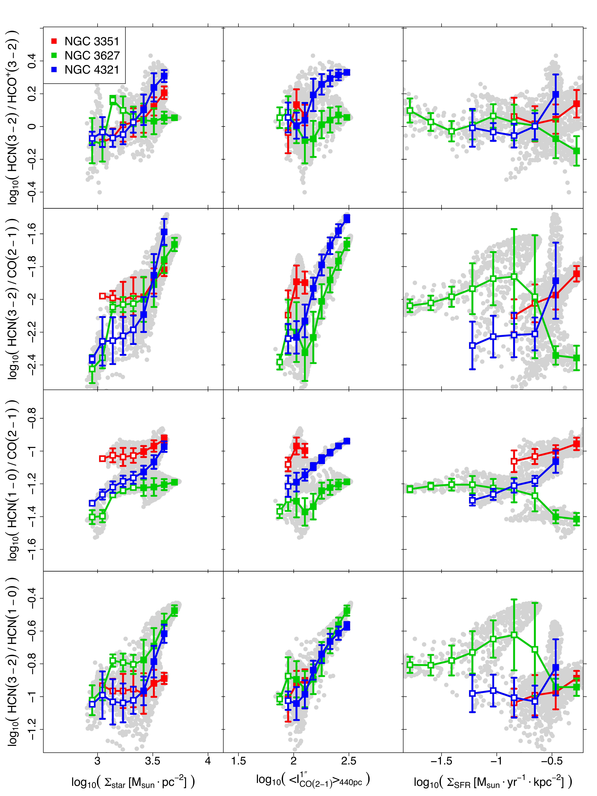

$\newcommand{\ensuremath}{}$
$\newcommand{\xspace}{}$
$\newcommand{\object}[1]{\texttt{#1}}$
$\newcommand{\farcs}{{.}''}$
$\newcommand{\farcm}{{.}'}$
$\newcommand{\arcsec}{''}$
$\newcommand{\arcmin}{'}$
$\newcommand{\ion}[2]{#1#2}$
$\newcommand{\textsc}[1]{\textrm{#1}}$
$\newcommand{\hl}[1]{\textrm{#1}}$
$\newcommand{\figcita}[1]{Fig. \ref{#1}}$
$\newcommand{\tabcita}[1]{Table \ref{#1}}$
$\newcommand{\refe}[1]{{\hypersetup{hidelinks}\hyperref[fig_point]{\color{blue}#1}}}$
$\newcommand{\ngc}[1]{\object{NGC #1}}$
$\newcommand{\dd}[0]{ \text{d}}$
$\newcommand{\hcnthree}[0]{HCN(3--2)\xspace}$
$\newcommand{\hcnfour}[0]{HCN(4--3)\xspace}$
$\newcommand{\hcopthree}[0]{HCO^+(3--2)\xspace}$
$\newcommand{\hcopfour}[0]{HCO^+(4--3)\xspace}$
$\newcommand{\hcnone}[0]{HCN(1--0)\xspace}$
$\newcommand{\hcopone}[0]{HCO^+(1--0)\xspace}$
$\newcommand{\cotwo}[0]{CO(2--1)\xspace}$
$\newcommand{\coone}[0]{CO(1--0)\xspace}$
$\newcommand{\tkin}[0]{T_\text{K}}$
$\newcommand{\mach}[0]{\mathcal{M}}$
$\newcommand{\alphapl}[0]{\alpha_\text{PL}}$
$\newcommand{\meann}[0]{\bar{n}}$
$\newcommand{\vgrad}[0]{\nabla v}$
$\newcommand{\sstar}[0]{\Sigma_\textrm{star}}$
$\newcommand{\ssfr}[0]{\Sigma_\text{SFR}}$
$\newcommand{\meanco}[0]{\langle I_\text{CO}\rangle}$
$\newcommand{\acotwo}[0]{\alpha_\text{CO21}}$
$\newcommand{\ahcnone}[0]{\alpha_\text{HCN10}^\text{dense}}$
$\newcommand{\ahcnthree}[0]{\alpha_\text{HCN32}^\text{dense}}$
$\newcommand{\fdense}[0]{f_\text{dense}}$
$\newcommand{\kms}[0]{km~s^{-1}}$
$\newcommand{\ltom}[0]{M_\odot~(K~km~s^{-1}~pc^{2})^{-1}}$
$\newcommand{\cmmcube}[0]{cm^{-3}}$

$\newcommand{\ensuremath}{}$
$\newcommand{\xspace}{}$
$\newcommand{\object}[1]{\texttt{#1}}$
$\newcommand{\farcs}{{.}''}$
$\newcommand{\farcm}{{.}'}$
$\newcommand{\arcsec}{''}$
$\newcommand{\arcmin}{'}$
$\newcommand{\ion}[2]{#1#2}$
$\newcommand{\textsc}[1]{\textrm{#1}}$
$\newcommand{\hl}[1]{\textrm{#1}}$
$\newcommand{\figcita}[1]{Fig. \ref{#1}}$
$\newcommand{\tabcita}[1]{Table \ref{#1}}$
$\newcommand{\refe}[1]{{\hypersetup{hidelinks}\hyperref[fig_point]{\color{blue}#1}}}$
$\newcommand{\ngc}[1]{\object{NGC #1}}$
$\newcommand{\dd}[0]{ \text{d}}$
$\newcommand{\hcnthree}[0]{HCN(3--2)\xspace}$
$\newcommand{\hcnfour}[0]{HCN(4--3)\xspace}$
$\newcommand{\hcopthree}[0]{HCO^+(3--2)\xspace}$
$\newcommand{\hcopfour}[0]{HCO^+(4--3)\xspace}$
$\newcommand{\hcnone}[0]{HCN(1--0)\xspace}$
$\newcommand{\hcopone}[0]{HCO^+(1--0)\xspace}$
$\newcommand{\cotwo}[0]{CO(2--1)\xspace}$
$\newcommand{\coone}[0]{CO(1--0)\xspace}$
$\newcommand{\tkin}[0]{T_\text{K}}$
$\newcommand{\mach}[0]{\mathcal{M}}$
$\newcommand{\alphapl}[0]{\alpha_\text{PL}}$
$\newcommand{\meann}[0]{\bar{n}}$
$\newcommand{\vgrad}[0]{\nabla v}$
$\newcommand{\sstar}[0]{\Sigma_\textrm{star}}$
$\newcommand{\ssfr}[0]{\Sigma_\text{SFR}}$
$\newcommand{\meanco}[0]{\langle I_\text{CO}\rangle}$
$\newcommand{\acotwo}[0]{\alpha_\text{CO21}}$
$\newcommand{\ahcnone}[0]{\alpha_\text{HCN10}^\text{dense}}$
$\newcommand{\ahcnthree}[0]{\alpha_\text{HCN32}^\text{dense}}$
$\newcommand{\fdense}[0]{f_\text{dense}}$
$\newcommand{\kms}[0]{km~s^{-1}}$
$\newcommand{\ltom}[0]{M_\odot~(K~km~s^{-1}~pc^{2})^{-1}}$
$\newcommand{\cmmcube}[0]{cm^{-3}}$

# Sub-kiloparsec empirical relations and excitation conditions of HCN and HCO$^+$ $J$=3-2 in nearby star-forming galaxies

<mark>Appeared on: 2023-02-01</mark> - _Accepted for publication in A&A. 14 pages, 8 figures_

Axel Garcia-Rodriguez, et al. -- incl., <mark><mark>Frank Bigiel</mark></mark>, <mark><mark>Eva Schinnerer</mark></mark>

**Abstract:** We present new HCN and HCO $^+$ ( $J$ =3--2) images of the nearby star-forming galaxies (SFGs) \ngc{3351} , \ngc{3627} , and \ngc{4321} . The observations, obtained with the Morita ALMA Compact Array, have a spatial resolution of $\sim$ 290--440 pc and resolve the inner $R_\textrm{gal} \lesssim$ 0.6-1 kpc of the targets, as well as the southern bar end of \ngc{3627} . We complement this data set with publicly available images of lower excitation lines of HCN, HCO $^+$ , and CO and analyse the behaviour of a representative set of line ratios: \hcnthree / \hcnone , \hcnthree / \hcopthree , \hcnone / \cotwo , and \hcnthree / \cotwo . Most of these ratios peak at the galaxy centres and decrease outwards. We compare the HCN and HCO $^+$ observations with a grid of one-phase, non-local thermodynamic equilibrium (non-LTE) radiative transfer models and find them compatible with models that predict subthermally excited and optically thick lines. We study the systematic variations of the line ratios across the targets as a function of the stellar surface density ( $\sstar$ ), the intensity-weighted \cotwo ( $\meanco$ ), and the star formation rate surface density ( $\ssfr$ ). We find no apparent correlation with $\ssfr$ , but positive correlations with the other two parameters, which are stronger in the case of $\meanco$ . The HCN/CO- $\meanco$ relations show $\lesssim$ 0.3 dex galaxy-to-galaxy offsets, with \hcnthree / \cotwo - $\meanco$ being $\sim$ 2 times steeper than \hcnone / \cotwo . In contrast, the \hcnthree / \hcnone - $\meanco$ relation exhibits a tighter alignment between galaxies. We conclude that the overall behaviour of the line ratios cannot be ascribed to variations in a single excitation parameter (e.g. density or temperature).

**Figure 2. -** 
Integrated intensity maps at $6"$ resolution of $\ngc${3351}, $\ngc${3627}, and $\ngc${4321 from left to right}. Top and middle rows: $\hcnthree$ and $\hcopthree$  maps. The white contours correspond to S/N=5 and the grey circles represent the $6"$ beam. Offsets are relative to the positions in Table \ref{tab_sample}. Bottom row: PHANGS-ALMA $\cotwo$ maps. Black contours correspond to 10, 30, 50, and 70\% of the maximum in each $\cotwo$ image at the native ${\sim}1.5"$ resolution. The white circles indicate the fields of the $\hcnthree$ and $\hcopthree$ observations with the ACA. (*fig_mom0-HCN32*)

**Figure 6. -** Same line ratios as in Fig. \ref{fig_lineRatioMaps} plotted against $\sstar$(left), $\meanco$(middle), and $\ssfr$(right) on a pixel-by-pixel basis (grey points).
All panels have the same vertical and horizontal span in dex for an easier comparison.
For each line ratio and galaxy, the colour squares and vertical bars represent the  mean  and the $\pm 1\sigma$ standard deviation within bins of the x-axis parameter. The squares are white-filled where the mean value does not necessarily represent the whole galaxy (Sect. \ref{sec_empirical-relations}). (*fig_line-ratio_galaxy_comparison*)

**Figure 4. -** Histograms per galaxy of $\hcnthree$/$\hcopthree$, $\hcnone$/$\hcopone$, $\hcnthree$/$\hcnone$, and $\hcopthree$/$\hcopone$ line ratios. (*fig_litHist-simple*)

