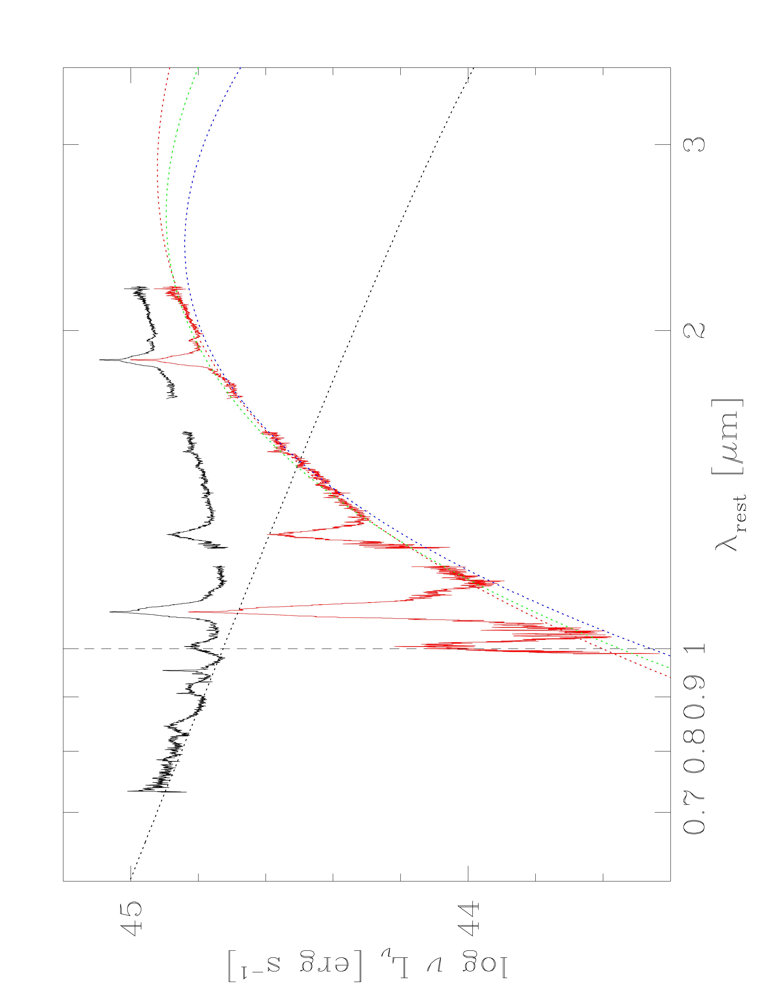
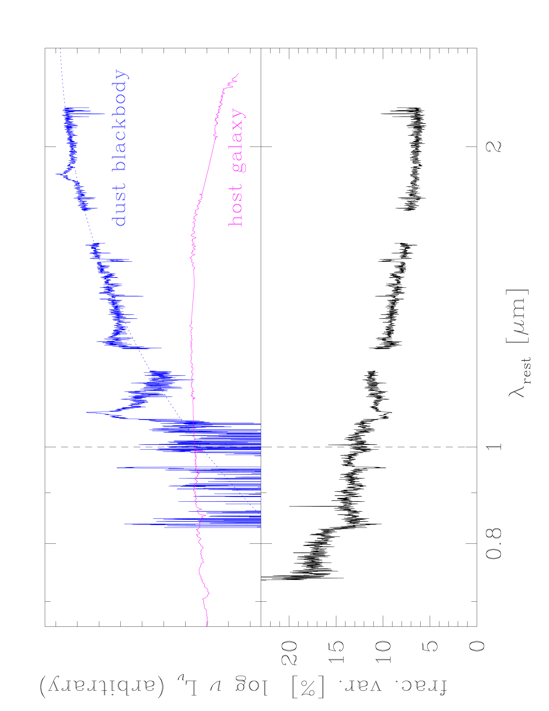
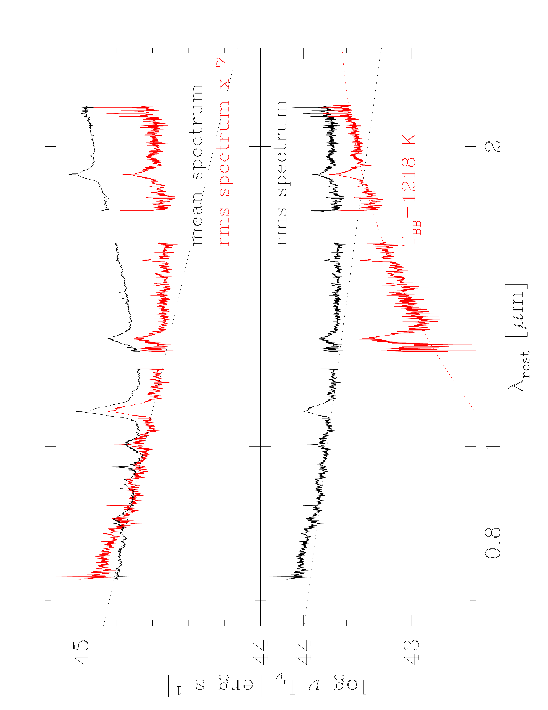

$\newcommand{\ensuremath}{}$
$\newcommand{\xspace}{}$
$\newcommand{\object}[1]{\texttt{#1}}$
$\newcommand{\farcs}{{.}''}$
$\newcommand{\farcm}{{.}'}$
$\newcommand{\arcsec}{''}$
$\newcommand{\arcmin}{'}$
$\newcommand{\ion}[2]{#1#2}$
$\newcommand{\textsc}[1]{\textrm{#1}}$
$\newcommand{\hl}[1]{\textrm{#1}}$
$\newcommand{\vdag}{(v)^\dagger}$
$\newcommand$
$\newcommand$
$\newcommand{\la}{\mathrel{\hbox{\rlap{\hbox{\lower4pt\hbox{\sim}}}\hbox{<}}}}$
$\newcommand{\ga}{\mathrel{\hbox{\rlap{\hbox{\lower4pt\hbox{\sim}}}\hbox{>}}}}$
$\newcommand{\OIII}{[O~{\sevenrm III}]}$
$\newcommand{\FeII}{Fe~{\sevenrm II}}$
$\newcommand{\FeIIf}{[Fe~{\sevenrm II}]}$
$\newcommand{\SIII}{[S~{\sevenrm III}]}$
$\newcommand{\HeI}{He~{\sevenrm I}}$
$\newcommand{\HeII}{He~{\sevenrm II}}$
$\newcommand{\NeV}{[Ne~{\sevenrm V}]}$
$\newcommand{\OIV}{[O~{\sevenrm IV}]}$
$\newcommand{\iraf}{{\sevenrm IRAF}}$
$\newcommand{\mpfit}{{\sevenrm MPFIT}}$
$\newcommand{\galfit}{{\sevenrm GALFIT}}$
$\newcommand{\prepspec}{{\sevenrm PrepSpec}}$
$\newcommand{\mapspec}{{\sevenrm mapspec}}$
$\newcommand{\cream}{{\sevenrm CREAM}}$
$\newcommand{\javelin}{{\sevenrm JAVELIN}}$
$\newcommand{\cloudy}{{\sevenrm CLOUDY}}$
$\newcommand{\banzai}{{\sevenrm BANZAI}}$
$\newcommand{\orac}{{\sevenrm ORAC}}$
$\newcommand{\demc}{{\sevenrm DEMC}}$
$\newcommand{\gp}{\mathcal{GP}}$

$\newcommand{$\ensuremath$}{}$
$\newcommand{$\xspace$}{}$
$\newcommand{$\object$}[1]{\texttt{#1}}$
$\newcommand{$\farcs$}{{.}''}$
$\newcommand{$\farcm$}{{.}'}$
$\newcommand{$\arcsec$}{''}$
$\newcommand{$\arcmin$}{'}$
$\newcommand{$\ion$}[2]{#1#2}$
$\newcommand{$\textsc$}[1]{\textrm{#1}}$
$\newcommand{$\hl$}[1]{\textrm{#1}}$
$\newcommand{$\vdag$}{(v)^\dagger}$
$\newcommand$
$\newcommand$
$\newcommand{$\la$}{\mathrel{\hbox{\rlap{\hbox{\lower4pt\hbox{\sim}}}\hbox{<}}}}$
$\newcommand{$\ga$}{\mathrel{\hbox{\rlap{\hbox{\lower4pt\hbox{\sim}}}\hbox{>}}}}$
$\newcommand{$\OIII$}{[O~{\sevenrm III}]}$
$\newcommand{$\FeII$}{Fe~{\sevenrm II}}$
$\newcommand{$\FeII$f}{[Fe~{\sevenrm II}]}$
$\newcommand{$\SIII$}{[S~{\sevenrm III}]}$
$\newcommand{$\HeI$}{He~{\sevenrm I}}$
$\newcommand{$\HeI$I}{He~{\sevenrm II}}$
$\newcommand{$\NeV$}{[Ne~{\sevenrm V}]}$
$\newcommand{$\OIV$}{[O~{\sevenrm IV}]}$
$\newcommand{$\iraf$}{{\sevenrm IRAF}}$
$\newcommand{$\mpfit$}{{\sevenrm MPFIT}}$
$\newcommand{$\ga$lfit}{{\sevenrm GALFIT}}$
$\newcommand{$\prepspec$}{{\sevenrm PrepSpec}}$
$\newcommand{$\mapspec$}{{\sevenrm mapspec}}$
$\newcommand{$\cream$}{{\sevenrm CREAM}}$
$\newcommand{$\javelin$}{{\sevenrm JAVELIN}}$
$\newcommand{$\cloudy$}{{\sevenrm CLOUDY}}$
$\newcommand{$\banzai$}{{\sevenrm BANZAI}}$
$\newcommand{$\orac$}{{\sevenrm ORAC}}$
$\newcommand{$\demc$}{{\sevenrm DEMC}}$
$\newcommand{$\gp$}{\mathcal{GP}}$

# A complex dust morphology in the high-luminosity AGN Mrk 876

<mark>Appeared on: 2023-02-06</mark> - _18 pages, 7 figures; accepted to ApJ_

<mark>Hermine Landt</mark>, et al. -- incl., <mark>J\"org-Uwe Pott</mark>, <mark>Juan V. Hernández Santisteban</mark>

**Abstract:** Recent models for the inner structure of active galactic nuclei (AGN) advocate the presence of a radiatively accelerated, dusty outflow launched from the outer regions of the accretion disk. Here we present the first near-infrared (near-IR) variable (rms) spectrum for the high-luminosity, nearby AGN Mrk 876. We find that it tracks the accretion disk spectrum out to longer wavelengths than the mean spectrum due to a reduced dust emission. The implied outer accretion disk radius is consistent with the infrared results predicted by a contemporaneous optical accretion disk reverberation mapping campaign and much larger than the self-gravity radius. The reduced flux variability of the hot dust could be either due to the presence of a secondary, constant dust component in the mean spectrum or introduced by the destructive superposition of the dust and accretion disk variability signals or some combination of both. Assuming thermal equilibrium for optically thin dust, we derive the luminosity-based dust radius for different grain properties using our measurement of the temperature. We find that in all cases considered the values are significantly larger than the dust response time measured by IR photometric monitoring campaigns, with the least discrepancy present relative to the result for a wavelength-independent dust emissivity law, i.e. a blackbody, which is appropriate for large grain sizes. This result can be well explained by assuming a flared, disk-like structure for the hot dust.

**Figure 2. -** $\la$bel{irsed} Gemini GNIRS near-IR spectrum from 2016 May 25 shown as luminosity versus rest-frame wavelength (black spectrum). We decomposed the continuum into two components, namely, an accretion disk spectrum that approximates the wavelength range $\la 1 \mu$m (black dotted curve) and still dominates at $1 \mu$m (vertical dashed line) and hot dust emission (red spectrum). We fitted the hot dust continuum with a blackbody spectrum (red dotted curve) and modified blackbody spectra for carbon and silicate dust (green and blue dotted curves, respectively) with resulting best-fit temperatures as listed in Table \ref{lumradiustab}. (*irsed*)

**Figure 3. -** $\la$bel{fracvar} Top panel: The flux difference between the normalised mean and variable spectra (blue) can be attributed to an additional (non-variable) dust component with a blackbody temperature of $T \sim 1300$ K (blue dotted line). The template of an elliptical host galaxy is also shown (magenta). Bottom panel: The fractional amplitude of the variations as a percentage of the mean flux versus the rest-frame wavelength. (*fracvar*)

**Figure 6. -** $\la$bel{rmsspec} Top panel: The mean (black) and variable near-IR spectrum (red) for our campaign normalised at rest-frame $0.9 \mu$m. The spectrum of a standard accretion disk (black dotted line) is traced to $\sim 1.2 \mu$m in the variable component and only to $\sim 1 \mu$m in the mean spectrum. Bottom panel: The spectral decomposition of the variable near-IR spectrum (black) into an accretion disk spectrum (black dotted line) and a hot dust component (red spectrum) yields a blackbody temperature of $T \sim 1200$ K for the latter (red dotted curve). (*rmsspec*)

