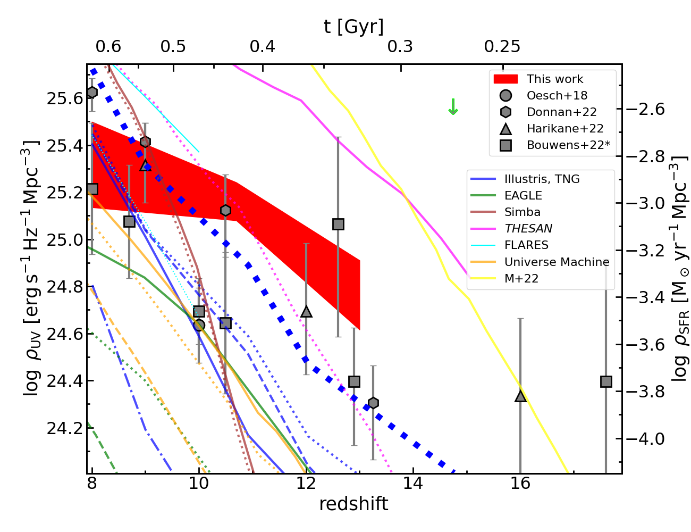
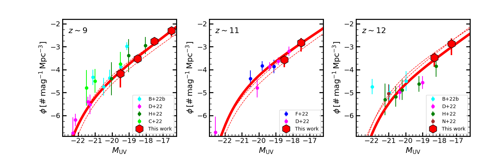
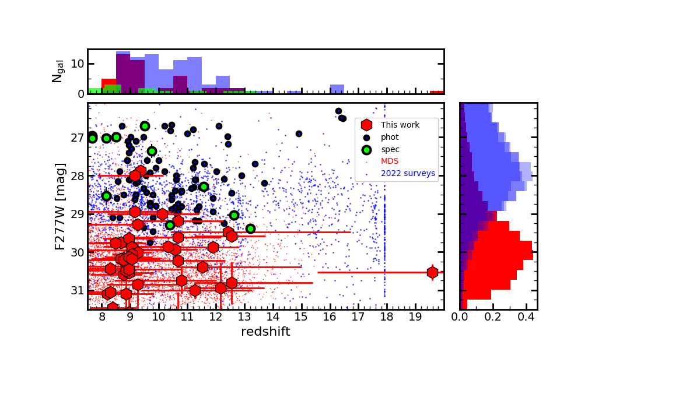

$\newcommand{\ensuremath}{}$
$\newcommand{\xspace}{}$
$\newcommand{\object}[1]{\texttt{#1}}$
$\newcommand{\farcs}{{.}''}$
$\newcommand{\farcm}{{.}'}$
$\newcommand{\arcsec}{''}$
$\newcommand{\arcmin}{'}$
$\newcommand{\ion}[2]{#1#2}$
$\newcommand{\textsc}[1]{\textrm{#1}}$
$\newcommand{\hl}[1]{\textrm{#1}}$
$\newcommand{\footnote}[1]{}$
$\newcommand{\lucacomment}[1]{{\color{magenta} [{#1}]}}$
$\newcommand{\luca}[1]{\lucacomment{{\bf #1}}}$
$\newcommand{\mariannacomment}[1]{{\color{blue} [{#1}]}}$
$\newcommand{\MA}[1]{\mariannacomment{{\bf #1}}}$
$\newcommand{\danial}[1]{{\color{teal}{#1}}}$
$\newcommand{\johncomment}[1]{{\color{green} [{#1}]}}$
$\newcommand{\john}[1]{\johncomment{{\bf #1}}}$
$\newcommand{\vdag}{(v)^\dagger}$
$\newcommand$
$\newcommand$

$\newcommand{\ensuremath}{}$
$\newcommand{\xspace}{}$
$\newcommand{\object}[1]{\texttt{#1}}$
$\newcommand{\farcs}{{.}''}$
$\newcommand{\farcm}{{.}'}$
$\newcommand{\arcsec}{''}$
$\newcommand{\arcmin}{'}$
$\newcommand{\ion}[2]{#1#2}$
$\newcommand{\textsc}[1]{\textrm{#1}}$
$\newcommand{\hl}[1]{\textrm{#1}}$
$\newcommand{\footnote}[1]{}$
$\newcommand{\lucacomment}[1]{{\color{magenta} [{#1}]}}$
$\newcommand{\luca}[1]{\lucacomment{{\bf #1}}}$
$\newcommand{\mariannacomment}[1]{{\color{blue} [{#1}]}}$
$\newcommand{\MA}[1]{\mariannacomment{{\bf #1}}}$
$\newcommand{\danial}[1]{{\color{teal}{#1}}}$
$\newcommand{\johncomment}[1]{{\color{green} [{#1}]}}$
$\newcommand{\john}[1]{\johncomment{{\bf #1}}}$
$\newcommand{\vdag}{(v)^\dagger}$
$\newcommand$
$\newcommand$

# Life beyond 30: probing the $-20<M_\mathrm{UV}<-17$ luminosity function at $8<z<13$ with the NIRCam parallel field of the MIRI Deep Survey

<mark>Appeared on: 2023-02-05</mark> - _Submitted to ApJL, in memoriam Hans Ulrik Noorgaard-Nielsen and Olivier Le Fèvre, Table 1 replaced with a correct version_

Pablo G. Pérez-González, et al. -- incl., <mark>Fabian Walter</mark>, <mark>Sarah E.~I.~Bosman</mark>

**Abstract:** We present the ultraviolet luminosity function and an estimate of the cosmic star formation rate density at $8<z<13$ derived from deep NIRCam observations taken in parallel with the MIRI Deep Survey (MDS) of the Hubble Ultra Deep Field (HUDF), NIRCam covering the parallel field 2 (HUDF-P2). Our deep (40 hours) NIRCam observations reach a $F277W$ magnitude of 30.8 at the $5\sigma$ level, more than 2 magnitudes deeper than JWST public datasets already analyzed to find high redshift galaxies. We select a sample of 45 $z>8$ galaxy candidates based on their dropout nature in the $F115W$ and/or $F150W$ filters, a high probability for their photometric redshifts, estimated with three different codes, being at $z>8$ , good fits based on $\chi^2$ calculations, and predominant solutions compared to $z<8$ alternatives. We find mild evolution in the luminosity function from $z\sim13$ to $z\sim8$ , i.e., only a small increase in the average number density of $\sim$ 0.2 dex, while the faint-end slope and absolute magnitude of the knee remain approximately constant, with values $\alpha=-2.3\pm0.2$ and $M^*=-20.8\pm0.2$ mag. Comparing our results with the predictions of a wide range of state-of-the-art galaxy evolution models, we find two main results: (1) a slower increase with time in the cosmic star formation rate density compared to a steeper rise predicted by models; (2) nearly a factor of 10 higher star formation activity concentrated in scales around 2 kpc in galaxies with stellar masses $\sim10^8$ M $_\odot$ during the first 350 Myr of the Universe ( $z\sim12$ ), with models matching better the observations $\sim$ 150 Myr later, by $z\sim9$ .

**Figure 4. -** Evolution of the UV luminosity density, transformed into SFR density on the right vertical axis (assuming a  ([ and Chabrier 2003]()) ). The {\sc EAGLE} simulations  ([Schaye, Crain and Bower 2015](), [Crain, Schaye and Bower 2015]())  are plotted in green for galaxy samples cut in stellar masses $\mathrm{M\!_\star}>10^{6,7,8}$ M$_\odot$ in continuous, dotted, dashed lines. The {\sc simba} predictions are shown with a brown continuous line for all galaxies, dashed line for $F277W<31$ mag sources  ([Davé, Anglés-Alcázar and Narayanan 2019]()) . The {\sc thesan-1} and {\sc thesan-sdao-2} simulations  ([Kannan, Garaldi and Smith 2022]())  are shown in magenta with continuous and dotted lines, respectively (see text for differences). The {\sc FLARES} predictions are shown in cyan  ([Lovell, Vijayan and Thomas 2021](), [Vijayan, Lovell and Wilkins 2021]()) . The  UniverseMachine semi-empirical model  ([Behroozi, Conroy and Wechsler 2020]())  is shown in orange with the same mass cuts and line styles mentioned for {\sc EAGLE}. Finally, the models in  ([Maio and Viel (2022)]())  are shown in yellow. (*fig:density*)

**Figure 3. -** From left to right, UV luminosity functions at $z\sim9$, $z\sim11$ and $z\sim12$. We plot our results with red hexagons (uncertainties smaller than data points in some cases, see Table \ref{tab:lf}), and compare with literature estimations from  ([Donnan, McLeod and Dunlop (2023)](), [Naidu and Oesch (2022)](), [Finkelstein, Bagley and Ferguson (2022)](), [Bouwens, Illingworth and Oesch (2022)]()) ,   ([Harikane, Ouchi and Oguri (2022)]()) , and  ([Castellano, Fontana and Treu (2022)]()) . We fit all points (ours and those in the literature) to a   ([ and Schechter (1976)]())  function, which is plotted with red continuous lines in each panel, with the fits for other redshifts shown with dashed lines. (*fig:lf*)

**Figure 2. -** Magnitude in the NIRCam $F277W$ filter vs$.$ photometric redshift for $z>8$ galaxies. General galaxy samples extracted from the catalogs released by G. Brammer for the SMACS0723, GLASS, and CEERS datasets gathered in 2022 are plotted with blue small dots  to illustrate the magnitude limits of the surveys and the number of high-redshift galaxies in unsupervised and unvetted photometric catalogs. Our parent galaxy sample is plotted with red small dots, and the final sample of $z>8$ galaxy candidates with red hexagons. We depict $1\sigma$ uncertainties plotted in both axes and the data point referring to the zPDF peak redshift. We also plot the photometric high-redshift galaxy candidates of  ([Donnan, McLeod and Dunlop (2023)]()) ,  ([Naidu and Oesch (2022)]()) ,  ([Bouwens, Illingworth and Oesch (2022)]()) , and  ([Finkelstein, Bagley and Ferguson (2022)]())  with large black circles (samples not providing $F277W$ magnitudes are not shown, e.g.,  ([Harikane, Ouchi and Oguri (2022)]()) , and we do not remove repeated sources with different measurements), as well as spectroscopically confirmed galaxies from JADES  ([Curtis-Lake, Carniani and Cameron 2022](), [Robertson, Tacchella and Johnson 2022]())  and lensing clusters \citep[][not corrected for magnification]{2023MNRAS.518L..45C,2022arXiv221015699W,2022arXiv221202491L,2022arXiv221015639R} in green. The top panel shows the histogram of redshifts for these samples of high-redshift galaxy candidates. The right panel shows the magnitude distribution of the different datasets mentioned before, with the three 2022 surveys plotted with  transparency. Our deeper data (peaking around 2 magnitudes fainter than previous surveys) probe the 29 to 31 mag regime, providing candidates at the previously unexplored faint-end of the luminosity functions. (*fig:z-mag*)

