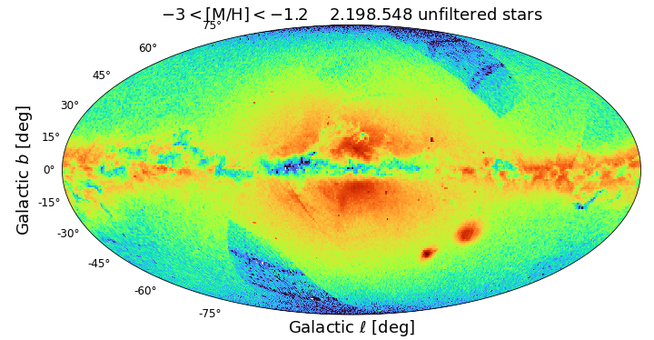
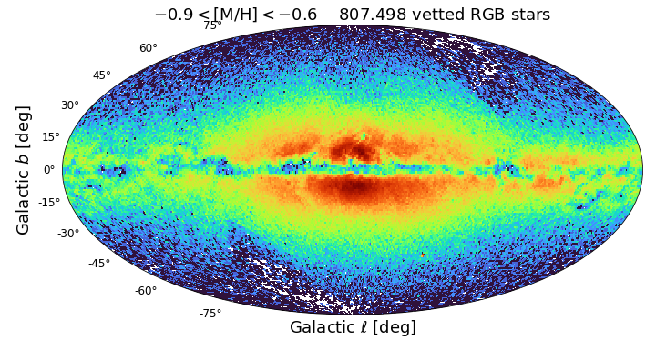

$\newcommand{\ensuremath}{}$
$\newcommand{\xspace}{}$
$\newcommand{\object}[1]{\texttt{#1}}$
$\newcommand{\farcs}{{.}''}$
$\newcommand{\farcm}{{.}'}$
$\newcommand{\arcsec}{''}$
$\newcommand{\arcmin}{'}$
$\newcommand{\ion}[2]{#1#2}$
$\newcommand{\textsc}[1]{\textrm{#1}}$
$\newcommand{\hl}[1]{\textrm{#1}}$
$\newcommand{\footnote}[1]{}$
$\newcommand{\vdag}{(v)^\dagger}$
$\newcommand$
$\newcommand$
$\newcommand$
$\newcommand$
$\newcommand$
$\newcommand$
$\newcommand{\referee}[1]{#1}$

$\newcommand{\ensuremath}{}$
$\newcommand{\xspace}{}$
$\newcommand{\object}[1]{\texttt{#1}}$
$\newcommand{\farcs}{{.}''}$
$\newcommand{\farcm}{{.}'}$
$\newcommand{\arcsec}{''}$
$\newcommand{\arcmin}{'}$
$\newcommand{\ion}[2]{#1#2}$
$\newcommand{\textsc}[1]{\textrm{#1}}$
$\newcommand{\hl}[1]{\textrm{#1}}$
$\newcommand{\footnote}[1]{}$
$\newcommand{\vdag}{(v)^\dagger}$
$\newcommand$
$\newcommand$
$\newcommand$
$\newcommand$
$\newcommand$
$\newcommand$
$\newcommand{\referee}[1]{#1}$

# Robust Data-driven Metallicities for 120 Million Stars from Gaia XP Spectra

<mark>Appeared on: 2023-02-06</mark> - _18 pages, 17 figures, submitted to ApJS_

<mark>René Andrae</mark>, <mark>Hans-Walter Rix</mark>, Vedant Chandra

**Abstract:** We derive and publish data-driven estimates of stellar metallicities $\MH$ for $\gtrsim 120$ million stars with low-resolution XP spectra published in Gaia DR3. The $\MH$ values, along with $\Teff$ and $\logg$ ,are derived using the XGBoost algorithm, trained on stellar parameters from APOGEE, augmented by a set of very metal-poor stars.XGBoost draws on a number of data features: the full set of XP spectral coefficients, narrowband fluxes derived from XP spectra, and broadband magnitudes.  In particular, we include AllWISE magnitudes, as they reduce the degeneracy of $\Teff$ and dust reddening.  We also include the parallax as a data feature, which helps constrain $\logg$ and $\MH$ . The resulting mean stellar parameter precision is 0.1 dex in $\MH$ , 50 K in $\Teff$ , and 0.08 dex in $\logg$ .This all-sky $\MH$ sample  is two orders of magnitude larger than published samples of comparable fidelity across $-3\lesssim \MH \lesssim +0.5$ .Additionally, we provide a catalog of over 13 million bright ( $G<16$ ) red giants whose $\MH$ are vetted to be precise and pure.We present all-sky maps of the Milky Way in different $\MH$ regimes that illustrate the purity of the dataset, and demonstrate the power of this unprecedented sample to reveal the Milky Way's structure from its heart to its disk.

**Figure 14. -** Cross-validation of the XGBoost parameters derived from the XP spectra with SDSS-APOGEE DR17. The plots show the results of the twenty-fold cross-validation of the 5\% portions of the training sample, withheld in the training. Rows from top to bottom show \MH residuals, \Teff residuals and \logg residuals. Columns from left to right show residuals vs. APOGEE's \MH, APOGEE's \Teff, APOGEE's \logg and Gaia's apparent $G_\textrm{BP}$ magnitude. The numbers in the top right corners quote the median absolute difference (MedAD) and the root mean square difference (RMSD). The density map is logarithmic. These plots illustrate the remarkable precision of the approach: 0.10 dex in \MH, 50K in \Teff , and 0.08 dex in \logg . Note that these variances still include all the uncertainties in the APOGEE estimates. (*fig:internal-x-validation-XGBoost*)

**Figure 7. -** Validation of the \MH estimates in the main sequence, using the Praesepe cluster. The cluster's color-magnitude diagram of all 640 members with \MH is illustrated in panel (a). Their \MH estimates are shown as a function of color in panel (b). The horizontal dashed line indicates the metallicity of 0.16 $\referee${($Z=0.02$) adopted by  ([ and Babusiaux (2018)]()) }. For $0.5<G_\textrm{BP}-G_\textrm{RP}<1.5$ the metallicity agreement is excellent, whereas for $1.5<G_\textrm{BP}-G_\textrm{RP}<2.5$ they are systematically too low by 0.15 dex. Outside of these color-ranges the agreement is poor. We attribute the offsets and the poor estimates to possible systematics and poor sampling of the CMD space in the training sample. The \MH estimates for main-sequence stars with colors outside $0.5<G_\textrm{BP}-G_\textrm{RP}<2.5$ are manifestly unreliable. (*fig:Praesepe-MH-vs-colour*)

**Figure 16. -** Skymaps showing the logarithmic number density of all *unfiltered* stars with $-3<\MH<-1.2$(top panel), $-0.9<\MH<-0.6$(middle panel) and $-0.3<\MH<0.1$(bottom panel). These illustrate two important issues: the incompleteness of XP spectra in the two sickle-shaped regions at high latitude. And a significant contamination of the metal-poor bin in the unfiltered sample, which manifests itself as a thin disk near the Galactic plane; these are presumably hotter and highly reddened stars with weaker metal lines that are not recognized as such by our algorithm, as it lacks good training sets in this CMD regime.Skymaps showing the logarithmic number density of *vetted* RGB stars for $-3<\MH<-1.2$(top panel), $-0.9<\MH<-0.6$(middle panel) and $-0.3<\MH<0.1$(bottom panel). This vetted sample (see Fig. \ref{fig:clean-RGB-cuts}) is restricted to red giants with good S/N ($G<16$), \Teff cuts that eliminate contaminants in the low-metallicity subsample and significant parallax (which explains the "disapperance" of the Magellanic Clouds compared to Fig. \ref{fig:mono-abundance-all-sky}. The top panel qualitatively illustrates how clean the metal-poor subsample is: it prominently shows the *Poor Old Heart of the Galaxy* ([Rix, Chandra and Andrae 2022]()) , without any traces of spurious sample members in the disk that is so dominant in the high-metallicity subsample (bottom panel). (*fig:mono-abundance-all-sky*)

