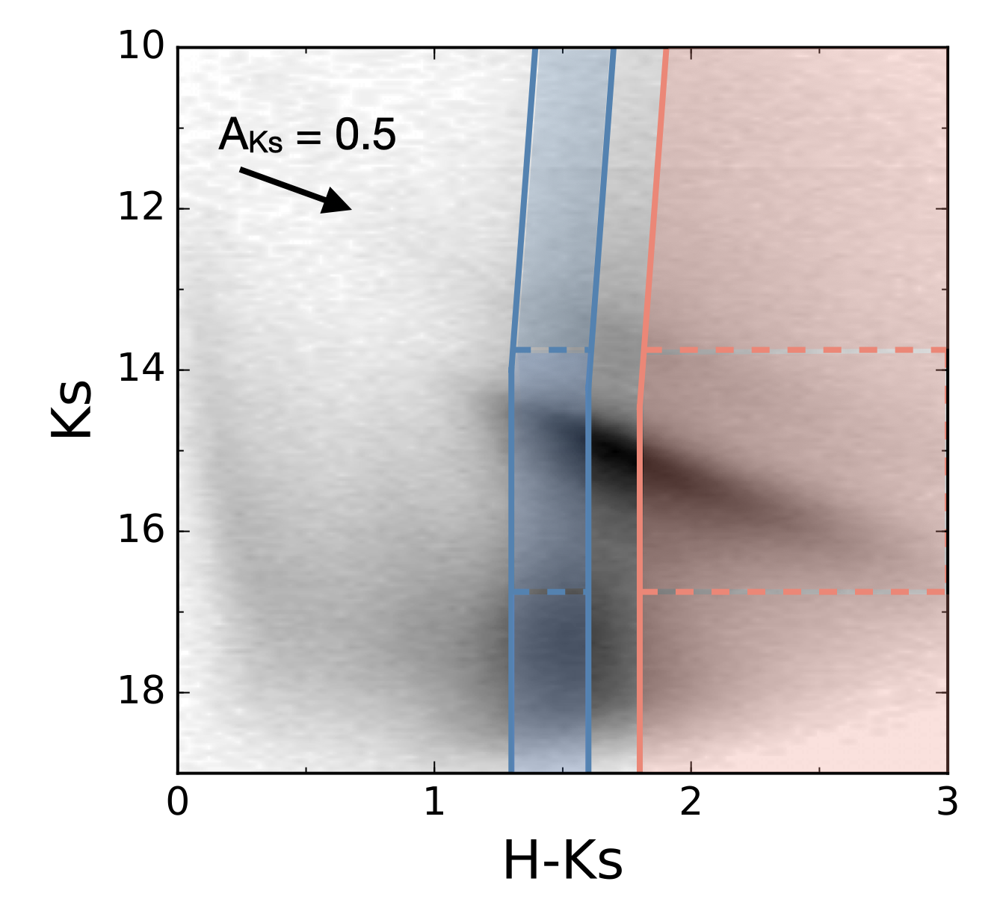
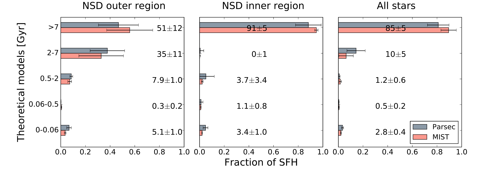
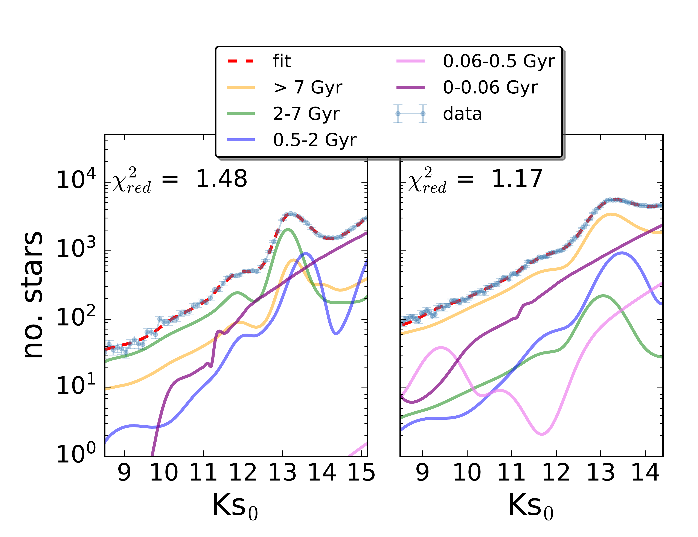

$\newcommand{\ensuremath}{}$
$\newcommand{\xspace}{}$
$\newcommand{\object}[1]{\texttt{#1}}$
$\newcommand{\farcs}{{.}''}$
$\newcommand{\farcm}{{.}'}$
$\newcommand{\arcsec}{''}$
$\newcommand{\arcmin}{'}$
$\newcommand{\ion}[2]{#1#2}$
$\newcommand{\textsc}[1]{\textrm{#1}}$
$\newcommand{\hl}[1]{\textrm{#1}}$

$\newcommand{$\ensuremath$}{}$
$\newcommand{$\xspace$}{}$
$\newcommand{$\object$}[1]{\texttt{#1}}$
$\newcommand{$\farcs$}{{.}''}$
$\newcommand{$\farcm$}{{.}'}$
$\newcommand{$\arcsec$}{''}$
$\newcommand{$\arcmin$}{'}$
$\newcommand{$\ion$}[2]{#1#2}$
$\newcommand{$\textsc$}[1]{\textrm{#1}}$
$\newcommand{$\hl$}[1]{\textrm{#1}}$

# Evidence of an age gradient along the line of sight in the nuclear stellar disc of the Milky Way

<mark>Appeared on: 2023-02-07</mark> - _Submitted to A&A_

<mark>F. Nogueras-Lara</mark>, et al.

**Abstract:** The nuclear stellar disc (NSD) is a flat dense stellar structure at the heart of the Milky Way. Recent work shows that analogous structures are common in the nuclei of external spiral galaxies, where there is evidence of an age gradient that indicates that they form inside-out. However, the characterisation of the age of the NSD stellar population along the line of sight is still missing due to its extreme source crowding and the high interstellar extinction towards the Galactic centre.We aim to characterise the age of the stellar population at different average Galactocentric NSD radii to investigate for the first time the presence of an age gradient along the line of sight.We selected two groups of stars at different NSD radii via their different extinction and proper motion distribution. We analysed their stellar population by fitting their de-reddened$K_s$luminosity functions with a linear combination of theoretical models.We find significant differences in the stellar population at different NSD radii, indicating the presence of an age gradient along the line of sight. Our sample from the closest edge of the NSD contains a significant fraction ($\sim40$\%of its total stellar mass) of intermediate-age stars (2-7 Gyr), that is not present in the sample from stars deeper inside the NSD, in which$\sim90 \%$of the stellar mass is older than 7 Gyr. Our results suggest that the NSD age distribution is similar as the one found in external galaxies and  imply that bar-driven processes observed in external galaxies are similarly at play in the Milky Way.

**Figure 1. -** CMD $K_s$ versus $H-K_s$. The blue and salmon coloured regions indicate the two target groups of stars with different reddening dominated on average by stars from the closest edge of the NSD (NSD outer region) and stars deeper inside the NSD  (NSD inner region), respectively. The dashed boxes show the reference stars used to build the extinction maps for each of the stellar groups analysed (see Sect, \ref{extinct}). The black arrow indicates the reddening vector. (*CMD*)

**Figure 6. -** Stellar populations present in the NSD outer region (left panel), inner region (central panel), and all the NSD stars in the sample (right panel). The numbers indicate the percentage of mass due to a given age bin and its standard deviation. (*SFH*)

**Figure 4. -** Analysis of the de-reddened luminosity functions corresponding to the NSD outer (left panel) and inner (right panel) regions. The reduced $\chi^2$ of the fit is shown in each panel. The 14 theoretical models used are grouped into 5 broader age bins to decrease the degeneracy between models with similar ages. (*KLFs*)

