

$\newcommand{\ensuremath}{}$
$\newcommand{\xspace}{}$
$\newcommand{\object}[1]{\texttt{#1}}$
$\newcommand{\farcs}{{.}''}$
$\newcommand{\farcm}{{.}'}$
$\newcommand{\arcsec}{''}$
$\newcommand{\arcmin}{'}$
$\newcommand{\ion}[2]{#1#2}$
$\newcommand{\textsc}[1]{\textrm{#1}}$
$\newcommand{\hl}[1]{\textrm{#1}}$
$\newcommand{\oiii}{[\ion{O}{iii}]}$
$\newcommand{\nii}{[\ion{N}{ii}]}$
$\newcommand{\sii}{[\ion{S}{ii}]}$
$\newcommand{\thebibliography}{\DeclareRobustCommand{\VAN}[3]{##3}\VANthebibliography}$

$\newcommand{$\ensuremath$}{}$
$\newcommand{$\xspace$}{}$
$\newcommand{$\object$}[1]{\texttt{#1}}$
$\newcommand{$\farcs$}{{.}''}$
$\newcommand{$\farcm$}{{.}'}$
$\newcommand{$\arcsec$}{''}$
$\newcommand{$\arcmin$}{'}$
$\newcommand{$\ion$}[2]{#1#2}$
$\newcommand{$\textsc$}[1]{\textrm{#1}}$
$\newcommand{$\hl$}[1]{\textrm{#1}}$
$\newcommand{$\oiii$}{[$\ion${O}{iii}]}$
$\newcommand{$\nii$}{[$\ion${N}{ii}]}$
$\newcommand{$\sii$}{[$\ion${S}{ii}]}$
$\newcommand{$\thebibliography$}{\DeclareRobustCommand{\VAN}[3]{##3}\VANthebibliography}$

#  emission in AGN host galaxies at Cosmic noon using SINFONI

<mark>Appeared on: 2023-02-08</mark> - _16 pages, 11 figures, 2 tables, accepted for publication in MNRAS; Appendix = 2 tables and 3 figures_

D. Kakkad, et al. -- incl., <mark><mark>C. M. Harrison</mark></mark>

**Abstract:** We present spatially resolved H$\alpha$properties of 21 type 1 AGN host galaxies at z$\sim$2 derived from the SUPER survey. These targets were observed with the adaptive optics capabilities of the SINFONI spectrograph, a near-infrared integral field spectrograph, that provided a median spatial resolution of 0.3$\arcsec$($\sim$2 kpc). We model the H$\alpha$emission line profile in each pixel to investigate whether it traces gas in the narrow line region or if it is associated with star formation. To do this, we first investigate the presence of resolved H$\alpha$emission by removing the contribution of the AGN PSF. We find extended H$\alpha$emission in sixteen out of the 21 type 1 AGN host galaxies (76\%). Based on the BPT diagnostics, optical line flux ratios and the line widths (FWHM), we show that the H$\alpha$emission in five galaxies is ionised by the AGN (30\%), in four galaxies by star formation (25\%) and for the rest (45\%), the ionisation source is unconstrained. Two galaxies show extended H$\alpha$FWHM$>$600 km/s, which is interpreted as a part of an AGN-driven outflow. Morphological and kinematic maps of H$\alpha$emission in targets with sufficient signal-to-noise ratio suggest the presence of rotationally supported disks in six galaxies and possible presence of companions in four galaxies. In two galaxies, we find an anti-correlation between the locations of extended H$\alpha$emission and$\oiii$-based ionised outflows, indicating possible negative feedback at play. However, in the majority of galaxies, we do not find evidence of outflows impacting H$\alpha$based star formation.

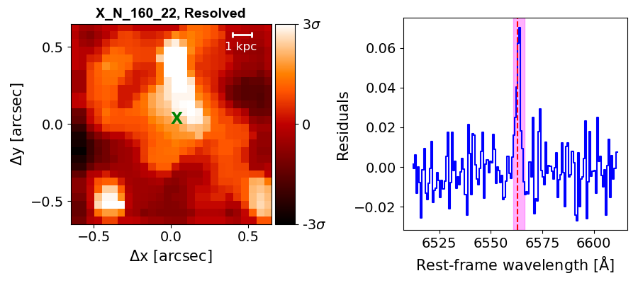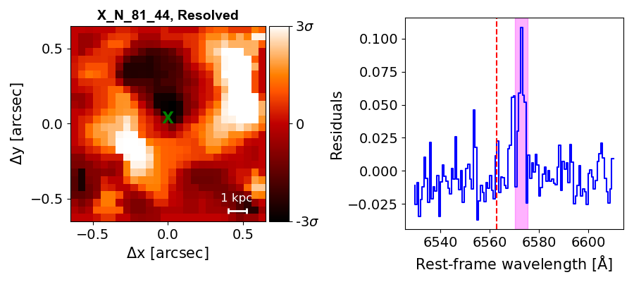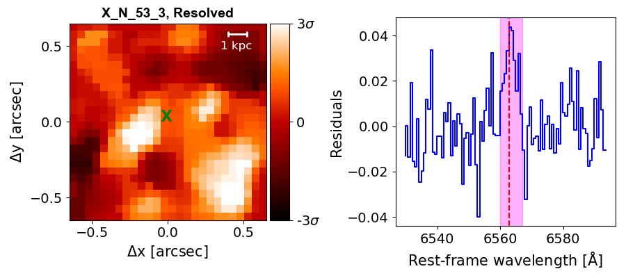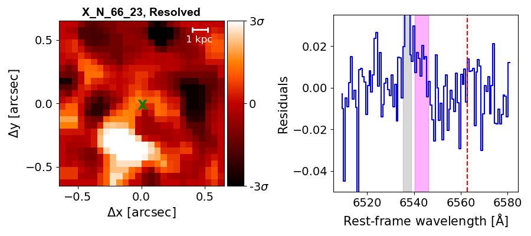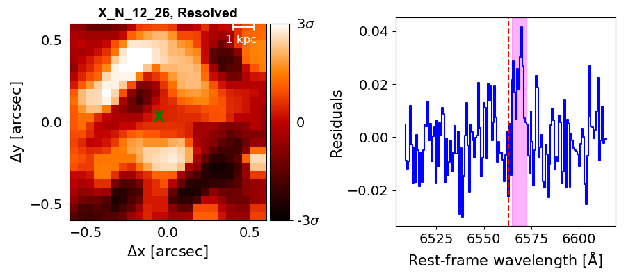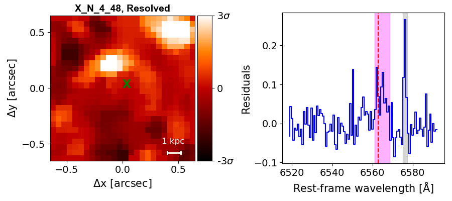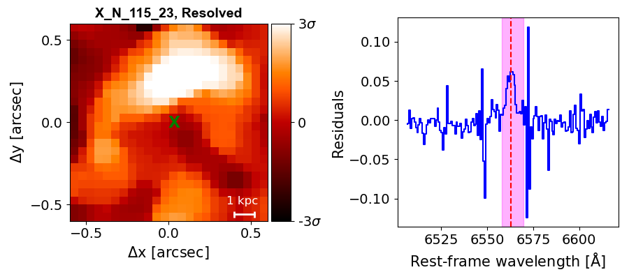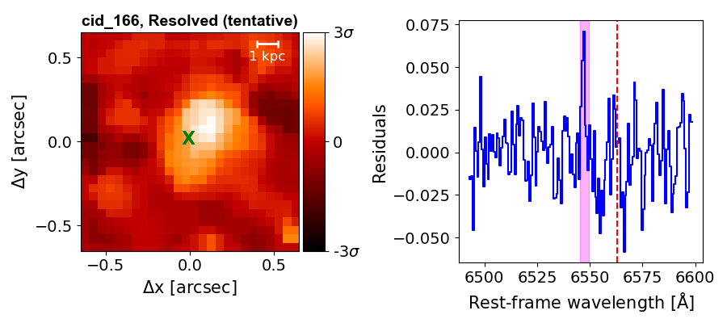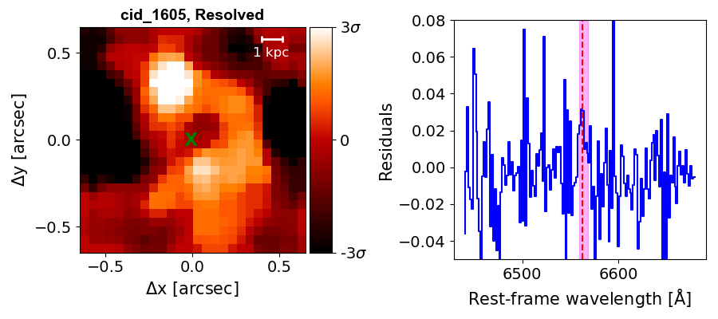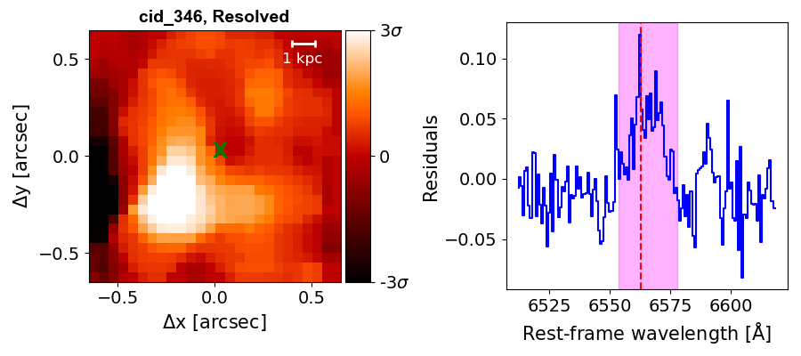

**Figure 7. -** The plots in this figure show the results of the PSF-subtraction procedure described in Sect. \ref{sect3.2}. The maps show the PSF-subtracted H$\alpha$ channel map and the corresponding right panels show the spectrum extracted from regions above 3$\sigma$ noise levels (white regions in the channel maps). The noise levels in each map is obtained from object-free regions. The "X" in the maps mark the peak of the K-band continuum emission which is used as a proxy for the AGN location. The magenta shaded region in the spectra show the channels that were collapsed to obtain the PSF-subtracted images. The vertical red dashed line shows the expected location of the H$\alpha$ line based on the redshift of the respective targets. The presence of structure in the PSF-subtracted map and a visible detection of the emission line in the spectra would suggest an extended H$\alpha$ feature. Each target in this figure show signatures of extended H$\alpha$ emission (labelled as "Resolved"), except X\_N\_66\_23 and cid\_166 (labelled as "Resolved?") where the extension is a possibility but unconfirmed with the current data. Further details are given in Sect. \ref{sect3.2}. (*fig:BPT_PSF*)

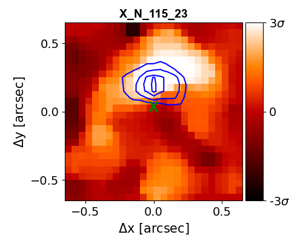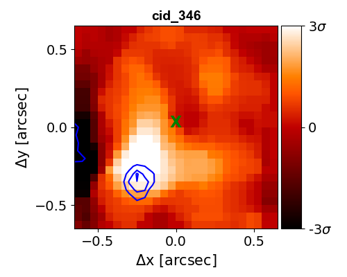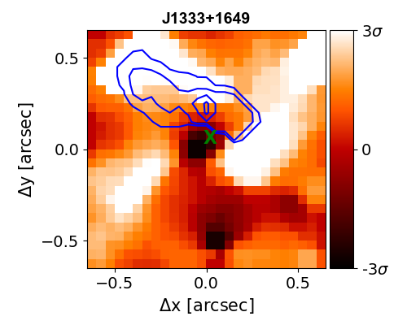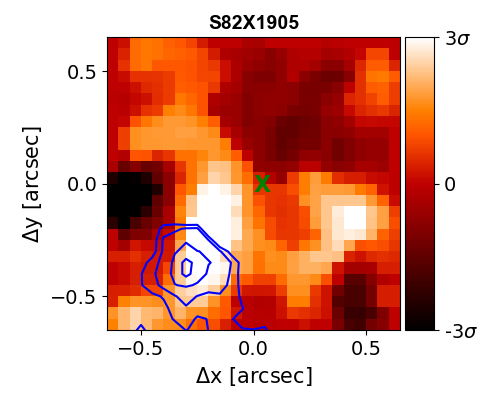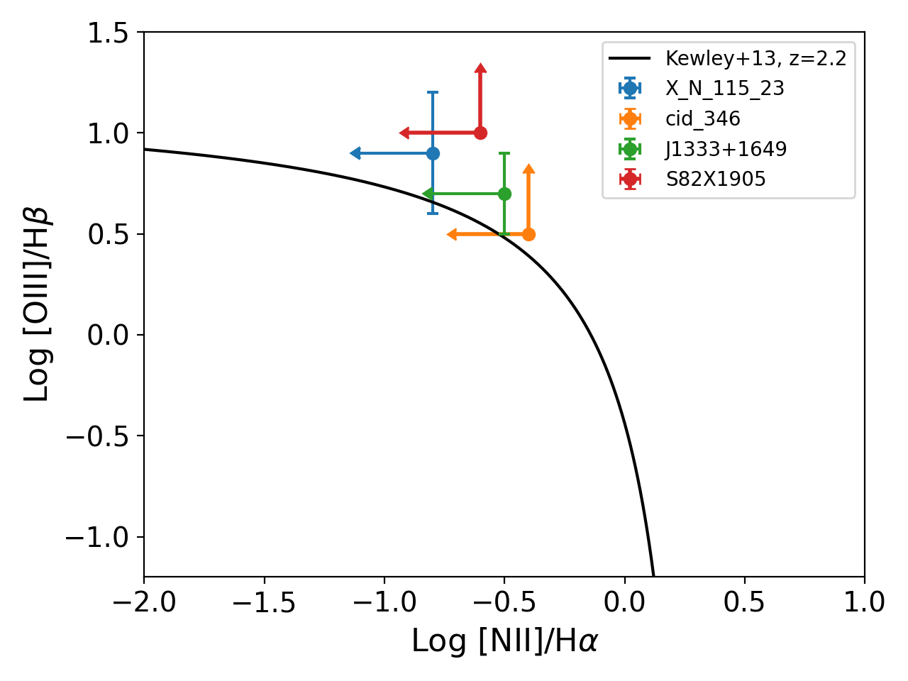

**Figure 2. -** The background images in the maps in the top two rows shows the PSF-subtracted H$\alpha$ images and the overlaid blue contours show the locations of extended $\oiii$ emission. The contour levels are at 98\%, 90\%, 70\% and 50\% of the peak $\oiii$ flux. In four targets, X\_N\_115\_23, cid\_346, J1333+1649 and S82X1905, the spatial location of the extended H$\alpha$ emission coincides with that of the $\oiii$ emission. This made it possible to place the extended H$\alpha$ emission of these four galaxies in the BPT diagram shown in the bottom panel. In all these four galaxies, the extended emission is ionised by the AGN. The black line shows the division between star forming and AGN ionisation from \citet{kewley13}. Targets, X\_N\_81\_44 and J1549+1245 do not show the same location of the $\oiii$ and H$\alpha$ emission. (*fig:BPT*)

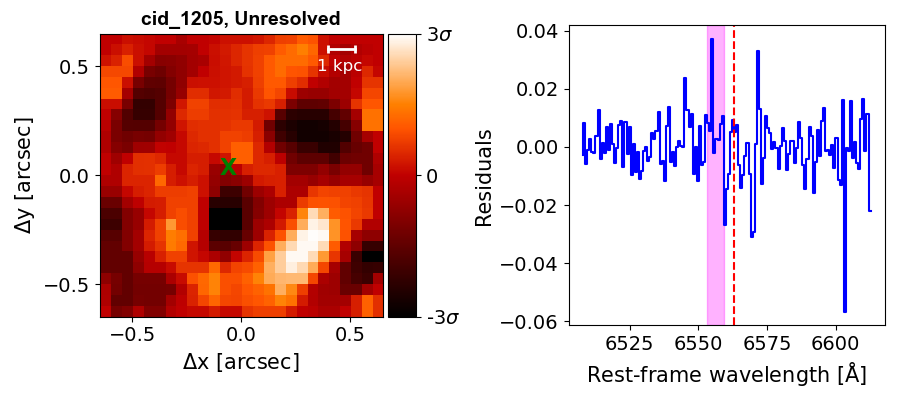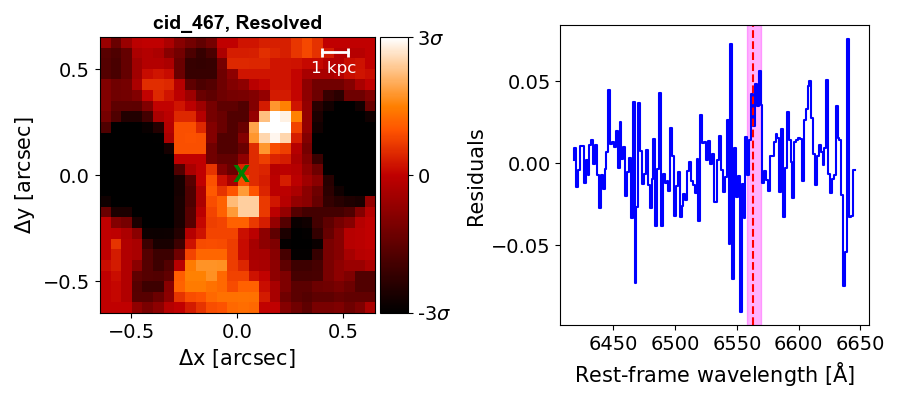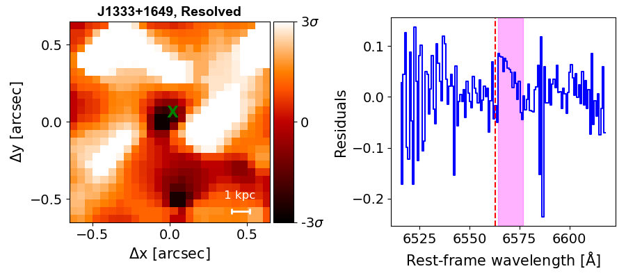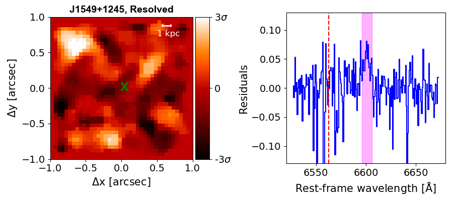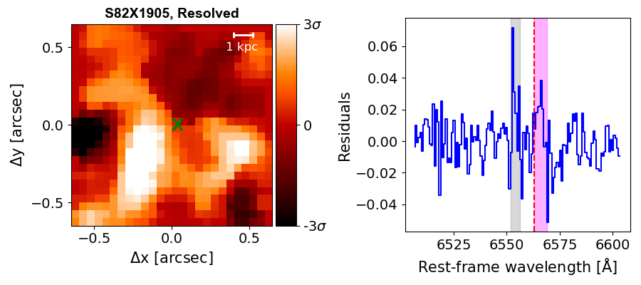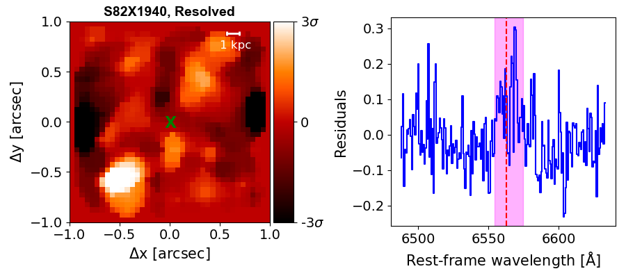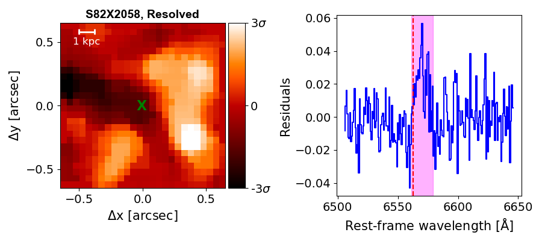

**Figure 8. -** Same as Fig. \ref{fig:BPT_PSF}, for the rest of the targets presented in this paper. All the targets, except cid\_1205 and J1549+1245, show confirmed evidence of extended H$\alpha$ emission. We detected no extended emission in cid\_1205 and the detection in J1549+1245 is tentative. (*fig:BPT_PSF2*)

