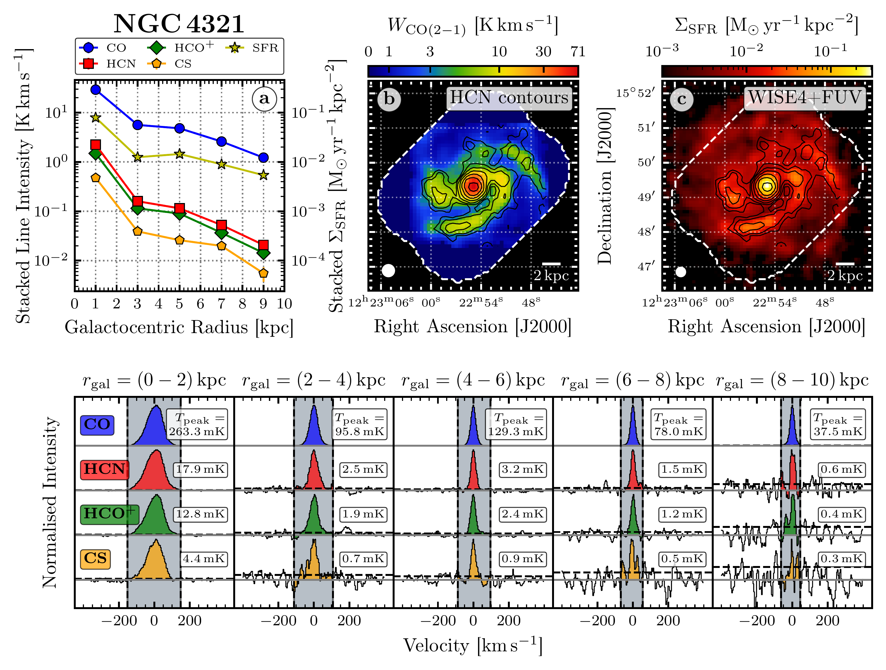
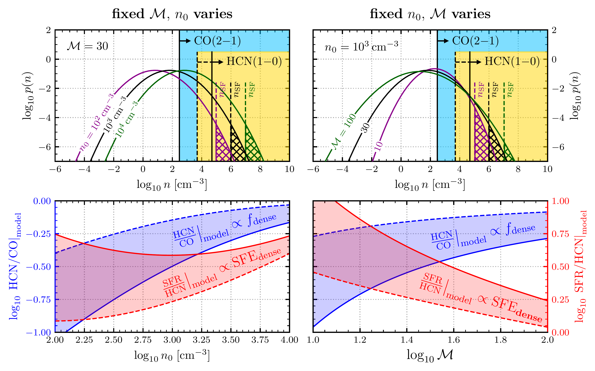
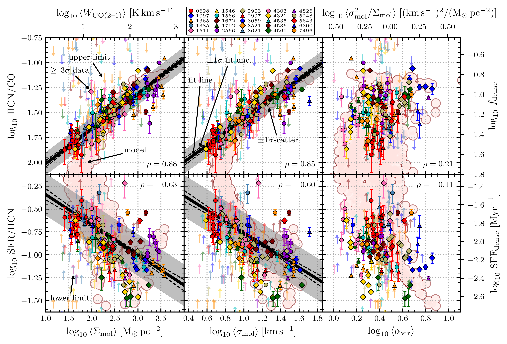

$\newcommand{\ensuremath}{}$
$\newcommand{\xspace}{}$
$\newcommand{\object}[1]{\texttt{#1}}$
$\newcommand{\farcs}{{.}''}$
$\newcommand{\farcm}{{.}'}$
$\newcommand{\arcsec}{''}$
$\newcommand{\arcmin}{'}$
$\newcommand{\ion}[2]{#1#2}$
$\newcommand{\textsc}[1]{\textrm{#1}}$
$\newcommand{\hl}[1]{\textrm{#1}}$
$\newcommand{\footnote}[1]{}$
$\newcommand{\cmark}{\textcolor{green}{\ding{51}}}$
$\newcommand{\xmark}{\textcolor{red}{\ding{55}}}$
$\newcommand{\ubonn}{Argelander-Institut für Astronomie, Universität Bonn, Auf dem Hügel 71, 53121 Bonn, Germany}$
$\newcommand{\osu}{Department of Astronomy, The Ohio State University, 4055 McPherson Laboratory, 140 West 18th Ave, Columbus, OH 43210, USA}$
$\newcommand{\oan}{Observatorio Astronómico Nacional (IGN), C/ Alfonso XII, 3, E-28014 Madrid, Spain}$
$\newcommand{\inaf}{INAF — Osservatorio Astrofisico di Arcetri, Largo E. Fermi 5, I-50125, Florence, Italy}$
$\newcommand{\mpe}{Max-Planck-Institut für Extraterrestrische Physik (MPE), Giessenbachstr. 1, D-85748 Garching, Germany}$
$\newcommand{\zah}{Universität Heidelberg, Zentrum für Astronomie, Institut für theoretische Astrophysik, Albert-Ueberle-Stra{\ss}e 2, 69120, Heidelberg, Germany}$
$\newcommand{\cool}{Cosmic Origins Of Life (COOL) Research DAO, coolresearch.io}$
$\newcommand{\anu}{Research School of Astronomy and Astrophysics, Australian National University, Canberra, ACT 2611, Australia}$
$\newcommand{\astrothreed}{ARC Centre of Excellence for All Sky Astrophysics in 3 Dimensions (ASTRO 3D), Australia}$
$\newcommand{\mpia}{Max Planck Institute for Astronomy, Königstuhl 17, D-69117 Heidelberg, Germany}$
$\newcommand{\hsc}{Centro de Desarrollos Tecnológicos, Observatorio de Yebes (IGN), 19141 Yebes, Guadalajara, Spain}$
$\newcommand{\zw}{Universität Heidelberg, Interdisziplinäres Zentrum für Wissenschaftliches Rechnen, Im Neuenheimer Feld 205, 69120 Heidelberg, Germany}$
$\newcommand{\gent}{Sterrenkundig Observatorium, Universiteit Gent, Krijgslaan 281 S9, B-9000 Gent, Belgium}$
$\newcommand{\iram}{Institut de Radioastronomie Millimétrique (IRAM), 300 Rue de la Piscine, F-38406 Saint Martin d’Hères, France}$
$\newcommand{\lerma}{LERMA, Observatoire de Paris, PSL Research University, CNRS, Sorbonne Universités, 75014 Paris, France}$
$\newcommand{\ucsd}{Center for Astrophysics and Space Sciences, Department of Physics, University of California San Diego, 9500 Gilman Drive, La Jolla, CA 92093, USA}$
$\newcommand{\mmu}{Department of Physics and Astronomy, McMaster University, 1280 Main Street West, Hamilton, ON L8S 4M1, Canada}$
$\newcommand{\cita}{Canadian Institute for Theoretical Astrophysics (CITA), University of Toronto, 60 St George Street, Toronto, ON M5S 3H8, Canada}$
$\newcommand{\wyo}{Department of Physics \& Astronomy, University of Wyoming, Laramie, WY, 82071, USA}$
$\newcommand{\alb}{Dept. of Physics, University of Alberta, Edmonton, Alberta, Canada T6G 2E1}$
$\newcommand{\ox}{Sub-department of Astrophysics, Department of Physics, University of Oxford, Keble Road, Oxford OX1 3RH, UK}$
$\newcommand{\ESO}{European Southern Observatory, Karl-Schwarzschild Stra{\ss}e 2, D-85748 Garching bei München, Germany}$
$\newcommand{\ljmu}{Astrophysics Research Institute, Liverpool John Moores University, 146 Brownlow Hill, Liverpool L3 5RF, UK}$
$\newcommand{\SAO}{Center for Astrophysics \mid Harvard \& Smithsonian, 60 Garden St., 02138 Cambridge, MA, USA}$
$\newcommand{\thebibliography}{\DeclareRobustCommand{\VAN}[3]{##3}\VANthebibliography}$
$\newcommand{\SIUnitSymbolDegree}{\textsuperscript{h}}$
$\newcommand{\SIUnitSymbolArcminute}{\textsuperscript{m}}$
$\newcommand{\SIUnitSymbolArcsecond}{\textsuperscript{s}}$

$\newcommand{\ensuremath}{}$
$\newcommand{\xspace}{}$
$\newcommand{\object}[1]{\texttt{#1}}$
$\newcommand{\farcs}{{.}''}$
$\newcommand{\farcm}{{.}'}$
$\newcommand{\arcsec}{''}$
$\newcommand{\arcmin}{'}$
$\newcommand{\ion}[2]{#1#2}$
$\newcommand{\textsc}[1]{\textrm{#1}}$
$\newcommand{\hl}[1]{\textrm{#1}}$
$\newcommand{\footnote}[1]{}$
$\newcommand{\cmark}{\textcolor{green}{\ding{51}}}$
$\newcommand{\xmark}{\textcolor{red}{\ding{55}}}$
$\newcommand{\ubonn}{Argelander-Institut für Astronomie, Universität Bonn, Auf dem Hügel 71, 53121 Bonn, Germany}$
$\newcommand{\osu}{Department of Astronomy, The Ohio State University, 4055 McPherson Laboratory, 140 West 18th Ave, Columbus, OH 43210, USA}$
$\newcommand{\oan}{Observatorio Astronómico Nacional (IGN), C/ Alfonso XII, 3, E-28014 Madrid, Spain}$
$\newcommand{\inaf}{INAF — Osservatorio Astrofisico di Arcetri, Largo E. Fermi 5, I-50125, Florence, Italy}$
$\newcommand{\mpe}{Max-Planck-Institut für Extraterrestrische Physik (MPE), Giessenbachstr. 1, D-85748 Garching, Germany}$
$\newcommand{\zah}{Universität Heidelberg, Zentrum für Astronomie, Institut für theoretische Astrophysik, Albert-Ueberle-Stra{\ss}e 2, 69120, Heidelberg, Germany}$
$\newcommand{\cool}{Cosmic Origins Of Life (COOL) Research DAO, coolresearch.io}$
$\newcommand{\anu}{Research School of Astronomy and Astrophysics, Australian National University, Canberra, ACT 2611, Australia}$
$\newcommand{\astrothreed}{ARC Centre of Excellence for All Sky Astrophysics in 3 Dimensions (ASTRO 3D), Australia}$
$\newcommand{\mpia}{Max Planck Institute for Astronomy, Königstuhl 17, D-69117 Heidelberg, Germany}$
$\newcommand{\hsc}{Centro de Desarrollos Tecnológicos, Observatorio de Yebes (IGN), 19141 Yebes, Guadalajara, Spain}$
$\newcommand{\zw}{Universität Heidelberg, Interdisziplinäres Zentrum für Wissenschaftliches Rechnen, Im Neuenheimer Feld 205, 69120 Heidelberg, Germany}$
$\newcommand{\gent}{Sterrenkundig Observatorium, Universiteit Gent, Krijgslaan 281 S9, B-9000 Gent, Belgium}$
$\newcommand{\iram}{Institut de Radioastronomie Millimétrique (IRAM), 300 Rue de la Piscine, F-38406 Saint Martin d’Hères, France}$
$\newcommand{\lerma}{LERMA, Observatoire de Paris, PSL Research University, CNRS, Sorbonne Universités, 75014 Paris, France}$
$\newcommand{\ucsd}{Center for Astrophysics and Space Sciences, Department of Physics, University of California San Diego, 9500 Gilman Drive, La Jolla, CA 92093, USA}$
$\newcommand{\mmu}{Department of Physics and Astronomy, McMaster University, 1280 Main Street West, Hamilton, ON L8S 4M1, Canada}$
$\newcommand{\cita}{Canadian Institute for Theoretical Astrophysics (CITA), University of Toronto, 60 St George Street, Toronto, ON M5S 3H8, Canada}$
$\newcommand{\wyo}{Department of Physics \& Astronomy, University of Wyoming, Laramie, WY, 82071, USA}$
$\newcommand{\alb}{Dept. of Physics, University of Alberta, Edmonton, Alberta, Canada T6G 2E1}$
$\newcommand{\ox}{Sub-department of Astrophysics, Department of Physics, University of Oxford, Keble Road, Oxford OX1 3RH, UK}$
$\newcommand{\ESO}{European Southern Observatory, Karl-Schwarzschild Stra{\ss}e 2, D-85748 Garching bei München, Germany}$
$\newcommand{\ljmu}{Astrophysics Research Institute, Liverpool John Moores University, 146 Brownlow Hill, Liverpool L3 5RF, UK}$
$\newcommand{\SAO}{Center for Astrophysics \mid Harvard \& Smithsonian, 60 Garden St., 02138 Cambridge, MA, USA}$
$\newcommand{\thebibliography}{\DeclareRobustCommand{\VAN}[3]{##3}\VANthebibliography}$
$\newcommand{\SIUnitSymbolDegree}{\textsuperscript{h}}$
$\newcommand{\SIUnitSymbolArcminute}{\textsuperscript{m}}$
$\newcommand{\SIUnitSymbolArcsecond}{\textsuperscript{s}}$

# The ALMOND Survey: Molecular cloud properties and gas density tracers across 25 nearby spiral galaxies with ALMA

<mark>Appeared on: 2023-02-06</mark> - _48 pages, 40 figures_

<mark><mark>Lukas Neumann</mark></mark>, et al. -- incl., <mark><mark>Frank Bigiel</mark></mark>, <mark><mark>Eva Schinnerer</mark></mark>

**Abstract:** We use new $\hcnone$ data from the ALMOND (ACA Large-sample Mapping Of Nearby galaxies in Dense gas) survey to trace the kpc-scale molecular gas density structure and $\cotwo$ data from PHANGS-ALMA to trace the bulk molecular gas across 25 nearby, star-forming galaxies.At $\SI{2.1}{\kilo\parsec}$ scale, we measure the density-sensitive HCN/CO line ratio and the SFR/HCN ratio to trace the star formation efficiency in the denser molecular medium.At $\SI{150}{\parsec}$ scale, we measure structural and dynamical properties of the molecular gas via $\cotwo$ line emission, which is linked to the lower resolution data using an intensity-weighted averaging method.We find positive correlations (negative) of HCN/CO (SFR/HCN) with the surface density, the velocity dispersion and the internal turbulent pressure of the molecular gas.These observed correlations agree with expected trends from turbulent models of star formation, which consider a single free-fall time gravitational collapse.Our results show that the kpc-scale HCN/CO line ratio is a powerful tool to trace the $\SI{150}{\parsec}$ scale average density distribution of the molecular clouds.Lastly, we find systematic variations of the SFR/HCN ratio with cloud-scale molecular gas properties, which are incompatible with a universal star formation efficiency.Overall, these findings show that mean molecular gas density, molecular cloud properties and star formation are closely linked in a coherent way, and observations of density-sensitive molecular gas tracers are a useful tool to analyse these variations, linking molecular gas physics to stellar output across galaxy discs.

**Figure 7. -** Spectral stacking across NGC 4321. _a)_ Integrated intensities of radially stacked spectra in bins of $r_{\rm gal}=\SI{2}{\kilo\parsec}$. Shown are \cotwo from PHANGS--ALMA  ([ and Leroy 2021](https://ui.adsabs.harvard.edu/abs/2021ApJS..257...43L)) , \hcnone, \hcopone, \cstwo from ALMOND (this work) and SFR surface density from z0MGS  ([ and Leroy 2019](https://ui.adsabs.harvard.edu/abs/2019ApJS..244...24L)) . Solid points indicate significant data ($\text{S/N}>3$). _b)_\cotwo moment-0 map, computed as described in Section \ref{SEC:mom0_maps}, overlaid with \hcnone contours in S/N levels of $2^n\;\text{for}\; n\in\{0,1,2,...,7\}$, both at a common spatial resolution of \ang{;;19.7}. _c)_ SFR map at \ang{;;15} resolution, computed as described in Section \ref{SEC:star_formation_rate} from a linear combination of the WISE4 IR and GALEX FUV data. _Bottom:_ Stacked spectra, obtained as described in Appendix \ref{SEC:appendix:stacking} corresponding to the integrated intensities shown in a). The grey shaded area indicates the velocity-integration mask. The spectra are normalised by their peak intensity for each bin and each line individually. The respective peak intensities (measured inside the integration mask) are shown in the box next to each spectra. The horizontal dotted line indicates the rms, i.e. the standard deviation of the spectrum outside the integration mask.
    We show analogues plots for the other 24 galaxies in Appendix \ref{SEC:appendix:supplements}.
     (*FIG:ngc4321_stacking*)

**Figure 5. -** _Top:_ Volume-weighted probability distribution functions (PDFs) of the molecular cloud gas density, $n$, for varying mean density (\nmean, left panel) and varying Mach number (\Mach, right panel). The light blue shaded area indicates the density regime traced by \cotwo, i.e. all gas above $\neff(\text{CO})=\SI{3e2}{\per\cubic\centi\metre}$ ([ and Leroy 2017](https://ui.adsabs.harvard.edu/abs/2017ApJ...835..217L)) . Analogously, the yellow shaded area is the density regime traced by \hcnone, where we adopted two effective critical densities such that in one case (solid line) HCN traces all gas above $\neff(\text{HCN})=\SI{5e4}{\per\cubic\centi\metre}$ ([ and Leroy 2017](https://ui.adsabs.harvard.edu/abs/2017ApJ...835..217L))  and in the other case (dashed line) HCN traces gas above $\neff(\text{HCN})=\SI{5e3}{\per\cubic\centi\metre}$ ([Onus, Krumholz and Federrath 2018](https://ui.adsabs.harvard.edu/abs/2018MNRAS.479.1702O)) . The dashed lines labelled with \nSF show the threshold density above which gas in clouds collapses to form stars. Thus, the hatched areas are a measure of the SFR per free-fall time. _Bottom:_ HCN/CO as a proxy for \fdense and SFR/HCN as a proxy for \sfedense estimated from the PDFs as a function of the mean density (left panel) and the Mach number (right panel) in accordance with the top panel plots. We compute HCN/CO as the ratio of the integrated mass-weighted PDFs within the assumed density regimes (Equation \ref{EQU:model_HCN_CO}). Similarly, SFR/HCN is obtained by integrating the mass-weighted PDF above \nSF accounting for the free-fall time at mean density and dividing with the area of the PDF traced by HCN (Equation \ref{EQU:model_SFR_HCN}). The solid line and dashed lines are in accordance with the density thresholds in the top panels. (*FIG:PDF_expectations*)

**Figure 9. -** **HCN/CO vs. \Xavg and SFR/HCN vs. \Xavg (cloud-scale = \textbf{150**$ $**pc**, kpc-scale = **2.1**$ $**kpc**)}_Top:_ HCN/CO as a proxy of dense gas fraction against molecular cloud properties (\sigmolavg, \vdisavg, \aviravg) as obtained from \cotwo data from left to right. The data are binned according to Section \ref{SEC:binning}. Filled points specify significant data with $\text{SNR(HCN/CO)}\ge3$ and downward pointing arrows indicate $3\sigma$ upper limits on HCN/CO. The thick solid line denotes the best fit linear regression, i.e. the median realisation of the MCMC simulation. The dashed lines indicate the $1\sigma$ credibility interval of the MCMC realisations. The grey shaded area shows the scatter of the significant data about the fit line. For \aviravg we do not observe a correlation and thus do not fit a line to the data. _Bottom:_ Analogous to the upper panels, SFR/HCN as a proxy of the star formation efficiency of the dense gas vs. molecular cloud properties from left to right. Here, upward pointing arrows denote $3\sigma$ lower limits in SFR/HCN. Again, the linear regression to \aviravg was not determined due to lack of correlation. The light red shaded areas show the model prediction, equivalent to the red data in Figure \ref{FIG:PDF_expectations_data}, but shifted by \SI{-1.0}{\dex} in HCN/CO and \SI{-0.6}{\dex} in SFR/HCN to visually overlap with the observational results. (*FIG:HCN_lowres*)

