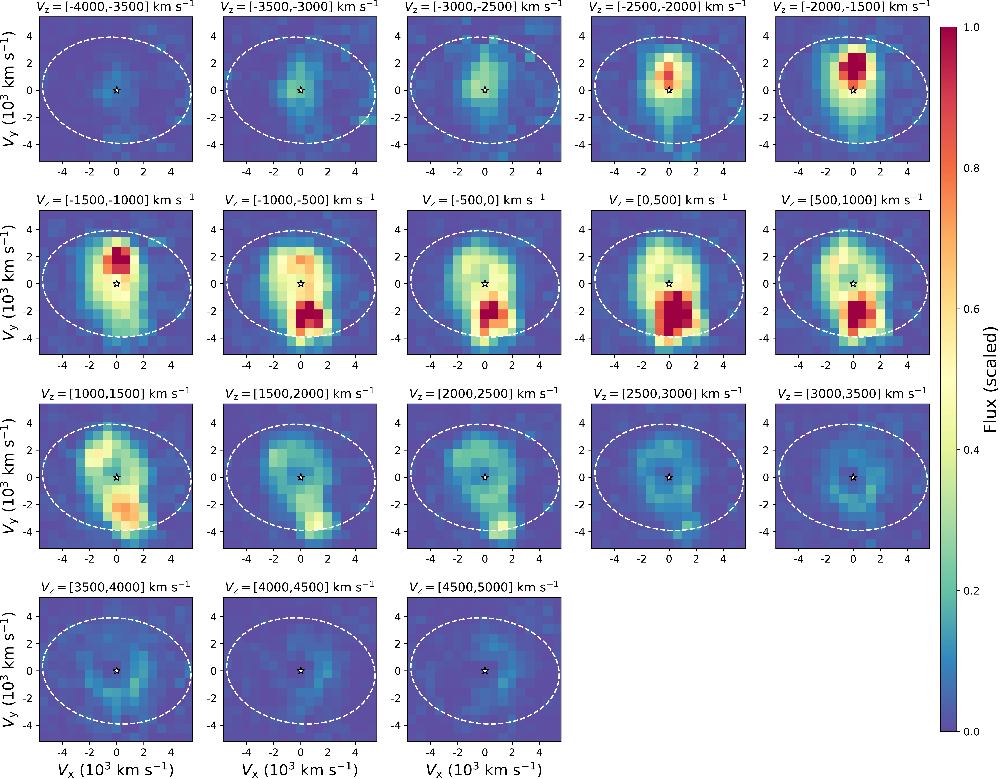
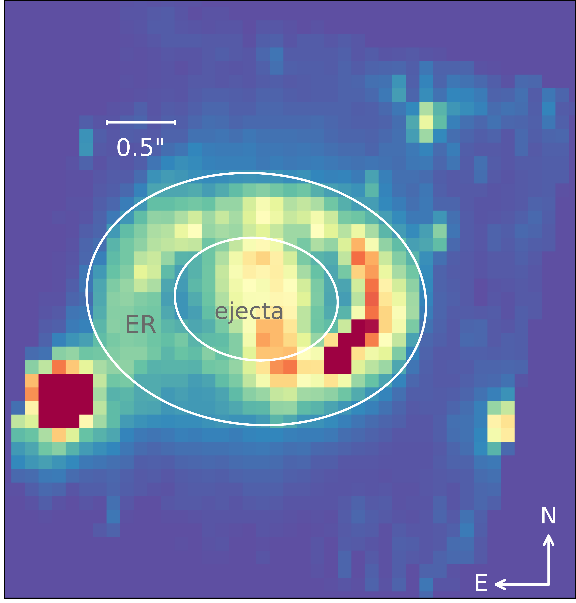
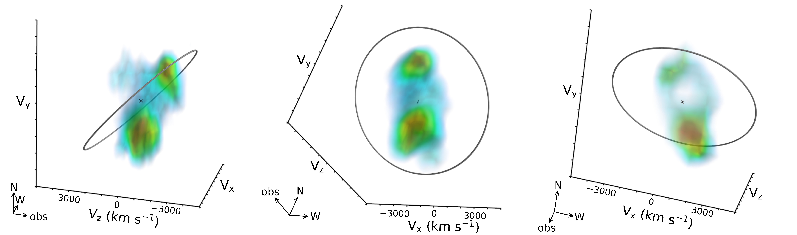

$\newcommand{\ensuremath}{}$
$\newcommand{\xspace}{}$
$\newcommand{\object}[1]{\texttt{#1}}$
$\newcommand{\farcs}{{.}''}$
$\newcommand{\farcm}{{.}'}$
$\newcommand{\arcsec}{''}$
$\newcommand{\arcmin}{'}$
$\newcommand{\ion}[2]{#1#2}$
$\newcommand{\textsc}[1]{\textrm{#1}}$
$\newcommand{\hl}[1]{\textrm{#1}}$
$\newcommand{\msun}{ M_\odot  }$
$\newcommand{\dg}{^\circ}$
$\newcommand{\kms}{\rm{km s^{-1}}}$
$\newcommand{\ergcms}{\rm erg~cm^{-2}~s^{-1}}$

$\newcommand{$\ensuremath$}{}$
$\newcommand{$\xspace$}{}$
$\newcommand{$\object$}[1]{\texttt{#1}}$
$\newcommand{$\farcs$}{{.}''}$
$\newcommand{$\farcm$}{{.}'}$
$\newcommand{$\arcsec$}{''}$
$\newcommand{$\arcmin$}{'}$
$\newcommand{$\ion$}[2]{#1#2}$
$\newcommand{$\textsc$}[1]{\textrm{#1}}$
$\newcommand{$\hl$}[1]{\textrm{#1}}$
$\newcommand{$\msun$}{ M_\odot  }$
$\newcommand{$\dg$}{^\circ}$
$\newcommand{$\kms$}{\rm{km s^{-1}}}$
$\newcommand{$\ergcms$}{\rm erg~cm^{-2}~s^{-1}}$

# JWST NIRSpec observations of Supernova 1987A -- from the inner ejecta to the reverse shock 

<mark>Appeared on: 2023-02-08</mark> - _Submitted to AAS Journals_

J. Larsson, et al. -- incl., <mark>M. Meixner</mark>, <mark>O. Krause</mark>

**Abstract:** We present initial results from{\it JWST}NIRSpec integral field unit observations of the nearby Supernova (SN) 1987A. The observations provide the first spatially-resolved spectroscopy of the ejecta and equatorial ring (ER) over the 1--5$\mu$m range. We construct 3D emissivity maps of the[$\ion${Fe}{1}]$1.443 \mu$m line from the inner ejecta and the$\ion${He}{1}1.083$\mu$m line from the reverse shock (RS), where the former probes the explosion geometry and the latter traces the structure of the circumstellar medium. We also present a model for the integrated spectrum of the ejecta. The[$\ion${Fe}{1}]3D map reveals a highly-asymmetric morphology resembling a broken dipole, dominated by two large clumps with  velocities of$\sim 2300$\kms. We also find evidence that the Fe-rich inner ejecta have started to interact with the RS in the south. The RS surface traced by the$\ion${He}{1}line extends from just inside the ER to higher latitudes on both sides of the ER with a half-opening angle$\sim 45$\dg, forming a bubble-like structure above and below the ER. The spectral model for the ejecta allows us to identify the many emission lines in this wavelength region, including numerous H$_2$lines. We find that the H$_2$is most likely excited by far-UV emission, while the metal lines ratios are consistent with recombination in very low temperature ejecta.

**Figure 4. -** Images of the [$\ion${Fe}{1}] 1.443 $\mu$m emission from the ejecta as a function of Doppler shift, ranging from $V\rm_z = -4000$ $\kms$(top left) to $V\rm_z =5000$ $\kms$(bottom right). Each image was integrated over an interval of 500 $\kms$. The velocities of freely-expanding ejecta in the plane of the sky are shown on the x and y axes, where the assumed center of explosion marks 0 velocity (white star symbol). The dashed white line shows the position of the ER. (*fig:fe_slices*)

**Figure 1. -** NIRSpec image integrated over the wavelength region of [$\ion${Fe}{1}] 1.443 $\mu \rm{m} \pm 5000$ $\kms$. This line originates from the ejecta, while the emission from the ER in this wavelength range is due to narrow [$\ion${Fe}{1}] $1.427 \mu$m and $\ion${H}{1} $1.460 \mu$m lines, as well as continuum. The white lines show the regions used to extract spectra for the ejecta (inner ellipse) and ER (elliptical annulus). The five point sources seen outside the ER are stars. (*fig:fe_image*)

**Figure 5. -** Volume rendering of the [$\ion${Fe}{1}] 1.443 $\mu$m emission from the ejecta. The three panels show the system from different viewing angles, as indicated by the arrows in the lower left corners. In the left and middle panels, the faintest emission (plotted in blue) corresponds to 15\% of the peak value (red). The right panel only shows ejecta with $V\rm_z >1000$ $\kms$ in order to highlight the faint ring structure. In this case, the faintest emission plotted corresponds to 10\% of the peak value. The gray circle shows the inner edge of the ER. (*fig:fe_3d*)

