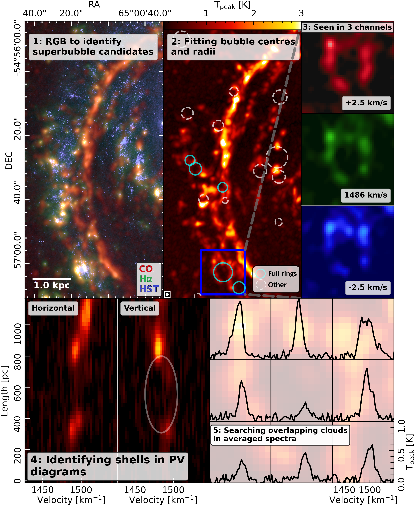
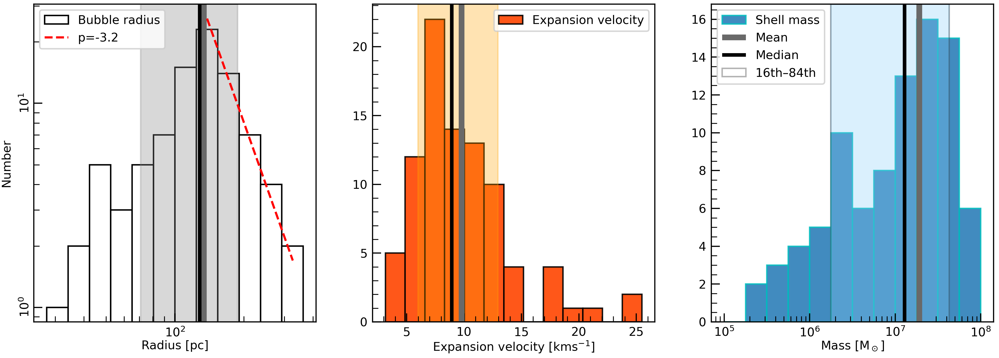
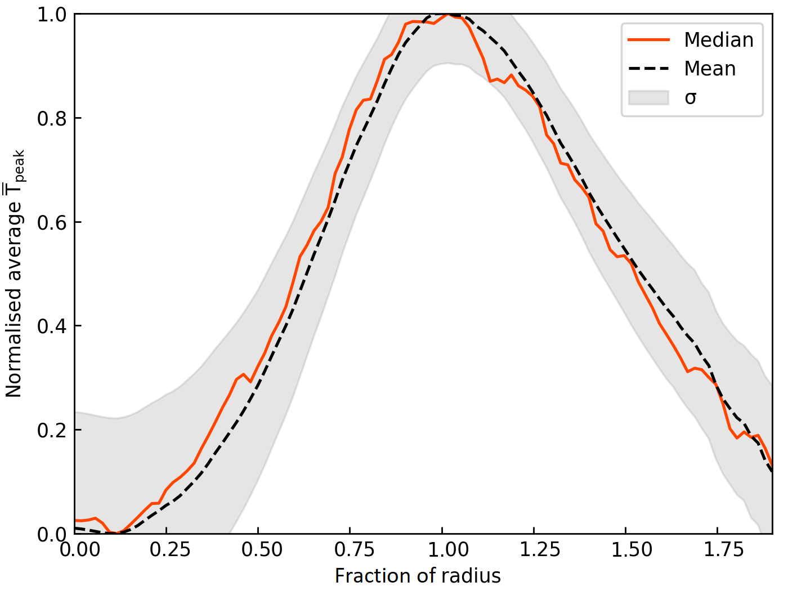

$\newcommand{\ensuremath}{}$
$\newcommand{\xspace}{}$
$\newcommand{\object}[1]{\texttt{#1}}$
$\newcommand{\farcs}{{.}''}$
$\newcommand{\farcm}{{.}'}$
$\newcommand{\arcsec}{''}$
$\newcommand{\arcmin}{'}$
$\newcommand{\ion}[2]{#1#2}$
$\newcommand{\textsc}[1]{\textrm{#1}}$
$\newcommand{\hl}[1]{\textrm{#1}}$
$\newcommand{\SII}{[S\textsc{ii}]}$
$\newcommand{\OI}{[O\textsc{i}]}$
$\newcommand{\OIII}{[O\textsc{iii}]}$
$\newcommand{\NII}{[N\textsc{ii}]}$
$\newcommand{\kms}{km~s^{-1}}$
$\newcommand{\h}{H_2}$
$\newcommand{\msun}{M_\odot}$
$\newcommand{\e}{\times10}$
$\newcommand{\HII}{H\textsc{ii}}$
$\newcommand{\HI}{H\textsc{i}}$
$\newcommand{\Ha}{H\alpha}$
$\newcommand{\Hb}{H\beta}$
$\newcommand{\CO}{^{12}CO}$
$\newcommand{\Tpeak}{T_\text{peak}}$

$\newcommand{$\ensuremath$}{}$
$\newcommand{$\xspace$}{}$
$\newcommand{$\object$}[1]{\texttt{#1}}$
$\newcommand{$\farcs$}{{.}''}$
$\newcommand{$\farcm$}{{.}'}$
$\newcommand{$\arcsec$}{''}$
$\newcommand{$\arcmin$}{'}$
$\newcommand{$\ion$}[2]{#1#2}$
$\newcommand{$\textsc$}[1]{\textrm{#1}}$
$\newcommand{$\hl$}[1]{\textrm{#1}}$
$\newcommand{$\SII$}{[S$\textsc${ii}]}$
$\newcommand{$\OI$}{[O$\textsc${i}]}$
$\newcommand{$\OI$II}{[O$\textsc${iii}]}$
$\newcommand{$\NII$}{[N$\textsc${ii}]}$
$\newcommand{$\kms$}{km~s^{-1}}$
$\newcommand{$\h$}{H_2}$
$\newcommand{$\msun$}{M_\odot}$
$\newcommand{$\e$}{\times10}$
$\newcommand{$\HII$}{H$\textsc${ii}}$
$\newcommand{$\HI$}{H$\textsc${i}}$
$\newcommand{$\Ha$}{H\alpha}$
$\newcommand{$\Hb$}{H\beta}$
$\newcommand{$\CO$}{^{12}CO}$
$\newcommand{$\Tpeak$}{T_\text{peak}}$

# Quantifying the energetics of molecular superbubbles in PHANGS galaxies

<mark>Appeared on: 2023-02-09</mark> - _20 pages, 14 figures, 3 tables. Submitted to A&A. Abstract abridged for arXiv_

E. J. Watkins, et al. -- incl., <mark>K. Kreckel</mark>, <mark>E. Schinnerer</mark>, <mark>J. C. Lee</mark>, <mark>J. Li</mark>

**Abstract:** Star formation and stellar feedback are interlinked processes that redistribute energy, turbulence and material throughout galaxies. Because young, and massive stars form in spatially clustered environments, they create pockets of expanding gas termed superbubbles, which retain information about the physical processes that drive them. As these processes play a critical role in shaping galaxy discs and regulating the baryon cycle, measuring the properties of superbubbles provides important input for galaxy evolution models.With wide coverage and high angular resolution ($\sim$50--150 pc) of the PHANGS--ALMA$\CO$({\it J}=2$-$1) survey, we can now resolve, identify and characterise statistically representative numbers of superbubbles with molecular gas in nearby galaxies.We identify superbubbles by requiring spatial correspondence between shells in CO with stellar populations identified in PHANGS--HST, and combine the properties of the stellar populations with CO to constrain feedback models and quantify their energetics. We visually identify 325 cavities across 18 PHANGS--ALMA galaxies, 88 of which have clear superbubble signatures (unbroken shells, central clusters, kinematic signatures of expansion). We measure their radii and expansion velocities using CO (2--1) to dynamically derive their ages and the mechanical power driving the bubbles, which we use to compute the expected properties of the parent stellar populations driving the bubbles.We find consistency between the predicted and derived stellar ages and masses of the stellar populations if we use a supernova (SN) model that injects energy with a coupling efficiency of 5--12\%, whereas wind models fail to explain stellar ages we measure. Not only does this confirm molecular gas accurately traces superbubble properties, but it also provides key observational constraints for superbubble models. We also find evidence that the bubbles are sweeping up gas as they expand and speculate that these sites have the potential to host new generations of stars.This work demonstrates that molecular superbubbles provide  novel quantitative constraints on SNe feedback efficiencies and gas clearing times, and represent a promising environment to search for the propagation of star formation, all of which are needed to understand what sets the observed star formation rates in galaxies.

**Figure 10. -** Illustrating bubble identification and elimination criteria in section of NGC 1566. \textbf{1.} CO $\Tpeak$(red), $\Ha$(green), and HST \textit{B}-band (blue) combined into a false colour image at their original resolution to identify superbubbles using multi-wavelength information. \textbf{2.} Manually fitting radii and their centres using the CO $\Tpeak$ map. Cyan and dashed white circles show catalogued bubbles that were analysed or ignored respectively. The blue box outlines the bubble examined in all remaining panels (Bubble 36 in Table \ref{tab:props}). \textbf{3.} Checking three channel maps in CO to confirm if bubble emission is significant in multiple consecutive velocity bands. If not, the bubble is removed from the sample. \textbf{4.} Horizontal and vertical PV diagrams to confirm expansion signature is present. Grey ellipse shows present expansion signature. If unable to confirm, bubble is removed. \textbf{5.} Illustrating average spectra around the bubble. If identifiable background or foreground emission is found, bubble is removed. All spectra shown here are free of contaminating emission. (*fig:method*)

**Figure 12. -** Histogram distributions of the bubble radii \textit{(left)}, expansion velocity \textit{(middle)} and shell mass \textit{(right)} for all 88 superbubbles. The dashed red line in the left panel shows a power-law fit to the radii with an exponent of $-3.2$. Thick vertical grey and black lines show the mean and median of each distribution, respectively, and coloured filled regions show the 16\textsuperscript{th}--84\textsuperscript{th} sigma percentiles. (*fig:meas-bub_props*)

**Figure 1. -** Averaged normalised intensity profile of bubbles categorised as \textit{closed rings}. Solid red line shows the mean profile, dashed black line shows the median profile and filled grey region shows the statistical spread of the data measured using the standard deviation ($\sigma$). (*fig:profile*)

