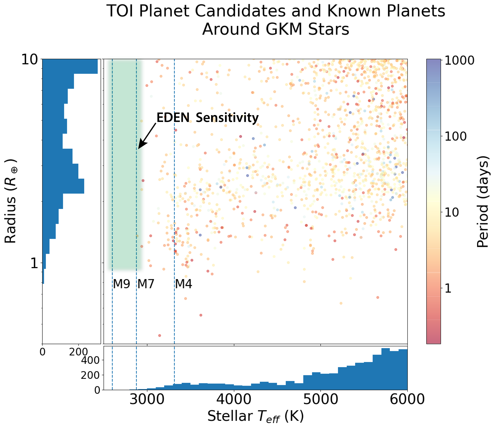
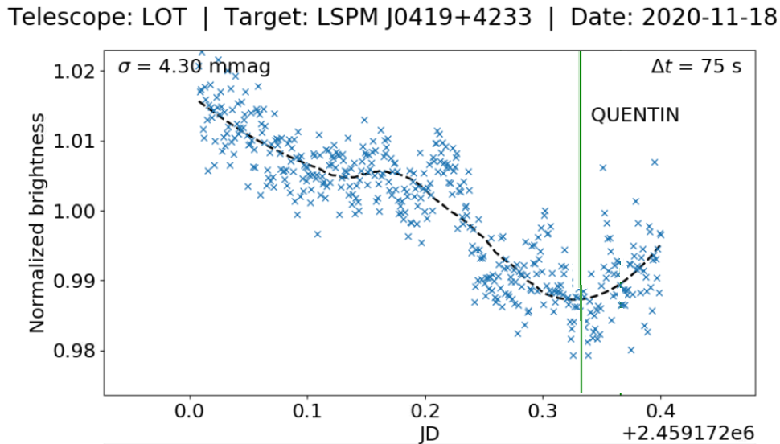
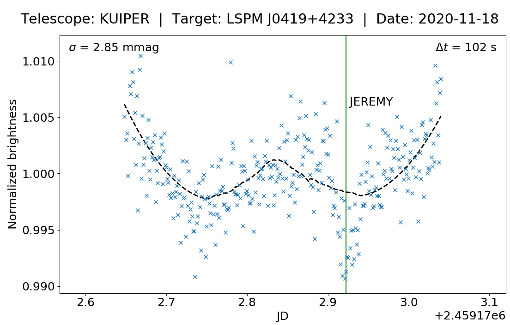
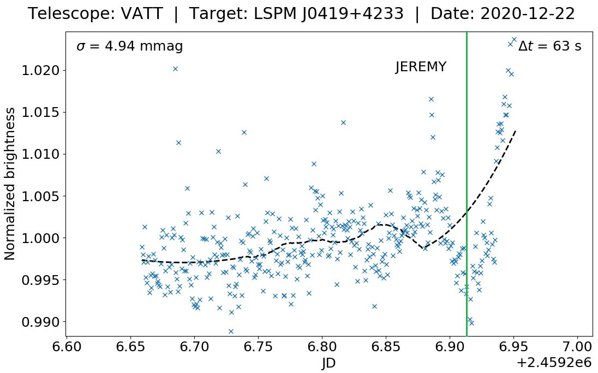
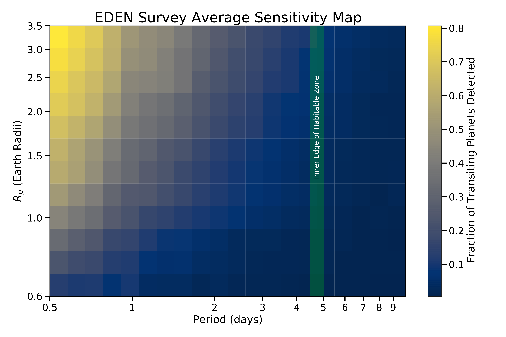
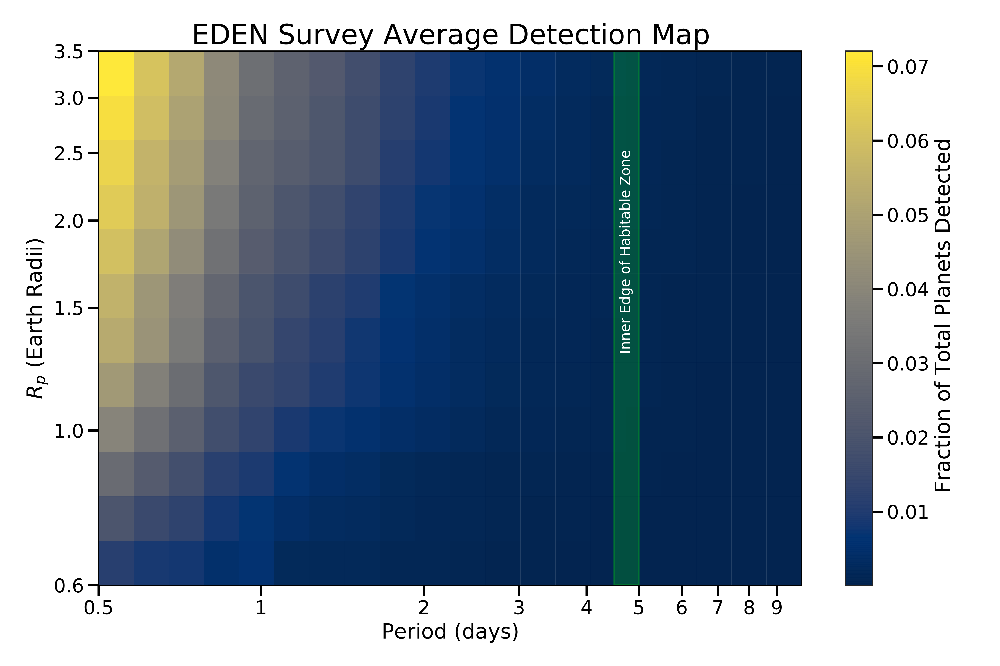

$\newcommand{\ensuremath}{}$
$\newcommand{\xspace}{}$
$\newcommand{\object}[1]{\texttt{#1}}$
$\newcommand{\farcs}{{.}''}$
$\newcommand{\farcm}{{.}'}$
$\newcommand{\arcsec}{''}$
$\newcommand{\arcmin}{'}$
$\newcommand{\ion}[2]{#1#2}$
$\newcommand{\textsc}[1]{\textrm{#1}}$
$\newcommand{\hl}[1]{\textrm{#1}}$
$\newcommand{\vdag}{(v)^\dagger}$
$\newcommand$
$\newcommand$
$\newcommand$
$\newcommand$
$\newcommand$

$\newcommand{$\ensuremath$}{}$
$\newcommand{$\xspace$}{}$
$\newcommand{$\object$}[1]{\texttt{#1}}$
$\newcommand{$\farcs$}{{.}''}$
$\newcommand{$\farcm$}{{.}'}$
$\newcommand{$\arcsec$}{''}$
$\newcommand{$\arcmin$}{'}$
$\newcommand{$\ion$}[2]{#1#2}$
$\newcommand{$\textsc$}[1]{\textrm{#1}}$
$\newcommand{$\hl$}[1]{\textrm{#1}}$
$\newcommand{$\vdag$}{(v)^\dagger}$
$\newcommand$
$\newcommand$
$\newcommand$
$\newcommand$
$\newcommand$

# 

<mark>Appeared on: 2023-02-09</mark> - _27 pages, 11 figures_

Jeremy Dietrich, et al. -- incl., <mark>Nicolas Kurtovic</mark>, <mark>Thomas Henning</mark>, <mark>Samantha Brown-Sevilla</mark>, <mark>Remo Burn</mark>, <mark>Timmy N. Delage</mark>, <mark>Lizxandra Flores-Rivera</mark>, <mark>Riccardo Franceschi</mark>, <mark>Sofia Savvidou</mark>, <mark>Jonas Syed</mark>, <mark>An-Li Tsai</mark>, <mark>Chia-Lung Lin</mark>, <mark>Chi-Sheng Lin</mark>, <mark>Hung-Chin Lin</mark>

**Abstract:** Earth-sized exoplanets that transit nearby, late spectral type red dwarfs will be prime targets for atmospheric characterization in the coming decade. Such systems, however, are difficult to find via wide-field transit surveys like\textit{Kepler}or TESS. Consequently, the presence of such transiting planets is unexplored and the occurrence rates of short-period Earth-sized planets around late M dwarfs remain poorly constrained. Here, we present the deepest photometric monitoring campaign of\ntargetsnearby late M dwarf stars, using data from over 500 nights on seven 1-2 meter class telescopes. Our survey includes all known single quiescent northern late M dwarfs within 15 pc.  We use transit-injection-and-recovery tests to quantify the completeness of our survey, successfully identify most ($>80\%$) transiting short-period (0.5-1 d) super-Earths (R$>1.9 R_\oplus$), and are sensitive ($\sim$50\%) to transiting Earth-sized planets (1.0--1.2$R_\oplus$). Our high sensitivity to transits with a near-zero false positive rate demonstrates an efficient survey strategy. Our survey does not yield a transiting planet detection, yet it provides the most sensitive upper limits on transiting planets orbiting our target stars. Finally, we explore multiple hypotheses about the occurrence rates of short-period planets (from Earth-sized planets to giant planets) around late M dwarfs. We show, for example, that giant planets at short periods ($<$1 day) are uncommon around our target stars. Our dataset provides some insight into occurrence rates of short-period planets around TRAPPIST-1-like stars, and our results can help test planetary formation and system evolution models, as well as guide future observations of nearby late M dwarfs.

**Figure 5. -** TESS objects of interest (TOIs) by stellar effective temperature and planet candidate radius. The temperature and planet radius distributions of the TOIs show a marked drop toward late spectral types ($>$M4--M6) and for small planets ($R_p<2$ $R_\oplus$). The green shaded region represents the sensitivity of our EDEN survey, which is complementary to that of TESS. (*fig:TESSTOIST*)

**Figure 9. -** The first look at the non-detrended light curves from a simple reference star calibration of each potential transit event, before full detrending is done. The transit-like features are marked with green lines and the name of the Project EDEN member who analyzed the quick look data. (*fig:EIC9FL*)

**Figure 7. -** The average sensitivity (top) and full detection probability including geometric transit likelihood (bottom) of the EDEN survey for planets with periods between 0.5 and 10 days and sizes between 0.6 and 3.5 Earth radii.  For ultra-short-period planets ($<$ 1 day), we reach 50\% sensitivity for planets with radius $1.5 R_\oplus$ or larger.  Due to the low geometric transit probability, the overall completeness is much lower and drops sharply with the orbital period.  The inner edge of the habitable zone is defined using the \citet[][]{Kopparapu2013} model based on the temperature and insolation (assuming a stellar effective temperature of 2600 K and a planetary albedo of 0.3). (*fig:map1*)

