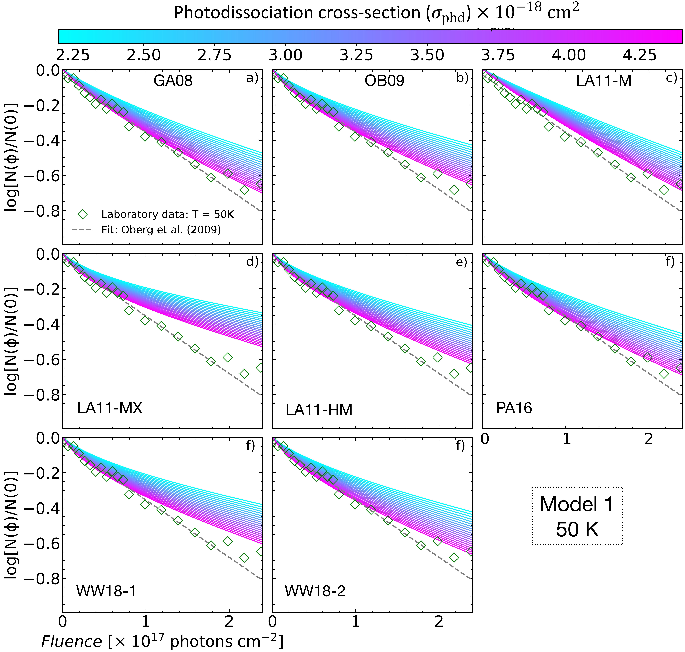
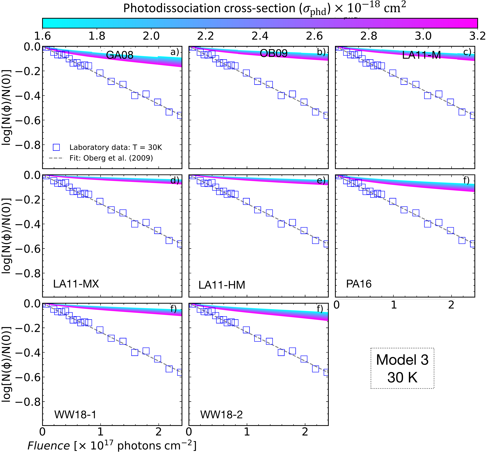
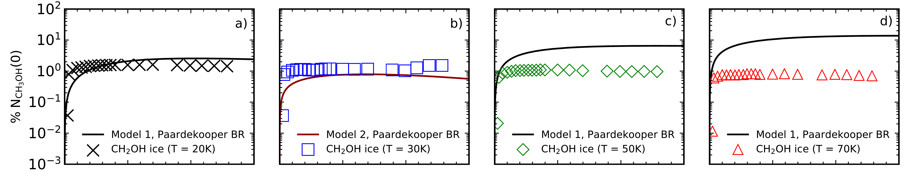
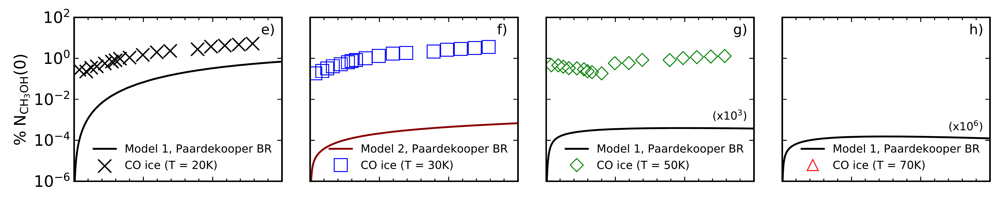
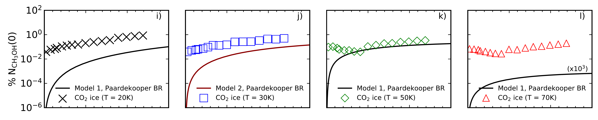
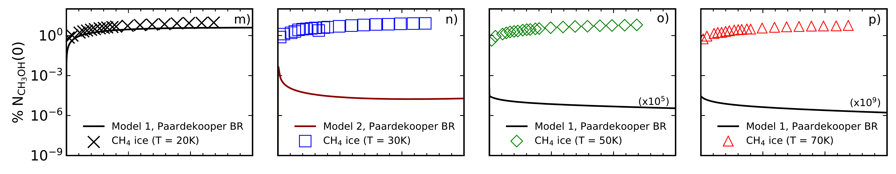
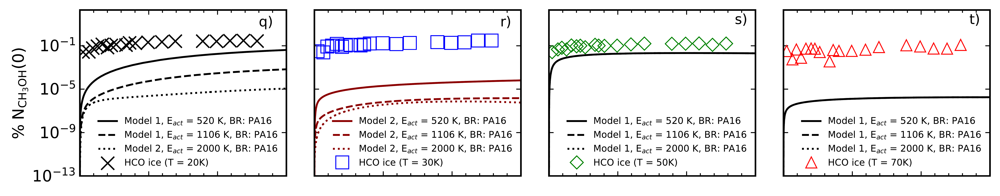
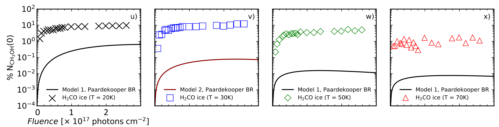

$\newcommand{\ensuremath}{}$
$\newcommand{\xspace}{}$
$\newcommand{\object}[1]{\texttt{#1}}$
$\newcommand{\farcs}{{.}''}$
$\newcommand{\farcm}{{.}'}$
$\newcommand{\arcsec}{''}$
$\newcommand{\arcmin}{'}$
$\newcommand{\ion}[2]{#1#2}$
$\newcommand{\textsc}[1]{\textrm{#1}}$
$\newcommand{\hl}[1]{\textrm{#1}}$
$\newcommand{\footnote}[1]{}$
$\newcommand{\arraystretch}{1.5}$
$\newcommand{\arraystretch}{1.1}$
$\newcommand{\arraystretch}{1.3}$
$\newcommand{\arraystretch}{1.5}$
$\newcommand{\theequation}{R\arabic{equation}}$
$\newcommand{\theequation}{R\arabic{equation}}$
$\newcommand{\theequation}{R\arabic{equation}}$
$\newcommand{\theequation}{R\arabic{equation}}$
$\newcommand{\theequation}{R\arabic{equation}}$
$\newcommand{\arraystretch}{1.}$
$\newcommand{\arraystretch}{1.2}$
$\newcommand{\arraystretch}{1.2}$
$\newcommand{\arraystretch}{1.2}$
$\newcommand{\@}{currentlabel}$
$\newcommand{\@}{currentlabel}$
$\newcommand{\@}{currentlabel}$
$\newcommand{\@}{currentlabel}$
$\newcommand{\@}{currentlabel}$

$\newcommand{\ensuremath}{}$
$\newcommand{\xspace}{}$
$\newcommand{\object}[1]{\texttt{#1}}$
$\newcommand{\farcs}{{.}''}$
$\newcommand{\farcm}{{.}'}$
$\newcommand{\arcsec}{''}$
$\newcommand{\arcmin}{'}$
$\newcommand{\ion}[2]{#1#2}$
$\newcommand{\textsc}[1]{\textrm{#1}}$
$\newcommand{\hl}[1]{\textrm{#1}}$
$\newcommand{\footnote}[1]{}$
$\newcommand{\arraystretch}{1.5}$
$\newcommand{\arraystretch}{1.1}$
$\newcommand{\arraystretch}{1.3}$
$\newcommand{\arraystretch}{1.5}$
$\newcommand{\theequation}{R\arabic{equation}}$
$\newcommand{\theequation}{R\arabic{equation}}$
$\newcommand{\theequation}{R\arabic{equation}}$
$\newcommand{\theequation}{R\arabic{equation}}$
$\newcommand{\theequation}{R\arabic{equation}}$
$\newcommand{\arraystretch}{1.}$
$\newcommand{\arraystretch}{1.2}$
$\newcommand{\arraystretch}{1.2}$
$\newcommand{\arraystretch}{1.2}$
$\newcommand{\@}{currentlabel}$
$\newcommand{\@}{currentlabel}$
$\newcommand{\@}{currentlabel}$
$\newcommand{\@}{currentlabel}$
$\newcommand{\@}{currentlabel}$

# Simulation of CH$_3$OH ice UV photolysis under laboratory conditions

<mark>Appeared on: 2023-02-08</mark> - _Accepted for publication in A&A on 08-Feb-2023_

W. R. M. Rocha, et al. -- incl., <mark><mark>G. Perotti</mark></mark>

**Abstract:** Methanol is the most complex molecule securely identified in interstellar ices and is a key chemical species for understanding chemical complexity in astrophysical environments. Important aspects of the methanol ice photochemistry are still unclear such as the branching ratios and photo-dissociation cross-sections at different temperatures and irradiation fluxes. This work aims at a quantitative agreement between laboratory experiments and astrochemical modelling of the CH $_3$ OH ice UV photolysis. Ultimately, this work allows us to better understand which processes govern the methanol ice photochemistry present in laboratory experiments. We use the $\texttt{ProDiMo}$ code to simulate the radiation fields, pressures and pumping efficiencies characteristic of laboratory measurements. The simulations start with simple chemistry consisting only of methanol ice and helium to mimic the residual gas in the experimental chamber. A surface chemical network enlarged by photo-dissociation reactions is used to study the chemical reactions within the ice. Additionally, different surface chemistry parameters such as surface competition, tunnelling, thermal diffusion and reactive desorption are adopted to check those that reproduce the experimental results. The chemical models with the $\texttt{ProDiMo}$ code including surface chemistry parameters can reproduce the methanol ice destruction via UV photodissociation at temperatures of 20, 30, 50 and 70 K as observed in the experiments. We also note that the results are sensitive to different branching ratios after photolysis and to the mechanisms of reactive desorption. In the simulations of a molecular cloud at 20 K, we observed an increase in the methanol gas abundance of one order of magnitude, with a similar decrease in the solid-phase abundance. Comprehensive astrochemical models provide new insights into laboratory experiments as the quantitative understanding of the processes that govern the reactions within the ice. Ultimately, those insights can help to better interpret astronomical observations.

**Figure 18. -** Grid of methanol ice photodissociation models at 50 K assuming different photodissociation cross-sections and BRs. The Model 1 in Table \ref{t7} is adopted in these plots. (*M1_50*)

**Figure 13. -** Grid of methanol ice photodissociation models at 30 K assuming different photodissociation cross-sections and BRs. The Model 3 in Table \ref{t7} is adopted in these plots. (*M3_30*)

**Figure 37. -** Formation curves of selected daughter species (CH$_2$OH, CO, CO$_2$, CH$_4$, HCO and H$_2$CO) due to CH$_3$OH photolysis over fluence with respect to the initial methanol ice column density at four temperatures. The symbols are the experimental measurements and the solid lines are the results of ProDiMo simulations of the best photodissociation models (see Figure \ref{fits}). (*growth*)

