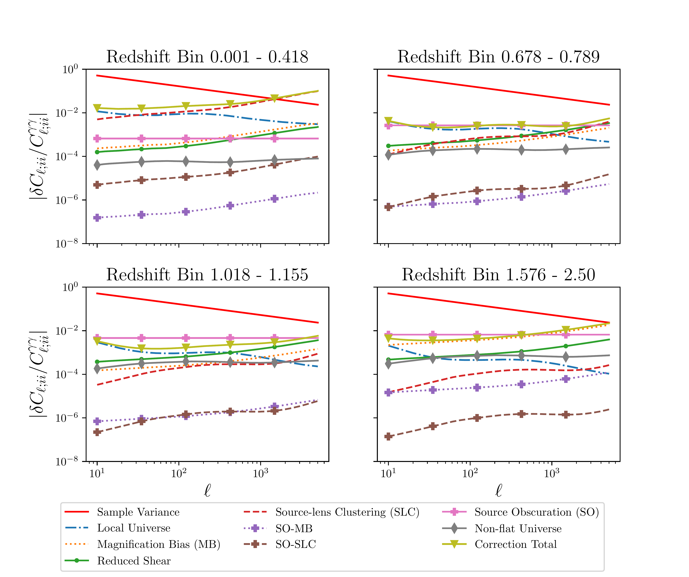

$\newcommand{\ensuremath}{}$
$\newcommand{\xspace}{}$
$\newcommand{\object}[1]{\texttt{#1}}$
$\newcommand{\farcs}{{.}''}$
$\newcommand{\farcm}{{.}'}$
$\newcommand{\arcsec}{''}$
$\newcommand{\arcmin}{'}$
$\newcommand{\ion}[2]{#1#2}$
$\newcommand{\textsc}[1]{\textrm{#1}}$
$\newcommand{\hl}[1]{\textrm{#1}}$
$\newcommand{\orcid}[1]$

$\newcommand{\ensuremath}{}$
$\newcommand{\xspace}{}$
$\newcommand{\object}[1]{\texttt{#1}}$
$\newcommand{\farcs}{{.}''}$
$\newcommand{\farcm}{{.}'}$
$\newcommand{\arcsec}{''}$
$\newcommand{\arcmin}{'}$
$\newcommand{\ion}[2]{#1#2}$
$\newcommand{\textsc}[1]{\textrm{#1}}$
$\newcommand{\hl}[1]{\textrm{#1}}$
$\newcommand{\orcid}[1]$

# *Euclid* preparation: XXVIII. Modelling of the weak lensing angular power spectrum

<mark>Appeared on: 2023-02-09</mark> - _20 pages, submitted to A&A_

Euclid Collaboration, et al. -- incl., <mark><mark>M. L. Brown</mark></mark>, <mark><mark>E. Franceschi</mark></mark>, <mark><mark>K. Jahnke</mark></mark>

**Abstract:** This work considers which higher-order effects in modelling the cosmic shear angular power spectra must be taken into account for *Euclid* . We identify which terms are of concern, and quantify their individual and cumulative impact on cosmological parameter inference from *Euclid* . We compute the values of these higher-order effects using analytic expressions, and calculate the impact on cosmological parameter estimation using the Fisher matrix formalism. We review 24 effects and find the following potentially need to be accounted for: the reduced shear approximation, magnification bias, source-lens clustering, source obscuration, local Universe effects, and the flat Universe assumption. Upon computing these explicitly, and calculating their cosmological parameter biases, using a maximum multipole of $\ell=5000$ , we find that the magnification bias, source-lens clustering, source obscuration, and local Universe terms individually produce significant ( $ >0.25\sigma$ ) cosmological biases in one or more parameters, and accordingly must be accounted for. In total, over all effects, we find biases in $\Omega_{\rm m}$ , $\Omega_{\rm b}$ , $h$ , and $\sigma_{8}$ of $0.73\sigma$ , $0.28\sigma$ , $0.25\sigma$ , and $-0.79\sigma$ , respectively, for flat $\Lambda$ CDM. For the $w_0w_a$ CDM case, we find biases in $\Omega_{\rm m}$ , $\Omega_{\rm b}$ , $h$ , $n_{\rm s}$ , $\sigma_{8}$ , and $w_a$ of $1.49\sigma$ , $0.35\sigma$ , $-1.36\sigma$ , $1.31\sigma$ , $-0.84\sigma$ , and $-0.35\sigma$ , respectively; which are increased relative to the $\Lambda$ CDM due to additional degeneracies as a function of redshift and scale.

**Figure 2. -** Stacked bar chart of cosmological parameter biases resulting from the studied higher-order effects, for the flat $\Lambda$CDM case (left) of Table \ref{tab:biasesLCDMtab}, and the flat $w_0w_a$CDM case (right) of Table \ref{tab:biasesflattab}. The non-flat Universe term is not shown here, due to the different cosmology. Biases are presented here as a fraction of the $1\sigma$ parameter uncertainty. A bias is non-negligble if its absolute value reaches or exceeds $0.25\sigma$. `RS' denotes the reduced shear correction, `SLC' is the source-lens clustering term, `MB' is the magnification bias correction, `SO' is the two-point source obscuration correction, `SO-MB' and `SO-SLC' are the source obscuration-magnification bias and source-lens clustering cross terms respectively, and `LU' is the local Universe correction The segments with the dashed outlines show the total parameter biases from these corrections for each parameter. (*fig:stacked_bars*)

**Figure 1. -** Absolute magnitudes of the reduced shear, source-lens clustering, magnification bias, local Universe, source obscuration, and non-flat Universe corrections to the shear angular power spectra, relative to those angular power spectra, for *Euclid*. The corrections to the angular power spectra for four redshift bin auto-correlations are shown as representative examples, spanning across the redshift range of *Euclid*. The remaining auto and cross-correlations exhibit the same patterns. The absolute value of the signed sum of the corrections is also shown. These are all compared to the sample variance, calculated according to Eq. (\ref{eq:samplevar}). Notably, while the magnitudes of individual corrections are either higher at lower redshifts or vice-versa, the magnitude of the sum of the corrections is consistently high. Additionally, the cross-terms between source obscuration, and magnification bias and source-lens clustering are multiple orders of magnitude below other terms and sample variance, suggesting they are negligible. The remainder of the terms are typically of similar magnitudes across redshifts, suggesting they must all be accounted for. We note that these magnitudes are for both the $\Lambda$CDM and $w_0w_a$CDM cases, as the choice of fiducial values for the latter matches the former, and that the non-flat Universe correction here has been computed for a cosmology with $\Omega_{K}=0.05$, whilst other corrections are when $\Omega_{K}=0$. The markers for the SO-MB, SO-SLC, SO, Non-flat Universe, and total lines are only used to distinguish those from the other terms, and do not have any other significance. The symbols (points) are only included to allow a reader to distinguish the lines (in particular if printing in gray-scale) and do not indicate the $\ell$-modes where a computation was made; all quantities were evaluated for 200 $\ell$-bands, logarithmically spaced, with an $\ell_{\rm min}$ of 10, and an $\ell_{\rm max}$ of 5000. (*fig:dcls_all*)

**Figure 3. -** Projected 1$\sigma$ and 2$\sigma$ 2-parameter uncertainty contours for *Euclid* under a $\Lambda$CDM cosmology, with and without correcting for the source-lens clustering, magnification bias, source obscuration, and local Universe terms. These are predicted using the Fisher matrix formalism, using the cosmology specified in Table \ref{tab:cosmology}, in the case when $\Omega_{K}=0$ and is kept fixed. The true location of the constraints is denoted by the blue, dashed contours, while the biased locations if the corrections are not made are given by the solid, gold contours. Significant biases are predicted for $\Omega_{\rm m}$, $\Omega_{\rm b}$, $h$, and $\sigma_{8}$, and their values can be found in Table \ref{tab:biasesLCDMtab} (*fig:bias_corner_LCDM*)

