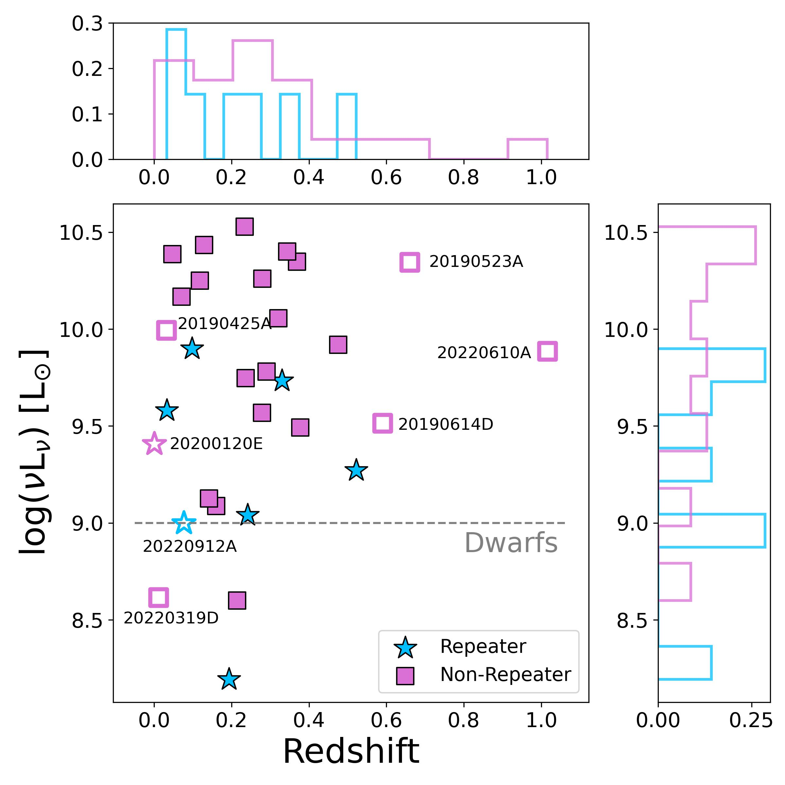
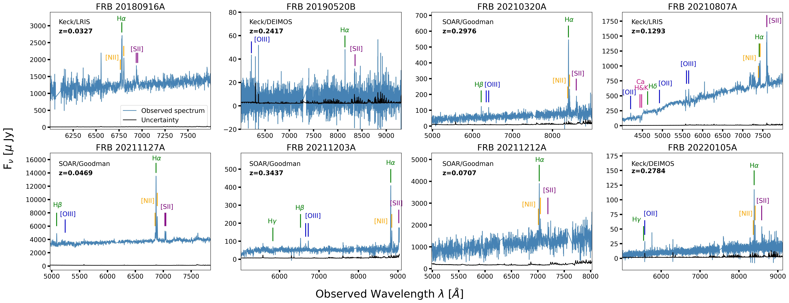
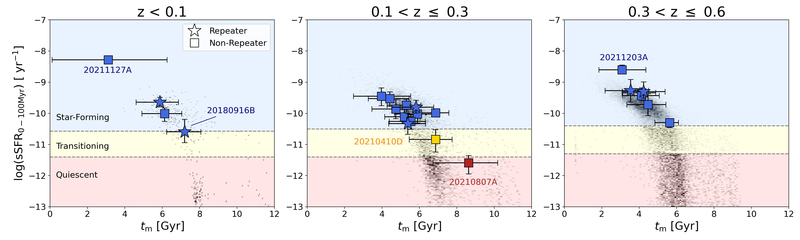

$\newcommand{\ensuremath}{}$
$\newcommand{\xspace}{}$
$\newcommand{\object}[1]{\texttt{#1}}$
$\newcommand{\farcs}{{.}''}$
$\newcommand{\farcm}{{.}'}$
$\newcommand{\arcsec}{''}$
$\newcommand{\arcmin}{'}$
$\newcommand{\ion}[2]{#1#2}$
$\newcommand{\textsc}[1]{\textrm{#1}}$
$\newcommand{\hl}[1]{\textrm{#1}}$
$\newcommand{\vdag}{(v)^\dagger}$
$\newcommand$
$\newcommand$
$\newcommand{\NU}{\affiliation{Center for Interdisciplinary Exploration and Research in Astrophysics (CIERA) and Department of Physics and Astronomy, Northwestern University, Evanston, IL 60208, USA}}$
$\newcommand{\Purdue}{\affiliation{Purdue University,$
$Department of Physics and Astronomy, 525 Northwestern Avenue, West Lafayette, IN 47907, USA}}$
$\newcommand{\CfA}{\affiliation{Center for Astrophysics\:|\:Harvard \& Smithsonian, 60 Garden St. Cambridge, MA 02138, USA}}$
$\newcommand{\UCSC}{\affiliation{Department of Astronomy and Astrophysics, University of California, Santa Cruz, CA 95064, USA}}$
$\newcommand{\IS}{\affiliation{Centre for Astrophysics and Cosmology, Science Institute, University of Iceland, Dunhagi 5, 107 Reykjav\'ik, Iceland}}$
$\newcommand{\DAWN}{\affiliation{Cosmic Dawn Center (DAWN), Niels Bohr Institute, University of Copenhagen, Jagtvej 128, 2100 Copenhagen \O, Denmark}}$
$\newcommand{\PUCV}{\affiliation{Instituto de F\'isica, Pontificia Universidad Cat\'olica de Valpara\'iso, Casilla 4059, Valpara\'iso, Chile}}$
$\newcommand{\IPMU}{\affiliation{Kavli Institute for the Physics and Mathematics of the Universe (Kavli IPMU), 5-1-5 Kashiwanoha, Kashiwa, 277-8583, Japan}}$
$\newcommand{\PSU}{\affiliation{Department of Astronomy \& Astrophysics, The Pennsylvania State University, University Park, PA 16802, USA}}$
$\newcommand{\ICDS}{\affiliation{Institute for Computational \& Data Sciences, The Pennsylvania State University, University Park, PA, USA}}$
$\newcommand{\IGC}{\affiliation{Institute for Gravitation and the Cosmos, The Pennsylvania State University, University Park, PA 16802, USA}}$
$\newcommand{\Swin}{\affiliation{ Centre for Astrophysics and Supercomputing, Swinburne University of Technology, Hawthorn, VIC, 3122, Australia}}$
$\newcommand{\Curtin}{\affiliation{ International Centre for Radio Astronomy Research, Curtin University, Bentley, WA 6102, Australia}}$
$\newcommand{\MQ}{\affiliation{School of Mathematical and Physical Sciences, Macquarie University, NSW 2109, Australia}}$
$\newcommand{\MQAAAstro}{\affiliation{Macquarie University Research Centre for Astronomy, Astrophysics \& Astrophotonics, Sydney, NSW 2109, Australia}}$
$\newcommand{\CSIRO}{\affiliation{CSIRO, Space and Astronomy, PO Box 76, Epping NSW 1710 Australia}}$
$\newcommand{\KICP}{\affiliation{Kavli Institute for Cosmological Physics, The University of Chicago, 5640 South Ellis Avenue, Chicago, IL 60637, USA}}$
$\newcommand{\UA}{\affiliation{University of Arizona, Steward Observatory, 933~N.~Cherry~Ave., Tucson, AZ 85721, USA}}$
$\newcommand{\EFI}{\affiliation{Enrico Fermi Institute, The University of Chicago, 933 East 56th Street, Chicago, IL 60637, USA}}$
$\newcommand{\mpia}{\affiliation{Max-Planck-Institut f\"{u}r Astronomie (MPIA), K\"{o}nigstuhl 17, 69117 Heidelberg, Germany}}$
$\newcommand{\GWU}{\affiliation{Department of Physics, The George Washington University, Washington, DC 20052, USA}}$
$\newcommand{\UCB}{\affiliation{Department of Astronomy, University of California, Berkeley, CA 94720-3411, USA}}$
$\newcommand{\RU}{\affiliation{Department of Astrophysics/IMAPP, Radboud University, PO Box 9010,$
$6500 GL, The Netherlands}}$
$\newcommand{\LJMU}{\affiliation{Astrophysics Research Institute, Liverpool John Moores University, IC2, Liverpool Science Park, 146 Brownlow Hill, Liverpool L3 5RF, UK}}$
$\newcommand{\LU}{\affiliation{School of Physics and Astronomy, University of Leicester, University Road, Leicester. LE1 7RH, UK}}$
$\newcommand{\ARC}{\affiliation{ARC Centre of Excellence for All-Sky Astrophysics in 3 Dimensions (ASTRO 3D), Australia}}$
$\newcommand{\ASTRON}{\affiliation{ASTRON, Netherlands Institute for Radio Astronomy, Oude Hoogeveensedijk 4, 7991 PD Dwingeloo, The Netherlands}}$
$\newcommand{\VLBI}{\affiliation{Joint institute for VLBI ERIC, Oude Hoogeveensedijk 4, 7991 PD Dwingeloo, The Netherlands$
$}}$
$\newcommand{\Anton}{\affiliation{Anton Pannekoek Institute for Astronomy, University of Amsterdam, Science Park 904, 1098 XH, Amsterdam, The Netherlands}}$
$\newcommand{\Manchester}{\affiliation{Department of Physics and Astronomy, University of Manchester, Oxford Road, M13 9PL, UK}}$
$\newcommand{\McGill}{\affiliation{Department of Physics, McGill University, Montreal, Quebec H3A 2T8, Canada$
$}}$
$\newcommand{\ICRAR}{\affiliation{International Centre for Radio Astronomy Research (ICRAR), Curtin University, Bentley, WA 6102, Australia}}$
$\newcommand{\SIA}{\affiliation{Sydney Institute for Astronomy, School of Physics A28, University of Sydney, NSW 2006, Australia}}$
$\newcommand{\NAOJ}{\affiliation{Division of Science, National Astronomical Observatory of Japan,2-21-1 Osawa, Mitaka, Tokyo 181-8588, Japan}}$
$\newcommand{\MPIA}{\affiliation{Max-Planck-Institut f\"ur Astronomie, K\"onigstuhl 17, 69117 Heidelberg, Germany}}$
$\newcommand{\thefigure}{\arabic{figure} (Cont.)}$
$\newcommand{\thefigure}{\arabic{figure}}$

$\newcommand{$\ensuremath$}{}$
$\newcommand{$\xspace$}{}$
$\newcommand{$\object$}[1]{\texttt{#1}}$
$\newcommand{$\farcs$}{{.}''}$
$\newcommand{$\farcm$}{{.}'}$
$\newcommand{$\arcsec$}{''}$
$\newcommand{$\arcmin$}{'}$
$\newcommand{$\ion$}[2]{#1#2}$
$\newcommand{$\textsc$}[1]{\textrm{#1}}$
$\newcommand{$\hl$}[1]{\textrm{#1}}$
$\newcommand{$\vdag$}{(v)^\dagger}$
$\newcommand$
$\newcommand$
$\newcommand{$\NU$}{\affiliation{Center for Interdisciplinary Exploration and Research in Astrophysics (CIERA) and Department of Physics and Astronomy, Northwestern University, Evanston, IL 60208, USA}}$
$\newcommand{\Purdue}{\affiliation{Purdue University,$
$Department of Physics and Astronomy, 525 Northwestern Avenue, West Lafayette, IN 47907, USA}}$
$\newcommand{$\CfA$}{\affiliation{Center for Astrophysics\:|\:Harvard \& Smithsonian, 60 Garden St. Cambridge, MA 02138, USA}}$
$\newcommand{$\UCSC$}{\affiliation{Department of Astronomy and Astrophysics, University of California, Santa Cruz, CA 95064, USA}}$
$\newcommand{$\IS$}{\affiliation{Centre for Astrophysics and Cosmology, Science Institute, University of Iceland, Dunhagi 5, 107 Reykjav\'ik, Iceland}}$
$\newcommand{$\DAWN$}{\affiliation{Cosmic Dawn Center (DAWN), Niels Bohr Institute, University of Copenhagen, Jagtvej 128, 2100 Copenhagen \O, Denmark}}$
$\newcommand{$\PUCV$}{\affiliation{Instituto de F\'isica, Pontificia Universidad Cat\'olica de Valpara\'iso, Casilla 4059, Valpara\'iso, Chile}}$
$\newcommand{$\IPMU$}{\affiliation{Kavli Institute for the Physics and Mathematics of the Universe (Kavli IPMU), 5-1-5 Kashiwanoha, Kashiwa, 277-8583, Japan}}$
$\newcommand{$\PSU$}{\affiliation{Department of Astronomy \& Astrophysics, The Pennsylvania State University, University Park, PA 16802, USA}}$
$\newcommand{$\ICDS$}{\affiliation{Institute for Computational \& Data Sciences, The Pennsylvania State University, University Park, PA, USA}}$
$\newcommand{$\IGC$}{\affiliation{Institute for Gravitation and the Cosmos, The Pennsylvania State University, University Park, PA 16802, USA}}$
$\newcommand{$\Swin$}{\affiliation{ Centre for Astrophysics and Supercomputing, Swinburne University of Technology, Hawthorn, VIC, 3122, Australia}}$
$\newcommand{$\Curtin$}{\affiliation{ International Centre for Radio Astronomy Research, Curtin University, Bentley, WA 6102, Australia}}$
$\newcommand{$\MQ$}{\affiliation{School of Mathematical and Physical Sciences, Macquarie University, NSW 2109, Australia}}$
$\newcommand{$\MQ$AAAstro}{\affiliation{Macquarie University Research Centre for Astronomy, Astrophysics \& Astrophotonics, Sydney, NSW 2109, Australia}}$
$\newcommand{$\CSIRO$}{\affiliation{CSIRO, Space and Astronomy, PO Box 76, Epping NSW 1710 Australia}}$
$\newcommand{$\KICP$}{\affiliation{Kavli Institute for Cosmological Physics, The University of Chicago, 5640 South Ellis Avenue, Chicago, IL 60637, USA}}$
$\newcommand{$\UA$}{\affiliation{University of Arizona, Steward Observatory, 933~N.~Cherry~Ave., Tucson, AZ 85721, USA}}$
$\newcommand{$\EFI$}{\affiliation{Enrico Fermi Institute, The University of Chicago, 933 East 56th Street, Chicago, IL 60637, USA}}$
$\newcommand{$\mpia$}{\affiliation{Max-Planck-Institut f\"{u}r Astronomie (MPIA), K\"{o}nigstuhl 17, 69117 Heidelberg, Germany}}$
$\newcommand{$\GWU$}{\affiliation{Department of Physics, The George Washington University, Washington, DC 20052, USA}}$
$\newcommand{$\UCB$}{\affiliation{Department of Astronomy, University of California, Berkeley, CA 94720-3411, USA}}$
$\newcommand{\RU}{\affiliation{Department of Astrophysics/IMAPP, Radboud University, PO Box 9010,$
$6500 GL, The Netherlands}}$
$\newcommand{$\LJMU$}{\affiliation{Astrophysics Research Institute, Liverpool John Moores University, IC2, Liverpool Science Park, 146 Brownlow Hill, Liverpool L3 5RF, UK}}$
$\newcommand{$\LU$}{\affiliation{School of Physics and Astronomy, University of Leicester, University Road, Leicester. LE1 7RH, UK}}$
$\newcommand{$\ARC$}{\affiliation{ARC Centre of Excellence for All-Sky Astrophysics in 3 Dimensions (ASTRO 3D), Australia}}$
$\newcommand{$\ASTRON$}{\affiliation{ASTRON, Netherlands Institute for Radio Astronomy, Oude Hoogeveensedijk 4, 7991 PD Dwingeloo, The Netherlands}}$
$\newcommand{\VLBI}{\affiliation{Joint institute for VLBI ERIC, Oude Hoogeveensedijk 4, 7991 PD Dwingeloo, The Netherlands$
$}}$
$\newcommand{$\Anton$}{\affiliation{Anton Pannekoek Institute for Astronomy, University of Amsterdam, Science Park 904, 1098 XH, Amsterdam, The Netherlands}}$
$\newcommand{$\Manchester$}{\affiliation{Department of Physics and Astronomy, University of Manchester, Oxford Road, M13 9PL, UK}}$
$\newcommand{\McGill}{\affiliation{Department of Physics, McGill University, Montreal, Quebec H3A 2T8, Canada$
$}}$
$\newcommand{$\ICRAR$}{\affiliation{International Centre for Radio Astronomy Research (ICRAR), Curtin University, Bentley, WA 6102, Australia}}$
$\newcommand{$\SIA$}{\affiliation{Sydney Institute for Astronomy, School of Physics A28, University of Sydney, NSW 2006, Australia}}$
$\newcommand{$\NAOJ$}{\affiliation{Division of Science, National Astronomical Observatory of Japan,2-21-1 Osawa, Mitaka, Tokyo 181-8588, Japan}}$
$\newcommand{$\MPIA$}{\affiliation{Max-Planck-Institut f\"ur Astronomie, K\"onigstuhl 17, 69117 Heidelberg, Germany}}$
$\newcommand{$\thefigure$}{\arabic{figure} (Cont.)}$
$\newcommand{$\thefigure$}{\arabic{figure}}$

# The Demographics, Stellar Populations, and Star Formation Histories of Fast Radio Burst Host Galaxies: Implications for the Progenitors

<mark>Appeared on: 2023-02-14</mark> - _50 pages, 32 figures, 6 tables, submitted_

Alexa C. Gordon, et al. -- incl., <mark>Elizabeth K. Mahoney</mark>, <mark>Kerry Paterson</mark>

**Abstract:** We present a comprehensive catalog of  observations and stellar population properties for 23 highly secure host galaxies of fast radio bursts (FRBs). Our sample comprises six repeating FRBs and 17 apparent non-repeaters. We present 82 new photometric and eight new spectroscopic observations of these hosts. Using stellar population synthesis modeling and employing non-parametric star formation histories (SFHs), we find that FRB hosts have a median stellar mass of$\approx 10^{9.8} M_{\odot}$, mass-weighted age of$\approx 5.2$Gyr, and ongoing star formation rate$\approx 1.3 M_{\odot}$yr$^{-1}$but span wide ranges in all properties. Classifying the hosts by degree of star formation, we find that 91\%(21/23 hosts) are star-forming, one is transitioning, and one is quiescent. The majority trace the star-forming main sequence of galaxies, but at least two FRBs originate in less active environments, both of which are apparent non-repeaters. Across all modeled properties, we find no statistically significant distinction between the hosts of repeaters and non-repeaters. However, the hosts of repeating FRBs generally extend to lower stellar masses, and the hosts of non-repeaters arise in more optically luminous galaxies. Further, the four galaxies with the most clear and prolonged rises in their SFHs all host repeating FRBs, demonstrating heightened star formation activity in the last$\lesssim 100$Myr. Our results support the young magnetar model for most FRBs in which their progenitors formed through core-collapse supernovae, but the presence of some FRBs in less active environments suggests that a fraction form through more delayed channels.

**Figure 1. -** Luminosity--redshift distribution for all FRB hosts. We denote repeaters by blue stars and non-repeaters by pink squares. We also include FRB hosts from the literature that did not meet our sample criteria as open symbols. (*fig:l-z*)

**Figure 4. -** New spectroscopic observations included in this work from SOAR/Goodman, Keck/DEIMOS, and Keck/LRIS. Major emission and absorption lines are denoted by colored lines: Balmer lines in green, oxygen lines in blue, nitrogen lines in orange, sulphur lines in purple, and calcium lines in pink. The spectra are normalized to the photometry in \texttt{Prospector}. The \texttt{Prospector}-derived redshifts are listed in each panel along with the facility/instrument of observation. (*fig:new spectra*)

**Figure 9. -** log(${\rm sSFR}_{\rm 0-100 Myr}$) vs. $t_{\rm m}$ of FRB host galaxies compared to COSMOS field galaxies for three redshift bins. The parameter space is divided into Star-Forming, Transitioning, and Quiescent following the \citet{Tacchella+22} classification. Repeaters are denoted by stars and non-repeaters by squares. Both are color-coded by their classification type. Error bars correspond to 68\% confidence. (*fig:sSFR-MWA*)

