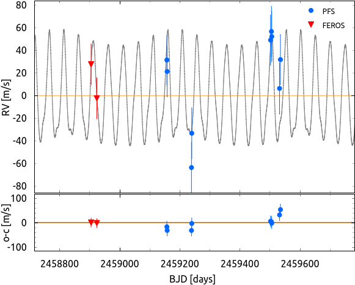
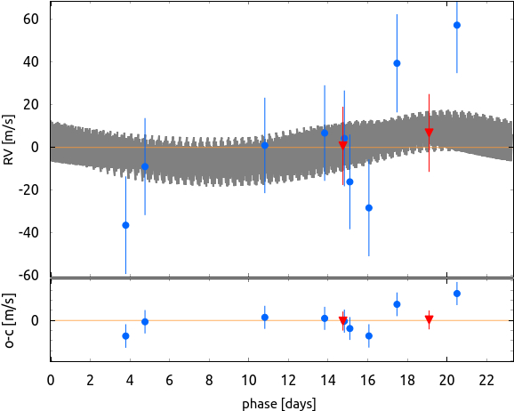
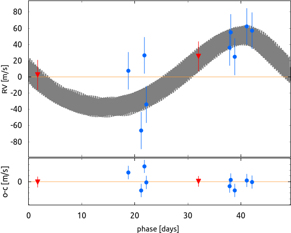
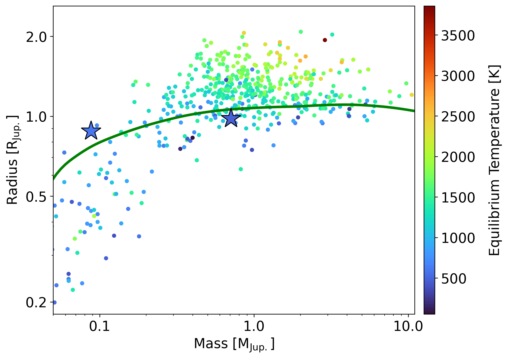
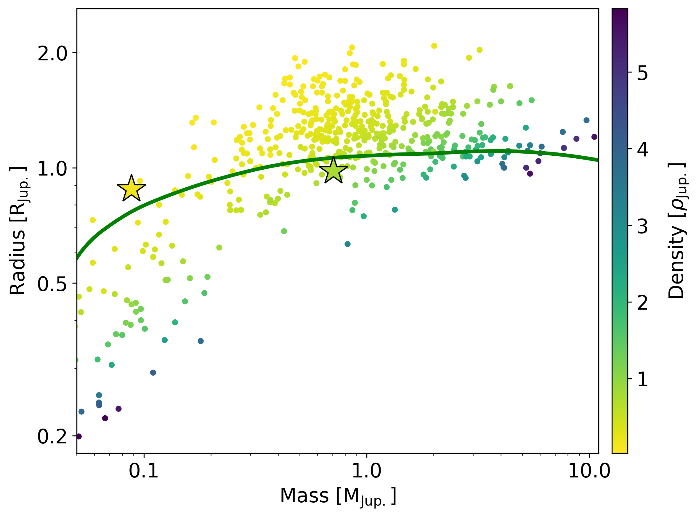

$\newcommand{\ensuremath}{}$
$\newcommand{\xspace}{}$
$\newcommand{\object}[1]{\texttt{#1}}$
$\newcommand{\farcs}{{.}''}$
$\newcommand{\farcm}{{.}'}$
$\newcommand{\arcsec}{''}$
$\newcommand{\arcmin}{'}$
$\newcommand{\ion}[2]{#1#2}$
$\newcommand{\textsc}[1]{\textrm{#1}}$
$\newcommand{\hl}[1]{\textrm{#1}}$
$\newcommand{\tess}{\emph{TESS}}$
$\newcommand{\autoref}$
$\newcommand{\thetable}{A\arabic{table}}$
$\newcommand{\thefigure}{A\arabic{figure}}$
$\newcommand{\equationautorefname}{Eq.}$
$\newcommand{\figureautorefname}{Fig.}$
$\newcommand{\sectionautorefname}{Sect.}$
$\newcommand{\subsectionautorefname}{Sect.}$
$\newcommand{\subsubsectionautorefname}{Sect.}$

$\newcommand{$\ensuremath$}{}$
$\newcommand{$\xspace$}{}$
$\newcommand{$\object$}[1]{\texttt{#1}}$
$\newcommand{$\farcs$}{{.}''}$
$\newcommand{$\farcm$}{{.}'}$
$\newcommand{$\arcsec$}{''}$
$\newcommand{$\arcmin$}{'}$
$\newcommand{$\ion$}[2]{#1#2}$
$\newcommand{$\textsc$}[1]{\textrm{#1}}$
$\newcommand{$\hl$}[1]{\textrm{#1}}$
$\newcommand{$\tess$}{\emph{TESS}}$
$\newcommand{$\autoref$}$
$\newcommand{$\thetable$}{A\arabic{table}}$
$\newcommand{$\thefigure$}{A\arabic{figure}}$
$\newcommand{$\equationautorefname$}{Eq.}$
$\newcommand{$\figureautorefname$}{Fig.}$
$\newcommand{$\sectionautorefname$}{Sect.}$
$\newcommand{$\subsectionautorefname$}{Sect.}$
$\newcommand{$\subsubsectionautorefname$}{Sect.}$

# Based on observations collected at the European Organization for Astronomical Research in the Southern Hemisphere under MPG programmes 0104.A-9007. This paper includes data gathered with the 6.5 meter Magellan Telescopes located at Las Campanas Observatory, Chile.

<mark>Appeared on: 2023-02-14</mark> - _Accepted for publication in AJ_

<mark>Trifon Trifonov</mark>, et al. -- incl., <mark>Thomas Henning</mark>, <mark>Melissa J. Hobson</mark>, <mark>Man Hoi Lee</mark>, <mark>Ren{\'e} Heller</mark>

**Abstract:** TOI-2525 is a K-type star with an estimated mass of M = 0.849$_{-0.033}^{+0.024}$M$_\odot$and radius ofR = 0.785$_{-0.007}^{+0.007}$R$_\odot$observed by the TESS mission in 22 sectors (within sectors 1 and 39).The TESS light curves yield significant transit events of two companions, whichshow strong transit timing variations (TTVs) with a semi-amplitude of a$\sim$6 hours.We performed TTV dynamical, and photo-dynamical light curve analysis of the TESS data, combined with radial velocity (RV) measurements from FEROS and PFS, and we confirmed the planetary nature of these companions.The TOI-2525 system consists of a transiting pair of planets comparable to Neptune and Jupiter withestimated dynamical masses of$m_{\rm b}$= 0.088$_{-0.004}^{+0.005}$M$_{\rm Jup.}$,and$m_{\rm c}$= 0.709$_{-0.033}^{+0.034}$M$_{\rm Jup.}$, radius of$r_b$= 0.88$_{-0.02}^{+0.02}$R$_{\rm Jup.}$and$r_c$= 0.98$_{-0.02}^{+0.02}$R$_{\rm Jup.}$, and with orbital periods of$P_{\rm b}$=  23.288$_{-0.002}^{+0.001}$days and$P_{\rm c}$= 49.260$_{-0.001}^{+0.001}$days for the inner and the outer planet, respectively. The period ratio is close tothe 2:1 period commensurability, but the dynamical simulations of the system suggestthat it is outside the mean motion resonance (MMR) dynamical configuration. TOI-2525 b is among the lowest density Neptune-mass planets known to date, with an estimated median density of$\rho_{\rm b}$= 0.174$_{-0.015}^{+0.016}$g cm$^{-3}$.The TOI-2525 system is very similar to the other K-dwarf systems discovered by TESS, TOI-2202 and TOI-216, which are composed of almost identical K-dwarf primary and two warm giant planets near the 2:1 MMR.

**Figure 10. -** 
    RV component of the two-planet dynamical model of TOI-2525, constructed jointly with the TTVs data and with the RVs from PFS (blue circles). The two RVs from FEROS (red triangles) are overploted with an optimized RV offset to the model. The left panel shows the time series
    and the N-body model,
    the middle and right panels show a phase-folded representation of the RV data, modeled with
    the dynamical model (with an osculating period). The PFS data uncertainties include the estimated RV jitter, added in quadrature to the error budget, while the FEROS data are plotted with their nominal RV uncertainties. The small sub-panels show the RVs residuals.
 (*RV_plot1*)

**Figure 11. -** Posteriors of the dynamical properties at the 2:1 period ratio commensurability of the two-planet system TOI-2525. The posteriors are generated by randomly drawing 10 000 samples from the TTV+RV dynamical model.
Each sample is tested for stability and the overall dynamical properties are evaluated at the 2:1 period ratio commensurability. The derived dynamical parameters are: mean period ratio $\hat{P}_{\rm rat.}$, mean eccentricities $\hat{e}_{\rm b}$, $\hat{e}_{\rm c}$, mean orbital aligment $\hat{\Delta\omega}$, and their peak-to-peak amplitudes Ampl. $e_{\rm b}$, Ampl. $e_{\rm c}$, Ampl. $\Delta\omega$, and the planetary dynamical masses and semi-major axes. Note that the posterior distribution of $\theta_1$, and $\theta_2$ are not shown, since these exhibit circulation between 0$^\circ$ and 360$^\circ$.
The black contours on the 2D panels represent the 1, 2 and 3$\sigma$ confidence level of the overall posterior samples.
 (*dyn_samp*)

**Figure 14. -** Radius-mass demographics for all giant transiting planets with measured
masses by TTVs or RVs. The position of TOI-2525 b and c are plotted with "star" symbols. Panel a) shows the mass-radius relation color-coded by T$_{\rm eq.}$. Panel b) shows the same as panel a), but is color-coded with the planetary density.
The solid curve corresponds to the predicted radius using the models of \citet{Fortney2007} given the estimated luminosity of TOI-2525, a semi-major axis=0.2 AU, and an age of 3.1 G yr.\looseness=-5
 (*hhe_fraction*)

