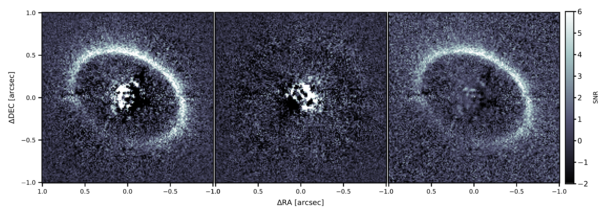
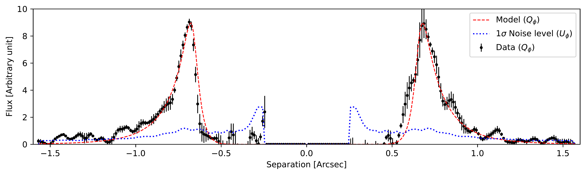

$\newcommand{\ensuremath}{}$
$\newcommand{\xspace}{}$
$\newcommand{\object}[1]{\texttt{#1}}$
$\newcommand{\farcs}{{.}''}$
$\newcommand{\farcm}{{.}'}$
$\newcommand{\arcsec}{''}$
$\newcommand{\arcmin}{'}$
$\newcommand{\ion}[2]{#1#2}$
$\newcommand{\textsc}[1]{\textrm{#1}}$
$\newcommand{\hl}[1]{\textrm{#1}}$
$\newcommand{\mum}{\SI{\micro\meter}}$
$\newcommand{\deg}{^{\circ}}$
$\newcommand{\degb}{^{\circ}}$

$\newcommand{$\ensuremath$}{}$
$\newcommand{$\xspace$}{}$
$\newcommand{$\object$}[1]{\texttt{#1}}$
$\newcommand{$\farcs$}{{.}''}$
$\newcommand{$\farcm$}{{.}'}$
$\newcommand{$\arcsec$}{''}$
$\newcommand{$\arcmin$}{'}$
$\newcommand{$\ion$}[2]{#1#2}$
$\newcommand{$\textsc$}[1]{\textrm{#1}}$
$\newcommand{$\hl$}[1]{\textrm{#1}}$
$\newcommand{$\mum$}{\SI{\micro\meter}}$
$\newcommand{$\deg$}{^{\circ}}$
$\newcommand{$\deg$b}{^{\circ}}$

# Morphology of the gas-rich debris disk around HD 121617 with SPHERE observations in polarized light

<mark>Appeared on: 2023-02-15</mark> - _12 pages, 7 figures. Accepted in A&A (06/02/2023)_

Clément Perrot, et al. -- incl., <mark><mark>Johan Olofsson</mark></mark>

**Abstract:** Debris disks are the signposts of collisionally eroding planetesimal circumstellar belts, whose study can put important constraints on the structure of extrasolar planetary systems. The best constraints on the morphology of disks are often obtained from spatially resolved observations in scattered light. Here, we investigate the young ($\sim$16 Myr) bright gas-rich debris disk around HD 121617.We use new scattered-light observations with VLT/SPHERE to characterize the morphology and the dust properties of this disk. From these properties we can then derive constraints on the physical and dynamical environment of this system, for which significant amounts of gas have been detected.The disk morphology is constrained by linear-polarimetric observations in the\textit{J}band. Based on our modeling results and archival photometry, we also model the SED to put constraints on the total dust mass and the dust size distribution. We explore different scenarios that could explain these new constraints.We present the first resolved image in scattered light of the debris disk HD 121617. We fit the morphology of the disk, finding a semi-major axis of$78.3\pm0.2$au, an inclination of$43.1\pm0.2^{\circ}$and a position angle of the major axis with respect to north, of$239.8\pm0.3^{\circ}$, compatible with the previous continuum and CO detection with ALMA. Our analysis shows that the disk has a very sharp inner edge, possibly sculpted by a yet-undetected planet or gas drag. While less sharp, its outer edge is steeper than expected for unperturbed disks, which could also be due to a planet or gas drag, but future observations probing the system farther from the main belt would help explore this further. The SED analysis leads to a dust mass of$0.21\pm0.02 M_{\oplus}$and a minimum grain size of$0.87\pm0.12 $\mum$$, smaller than the blowout size by radiation pressure, which is not unexpected for very bright collisionally active disks.

**Figure 4. -** Corner-plot for the MCMC analysis. From left to right and top to bot: $a$($r_0$), $i$, $\phi$, $g$, $\alpha_\mathrm{in}$, $\alpha_\mathrm{out}$, $e$ and $\omega$. Middle dash-lines are the more probable value and external dash-lines are the 1-$\sigma$ error. (*cornerplot*)

**Figure 5. -** Left to right: $Q_\phi$ image, $U_\phi$ image, and S/N map of the $J$ band observations of HD 121617. North is up, east is left. (*observation*)

**Figure 7. -** $Q_{\phi}$ radial profile following the projected major axis (6 pixels width) from the South-West to the North-East of the disk with the corresponding error bars (black points). The radial profile of the best model (red dashed line) and the Noise level obtained with the azimuthal standard deviation of the $U_{\phi}$ image (blue dotted line).
 (*radialprofile*)

