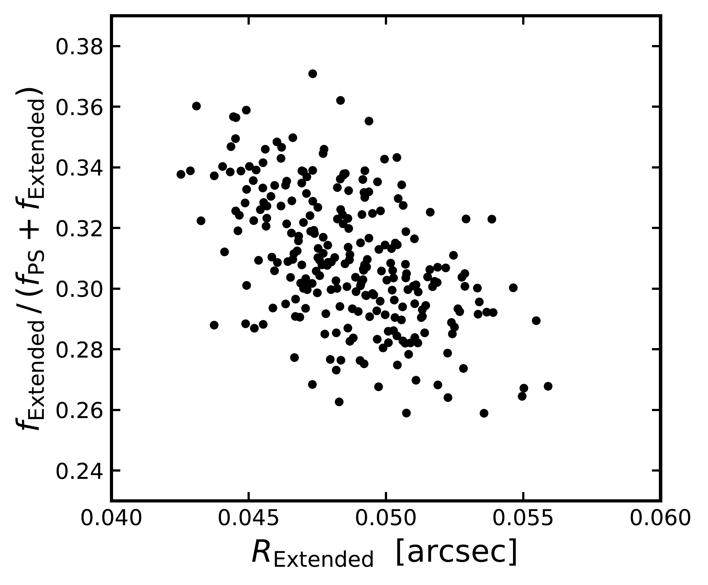
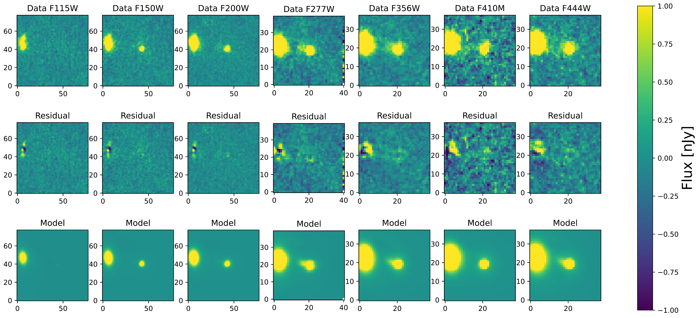

$\newcommand{\ensuremath}{}$
$\newcommand{\xspace}{}$
$\newcommand{\object}[1]{\texttt{#1}}$
$\newcommand{\farcs}{{.}''}$
$\newcommand{\farcm}{{.}'}$
$\newcommand{\arcsec}{''}$
$\newcommand{\arcmin}{'}$
$\newcommand{\ion}[2]{#1#2}$
$\newcommand{\textsc}[1]{\textrm{#1}}$
$\newcommand{\hl}[1]{\textrm{#1}}$
$\newcommand{\url}[1]{\href{#1}{#1}}$
$\newcommand{\dodoi}[1]{doi:~\href{http://doi.org/#1}{\nolinkurl{#1}}}$
$\newcommand{\doeprint}[1]{\href{http://ascl.net/#1}{\nolinkurl{http://ascl.net/#1}}}$
$\newcommand{\doarXiv}[1]{\href{https://arxiv.org/abs/#1}{\nolinkurl{https://arxiv.org/abs/#1}}}$
$\newcommand{\lya}{\ensuremath{{\rm Ly}\alpha}}$
$\newcommand{\kms}{\ensuremath{{\rm\;km\;s^{-1}}}}$
$\newcommand{\Mpc}{\ensuremath{{\rm\;Mpc}}}$
$\newcommand{\Myr}{\ensuremath{{\rm\;Myr}}}$
$\newcommand{\Msun}{\ensuremath{{\rm\;M_\odot}}}$
$\newcommand{\yr}{\ensuremath{{\rm\;yr}}}$
$\newcommand{\cm}{\ensuremath{{\rm\;cm}}}$
$\newcommand{\ergscms}{\ensuremath{{\rm\;ergs\;cm^{-2}\;s^{-1}}}}$
$\newcommand{\ergss}{\ensuremath{{\rm\;ergs\;s^{-1}}}}$
$\newcommand{\mic}{\ensuremath{\mu\rm m}}$
$\newcommand{\ciii}{C \textsc{iii}]}$
$\newcommand{\niii}{N \textsc{iii}]}$
$\newcommand{\heii}{He \textsc{ii}}$
$\newcommand{\civ}{C \textsc{iv}}$
$\newcommand{\niv}{N \textsc{iv}}$
$\newcommand{\todo}[1]{{\color{blue} \tt #1}}$
$\newcommand{\tbc}[1]{#1 ({\color{red} \tt TBC})}$
$\newcommand{\tbd}{({\color{red} \tt TBD})}$
$\newcommand{\nod}{\nodata}$
$\newcommand{\}{natexlab}$

$\newcommand{\ensuremath}{}$
$\newcommand{\xspace}{}$
$\newcommand{\object}[1]{\texttt{#1}}$
$\newcommand{\farcs}{{.}''}$
$\newcommand{\farcm}{{.}'}$
$\newcommand{\arcsec}{''}$
$\newcommand{\arcmin}{'}$
$\newcommand{\ion}[2]{#1#2}$
$\newcommand{\textsc}[1]{\textrm{#1}}$
$\newcommand{\hl}[1]{\textrm{#1}}$
$\newcommand{\url}[1]{\href{#1}{#1}}$
$\newcommand{\dodoi}[1]{doi:~\href{http://doi.org/#1}{\nolinkurl{#1}}}$
$\newcommand{\doeprint}[1]{\href{http://ascl.net/#1}{\nolinkurl{http://ascl.net/#1}}}$
$\newcommand{\doarXiv}[1]{\href{https://arxiv.org/abs/#1}{\nolinkurl{https://arxiv.org/abs/#1}}}$
$\newcommand{\lya}{\ensuremath{{\rm Ly}\alpha}}$
$\newcommand{\kms}{\ensuremath{{\rm\;km\;s^{-1}}}}$
$\newcommand{\Mpc}{\ensuremath{{\rm\;Mpc}}}$
$\newcommand{\Myr}{\ensuremath{{\rm\;Myr}}}$
$\newcommand{\Msun}{\ensuremath{{\rm\;M_\odot}}}$
$\newcommand{\yr}{\ensuremath{{\rm\;yr}}}$
$\newcommand{\cm}{\ensuremath{{\rm\;cm}}}$
$\newcommand{\ergscms}{\ensuremath{{\rm\;ergs\;cm^{-2}\;s^{-1}}}}$
$\newcommand{\ergss}{\ensuremath{{\rm\;ergs\;s^{-1}}}}$
$\newcommand{\mic}{\ensuremath{\mu\rm m}}$
$\newcommand{\ciii}{C \textsc{iii}]}$
$\newcommand{\niii}{N \textsc{iii}]}$
$\newcommand{\heii}{He \textsc{ii}}$
$\newcommand{\civ}{C \textsc{iv}}$
$\newcommand{\niv}{N \textsc{iv}}$
$\newcommand{\todo}[1]{{\color{blue} \tt #1}}$
$\newcommand{\tbc}[1]{#1 ({\color{red} \tt TBC})}$
$\newcommand{\tbd}{({\color{red} \tt TBD})}$
$\newcommand{\nod}{\nodata}$
$\newcommand{\}{natexlab}$

# JADES Imaging of GN-z11: Revealing the Morphology and Environment\of a Luminous Galaxy 430 Myr After the Big Bang

<mark>Appeared on: 2023-02-14</mark> - _Submitted to ApJ; 18 pages, 8 figures; comments welcome_

Sandro Tacchella, et al. -- incl., <mark>Hans-Walter Rix</mark>, <mark>Anna de Graaff</mark>

**Abstract:** We present JWST NIRCam 9-band near-infrared imaging of the luminous $z=10.6$ galaxy GN-z11 from the JWST Advanced Deep Extragalactic Survey (JADES) of the GOODS-N field.  We find a spectral energy distribution (SED) entirely consistent with the expected form of a high-redshift galaxy: a clear blue continuum from 1.5 to 4 microns with a complete dropout in F115W.  The core of GN-z11 is extremely compact in JWST imaging.  We analyze the image with a two-component model, using a point source and a Sérsic profile that fits to a half-light radius of 200 pc and an index $n=0.9$ . We find a low-surface brightness haze about $0.4"$ to the northeast of the galaxy, which is most likely a foreground object but might be a more extended component of GN-z11. At a spectroscopic redshift of 10.60 \citep{bunker23} , the comparison of the NIRCam F410M and F444W images spans the Balmer jump. From population synthesis modeling, here assuming no light from an active galactic nucleus, we reproduce the SED of GN-z11, finding a stellar mass of $\sim10^{9} M_{\odot}$ , a star-formation rate of $\sim20 M_{\odot} \mathrm{yr}^{-1}$ and a young stellar age of $\sim20$ Myr. As massive galaxies at high redshift are likely to be highly clustered, we search for faint neighbors of GN-z11, finding 9 galaxies out to $\sim$ 5 comoving Mpc transverse with photometric redshifts consistent with $z=10.6$ , and a 10 $^{\rm th}$ more tentative dropout only $3"$ away.

**Figure 1. -** Posterior distribution of the fraction of $F200W$ flux in the Extended component as a function of its half-light size.
We obtain this directly from the ForcePho modeling. We find an interesting covariance: the larger the Extended component, the less flux it contributes. Importantly, there is no tail towards zero size or zero flux, emphasizing that the Extended component is clearly detected and indeed extended.  (*fig:flux_ratio_size*)

**Figure 2. -** The spectral energy distribution and thumbnail images of GN-z11 from 9 JWST NIRCam bands. Each thumbnail square is 1.5 arcsec on a side. The blue points show the 7 detected NIRCam bands ("Galaxy" in Table \ref{tab:modelphotom}), while the 2$\sigma$ upper limits for F090W and F115W are indicated as downward pointing arrows. The red solid line and the shaded region shows the median the 16th-84th percentile of the SED posterior from the Prospector modeling (Section \ref{sec:sed}).  (*fig:sed*)

**Figure 4. -** The scene fitting from ForcePho.  We model the immediate region of GN-z11 with 3 components (in addition to the bright source on the left): a point source, an extended Sérsic component near that source, and a second Sérsic centered on the haze. The two elliptical Sérsic components are free in index $n$, half-light radius, position angle, axis ratio, and centroid.  All three components vary freely in amplitude in each band.  A fourth Sérsic component is used to model the brighter galaxy on the left of the thumbnails.  ForcePho fits to the individual exposures, producing a Markov Chain sampling of the likelihood of the scene. To display these residuals, we subtracted the model from the data exposures and then combined the exposures into a mosaic for each band. The residuals are very weak, indicating that the three component model has explained most of the scene.  We note that these images are displayed in pixel coordinates, unlike other images in this paper, which use the north-up mosaic. All maps are showing flux in nJy (see color bar) in each pixel.
 (*fig:FP_residual*)

