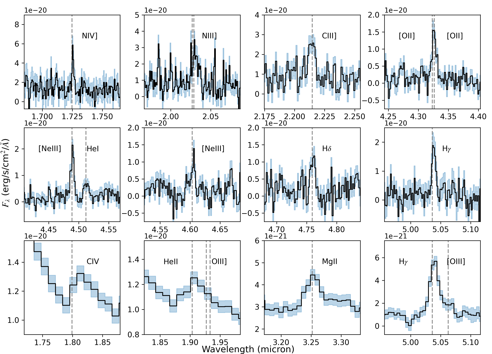
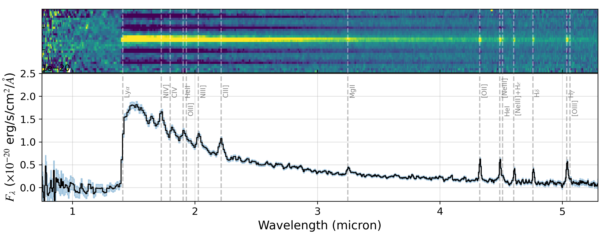
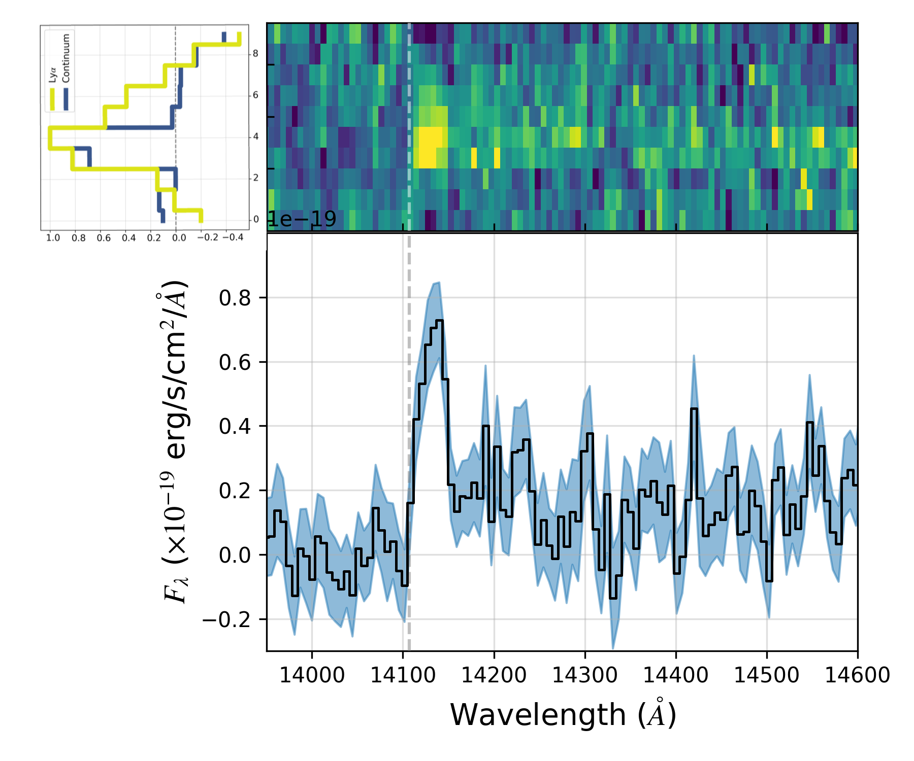

$\newcommand{\ensuremath}{}$
$\newcommand{\xspace}{}$
$\newcommand{\object}[1]{\texttt{#1}}$
$\newcommand{\farcs}{{.}''}$
$\newcommand{\farcm}{{.}'}$
$\newcommand{\arcsec}{''}$
$\newcommand{\arcmin}{'}$
$\newcommand{\ion}[2]{#1#2}$
$\newcommand{\textsc}[1]{\textrm{#1}}$
$\newcommand{\hl}[1]{\textrm{#1}}$
$\newcommand{\footnote}[1]{}$
$\newcommand{\lya}{Ly\alpha}$
$\newcommand{\niii}{N \textsc{iii}]}$
$\newcommand{\niv}{N \textsc{iv}]}$
$\newcommand{\hei}{He \textsc{i}}$
$\newcommand{\heii}{He \textsc{ii}}$
$\newcommand{\ciii}{C \textsc{iii}]}$
$\newcommand{\oii}{[O \textsc{ii}]}$
$\newcommand{\oiii}{[O \textsc{iii}]}$
$\newcommand{\oiiiSF}{O \textsc{iii}]}$
$\newcommand{\neiii}{[Ne \textsc{iii}]}$
$\newcommand{\niiiL}{N \textsc{iii}] \lambda}$
$\newcommand{\nivL}{N \textsc{iv}] \lambda}$
$\newcommand{\ciiiL}{C \textsc{iii}] \lambda}$
$\newcommand{\ciiiLL}{C \textsc{iii}] \lambda\lambda}$
$\newcommand{\civ}{C \textsc{iv}}$
$\newcommand{\oiiL}{[O \textsc{ii}] \lambda\lambda}$
$\newcommand{\oiiiL}{[O \textsc{iii}] \lambda}$
$\newcommand{\oiiiSFL}{O \textsc{iii}] \lambda\lambda}$
$\newcommand{\neiiiL}{[Ne \textsc{iii}] \lambda}$
$\newcommand{\hd}{H \delta}$
$\newcommand{\hg}{H \gamma}$
$\newcommand{\hb}{H \beta}$
$\newcommand{\mgii}{Mg \textsc{ii}}$
$\newcommand{\oiiiau}{[O \textsc{iii}]}$
$\newcommand{\oiiiauL}{[O \textsc{iii}] \lambda}$
$\newcommand{\xhi}{x_{\rm \textsc{hi}}}$
$\newcommand{\jwst}{\emph{JWST}}$
$\newcommand{\flux}{erg s^{-1} cm^{-2}}$
$\newcommand{\kms}{km s^{-1}\xspace}$
$\newcommand{\asec}{^{\prime\prime}}$

$\newcommand{\ensuremath}{}$
$\newcommand{\xspace}{}$
$\newcommand{\object}[1]{\texttt{#1}}$
$\newcommand{\farcs}{{.}''}$
$\newcommand{\farcm}{{.}'}$
$\newcommand{\arcsec}{''}$
$\newcommand{\arcmin}{'}$
$\newcommand{\ion}[2]{#1#2}$
$\newcommand{\textsc}[1]{\textrm{#1}}$
$\newcommand{\hl}[1]{\textrm{#1}}$
$\newcommand{\footnote}[1]{}$
$\newcommand{\lya}{Ly\alpha}$
$\newcommand{\niii}{N \textsc{iii}]}$
$\newcommand{\niv}{N \textsc{iv}]}$
$\newcommand{\hei}{He \textsc{i}}$
$\newcommand{\heii}{He \textsc{ii}}$
$\newcommand{\ciii}{C \textsc{iii}]}$
$\newcommand{\oii}{[O \textsc{ii}]}$
$\newcommand{\oiii}{[O \textsc{iii}]}$
$\newcommand{\oiiiSF}{O \textsc{iii}]}$
$\newcommand{\neiii}{[Ne \textsc{iii}]}$
$\newcommand{\niiiL}{N \textsc{iii}] \lambda}$
$\newcommand{\nivL}{N \textsc{iv}] \lambda}$
$\newcommand{\ciiiL}{C \textsc{iii}] \lambda}$
$\newcommand{\ciiiLL}{C \textsc{iii}] \lambda\lambda}$
$\newcommand{\civ}{C \textsc{iv}}$
$\newcommand{\oiiL}{[O \textsc{ii}] \lambda\lambda}$
$\newcommand{\oiiiL}{[O \textsc{iii}] \lambda}$
$\newcommand{\oiiiSFL}{O \textsc{iii}] \lambda\lambda}$
$\newcommand{\neiiiL}{[Ne \textsc{iii}] \lambda}$
$\newcommand{\hd}{H \delta}$
$\newcommand{\hg}{H \gamma}$
$\newcommand{\hb}{H \beta}$
$\newcommand{\mgii}{Mg \textsc{ii}}$
$\newcommand{\oiiiau}{[O \textsc{iii}]}$
$\newcommand{\oiiiauL}{[O \textsc{iii}] \lambda}$
$\newcommand{\xhi}{x_{\rm \textsc{hi}}}$
$\newcommand{\jwst}{\emph{JWST}}$
$\newcommand{\flux}{erg s^{-1} cm^{-2}}$
$\newcommand{\kms}{km s^{-1}\xspace}$
$\newcommand{\asec}{^{\prime\prime}}$

# JADES NIRSpec Spectroscopy of GN-z11: Lyman-$\alpha$ emission and possible enhanced nitrogen abundance in a $z=10.60$ luminous galaxy

<mark>Appeared on: 2023-02-14</mark> - _Submitted to Astronomy & Astrophysics, 14 pages, 9 figures_

Andrew J. Bunker, et al. -- incl., <mark>Anna de Graaff</mark>, <mark>Hans-Walter Rix</mark>

**Abstract:** We present JADES JWST/NIRSpec spectroscopy of GN-z11, the most luminous candidate $z>10$ Lyman break galaxy in the GOODS-North field with $M_{UV}=-21.5$ . We derive a redshift of $z=10.603$ (lower than previous determinations) based on multiple emission lines in our low and medium resolution spectra over $0.8-5.3 \mu$ m. We significantly detect the continuum and measure a blue rest-UV spectral slope of $\beta=-2.4$ . Remarkably, we see spatially-extended Lyman- $\alpha$ in emission (despite the highly-neutral IGM expected at this early epoch), offset 555 km s $^{-1}$ redward of the systemic redshift. From our measurements of collisionally-excited lines of both low- and high-ionization (including [ O $ii$ ] $\lambda3727$ , [ Ne $iii$ ] $\lambda 3869$ and C $iii$ ] $\lambda1909$ ) we infer a high ionization parameter ( $\log U\sim -2$ ). We detect the rarely-seen N $iv$ ] $\lambda1486$ and N $iii$ ] $\lambda1748$ lines in both our low and medium resolution spectra, with other high ionization lines seen in low resolution spectrum such as He $ii$ (blended with O $iii$ ] ) and C $iv$ (with a possible P-Cygni profile). Based on the observed rest-UV line ratios, we cannot conclusively rule out photoionization from AGN. The high C $iii$ ] /He $ii$ ratios, however, suggest a likely star-formation explanation. If the observed emission lines are powered by star formation, then the strong N $iii$ ] $\lambda1748$ observed may imply an unusually high $N/O$ abundance. Balmer emission lines (H $\gamma$ , H $\delta$ ) are also detected, and if powered by star formation rather than an AGN we infer a star formation rate of $\sim 20-30 M_{\odot} \rm yr^{-1}$ (depending on the IMF) and low dust attenuation. Our NIRSpec spectroscopy confirms that GN-z11 is a remarkable galaxy with extreme properties seen 430 Myr after the Big Bang.

**Figure 7. -** Emission lines seen in GN-z11 from the Medium resolution gratings, apart from the last row that shows line emission from the low resolution prism spectrum. The $\civ$, $\hei$i+$\oii$iSF$\mgii$ and $\oii$iauL$4363$ lines are not detected with high significance in the grating spectra. (*fig:emlines*)

**Figure 6. -** 2D (top) and 1D (bottom) spectra of GN-z11 using PRISM/CLEAR configuration of NIRSpec. Prominent emission lines present in the spectra are marked. The signal to noise ratio (SNR) of the continuum is high and the emission lines are clearly seen in both the 1D and 2D spectra. (*fig:spectrum*)

**Figure 3. -** Zoom in on the $\lya$ emission line in the G140M 1D (lower) and 2D (upper) spectra. The grey dashed line shows the systemic wavelength of the $\lya$ transition. The histogram (top-left) of the $\lya$ spatial profile (yellow) and that of the continuum (blue), shows the $\lya$ emission from GN-z11 is more extended towards the south-west (up in the MSA shutter in this view). (*fig:Lya_zoom*)

