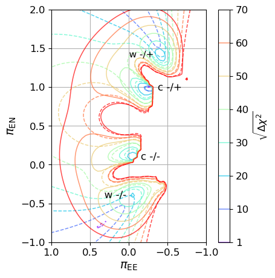
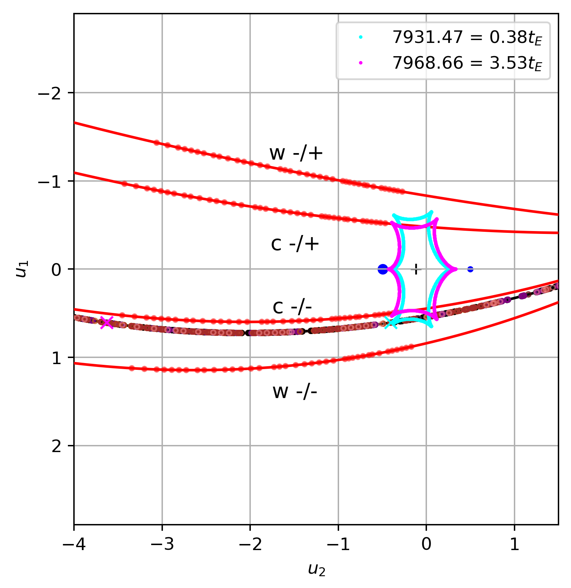
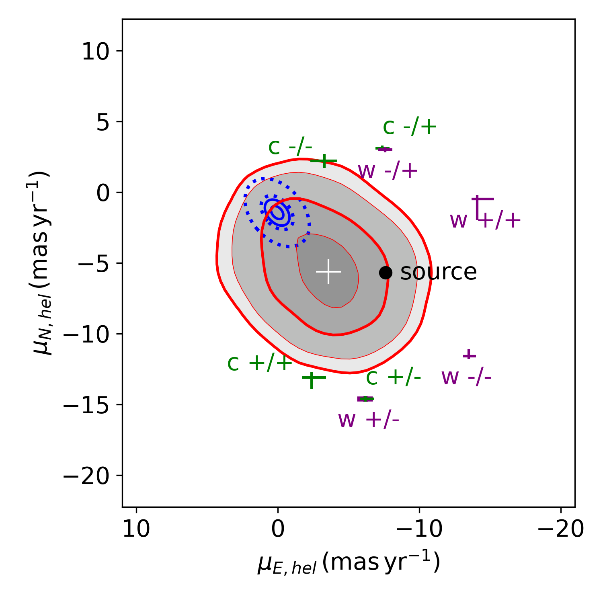
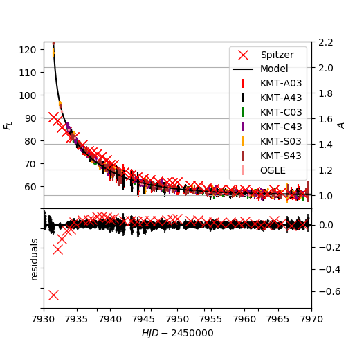

$\newcommand{\ensuremath}{}$
$\newcommand{\xspace}{}$
$\newcommand{\object}[1]{\texttt{#1}}$
$\newcommand{\farcs}{{.}''}$
$\newcommand{\farcm}{{.}'}$
$\newcommand{\arcsec}{''}$
$\newcommand{\arcmin}{'}$
$\newcommand{\ion}[2]{#1#2}$
$\newcommand{\textsc}[1]{\textrm{#1}}$
$\newcommand{\hl}[1]{\textrm{#1}}$
$\newcommand{\footnote}[1]{}$
$\newcommand{\vdag}{(v)^\dagger}$
$\newcommand$
$\newcommand$
$\newcommand$

$\newcommand{\ensuremath}{}$
$\newcommand{\xspace}{}$
$\newcommand{\object}[1]{\texttt{#1}}$
$\newcommand{\farcs}{{.}''}$
$\newcommand{\farcm}{{.}'}$
$\newcommand{\arcsec}{''}$
$\newcommand{\arcmin}{'}$
$\newcommand{\ion}[2]{#1#2}$
$\newcommand{\textsc}[1]{\textrm{#1}}$
$\newcommand{\hl}[1]{\textrm{#1}}$
$\newcommand{\footnote}[1]{}$
$\newcommand{\vdag}{(v)^\dagger}$
$\newcommand$
$\newcommand$
$\newcommand$

# $\large$ OGLE-2017-BLG-1038: A Possible Brown-dwarf Binary Revealed by Spitzer Microlensing Parallax

<mark>Appeared on: 2023-02-15</mark> - _20 pages, 11 figures, 4 tables_

Amber Malpas, et al. -- incl., <mark><mark>Andrew Gould</mark></mark>, <mark><mark>Seung-Lee Kim</mark></mark>, <mark><mark>Chung-Uk Lee</mark></mark>, <mark><mark>Dong-Joo Lee</mark></mark>, <mark><mark>Yongseok Lee</mark></mark>

**Abstract:** We report the analysis of microlensing event OGLE-2017-BLG-1038, observed by the Optical Gravitational Lensing Experiment, Korean Microlensing Telescope Network, and Spitzer telescopes. The event is caused by a giant source star in the Galactic Bulge passing over a large resonant binary lens caustic. The availability of space-based data allows the full set of physical parameters to be calculated.However, there exists an eightfold degeneracy in the parallax measurement. The four best solutions correspond to very-low-mass binaries near ( $M_1 = 170^{+40}_{-50} M_J$ and $M_2 = 110^{+20}_{-30} M_J$ ), or well below ( $M_1 = 22.5^{+0.7}_{-0.4} M_J$ and $M_2 = 13.3^{+0.4}_{-0.3} M_J$ ) the boundary between stars and brown dwarfs.A conventional analysis, with scaled uncertainties for Spitzer data, implies a very-low-mass brown dwarf binary lens at a distance of 2 kpc. Compensating for systematic Spitzer errors using a Gaussian process model suggests that a higher mass M-dwarf binary at 6 kpc is equally likely.A Bayesian comparison based on a galactic model favors the larger-mass solutions.We demonstrate how this degeneracy can be resolved within the next ten years through infrared adaptive-optics imaging with a 40 m class telescope.

**Figure 4. -** *Left*: contour maps demonstrating the results of the parallax grid searches over discretely varied $\pi_{{\rm E},E}$ and $\pi_{{\rm E},N}$ for the $-u_{0,Earth}$ configuration, including only the Spitzer $\chi^2$ components. The dashed contours show the $\chi^2$ landscape without a color constraint and the solid lines with the constraint. Note that the $\pi_{{\rm E},N}$-axis  of this figure is reversed from the usual orientation so that the two figures approximately align. *Right*: caustic diagram with projected ground-based and Spitzer-based trajectories (black and red, respectively).  The four Spitzer trajectories are the result of minimization from the local $\chi^{2}$ minima from the left figure, with all modeling parameters free to evolve.  The data points are represented by colored circles on the trajectories, where the colors correspond to the observation site and field, as specified in Figures \ref{Fig:StaticLC} and \ref{Fig:GroundCumulative}. The caustics change with the orbiting of the lens bodies and are depicted here at the instances of the first and last Spitzer data points, specifically for the c -/+ solution (all four $u_{0,Earth}<0$ solutions looks very diagrammatically similar to the one shown). These epochs are represented on grounds-based trajectory (also from the c -/+ solution) with colours matching their corresponding caustics. (*Fig:RSGrid*)

**Figure 3. -** Proper motions of the lens solutions and source star. For context, we also include contour representations of the disk (blue) and bulge (red) distributions. The bulge contours are from histograms of the red-clump stars from Gaia EDR3, selecting stars within a $0.2^o$ radius cone centred on the lens. The distribution of red-clump stars is the results of a Gaussian fit to the red clump on the field's CMD. The innermost thicker line of the red-clump distribution contains approximately 68\% of the population samples. The outermost thicker line contains approximately  95\% of the population samples. The blue contours depict the theoretical distribution of the disk stars used in our galactic model. The solid ellipses correspond to the 1 and 2 $\sigma$ proper-motion dispersions of disk stars at $D=6$ kpc. The dotted ellipses show the same for disk stars at $D=2.3$ kpc.
 (*F:pm*)

**Figure 1. -** Raw Spitzer light curve and model light curve resulting from the static binary-lens model (no parallax), fitted to the ground-based data, and transforming to the Spitzer flux system assuming $F_{\rm L} \equiv F_{{\rm S},L} A$, where $F_{{\rm S},L} = 56.1$ and $(I - L)_{\rm S} = -7.4$ . The ground-based observations have also been scaled to the Spitzer flux system. The residuals between the model and the data are depicted in black for ground-based data and red for _Spitzer_ data. These show a dramatic difference for the $t<7935$ data.  (*Fig:SpitzerLC*)

