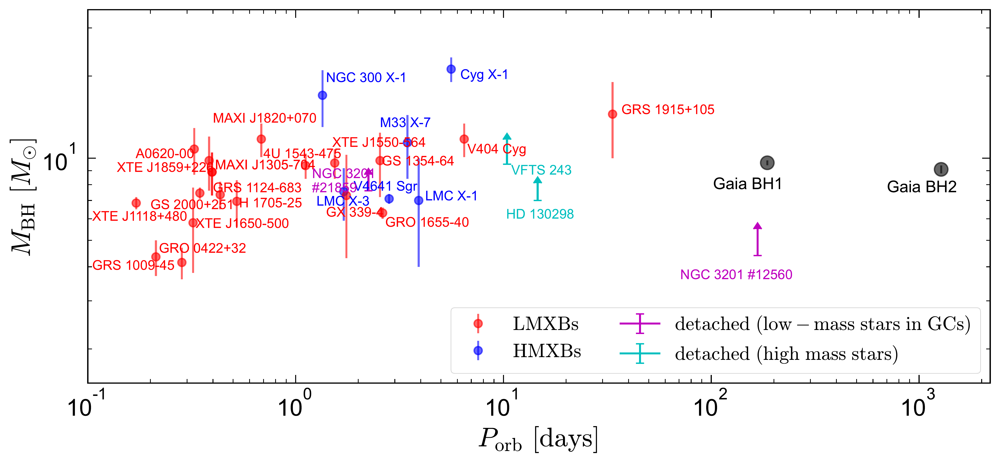
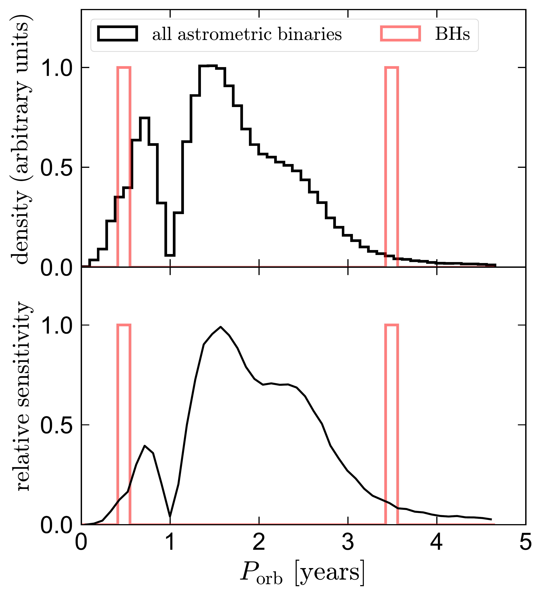
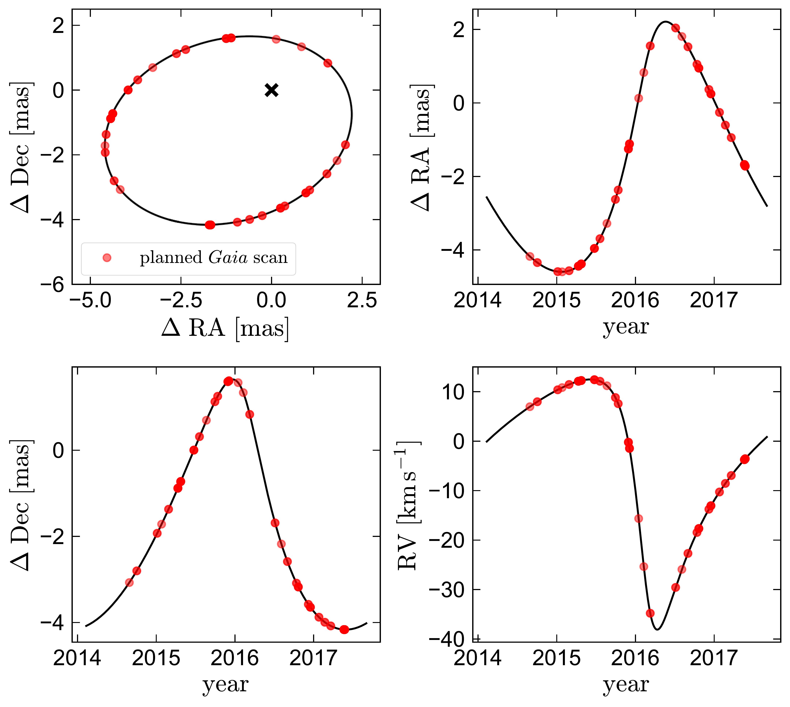

$\newcommand{\ensuremath}{}$
$\newcommand{\xspace}{}$
$\newcommand{\object}[1]{\texttt{#1}}$
$\newcommand{\farcs}{{.}''}$
$\newcommand{\farcm}{{.}'}$
$\newcommand{\arcsec}{''}$
$\newcommand{\arcmin}{'}$
$\newcommand{\ion}[2]{#1#2}$
$\newcommand{\textsc}[1]{\textrm{#1}}$
$\newcommand{\hl}[1]{\textrm{#1}}$
$\newcommand{\kb}[1]{[\color{teal}{KB: #1}]}$
$\newcommand{\red}[1]{\textcolor{red}{#1}}$
$\newcommand{\thebibliography}{\DeclareRobustCommand{\VAN}[3]{##3}\VANthebibliography}$
$\newcommand{\}{mn}$
$\newcommand{\}{mn}$
$\newcommand{\}{mn}$
$\newcommand{\}{mn}$
$\newcommand{\}{mn}$
$\newcommand{\}{mn}$
$\newcommand{\}{mn}$
$\newcommand{\@}{tempa}$
$\newcommand{\@}{tempa }$
$\newcommand{\@}{tempb }$
$\newcommand{\@}{tempc$
$  }$
$\newcommand{\@}{tempb }$

$\newcommand{\ensuremath}{}$
$\newcommand{\xspace}{}$
$\newcommand{\object}[1]{\texttt{#1}}$
$\newcommand{\farcs}{{.}''}$
$\newcommand{\farcm}{{.}'}$
$\newcommand{\arcsec}{''}$
$\newcommand{\arcmin}{'}$
$\newcommand{\ion}[2]{#1#2}$
$\newcommand{\textsc}[1]{\textrm{#1}}$
$\newcommand{\hl}[1]{\textrm{#1}}$
$\newcommand{\kb}[1]{[\color{teal}{KB: #1}]}$
$\newcommand{\red}[1]{\textcolor{red}{#1}}$
$\newcommand{\thebibliography}{\DeclareRobustCommand{\VAN}[3]{##3}\VANthebibliography}$
$\newcommand{\}{mn}$
$\newcommand{\}{mn}$
$\newcommand{\}{mn}$
$\newcommand{\}{mn}$
$\newcommand{\}{mn}$
$\newcommand{\}{mn}$
$\newcommand{\}{mn}$
$\newcommand{\@}{tempa}$
$\newcommand{\@}{tempa }$
$\newcommand{\@}{tempb }$
$\newcommand{\@}{tempc$
$  }$
$\newcommand{\@}{tempb }$

# A red giant orbiting a black hole

<mark>Appeared on: 2023-02-15</mark> - _22 pages, 15 figures. Submitted to MNRAS_

<mark><mark>Kareem El-Badry</mark></mark>, et al. -- incl., <mark><mark>Hans-Walter Rix</mark></mark>, <mark><mark>Eleonora Zari</mark></mark>, <mark><mark>Melissa Hobson</mark></mark>, <mark><mark>Rhys Seeburger</mark></mark>

**Abstract:** We report spectroscopic and photometric follow-up of a dormant black hole (BH) candidate from _ Gaia_ DR3. We show that the system, which we call Gaia BH2, contains a $\sim$ 1 $M_{\odot}$ red giant and a dark companion with mass $M_2 = 8.9\pm 0.3 M_{\odot}$ that is very likely a BH. The orbital period, $P_{\rm orb} = 1277$ days, is much longer than that of any previously studied BH binary. Our radial velocity (RV) follow-up over a 6-month period spans most of the orbit's dynamic range in RV and is in excellent agreement with predictions of the _ Gaia_ solution. UV imaging and high-resolution optical spectra rule out all plausible luminous companions that could explain the orbit. The  star is a bright ( $G=12.3$ ), slightly metal-poor ( $\rm[Fe/H]=-0.22$ ) low-luminosity giant ( $T_{\rm eff}=4600 \rm K$ ; $R = 7.9 R_{\odot}$ ; $\log\left[g/\left({\rm cm s^{-2}}\right)\right] = 2.6$ ). The binary's orbit is moderately eccentric ( $e=0.52$ ). The giant is strongly enhanced in $\alpha-$ elements, with $\rm[\alpha/Fe] = +0.26$ , but the system's Galactocentric orbit is typical of the thin disk. We obtained X-ray and radio nondetections of the source near periastron, which support BH accretion models in which the net accretion rate at the horizon is much lower than the Bondi-Hoyle-Lyttleton rate. At a distance of 1.16 kpc, Gaia BH2 is the second-nearest known BH, after Gaia BH1.  Its orbit -- like that of Gaia BH1 -- seems too wide to have formed through common envelope evolution. Gaia BH1 and BH2 have orbital periods at opposite edges of the _ Gaia_ DR3 sensitivity curve, perhaps hinting at a bimodal intrinsic period distribution for wide BH binaries. Dormant BH binaries like Gaia BH1 and Gaia BH2 likely significantly outnumber their close, X-ray bright cousins, but their formation pathways remain uncertain.

**Figure 6. -** Comparison of Gaia BH1 and BH2 (black points) to other known BHs. Red and blue symbols correspond to accreting BHs with low- and high-mass companions. Magenta symbols show detached binaries in the globular cluster NGC 3201, and cyan points show detached binaries in which the luminous star is a high-mass ($\gtrsim 20 M_{\odot}$) star. Gaia BH2 stands out from the rest of the population most strongly due to its orbital period, which is $7\times$ longer than that of Gaia BH1 and $\sim 1000$ times longer than the periods of typical X-ray binaries. (*fig:bh_pop*)

**Figure 2. -** Orbital period distribution of all astrometric binaries in _ Gaia_ DR3 (black) and Gaia BH1 and BH2 (red). In the bottom panel, we divide the observed period distribution of all astrometric binaries by the expected intrinsic binary period distribution for solar-type stars. This provides an approximate sensitivity function of _ Gaia_ DR3 as a function of orbital period, marginalized over other observables. The two BHs have periods at the long- and short-period edges of the full observed period distribution, where DR3's sensitivity is $\sim 10\times$ lower than at its peak at 1.5 years. This is suggestive of a bimodal intrinsic period distribution, with fewer BHs at periods of 1-3 years. (*fig:porb_distribution*)

**Figure 3. -** Predicted observation times of Gaia BH2 from the _ Gaia_ observation scheduling tool (GOST). Black line shows the best-fit orbit from our combined fit. Red points show the predicted photocenter positions at the times when GOST predicts _ Gaia_ would have observed the source. Note that we do not have access to the actual measured $\Delta \rm RA$, $\Delta \rm Dec$ and $\rm RV$ values; only to the predicted scan times. Further caveats are discussed in the text. (*fig:gost*)

