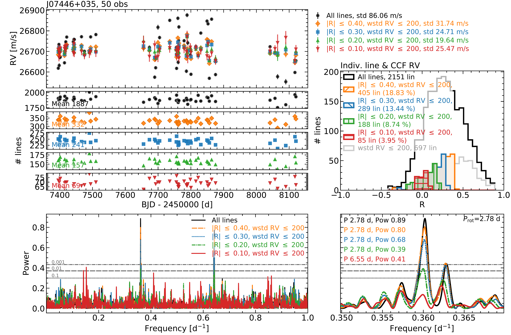
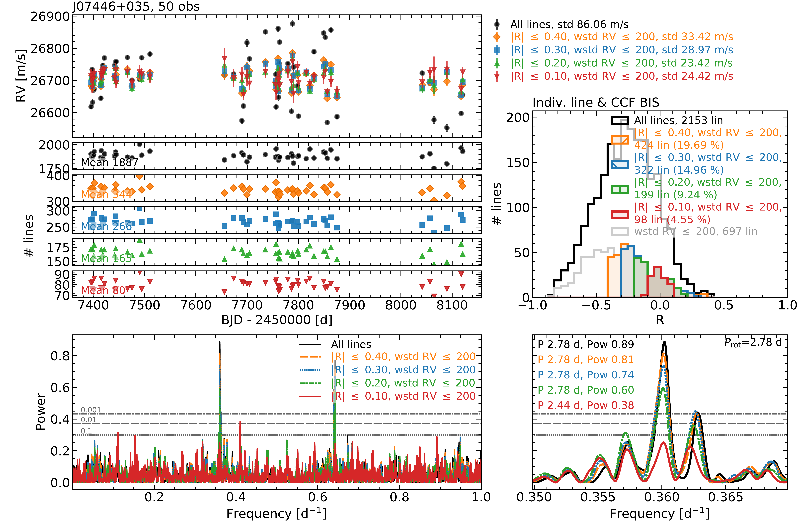
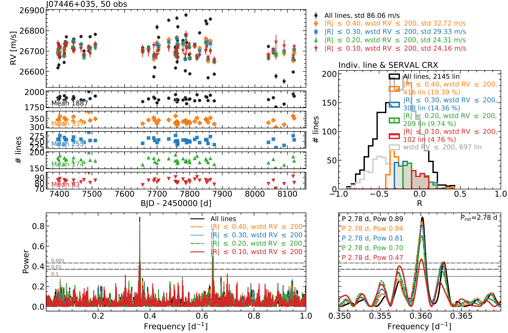

$\newcommand{\ensuremath}{}$
$\newcommand{\xspace}{}$
$\newcommand{\object}[1]{\texttt{#1}}$
$\newcommand{\farcs}{{.}''}$
$\newcommand{\farcm}{{.}'}$
$\newcommand{\arcsec}{''}$
$\newcommand{\arcmin}{'}$
$\newcommand{\ion}[2]{#1#2}$
$\newcommand{\textsc}[1]{\textrm{#1}}$
$\newcommand{\hl}[1]{\textrm{#1}}$
$\newcommand{\footnote}[1]{}$
$\newcommand{çf}{cross-correlation function\xspace}$
$\newcommand{\vsini}{\ensuremath{v \sin{i}}\xspace}$
$\newcommand{\ms}{\ensuremath{\mathrm{m s^{-1}}}\xspace}$
$\newcommand{\kms}{\ensuremath{\mathrm{km s^{-1}}}\xspace}$
$\newcommand{\A}{\ensuremath{\mathrm{Å}}\xspace}$
$\newcommand{\Halpha}{\ensuremath{\mathrm{H\alpha}}\xspace}$
$\newcommand{\CaHK}{\ion{Ca}{II} H\&K\xspace}$
$\newcommand{\pEWHalpha}{pEW\ensuremath{'(\Halpha)}\xspace}$
$\newcommand{\IHalpha}{\ensuremath{I_{\Halpha}}\xspace}$
$\newcommand{\logLHalphaLbol}{\ensuremath{\log(L_{\Halpha}/L_{\mathrm{bol}})}\xspace}$
$\newcommand{\LXLJ}{\ensuremath{L_X/L_J}\xspace}$
$\newcommand{\RHK}{\ensuremath{R'_{\mathrm{HK}}}\xspace}$
$\newcommand{\logRHK}{\ensuremath{\log R'_{\mathrm{HK}}}\xspace}$
$\newcommand{\HeD}{\ion{He}{I} \ensuremath{\mathrm{D_3}}\xspace}$
$\newcommand{\Heten}{\ensuremath{\mathrm{\ion{He}{I}} \lambda10833 \mathrm{Å}}\xspace}$
$\newcommand{\Pabeta}{\ensuremath{\mathrm{Pa}\beta}\xspace}$
$\newcommand{\NaD}{\ensuremath{\mathrm{\ion{Na}{I} D}}\xspace}$
$\newcommand{\Caii}{\ensuremath{\mathrm{\ion{Ca}{II}}}\xspace}$
$\newcommand{\Prot}{\ensuremath{P_{\mathrm{rot}}}\xspace}$
$\newcommand{\Prothalf}{\ensuremath{\frac{1}{2}P_{\mathrm{rot}}}\xspace}$
$\newcommand{\Protthird}{\ensuremath{\frac{1}{3}P_{\mathrm{rot}}}\xspace}$
$\newcommand{\Protalias}{\ensuremath{P_{\mathrm{rot}}\mathrm{ 1 d a.}}\xspace}$
$\newcommand{\Prothalfalias}{\ensuremath{\frac{1}{2}P_{\mathrm{rot}}\mathrm{ 1 d a.}}\xspace}$
$\newcommand{\Protthirdalias}{\ensuremath{\frac{1}{3}P_{\mathrm{rot}}\mathrm{ 1 d a.}}\xspace}$
$\newcommand{\days}{\ensuremath{\mathrm{d}}\xspace}$
$\newcommand{\FAP}{\ensuremath{\mathrm{FAP}}\xspace}$
$\newcommand{\Msun}{\ensuremath{\mathrm{M_{\odot}}}\xspace}$
$\newcommand{\Mearth}{\ensuremath{\mathrm{M_{\oplus}}}\xspace}$
$\newcommand{\Mjup}{\ensuremath{\mathrm{M_{J}}}\xspace}$
$\newcommand{\caracal}{\texttt{caracal}\xspace}$
$\newcommand{\serval}{\texttt{serval}\xspace}$
$\newcommand{\raccoon}{\texttt{raccoon}\xspace}$

$\newcommand{\ensuremath}{}$
$\newcommand{\xspace}{}$
$\newcommand{\object}[1]{\texttt{#1}}$
$\newcommand{\farcs}{{.}''}$
$\newcommand{\farcm}{{.}'}$
$\newcommand{\arcsec}{''}$
$\newcommand{\arcmin}{'}$
$\newcommand{\ion}[2]{#1#2}$
$\newcommand{\textsc}[1]{\textrm{#1}}$
$\newcommand{\hl}[1]{\textrm{#1}}$
$\newcommand{\footnote}[1]{}$
$\newcommand{çf}{cross-correlation function\xspace}$
$\newcommand{\vsini}{\ensuremath{v \sin{i}}\xspace}$
$\newcommand{\ms}{\ensuremath{\mathrm{m s^{-1}}}\xspace}$
$\newcommand{\kms}{\ensuremath{\mathrm{km s^{-1}}}\xspace}$
$\newcommand{\A}{\ensuremath{\mathrm{Å}}\xspace}$
$\newcommand{\Halpha}{\ensuremath{\mathrm{H\alpha}}\xspace}$
$\newcommand{\CaHK}{\ion{Ca}{II} H\&K\xspace}$
$\newcommand{\pEWHalpha}{pEW\ensuremath{'(\Halpha)}\xspace}$
$\newcommand{\IHalpha}{\ensuremath{I_{\Halpha}}\xspace}$
$\newcommand{\logLHalphaLbol}{\ensuremath{\log(L_{\Halpha}/L_{\mathrm{bol}})}\xspace}$
$\newcommand{\LXLJ}{\ensuremath{L_X/L_J}\xspace}$
$\newcommand{\RHK}{\ensuremath{R'_{\mathrm{HK}}}\xspace}$
$\newcommand{\logRHK}{\ensuremath{\log R'_{\mathrm{HK}}}\xspace}$
$\newcommand{\HeD}{\ion{He}{I} \ensuremath{\mathrm{D_3}}\xspace}$
$\newcommand{\Heten}{\ensuremath{\mathrm{\ion{He}{I}} \lambda10833 \mathrm{Å}}\xspace}$
$\newcommand{\Pabeta}{\ensuremath{\mathrm{Pa}\beta}\xspace}$
$\newcommand{\NaD}{\ensuremath{\mathrm{\ion{Na}{I} D}}\xspace}$
$\newcommand{\Caii}{\ensuremath{\mathrm{\ion{Ca}{II}}}\xspace}$
$\newcommand{\Prot}{\ensuremath{P_{\mathrm{rot}}}\xspace}$
$\newcommand{\Prothalf}{\ensuremath{\frac{1}{2}P_{\mathrm{rot}}}\xspace}$
$\newcommand{\Protthird}{\ensuremath{\frac{1}{3}P_{\mathrm{rot}}}\xspace}$
$\newcommand{\Protalias}{\ensuremath{P_{\mathrm{rot}}\mathrm{ 1 d a.}}\xspace}$
$\newcommand{\Prothalfalias}{\ensuremath{\frac{1}{2}P_{\mathrm{rot}}\mathrm{ 1 d a.}}\xspace}$
$\newcommand{\Protthirdalias}{\ensuremath{\frac{1}{3}P_{\mathrm{rot}}\mathrm{ 1 d a.}}\xspace}$
$\newcommand{\days}{\ensuremath{\mathrm{d}}\xspace}$
$\newcommand{\FAP}{\ensuremath{\mathrm{FAP}}\xspace}$
$\newcommand{\Msun}{\ensuremath{\mathrm{M_{\odot}}}\xspace}$
$\newcommand{\Mearth}{\ensuremath{\mathrm{M_{\oplus}}}\xspace}$
$\newcommand{\Mjup}{\ensuremath{\mathrm{M_{J}}}\xspace}$
$\newcommand{\caracal}{\texttt{caracal}\xspace}$
$\newcommand{\serval}{\texttt{serval}\xspace}$
$\newcommand{\raccoon}{\texttt{raccoon}\xspace}$

# The CARMENES search for exoplanets around M dwarfs

<mark>Appeared on: 2023-02-15</mark> - _Accepted for publication in A&A_

M. Lafarga, et al. -- incl., <mark>M. Kürster</mark>

**Abstract:** Radial velocities (RVs) measured from high-resolution stellar spectra are routinely used to detect and characterise orbiting exoplanet companions. The different lines present in stellar spectra are created by several species, which are non-uniformly affected by stellar variability features such as spots or faculae. Stellar variability distorts the shape of the spectral absorption lines from which precise RVs  are measured, posing one of the main problems in the study of exoplanets. In this work we aim to study how the spectral lines present in M dwarfs are independently impacted by stellar activity. We used CARMENES optical spectra of six active early- and mid-type M dwarfs to compute line-by-line RVs and study their correlation with several well-studied proxies of stellar activity. We are able to classify spectral lines based on their sensitivity to activity in five M dwarfs displaying high levels of stellar activity. We further used this line classification to compute RVs with activity-sensitive lines and less sensitive lines, enhancing or mitigating stellar activity effects in the RV time series. For specific sets of the least activity-sensitive lines, the RV scatter decreases by $\sim2$ to 5 times the initial one, depending on the star. Finally, we compare these lines in the different stars analysed, finding the sensitivity to activity to vary from star to star. Despite the high density of lines and blends present in M dwarf stellar spectra, we find that a line-by-line approach is able to deliver precise RVs. Line-by-line RVs are also sensitive to stellar activity effects, and they allow for an accurate selection of activity-insensitive lines to mitigate activity effects in RV. However, we find stellar activity effects to vary in the same insensitive lines from star to star.

**Figure 7. -** Line-by-line results obtained using inactive lines for J07446+035 (YZ CMi). *Top left*: LAV RV time series obtained using RVs of selected inactive individual lines (colour), together with the LAV RV time series obtained using all the lines (black). The lines are selected based on the correlation of their RVs with the total spectrum RV, and their scatter. *Middle left*: Number of lines used to compute the average RV in each observation, for the different selection of lines used in the *top left panel*. *Top right*: Distribution of the Pearson's correlation coefficient R from the correlation between the individual line RVs and the total spectrum RV. The regions in colour indicate the different selection of lines used to compute the RVs of the *top left panel*. Additionally, we show in grey the distribution of R values after applying only the cut in line RV scatter (wstd). *Bottom left*: Periodograms of the RV datasets plotted on the *top left panel*. The horizontal lines correspond to the 0.1, 0.01, and 0.001 FAP levels, respectively. *Bottom right*: Zoom in of the periodogram region around the peak corresponding to the rotation period of the star. The text indicates the period and power of the highest peak of each periodogram. (*fig:tsnhpccfrvinactivebestJ07446+035*)

**Figure 19. -** Same as Fig. \ref{fig:tsnhpccfrvinactivebestJ07446+035}, but using R values from the correlation between the individual line RVs and CCF BIS. (*fig:tsnhpccfbisinactivebestJ07446+035*)

**Figure 20. -** Same as Fig. \ref{fig:tsnhpccfrvinactivebestJ07446+035}, but using R values from the correlation between the individual line RVs and CRX. (*fig:tsnhpservalcrxinactivebestJ07446+035*)

