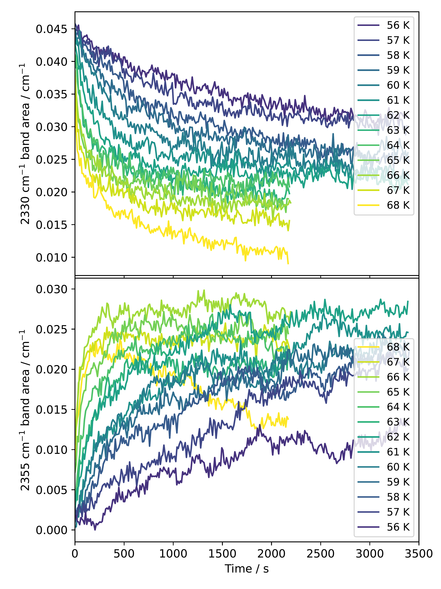

$\newcommand{\ensuremath}{}$
$\newcommand{\xspace}{}$
$\newcommand{\object}[1]{\texttt{#1}}$
$\newcommand{\farcs}{{.}''}$
$\newcommand{\farcm}{{.}'}$
$\newcommand{\arcsec}{''}$
$\newcommand{\arcmin}{'}$
$\newcommand{\ion}[2]{#1#2}$
$\newcommand{\textsc}[1]{\textrm{#1}}$
$\newcommand{\hl}[1]{\textrm{#1}}$
$\newcommand{\footnote}[1]{}$
$\newcommand$

$\newcommand{\ensuremath}{}$
$\newcommand{\xspace}{}$
$\newcommand{\object}[1]{\texttt{#1}}$
$\newcommand{\farcs}{{.}''}$
$\newcommand{\farcm}{{.}'}$
$\newcommand{\arcsec}{''}$
$\newcommand{\arcmin}{'}$
$\newcommand{\ion}[2]{#1#2}$
$\newcommand{\textsc}[1]{\textrm{#1}}$
$\newcommand{\hl}[1]{\textrm{#1}}$
$\newcommand{\footnote}[1]{}$
$\newcommand$

# New measurement of the diffusion of carbon dioxide on non-porous amorphous solid water

<mark>Appeared on: 2023-02-16</mark> - _13 pages, 6 figures_

<mark><mark>Jiao He</mark></mark>, et al. -- incl., <mark><mark>Tushar Suhasaria</mark></mark>

**Abstract:** The diffusion of molecules on interstellar grain surfaces is one of the most important driving forces for the molecular complexity in the interstellar medium. Due to the lack of laboratory measurements, astrochemical modeling of grain surface processes usually assumes a constant ratio between the diffusion energy barrier and the desorption energy. This over-simplification inevitably causes large uncertainty in model predictions. We present a new measurement of the diffusion of CO $_2$ molecules on the surface of non-porous amorphous solid water (np-ASW), an analog of the ice mantle that covers cosmic dust grains. A small coverage of CO $_2$ was deposited onto an np-ASW surface at 40 K, the subsequent warming of the ice activated the diffusion of CO $_2$ molecules, and a transition from isolated CO $_2$ to CO $_2$ clusters was seen in the infrared spectra. To obtain the diffusion energy barrier and pre-exponential factor simultaneously, a set of isothermal experiments were carried out. The values for the diffusion energy barrier and pre-exponential factor were found to be $1300\pm110$ K and $10^{7.6\pm0.8}$ s $^{-1}$ . A comparison with prior laboratory measurements on diffusion is discussed.

**Figure 2. -** Selected RAIRS spectra in the range of the CO$_2$$\nu_3$ mode during the isothermal experiment at different temperatures. Each panel depicts the CO$_2$ absorption peak at various times since the start of an isothermal experiment. The time and temperature of the isotherm are indicated in the figure. The black curves represent the experimental data, while the orange curves represent the fittings made with a sum of two Gaussian functions. (*fig:fitting*)

**Figure 3. -** The band areas of the 2330 and 2355 cm$^{-1}$ components of the CO$_2$ absorption peak during the isothermal evolution at different temperatures. (*fig:bandArea*)

**Figure 5. -** Arrhenius plot $log(k_D)$ over $1/T$, where $k_D$ is the diffusion rate, and $T$ is the isotherm temperature. The linear fitting is shown in orange.  (*fig:arrh*)

