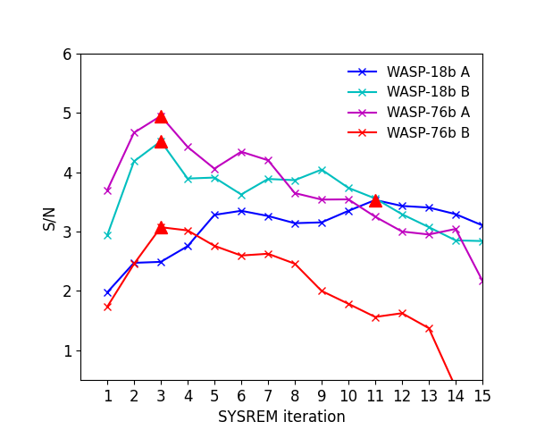
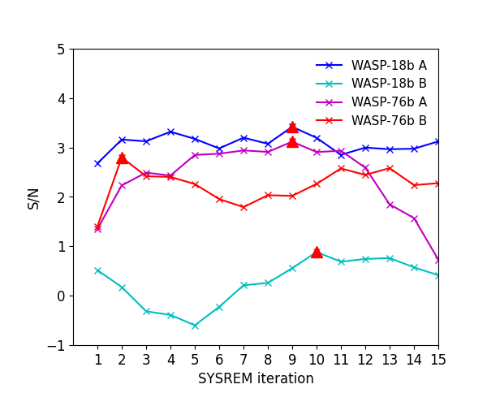
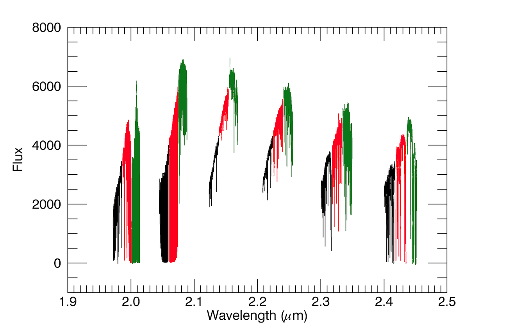

$\newcommand{\ensuremath}{}$
$\newcommand{\xspace}{}$
$\newcommand{\object}[1]{\texttt{#1}}$
$\newcommand{\farcs}{{.}''}$
$\newcommand{\farcm}{{.}'}$
$\newcommand{\arcsec}{''}$
$\newcommand{\arcmin}{'}$
$\newcommand{\ion}[2]{#1#2}$
$\newcommand{\textsc}[1]{\textrm{#1}}$
$\newcommand{\hl}[1]{\textrm{#1}}$

$\newcommand{$\ensuremath$}{}$
$\newcommand{$\xspace$}{}$
$\newcommand{$\object$}[1]{\texttt{#1}}$
$\newcommand{$\farcs$}{{.}''}$
$\newcommand{$\farcm$}{{.}'}$
$\newcommand{$\arcsec$}{''}$
$\newcommand{$\arcmin$}{'}$
$\newcommand{$\ion$}[2]{#1#2}$
$\newcommand{$\textsc$}[1]{\textrm{#1}}$
$\newcommand{$\hl$}[1]{\textrm{#1}}$

#  detection of CO emissions lines and temperature inversions on the dayside of WASP-18b and WASP-76b

<mark>Appeared on: 2023-02-20</mark> - _11 pages, 12 figures; accepted for publication in A&A_

F. Yan, et al. -- incl., <mark>U. Heiter</mark>

**Abstract:** The dayside atmospheres of ultra-hot Jupiters (UHJs) are predicted to possess temperature inversion layers with extremely high temperatures at high altitudes. We observed the dayside thermal emission spectra of WASP-18b and WASP-76b with the new CRIRES$^+$high-resolution spectrograph at near-infrared wavelengths. Using the cross-correlation technique, we detected strong CO emission lines in both planets, which confirms the existence of temperature inversions on their dayside hemispheres.The two planets are the first UHJs orbiting F-type stars with CO emission lines detected; previous detections were mostly for UHJs orbiting A-type stars.Evidence of weak$\mathrm{H_2O}$emission signals is also found for both planets. We further applied forward-model retrievals on the detected CO lines and retrieved the temperature-pressure profiles along with the CO volume mixing ratios. The retrieved logarithmic CO mixing ratio of WASP-18b ($-2.2_{-1.5}^{+1.4}$) is slightly higher than the value predicted by the self-consistent model assuming solar abundance. For WASP-76b, the retrieved CO mixing ratio ($-3.6_{-1.6}^{+1.8}$) is broadly consistent with the value of solar abundance. In addition, we included the equatorial rotation velocity ($\varv_\mathrm{eq}$) in the retrieval when analyzing the line profile broadening. The obtained$\varv_\mathrm{eq}$is$7.0\pm{2.9}$km s$^{-1}$for WASP-18b and$5.2_{-3.0}^{+2.5}$km s$^{-1}$for WASP-76b, which are consistent with the tidally locked rotational velocities.

**Figure 1. -** Detection significance of the CO signal with different \texttt{SYSREM} iteration numbers. The maximum S/N values are marked with the red triangles. The value here is measured at fixed $K_\mathrm{p}$ and at the $\mathrm{\Delta} \varv$ location where the detection signal is the strongest. (*App-sysrem*)

**Figure 2. -** Same as Fig. \ref{App-sysrem}, but for the $\mathrm{H_2O}$ signal. (*App-sysrem-H2O*)

**Figure 3. -** Example of the reduced CRIRES$^+$ spectrum of WASP-76 using the K2148 wavelength setting. The colors represent the three signal detectors. (*spec-demo*)

