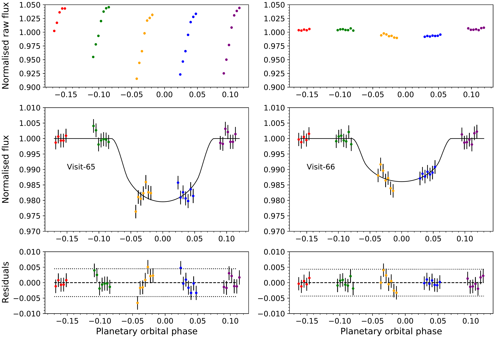
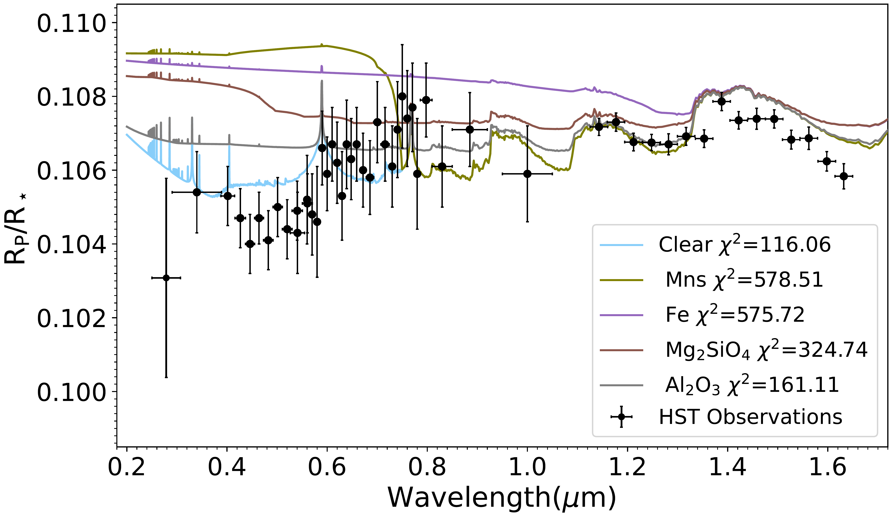
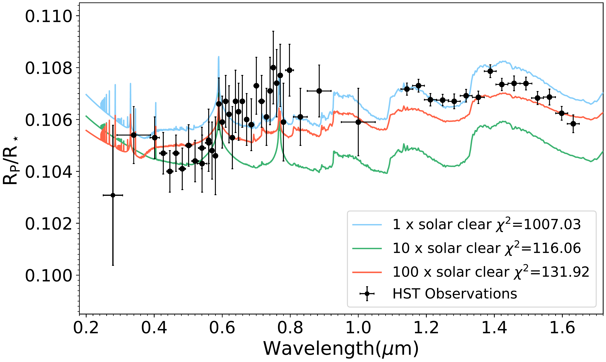
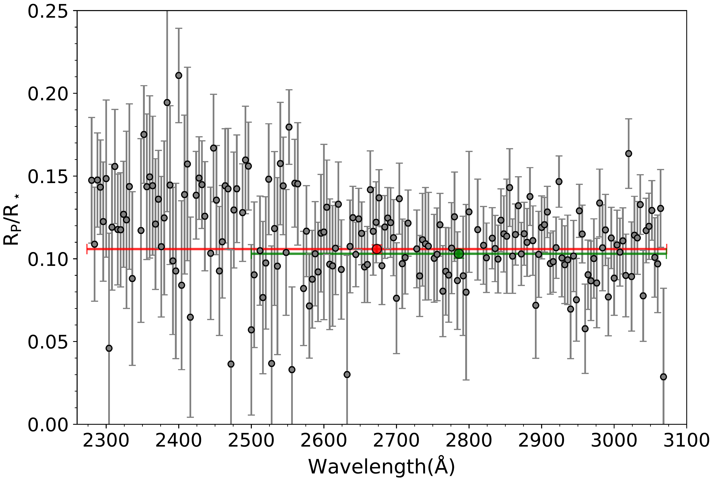

$\newcommand{\ensuremath}{}$
$\newcommand{\xspace}{}$
$\newcommand{\object}[1]{\texttt{#1}}$
$\newcommand{\farcs}{{.}''}$
$\newcommand{\farcm}{{.}'}$
$\newcommand{\arcsec}{''}$
$\newcommand{\arcmin}{'}$
$\newcommand{\ion}[2]{#1#2}$
$\newcommand{\textsc}[1]{\textrm{#1}}$
$\newcommand{\hl}[1]{\textrm{#1}}$
$\newcommand{\footnote}[1]{}$
$\newcommand{\vdag}{(v)^\dagger}$

$\newcommand{\ensuremath}{}$
$\newcommand{\xspace}{}$
$\newcommand{\object}[1]{\texttt{#1}}$
$\newcommand{\farcs}{{.}''}$
$\newcommand{\farcm}{{.}'}$
$\newcommand{\arcsec}{''}$
$\newcommand{\arcmin}{'}$
$\newcommand{\ion}[2]{#1#2}$
$\newcommand{\textsc}[1]{\textrm{#1}}$
$\newcommand{\hl}[1]{\textrm{#1}}$
$\newcommand{\footnote}[1]{}$
$\newcommand{\vdag}{(v)^\dagger}$

# The Hubble PanCET program: $\The near-ultraviolet transmission spectrum of WASP-79b$

<mark>Appeared on: 2023-02-17</mark> - _Accepted for publication January 31, 2023 in the Journal Astronomy & Astrophysics_

A. Gressier, et al. -- incl., <mark>T. Mikal-Evans</mark>

**Abstract:** We present Hubble Space Telescope (HST) transit observations of the Hot-Jupiter WASP-79 b acquired with the Space Telescope Imaging Spectrograph (STIS) in the near ultraviolet (NUV). Two transit observations, part of the PanCET program, are used to obtain the transmission spectra of the planet between 2280 and 3070 $\text{Å}$ .        We correct for systematic effects in the raw data using the jitter engineering parameters and polynomial modelling to fit the white light curves of the two transits.        We observe an increase in the planet-to-star radius ratio at short wavelengths, but no spectrally resolved absorption lines. The difference between the radius ratios at 2400 $\text{Å}$ and 3000 $\text{Å}$ reaches $0.0191\pm0.0042$ ( $\sim$ 4.5 $-\sigma$ ).        Although the NUV transmission spectrum does not show evidence of hydrodynamical escape,        the strong atmospheric features are likely due to species at very high altitudes. We performed a 1D simulation of the temperature and composition of WASP-79 b using Exo-REM.        The temperature pressure profile crosses condensation curves of radiatively active clouds, particularly MnS, Mg $_2$ SiO $_4$ , Fe, and Al $_2$ O $_3$ . Still, none of these species produces the level of observed absorption at short wavelengths and can explain the observed increase in the planet's radius.        WASP-79 b's transit depth reaches 23 scale height, making it one of the largest spectral features observed in an exoplanet at this temperature ( $\sim$ 1700 K).        The comparison of WASP-79 b's transmission spectrum with three warmer hot Jupiters shows a similar level of absorption to WASP-178 b and WASP-121 b between 0.2 and 0.3 $\mu$ m, while HAT-P-41 b's spectrum is flat. The features could be explained by SiO absorption.

**Figure 9. -** WASP-79b white light curves for visit \#65 (left) and \#66 (right). Top: Normalised raw light curves. Middle: Flux corrected from systematic errors and fitted with a transit model.
Bottom: Residuals between the flux corrected spectra, the best-fit models, and 2-$\rm \sigma$ error bars (dotted line). Visit \#65's raw data display a large ramp effect compared to visit \#66. This ramp is mainly correlated to the HST orbital phase. (*fig:1wlc*)

**Figure 6. -** WASP-79b HST transmission spectrum observations (black) and simulated spectra using Exo-REM (colours). WASP-79 b atmosphere is simulated using a 10 x solar metallicity and an interior temperature of 600 K, and we include different clouds (top). We also tested a clear atmosphere while changing the metallicity of the atmosphere (bottom). (*fig6:exorem_simulations*)

**Figure 3. -** WASP-79b NUV transmission spectra in 4\text{Å} bins for visit \#66. We indicate the overall NUV transmission spectrum (white light curve) R$_{\rm P}$/R$_{\rm\star}$(NUV) = 0.1059 in red, along with the planet-to-star radius ratio after 2500(Å) in green R$_{\rm P}$/R$_{\rm\star}$(>2500Å) = 0.1031.  (*fig:3spectralbins*)

