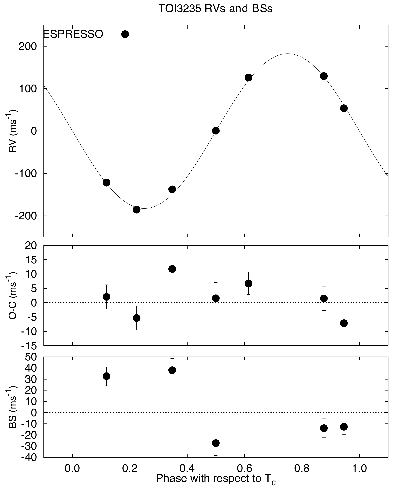
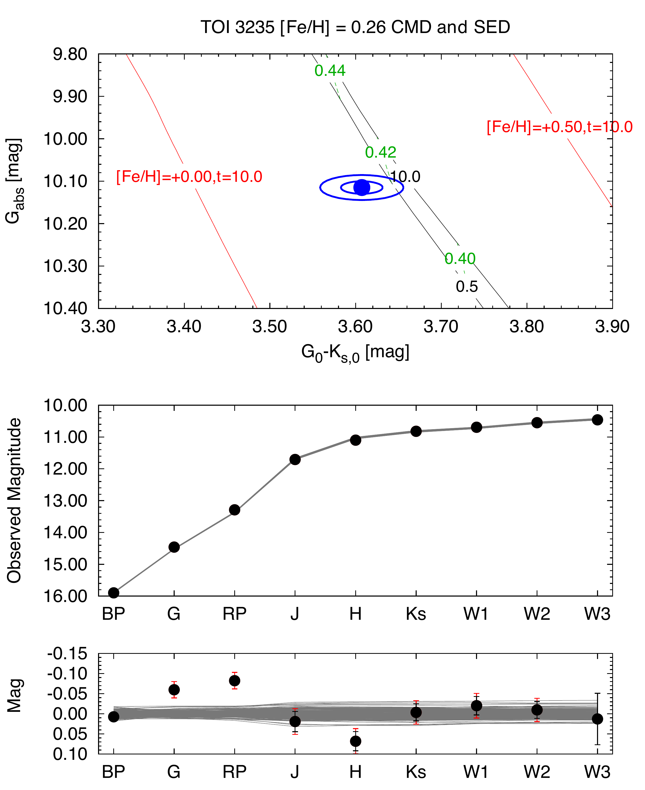

$\newcommand{\ensuremath}{}$
$\newcommand{\xspace}{}$
$\newcommand{\object}[1]{\texttt{#1}}$
$\newcommand{\farcs}{{.}''}$
$\newcommand{\farcm}{{.}'}$
$\newcommand{\arcsec}{''}$
$\newcommand{\arcmin}{'}$
$\newcommand{\ion}[2]{#1#2}$
$\newcommand{\textsc}[1]{\textrm{#1}}$
$\newcommand{\hl}[1]{\textrm{#1}}$
$\newcommand{\footnote}[1]{}$
$\newcommand{\forloop}[5][1]$
$\newcommand{\tbd}[1]{{\par\bf\textsc{TBD: #1\\}}}$
$\newcommand{\ctbd}[1]$
$\newcommand{\cor}{\textcolor{red}{(corr?) }}$
$\newcommand{\spl}{\textcolor{red}{(spl?) }}$
$\newcommand{\ii}{í }$
$\newcommand{\oo}{\H{o}}$
$\newcommand{\uu}{\H u}$
$\newcommand{\lc}{light curve}$
$\newcommand{\lcs}{light curves}$
$\newcommand{\Lc}{Light curve}$
$\newcommand{\Lcs}{Light curves}$
$\newcommand{\avg}[1]{\ensuremath{\langle #1\rangle}}$
$\newcommand{\med}[1]{\ensuremath{\langle #1\rangle_{med}}}$
$\newcommand{\dpt}{data-point}$
$\newcommand{\dpts}{data-points}$
$\newcommand{\tel}{telescope}$
$\newcommand{\magn}{magnitude}$
$\newcommand{\stan}{standard}$
$\newcommand{\aper}{aperture}$
$\newcommand{\oot}{out-of-transit}$
$\newcommand{\OOT}{Out-of-Transit}$
$\newcommand{\cfa}{Harvard-Smithsonian Center for Astrophysics (CfA)}$
$\newcommand{\cfadigi}{CfA Speedometers}$
$\newcommand{\cmd}{color-magnitude diagram}$
$\newcommand{\conc}[1]{\noindent\par{\noindent{\mathbf \Longrightarrow \bf #1}}}$
$\newcommand{\diam}{\ensuremath{\oslash}}$
$\newcommand{çdsize}[1]{\ensuremath{\rm #1\times\rm#1}}$
$\newcommand{\fovsize}[2]{\ensuremath{\rm #1 #2\times\rm#1 #2}}$
$\newcommand{\tsize}[1]{\mbox{\rm #1 m}}$
$\newcommand{\band}[1]{\ensuremath{#1}~band}$
$\newcommand{\ordo}{\ensuremath{\mathcal{O}}}$
$\newcommand{\chisq}{\ensuremath{\chi^2}}$
$\newcommand{\RA}[3]{\ensuremath{#1^{\mathrm h}#2^{\mathrm m}#3^{\mathrm s}}}$
$\newcommand{\DEC}[3]{\ensuremath{#1^{\mathrm d}#2^{\mathrm m}#3^{\mathrm s}}}$
$\newcommand{\ghr}{\ensuremath{^h}}$
$\newcommand{\gmin}{\ensuremath{^m}}$
$\newcommand{\Ks}{\ensuremath{K_s}}$
$\newcommand{\masy}{\ensuremath{\rm mas yr^{-1}}}$
$\newcommand{\kms}{\ensuremath{\rm km s^{-1}}}$
$\newcommand{\ms}{\ensuremath{\rm m s^{-1}}}$
$\newcommand{\msd}{\ensuremath{\rm m s^{-1} d^{-1}}}$
$\newcommand{\mss}{\ensuremath{\rm m s^{-2}}}$
$\newcommand{\gcmc}{\ensuremath{\rm g cm^{-3}}}$
$\newcommand{\ergscmsq}{\ensuremath{\rm erg s^{-1} cm^{-2}}}$
$\newcommand{\C}{\ensuremath{^{\circ}C\;}}$
$\newcommand{\el}{\ensuremath{e^-}}$
$\newcommand{\sqarcsec}{\ensuremath{\Box^{\prime\prime}}}$
$\newcommand{\sqarcdeg}{\ensuremath{\Box^{\circ}}}$
$\newcommand{\pxs}{\ensuremath{\rm \arcsec pixel^{-1}}}$
$\newcommand{\aduel}{\ensuremath{\lbrack ADU/\el \rbrack}}$
$\newcommand{\eladu}{\ensuremath{\lbrack \el/ADU \rbrack}}$
$\newcommand{\adupixs}{\ensuremath{\rm ADU/(pix  s)}}$
$\newcommand{\elpixs}{\ensuremath{\rm \el/(pix  s)}}$
$\newcommand{\masyr}{\ensuremath{\rm mas yr^{-1}}}$
$\newcommand{\msini}{\ensuremath{m \sin i}}$
$\newcommand{\mplsini}{\ensuremath{\mpl\sin i}}$
$\newcommand{\teff}{\ensuremath{T_{\rm eff}}}$
$\newcommand{\logg}{\ensuremath{\log{g}}}$
$\newcommand{\vsini}{\ensuremath{v \sin{i}}}$
$\newcommand{\feh}{\ensuremath{\rm[Fe/H]}}$
$\newcommand{\logl}{\ensuremath{\log{L}}}$
$\newcommand{\vmac}{\ensuremath{v_{\rm mac}}}$
$\newcommand{\vmic}{\ensuremath{v_{\rm mic}}}$
$\newcommand{\rhk}{\ensuremath{R^{\prime}_{\rm HK}}}$
$\newcommand{\logrhk}{\ensuremath{\log\rhk}}$
$\newcommand{\Savg}{\ensuremath{\langle S\rangle}}$
$\newcommand{\vic}{\ensuremath{V\!-\!I_C}}$
$\newcommand{\ebv}{\ensuremath{E(B\!-\!V)}}$
$\newcommand{\rsun}{\ensuremath{R_\sun}}$
$\newcommand{\msun}{\ensuremath{M_\sun}}$
$\newcommand{\lsun}{\ensuremath{L_\sun}}$
$\newcommand{\loglsun}{\ensuremath{\log{L_\sun}}}$
$\newcommand{\teffsun}{\ensuremath{T_{eff,\sun}}}$
$\newcommand{\rhosun}{\ensuremath{\rho_\sun}}$
$\newcommand{\loggsun}{\ensuremath{\log{g_{\sun}}}}$
$\newcommand{\rstar}{\ensuremath{R_\star}}$
$\newcommand{\mstar}{\ensuremath{M_\star}}$
$\newcommand{\lstar}{\ensuremath{L_\star}}$
$\newcommand{\astar}{\ensuremath{a_\star}}$
$\newcommand{\loglstar}{\ensuremath{\log{L_\star}}}$
$\newcommand{\teffstar}{\ensuremath{T_{\rm eff\star}}}$
$\newcommand{\rhostar}{\ensuremath{\rho_\star}}$
$\newcommand{\loggstar}{\ensuremath{\log{g_{\star}}}}$
$\newcommand{\rearth}{\ensuremath{R_\earth}}$
$\newcommand{\mearth}{\ensuremath{M_\earth}}$
$\newcommand{\learth}{\ensuremath{L_\earth}}$
$\newcommand{\teffearth}{\ensuremath{T_{\rm eff,\earth}}}$
$\newcommand{\rhoearth}{\ensuremath{\rho_\earth}}$
$\newcommand{\rpl}{\ensuremath{R_{p}}}$
$\newcommand{\mpl}{\ensuremath{M_{p}}}$
$\newcommand{\lpl}{\ensuremath{L_{p}}}$
$\newcommand{\teffpl}{\ensuremath{T_{\rm eff,{p}}}}$
$\newcommand{\rhopl}{\ensuremath{\rho_{p}}}$
$\newcommand{\ipl}{\ensuremath{i_{p}}}$
$\newcommand{\epl}{\ensuremath{e_{p}}}$
$\newcommand{\gpl}{\ensuremath{g_{p}}}$
$\newcommand{\loggpl}{\ensuremath{\log g_{p}}}$
$\newcommand{\arstar}{\ensuremath{a/\rstar}}$
$\newcommand{\zrstar}{\ensuremath{\zeta/\rstar}}$
$\newcommand{\rjup}{\ensuremath{R_{\rm J}}}$
$\newcommand{\mjup}{\ensuremath{M_{\rm J}}}$
$\newcommand{\ljup}{\ensuremath{L_{\rm J}}}$
$\newcommand{\teffjup}{\ensuremath{T_{eff,{\rm J}}}}$
$\newcommand{\rhojup}{\ensuremath{\rho_{\rm J}}}$
$\newcommand{\gjup}{\ensuremath{\g_{\rm J}}}$
$\newcommand{\rjuplong}{\ensuremath{R_{\rm Jup}}}$
$\newcommand{\mjuplong}{\ensuremath{M_{\rm Jup}}}$
$\newcommand{\ljuplong}{\ensuremath{L_{\rm Jup}}}$
$\newcommand{\teffjuplong}{\ensuremath{T_{eff,{\rm Jup}}}}$
$\newcommand{\rhojuplong}{\ensuremath{\rho_{\rm Jup}}}$
$\newcommand{\gjuplong}{\ensuremath{\g_{\rm Jup}}}$
$\newcommand{\pack}[1]{\textsc{\lowercase{#1}}}$
$\newcommand{\prog}[1]{\texttt{\lowercase{#1}}}$
$\newcommand{\iraf}{\pack{iraf}}$
$\newcommand{\todcor}{\prog{todcor}}$
$\newcommand{\xcsao}{\prog{xcsao}}$
$\newcommand{\daophot}{\pack{daophot}}$
$\newcommand{\fihat}{\pack{fihat}}$
$\newcommand{\fistar}{\prog{fistar}}$
$\newcommand{\fiphot}{\prog{fiphot}}$
$\newcommand{\grmatch}{\prog{grmatch}}$
$\newcommand{\grtrans}{\prog{grtrans}}$
$\newcommand{\refp}[1]{p.~\pageref{#1}}$
$\newcommand{\reffig}[1]{Fig.~\ref{fig:#1}}$
$\newcommand{\refsec}[1]{\mbox{\S \ref{sec:#1}}}$
$\newcommand{\refeq}[1]{Eq.~\ref{eq:#1}}$
$\newcommand{\reftab}[1]{Tab.~\ref{tab:#1}}$
$\newcommand{\reffigl}[1]{Figure~\ref{fig:#1}}$
$\newcommand{\refsecl}[1]{\mbox{Section \ref{sec:#1}}}$
$\newcommand{\refeql}[1]{Equation~\ref{eq:#1}}$
$\newcommand{\reftabl}[1]{Table~\ref{tab:#1}}$
$\newcommand{\reffigp}[1]{\reffig{#1} on \pref{fig:#1}}$
$\newcommand{\refsecp}[1]{\refsec{#1} on \pref{sec:#1}}$
$\newcommand{\refeqp}[1]{\refeq{#1} on \pref{eq:#1}}$
$\newcommand{\reftabp}[1]{\reftab{#1} on \pref{tab:#1}}$
$\newcommand{\reffigls}[2]{Figures~\ref{fig:#1}-\ref{fig:#2}}$
$\newcommand{\reftabls}[2]{Tables~\ref{tab:#1}-\ref{tab:#2}}$
$\newcommand{\flwof}{\mbox{FLWO 1.2 m}}$
$\newcommand{\flwos}{\mbox{FLWO 1.5 m}}$
$\newcommand{\flwot}{\mbox{TopHAT 0.25 m}}$
$\newcommand{\mmt}{\mbox{MMT 6.5 m}}$
$\newcommand{\ssts}{{\em Spitzer}}$
$\newcommand{\sstL}{{\em Spitzer Space Telescope}}$
$\newcommand{\hst}{{\em HST}}$
$\newcommand{\wom}{\mbox{Wise 1 m}}$
$\newcommand{\piszkessch}{Konkoly 0.6 m Schmidt}$
$\newcommand{\piszkesrcc}{Konkoly 1 m RCC}$
$\newcommand{\dscu}{\mbox{\delta Scuti}}$
$\newcommand{\gdor}{\mbox{\gamma Dor}}$
$\newcommand{\hj}{hot Jupiter}$
$\newcommand{\vhj}{very hot Jupiter}$
$\newcommand{\hd}[1]{\mbox{HD #1}}$
$\newcommand{\BD}[1]{\mbox{BD #1}}$
$\newcommand{\hip}[1]{\mbox{HIP #1}}$
$\newcommand{\gj}[1]{\mbox{GJ #1}}$
$\newcommand{\tbn}[1]{\tablenotemark{#1}}$
$\newcommand{\hatcurhtr}{TOI-3235}$
$\newcommand{\hatcurfield}{\ensuremath{string}}$
$\newcommand{\hatcurCCra}{\ensuremath{13^{\mathrm h}49^{\mathrm m}53.9777{\mathrm s}}}$
$\newcommand{\hatcurCCdec}{\ensuremath{-46{\arcdeg}03{\arcmin}58.4541{\arcsec}}}$
$\newcommand{\hatcurCCmag}{NULL}$
$\newcommand{\hatcurCCtwomass}{2MASS~13495398-4603583}$
$\newcommand{\hatcurCCgsc}{GSC~NULL}$
$\newcommand{\hatcurCCgaia}{GAIA~6107144260247338240}$
$\newcommand{\hatcurCCgaiadrtwo}{GAIA~DR2~6107144260251920000}$
$\newcommand{\hatcurCCgaiadrthree}{GAIA~DR3~6107144260251920000}$
$\newcommand{\hatcurTICID}{TIC~243641947}$
$\newcommand{\hatcurCCtassmv}{\ensuremath{nff\pmnff}}$
$\newcommand{\hatcurCCtassmvshort}{\ensuremath{0.0}}$
$\newcommand{\hatcurCCtassmB}{\ensuremath{nff\pmnff}}$
$\newcommand{\hatcurCCtassmBshort}{\ensuremath{0.0}}$
$\newcommand{\hatcurCCtassmI}{\ensuremath{nff\pmnff}}$
$\newcommand{\hatcurCCtassmIshort}{\ensuremath{0.0}}$
$\newcommand{\hatcurCCtassmg}{\ensuremath{nff\pmnff}}$
$\newcommand{\hatcurCCtassmgshort}{\ensuremath{0.0}}$
$\newcommand{\hatcurCCtassmr}{\ensuremath{nff\pmnff}}$
$\newcommand{\hatcurCCtassmrshort}{\ensuremath{0.0}}$
$\newcommand{\hatcurCCtassmi}{\ensuremath{nff\pmnff}}$
$\newcommand{\hatcurCCtassmishort}{\ensuremath{0.0}}$
$\newcommand{\hatcurCCparallax}{\ensuremath{13.781\pm0.027}}$
$\newcommand{\hatcurCCgaiamG}{\ensuremath{14.4605\pm0.0028}}$
$\newcommand{\hatcurCCgaiamBP}{\ensuremath{15.9000\pm0.0042}}$
$\newcommand{\hatcurCCgaiamRP}{\ensuremath{13.2881\pm0.0038}}$
$\newcommand{\hatcurCCgaiamGthree}{\ensuremath{14.4605\pm0.0028}}$
$\newcommand{\hatcurCCgaiamBPthree}{\ensuremath{15.9000\pm0.0042}}$
$\newcommand{\hatcurCCgaiamRPthree}{\ensuremath{13.2881\pm0.0038}}$
$\newcommand{\hatcurCCtwomassJmag}{\ensuremath{11.706\pm0.025}}$
$\newcommand{\hatcurCCtwomassHmag}{\ensuremath{11.099\pm0.024}}$
$\newcommand{\hatcurCCtwomassKmag}{\ensuremath{10.819\pm0.021}}$
$\newcommand{\hatcurCCcitJmag}{\ensuremath{11.695\pm0.026}}$
$\newcommand{\hatcurCCcitHmag}{\ensuremath{11.088\pm0.026}}$
$\newcommand{\hatcurCCcitKmag}{\ensuremath{10.843\pm0.022}}$
$\newcommand{\hatcurCCbbJmag}{\ensuremath{11.787\pm0.029}}$
$\newcommand{\hatcurCCbbHmag}{\ensuremath{11.116\pm0.026}}$
$\newcommand{\hatcurCCbbKmag}{\ensuremath{10.863\pm0.022}}$
$\newcommand{\hatcurCCesoJmag}{\ensuremath{11.796\pm0.033}}$
$\newcommand{\hatcurCCesoHmag}{\ensuremath{11.118\pm0.047}}$
$\newcommand{\hatcurCCesoKmag}{\ensuremath{10.859\pm0.024}}$
$\newcommand{\hatcurCCesoJHmag}{\ensuremath{0.678\pm0.054}}$
$\newcommand{\hatcurCCesoJKmag}{\ensuremath{0.936\pm0.038}}$
$\newcommand{\hatcurCCesoHKmag}{\ensuremath{0.258\pm0.051}}$
$\newcommand{\hatcurCCWonemag}{\ensuremath{10.694\pm0.023}}$
$\newcommand{\hatcurCCWtwomag}{\ensuremath{10.548\pm0.021}}$
$\newcommand{\hatcurCCWthreemag}{\ensuremath{10.458\pm0.064}}$
$\newcommand{\hatcurCCWfourmag}{\ensuremath{nff\pmnff}}$
$\newcommand{\hatcurLCdip}{\ensuremath{0.1}}$
$\newcommand{\hatcurLCrprstar}{\ensuremath{0.2828\pm0.0016}}$
$\newcommand{\hatcurLCbsq}{\ensuremath{0.261_{-0.012}^{+0.012}}}$
$\newcommand{\hatcurLCimp}{\ensuremath{0.511_{-0.012}^{+0.011}}}$
$\newcommand{\hatcurLCzeta}{\ensuremath{44.41\pm0.32}}$
$\newcommand{\hatcurLCdur}{\ensuremath{0.06165\pm0.00021}}$
$\newcommand{\hatcurLCdurshort}{\ensuremath{0.0616}}$
$\newcommand{\hatcurLCdurhr}{\ensuremath{1.4795\pm0.0049}}$
$\newcommand{\hatcurLCdurhrshort}{\ensuremath{1.480}}$
$\newcommand{\hatcurLCq}{\ensuremath{0.023800\pm0.000086}}$
$\newcommand{\hatcurLCqshort}{\ensuremath{0.024}}$
$\newcommand{\hatcurLCingdur}{\ensuremath{0.01765\pm0.00030}}$
$\newcommand{\hatcurLCP}{\ensuremath{2.59261842\pm0.00000041}}$
$\newcommand{\hatcurLCPprec}{\ensuremath{2.5926184}}$
$\newcommand{\hatcurLCPshort}{\ensuremath{2.5926}}$
$\newcommand{\hatcurLCT}{\ensuremath{2459690.001730\pm0.000045}}$
$\newcommand{\hatcurLCTA}{\ensuremath{2457797.39028\pm0.00028}}$
$\newcommand{\hatcurLCTB}{\ensuremath{2459762.595048\pm0.000053}}$
$\newcommand{\hatcurLChatnetmA}{\ensuremath{13.62811\pm0.00072}}$
$\newcommand{\hatcurLCiblendA}{\ensuremath{0.982\pm0.022}}$
$\newcommand{\hatcurLChatnetmB}{\ensuremath{13.63138\pm0.00053}}$
$\newcommand{\hatcurLCiblendB}{\ensuremath{0.957\pm0.027}}$
$\newcommand{\hatcurLChatnetmC}{\ensuremath{-7.03640\pm0.00011}}$
$\newcommand{\hatcurLCiblendC}{\ensuremath{1.084\pm0.011}}$
$\newcommand{\hatcurLChatnetmD}{\ensuremath{-6.996030\pm0.000084}}$
$\newcommand{\hatcurLCiblendD}{\ensuremath{1.1248\pm0.0088}}$
$\newcommand{\hatcurLCrho}{\ensuremath{10.99\pm0.13}}$
$\newcommand{\hatcurSMEiteff}{\ensuremath{3196\pm67}}$
$\newcommand{\hatcurSMEizfeh}{\ensuremath{-0.02\pm0.10}}$
$\newcommand{\hatcurSMEizfehshort}{\ensuremath{-0.02}}$
$\newcommand{\hatcurSMEilogg}{\ensuremath{4.80\pm0.50}}$
$\newcommand{\hatcurSMEivsin}{\ensuremath{0\pm50}}$
$\newcommand{\hatcurSMEivmac}{\ensuremath{nff\pmnff}}$
$\newcommand{\hatcurSMEivmic}{\ensuremath{nff\pmnff}}$
$\newcommand{\hatcurextraerrMJ}{\ensuremath{0\pm0}}$
$\newcommand{\hatcurextraerrMJtwosiglim}{\ensuremath{<0.0200}}$
$\newcommand{\hatcurextraerrMH}{\ensuremath{0\pm0}}$
$\newcommand{\hatcurextraerrMHtwosiglim}{\ensuremath{<0.0200}}$
$\newcommand{\hatcurextraerrMKs}{\ensuremath{0\pm0}}$
$\newcommand{\hatcurextraerrMKstwosiglim}{\ensuremath{<0.0200}}$
$\newcommand{\hatcurextraerrMG}{\ensuremath{0\pm0}}$
$\newcommand{\hatcurextraerrMGtwosiglim}{\ensuremath{<0.0200}}$
$\newcommand{\hatcurextraerrMRP}{\ensuremath{0\pm0}}$
$\newcommand{\hatcurextraerrMRPtwosiglim}{\ensuremath{<0.0200}}$
$\newcommand{\hatcurextraerrMWone}{\ensuremath{0\pm0}}$
$\newcommand{\hatcurextraerrMWonetwosiglim}{\ensuremath{<0.0200}}$
$\newcommand{\hatcurextraerrMWtwo}{\ensuremath{0\pm0}}$
$\newcommand{\hatcurextraerrMWtwotwosiglim}{\ensuremath{<0.0200}}$
$\newcommand{\hatcurLBiB}{\ensuremath{0.5035}}$
$\newcommand{\hatcurLBiiB}{\ensuremath{0.3376}}$
$\newcommand{\hatcurLBiV}{\ensuremath{0.4840}}$
$\newcommand{\hatcurLBiiV}{\ensuremath{0.3559}}$
$\newcommand{\hatcurLBiR}{\ensuremath{0.4142}}$
$\newcommand{\hatcurLBiiR}{\ensuremath{0.3369}}$
$\newcommand{\hatcurLBiI}{\ensuremath{0.2042}}$
$\newcommand{\hatcurLBiiI}{\ensuremath{0.3912}}$
$\newcommand{\hatcurLBiu}{\ensuremath{0.4328}}$
$\newcommand{\hatcurLBiiu}{\ensuremath{0.3416}}$
$\newcommand{\hatcurLBig}{\ensuremath{0.31\pm0.12}}$
$\newcommand{\hatcurLBiig}{\ensuremath{0.35\pm0.14}}$
$\newcommand{\hatcurLBir}{\ensuremath{0.41\pm0.15}}$
$\newcommand{\hatcurLBiir}{\ensuremath{0.32\pm0.16}}$
$\newcommand{\hatcurLBii}{\ensuremath{0.30\pm0.11}}$
$\newcommand{\hatcurLBiii}{\ensuremath{0.26_{-0.15}^{+0.11}}}$
$\newcommand{\hatcurLBiz}{\ensuremath{0.140_{-0.081}^{+0.106}}}$
$\newcommand{\hatcurLBiiz}{\ensuremath{0.17\pm0.13}}$
$\newcommand{\hatcurLBiJ}{\ensuremath{0.126\pm0.072}}$
$\newcommand{\hatcurLBiiJ}{\ensuremath{0.12\pm0.12}}$
$\newcommand{\hatcurLBiH}{\ensuremath{0.0889}}$
$\newcommand{\hatcurLBiiH}{\ensuremath{0.2815}}$
$\newcommand{\hatcurLBiK}{\ensuremath{0.0827}}$
$\newcommand{\hatcurLBiiK}{\ensuremath{0.2458}}$
$\newcommand{\hatcurLBiT}{\ensuremath{0.24\pm0.12}}$
$\newcommand{\hatcurLBiiT}{\ensuremath{0.33\pm0.16}}$
$\newcommand{\hatcurLBikep}{\ensuremath{0.2909}}$
$\newcommand{\hatcurLBiikep}{\ensuremath{0.4272}}$
$\newcommand{\hatcurLBiC}{\ensuremath{0.2393}}$
$\newcommand{\hatcurLBiiC}{\ensuremath{0.4323}}$
$\newcommand{\hatcurLBiM}{\ensuremath{0.4020}}$
$\newcommand{\hatcurLBiiM}{\ensuremath{0.4034}}$
$\newcommand{\hatcurLBiSone}{\ensuremath{0.0655}}$
$\newcommand{\hatcurLBiiSone}{\ensuremath{0.1827}}$
$\newcommand{\hatcurLBiStwo}{\ensuremath{0.0480}}$
$\newcommand{\hatcurLBiiStwo}{\ensuremath{0.1526}}$
$\newcommand{\hatcurLBiSthree}{\ensuremath{0.0530}}$
$\newcommand{\hatcurLBiiSthree}{\ensuremath{0.1348}}$
$\newcommand{\hatcurLBiSfour}{\ensuremath{0.0565}}$
$\newcommand{\hatcurLBiiSfour}{\ensuremath{0.1029}}$
$\newcommand{\hatcurISOm}{\ensuremath{0.3939\pm0.0030}}$
$\newcommand{\hatcurISOmshort}{\ensuremath{0.39}}$
$\newcommand{\hatcurISOmlong}{\ensuremath{0.3939\pm0.0030}}$
$\newcommand{\hatcurISOr}{\ensuremath{0.3697\pm0.0018}}$
$\newcommand{\hatcurISOrshort}{\ensuremath{0.37}}$
$\newcommand{\hatcurISOrlong}{\ensuremath{0.3697\pm0.0018}}$
$\newcommand{\hatcurISOrho}{\ensuremath{10.99\pm0.13}}$
$\newcommand{\hatcurISOrholong}{\ensuremath{10.99\pm0.13}}$
$\newcommand{\hatcurISOlogg}{\ensuremath{4.8976\pm0.0035}}$
$\newcommand{\hatcurISOlum}{\ensuremath{0.01623\pm0.00018}}$
$\newcommand{\hatcurISOlumshort}{\ensuremath{0.02}}$
$\newcommand{\hatcurISOteff}{\ensuremath{3388.8\pm5.9}}$
$\newcommand{\hatcurISOteffshort}{\ensuremath{3389}}$
$\newcommand{\hatcurISOzfeh}{\ensuremath{0.264_{-0.017}^{+0.013}}}$
$\newcommand{\hatcurISOage}{\ensuremath{0.394_{-0.090}^{+0.152}}}$
$\newcommand{\hatcurISOspec}{M}$
$\newcommand{\hatcurRVK}{\ensuremath{182.9\pm3.3}}$
$\newcommand{\hatcurRVKtwosiglim}{\ensuremath{<188.1}}$
$\newcommand{\hatcurRVrk}{\ensuremath{0\pm0}}$
$\newcommand{\hatcurRVrh}{\ensuremath{0\pm0}}$
$\newcommand{\hatcurRVk}{\ensuremath{0\pm0}}$
$\newcommand{\hatcurRVh}{\ensuremath{0\pm0}}$
$\newcommand{\hatcurRVtrone}{\ensuremath{0\pm0}}$
$\newcommand{\hatcurRVtrtwo}{\ensuremath{0\pm0}}$
$\newcommand{\hatcurRVgamma}{\ensuremath{-12182.3\pm2.4}}$
$\newcommand{\hatcurRVjitter}{\ensuremath{0.1\pm4.2}}$
$\newcommand{\hatcurRVjittertwosiglim}{\ensuremath{<9.6}}$
$\newcommand{\hatcurRVfitrms}{\ensuremath{.1fym}}$
$\newcommand{\hatcurRVeccen}{\ensuremath{0\pm0}}$
$\newcommand{\hatcurRVeccentwosiglim}{\ensuremath{<0.000}}$
$\newcommand{\hatcurRVomega}{\ensuremath{0\pm0}}$
$\newcommand{\hatcurPPi}{\ensuremath{88.140\pm0.046}}$
$\newcommand{\hatcurPPg}{\ensuremath{15.90\pm0.37}}$
$\newcommand{\hatcurPPloggold}{\ensuremath{3.202\pm0.010}}$
$\newcommand{\hatcurPPlogg}{\ensuremath{3.202\pm0.041}}$
$\newcommand{\hatcurPParold}{\ensuremath{15.754\pm0.062}}$
$\newcommand{\hatcurPPar}{\ensuremath{15.75\pm0.73}}$
$\newcommand{\hatcurPParelold}{\ensuremath{0.027089\pm0.000069}}$
$\newcommand{\hatcurPParel}{\ensuremath{0.02709\pm0.00046}}$
$\newcommand{\hatcurPPrhoold}{\ensuremath{0.783\pm0.022}}$
$\newcommand{\hatcurPPrho}{\ensuremath{0.78\pm0.11}}$
$\newcommand{\hatcurPPmold}{\ensuremath{0.665\pm0.013}}$
$\newcommand{\hatcurPPm}{\ensuremath{0.665\pm0.025}}$
$\newcommand{\hatcurPPmtwosiglim}{\ensuremath{<0.68}}$
$\newcommand{\hatcurPPmshort}{\ensuremath{0.66}}$
$\newcommand{\hatcurPPmlong}{\ensuremath{0.665\pm0.025}}$
$\newcommand{\hatcurPPme}{\ensuremath{211.3\pm4.0}}$
$\newcommand{\hatcurPPmeshort}{\ensuremath{211.3}}$
$\newcommand{\hatcurPPmelong}{\ensuremath{211.3\pm4.0}}$
$\newcommand{\hatcurPProld}{\ensuremath{1.0174\pm0.0078}}$
$\newcommand{\hatcurPPr}{\ensuremath{1.017\pm0.044}}$
$\newcommand{\hatcurPPrshort}{\ensuremath{1.02}}$
$\newcommand{\hatcurPPrlong}{\ensuremath{1.017\pm0.044}}$
$\newcommand{\hatcurPPre}{\ensuremath{11.404\pm0.087}}$
$\newcommand{\hatcurPPreshort}{\ensuremath{11.4}}$
$\newcommand{\hatcurPPrelong}{\ensuremath{11.404\pm0.087}}$
$\newcommand{\hatcurPPmrcorr}{\ensuremath{0.09}}$
$\newcommand{\hatcurPPteffold}{\ensuremath{603.8\pm1.2}}$
$\newcommand{\hatcurPPteff}{\ensuremath{604\pm19}}$
$\newcommand{\hatcurPPteffshort}{\ensuremath{604}}$
$\newcommand{\hatcurPPthetaold}{\ensuremath{0.0896\pm0.0018}}$
$\newcommand{\hatcurPPtheta}{\ensuremath{0.0896\pm0.0042}}$
$\newcommand{\hatcurPPfluxperi}{\ensuremath{3.014\pm0.024}}$
$\newcommand{\hatcurPPfluxperidim}{\ensuremath{7}}$
$\newcommand{\hatcurPPfluxap}{\ensuremath{3.014\pm0.024}}$
$\newcommand{\hatcurPPfluxapdim}{\ensuremath{7}}$
$\newcommand{\hatcurPPfluxavg}{\ensuremath{3.014\pm0.024}}$
$\newcommand{\hatcurPPfluxavgdim}{\ensuremath{7}}$
$\newcommand{\hatcurPPfluxavglogold}{\ensuremath{7.4791\pm0.0035}}$
$\newcommand{\hatcurPPfluxavglog}{\ensuremath{7.479\pm0.018}}$
$\newcommand{\hatcurXsecphase}{\ensuremath{0\pm0}}$
$\newcommand{\hatcurXsecondary}{\ensuremath{2459691.298040\pm0.000045}}$
$\newcommand{\hatcurXsecdur}{\ensuremath{0.06165\pm0.00021}}$
$\newcommand{\hatcurXsecingdur}{\ensuremath{0.01765\pm0.00030}}$
$\newcommand{\hatcurPPphiconj}{\ensuremath{0\pm0}}$
$\newcommand{\hatcurPPperi}{\ensuremath{2459689.353577\pm0.000045}}$
$\newcommand{\hatcurPPaequiv}{\ensuremath{0.21250\pm0.00085}}$
$\newcommand{\hatcurPPtcirc}{\ensuremath{62.0\pm2.5}}$
$\newcommand{\hatcurPPtinfall}{\ensuremath{14150\pm370}}$
$\newcommand{\hatcurXdist}{\ensuremath{72.50\pm0.13}}$
$\newcommand{\hatcurXAv}{\ensuremath{0.064\pm0.021}}$
$\newcommand{\hatcurXdistred}{\ensuremath{72.50\pm0.12}}$
$\newcommand{\hatcurXEBV}{\ensuremath{0.0210_{-0.0070}^{+0.0050}}}$
$\newcommand{\hatcurCCpmra}{\ensuremath{-170.503\pm0.028}}$
$\newcommand{\hatcurCCpmdec}{\ensuremath{-64.264\pm0.023}}$
$\newcommand{\hatcurCCpm}{\ensuremath{182.212\pm0.036}}$
$\newcommand{\hatcurhtreccen}{TOI3235}$
$\newcommand{\hatcurfieldeccen}{\ensuremath{string}}$
$\newcommand{\hatcurCCraeccen}{\ensuremath{13^{\mathrm h}49^{\mathrm m}53.9777{\mathrm s}}}$
$\newcommand{\hatcurCCdececcen}{\ensuremath{-46{\arcdeg}03{\arcmin}58.4541{\arcsec}}}$
$\newcommand{\hatcurCCmageccen}{NULL}$
$\newcommand{\hatcurCCtwomasseccen}{2MASS~13495398-4603583}$
$\newcommand{\hatcurCCgsceccen}{GSC~NULL}$
$\newcommand{\hatcurCCgaiaeccen}{GAIA~6107144260247338240}$
$\newcommand{\hatcurCCgaiadrtwoeccen}{GAIA~DR2~6107144260251920000}$
$\newcommand{\hatcurCCtassmveccen}{\ensuremath{nff\pmnff}}$
$\newcommand{\hatcurCCtassmvshorteccen}{\ensuremath{0.0}}$
$\newcommand{\hatcurCCtassmBeccen}{\ensuremath{nff\pmnff}}$
$\newcommand{\hatcurCCtassmBshorteccen}{\ensuremath{0.0}}$
$\newcommand{\hatcurCCtassmIeccen}{\ensuremath{nff\pmnff}}$
$\newcommand{\hatcurCCtassmIshorteccen}{\ensuremath{0.0}}$
$\newcommand{\hatcurCCtassmgeccen}{\ensuremath{nff\pmnff}}$
$\newcommand{\hatcurCCtassmgshorteccen}{\ensuremath{0.0}}$
$\newcommand{\hatcurCCtassmreccen}{\ensuremath{nff\pmnff}}$
$\newcommand{\hatcurCCtassmrshorteccen}{\ensuremath{0.0}}$
$\newcommand{\hatcurCCtassmieccen}{\ensuremath{nff\pmnff}}$
$\newcommand{\hatcurCCtassmishorteccen}{\ensuremath{0.0}}$
$\newcommand{\hatcurCCparallaxeccen}{\ensuremath{13.781\pm0.027}}$
$\newcommand{\hatcurCCgaiamGeccen}{\ensuremath{14.4605\pm0.0028}}$
$\newcommand{\hatcurCCgaiamBPeccen}{\ensuremath{15.9000\pm0.0042}}$
$\newcommand{\hatcurCCgaiamRPeccen}{\ensuremath{13.2881\pm0.0038}}$
$\newcommand{\hatcurCCtwomassJmageccen}{\ensuremath{11.706\pm0.025}}$
$\newcommand{\hatcurCCtwomassHmageccen}{\ensuremath{11.099\pm0.024}}$
$\newcommand{\hatcurCCtwomassKmageccen}{\ensuremath{10.819\pm0.021}}$
$\newcommand{\hatcurCCcitJmageccen}{\ensuremath{11.695\pm0.026}}$
$\newcommand{\hatcurCCcitHmageccen}{\ensuremath{11.088\pm0.026}}$
$\newcommand{\hatcurCCcitKmageccen}{\ensuremath{10.843\pm0.022}}$
$\newcommand{\hatcurCCbbJmageccen}{\ensuremath{11.787\pm0.029}}$
$\newcommand{\hatcurCCbbHmageccen}{\ensuremath{11.116\pm0.026}}$
$\newcommand{\hatcurCCbbKmageccen}{\ensuremath{10.863\pm0.022}}$
$\newcommand{\hatcurCCesoJmageccen}{\ensuremath{11.796\pm0.033}}$
$\newcommand{\hatcurCCesoHmageccen}{\ensuremath{11.118\pm0.047}}$
$\newcommand{\hatcurCCesoKmageccen}{\ensuremath{10.859\pm0.024}}$
$\newcommand{\hatcurCCesoJHmageccen}{\ensuremath{0.678\pm0.054}}$
$\newcommand{\hatcurCCesoJKmageccen}{\ensuremath{0.936\pm0.038}}$
$\newcommand{\hatcurCCesoHKmageccen}{\ensuremath{0.258\pm0.051}}$
$\newcommand{\hatcurCCWonemageccen}{\ensuremath{10.694\pm0.023}}$
$\newcommand{\hatcurCCWtwomageccen}{\ensuremath{10.548\pm0.021}}$
$\newcommand{\hatcurCCWthreemageccen}{\ensuremath{10.458\pm0.064}}$
$\newcommand{\hatcurCCWfourmageccen}{\ensuremath{nff\pmnff}}$
$\newcommand{\hatcurLCdipeccen}{\ensuremath{0.1}}$
$\newcommand{\hatcurLCrprstareccen}{\ensuremath{0.2826\pm0.0015}}$
$\newcommand{\hatcurLCbsqeccen}{\ensuremath{0.258_{-0.013}^{+0.012}}}$
$\newcommand{\hatcurLCimpeccen}{\ensuremath{0.507_{-0.013}^{+0.012}}}$
$\newcommand{\hatcurLCzetaeccen}{\ensuremath{44.43\pm0.30}}$
$\newcommand{\hatcurLCdureccen}{\ensuremath{0.06154\pm0.00021}}$
$\newcommand{\hatcurLCdurshorteccen}{\ensuremath{0.0615}}$
$\newcommand{\hatcurLCdurhreccen}{\ensuremath{1.4770\pm0.0051}}$
$\newcommand{\hatcurLCdurhrshorteccen}{\ensuremath{1.477}}$
$\newcommand{\hatcurLCqeccen}{\ensuremath{0.023700\pm0.000096}}$
$\newcommand{\hatcurLCqshorteccen}{\ensuremath{0.024}}$
$\newcommand{\hatcurLCingdureccen}{\ensuremath{0.01753\pm0.00031}}$
$\newcommand{\hatcurLCPeccen}{\ensuremath{2.59261840\pm0.00000040}}$
$\newcommand{\hatcurLCPprececcen}{\ensuremath{2.5926184}}$
$\newcommand{\hatcurLCPshorteccen}{\ensuremath{2.5926}}$
$\newcommand{\hatcurLCTeccen}{\ensuremath{2459684.816480\pm0.000046}}$
$\newcommand{\hatcurLCTAeccen}{\ensuremath{2457797.39029\pm0.00026}}$
$\newcommand{\hatcurLCTBeccen}{\ensuremath{2459762.595037\pm0.000053}}$
$\newcommand{\hatcurLChatnetmAeccen}{\ensuremath{13.62805\pm0.00074}}$
$\newcommand{\hatcurLCiblendAeccen}{\ensuremath{0.981\pm0.022}}$
$\newcommand{\hatcurLChatnetmBeccen}{\ensuremath{13.63141\pm0.00051}}$
$\newcommand{\hatcurLCiblendBeccen}{\ensuremath{0.965\pm0.029}}$
$\newcommand{\hatcurLChatnetmCeccen}{\ensuremath{-7.03641\pm0.00011}}$
$\newcommand{\hatcurLCiblendCeccen}{\ensuremath{1.085\pm0.011}}$
$\newcommand{\hatcurLChatnetmDeccen}{\ensuremath{-6.996010\pm0.000083}}$
$\newcommand{\hatcurLCiblendDeccen}{\ensuremath{1.1257\pm0.0089}}$
$\newcommand{\hatcurLCrhoeccen}{\ensuremath{10.64\pm0.23}}$
$\newcommand{\hatcurSMEiteffeccen}{\ensuremath{3196\pm67}}$
$\newcommand{\hatcurSMEizfeheccen}{\ensuremath{-0.02\pm0.10}}$
$\newcommand{\hatcurSMEizfehshorteccen}{\ensuremath{-0.02}}$
$\newcommand{\hatcurSMEiloggeccen}{\ensuremath{4.80\pm0.50}}$
$\newcommand{\hatcurSMEivsineccen}{\ensuremath{0\pm50}}$
$\newcommand{\hatcurSMEivmaceccen}{\ensuremath{nff\pmnff}}$
$\newcommand{\hatcurSMEivmiceccen}{\ensuremath{nff\pmnff}}$
$\newcommand{\hatcurextraerrMJeccen}{\ensuremath{0\pm0}}$
$\newcommand{\hatcurextraerrMJtwosiglimeccen}{\ensuremath{<0.0200}}$
$\newcommand{\hatcurextraerrMHeccen}{\ensuremath{0\pm0}}$
$\newcommand{\hatcurextraerrMHtwosiglimeccen}{\ensuremath{<0.0200}}$
$\newcommand{\hatcurextraerrMKseccen}{\ensuremath{0\pm0}}$
$\newcommand{\hatcurextraerrMKstwosiglimeccen}{\ensuremath{<0.0200}}$
$\newcommand{\hatcurextraerrMGeccen}{\ensuremath{0\pm0}}$
$\newcommand{\hatcurextraerrMGtwosiglimeccen}{\ensuremath{<0.0200}}$
$\newcommand{\hatcurextraerrMRPeccen}{\ensuremath{0\pm0}}$
$\newcommand{\hatcurextraerrMRPtwosiglimeccen}{\ensuremath{<0.0200}}$
$\newcommand{\hatcurextraerrMWoneeccen}{\ensuremath{0\pm0}}$
$\newcommand{\hatcurextraerrMWonetwosiglimeccen}{\ensuremath{<0.0200}}$
$\newcommand{\hatcurextraerrMWtwoeccen}{\ensuremath{0\pm0}}$
$\newcommand{\hatcurextraerrMWtwotwosiglimeccen}{\ensuremath{<0.0200}}$
$\newcommand{\hatcurLBiBeccen}{\ensuremath{0.5035}}$
$\newcommand{\hatcurLBiiBeccen}{\ensuremath{0.3376}}$
$\newcommand{\hatcurLBiVeccen}{\ensuremath{0.4840}}$
$\newcommand{\hatcurLBiiVeccen}{\ensuremath{0.3559}}$
$\newcommand{\hatcurLBiReccen}{\ensuremath{0.4142}}$
$\newcommand{\hatcurLBiiReccen}{\ensuremath{0.3369}}$
$\newcommand{\hatcurLBiIeccen}{\ensuremath{0.2042}}$
$\newcommand{\hatcurLBiiIeccen}{\ensuremath{0.3912}}$
$\newcommand{\hatcurLBiueccen}{\ensuremath{0.4328}}$
$\newcommand{\hatcurLBiiueccen}{\ensuremath{0.3416}}$
$\newcommand{\hatcurLBigeccen}{\ensuremath{0.34\pm0.13}}$
$\newcommand{\hatcurLBiigeccen}{\ensuremath{0.31\pm0.16}}$
$\newcommand{\hatcurLBireccen}{\ensuremath{0.39\pm0.15}}$
$\newcommand{\hatcurLBiireccen}{\ensuremath{0.33\pm0.17}}$
$\newcommand{\hatcurLBiieccen}{\ensuremath{0.303\pm0.097}}$
$\newcommand{\hatcurLBiiieccen}{\ensuremath{0.24\pm0.13}}$
$\newcommand{\hatcurLBizeccen}{\ensuremath{0.154\pm0.096}}$
$\newcommand{\hatcurLBiizeccen}{\ensuremath{0.16\pm0.14}}$
$\newcommand{\hatcurLBiJeccen}{\ensuremath{0.128\pm0.082}}$
$\newcommand{\hatcurLBiiJeccen}{\ensuremath{0.12\pm0.13}}$
$\newcommand{\hatcurLBiHeccen}{\ensuremath{0.0889}}$
$\newcommand{\hatcurLBiiHeccen}{\ensuremath{0.2815}}$
$\newcommand{\hatcurLBiKeccen}{\ensuremath{0.0827}}$
$\newcommand{\hatcurLBiiKeccen}{\ensuremath{0.2458}}$
$\newcommand{\hatcurLBiTeccen}{\ensuremath{0.24\pm0.11}}$
$\newcommand{\hatcurLBiiTeccen}{\ensuremath{0.32\pm0.15}}$
$\newcommand{\hatcurLBikepeccen}{\ensuremath{0.2909}}$
$\newcommand{\hatcurLBiikepeccen}{\ensuremath{0.4272}}$
$\newcommand{\hatcurLBiCeccen}{\ensuremath{0.2393}}$
$\newcommand{\hatcurLBiiCeccen}{\ensuremath{0.4323}}$
$\newcommand{\hatcurLBiMeccen}{\ensuremath{0.4020}}$
$\newcommand{\hatcurLBiiMeccen}{\ensuremath{0.4034}}$
$\newcommand{\hatcurLBiSoneeccen}{\ensuremath{0.0655}}$
$\newcommand{\hatcurLBiiSoneeccen}{\ensuremath{0.1827}}$
$\newcommand{\hatcurLBiStwoeccen}{\ensuremath{0.0480}}$
$\newcommand{\hatcurLBiiStwoeccen}{\ensuremath{0.1526}}$
$\newcommand{\hatcurLBiSthreeeccen}{\ensuremath{0.0530}}$
$\newcommand{\hatcurLBiiSthreeeccen}{\ensuremath{0.1348}}$
$\newcommand{\hatcurLBiSfoureccen}{\ensuremath{0.0565}}$
$\newcommand{\hatcurLBiiSfoureccen}{\ensuremath{0.1029}}$
$\newcommand{\hatcurISOmeccen}{\ensuremath{0.3892\pm0.0045}}$
$\newcommand{\hatcurISOmshorteccen}{\ensuremath{0.39}}$
$\newcommand{\hatcurISOmlongeccen}{\ensuremath{0.3892\pm0.0045}}$
$\newcommand{\hatcurISOreccen}{\ensuremath{0.3720\pm0.0022}}$
$\newcommand{\hatcurISOrshorteccen}{\ensuremath{0.37}}$
$\newcommand{\hatcurISOrlongeccen}{\ensuremath{0.3720\pm0.0022}}$
$\newcommand{\hatcurISOrhoeccen}{\ensuremath{10.64\pm0.23}}$
$\newcommand{\hatcurISOrholongeccen}{\ensuremath{10.64\pm0.23}}$
$\newcommand{\hatcurISOloggeccen}{\ensuremath{4.8866\pm0.0073}}$
$\newcommand{\hatcurISOlumeccen}{\ensuremath{0.01627\pm0.00018}}$
$\newcommand{\hatcurISOlumshorteccen}{\ensuremath{0.02}}$
$\newcommand{\hatcurISOteffeccen}{\ensuremath{3380.6\pm7.5}}$
$\newcommand{\hatcurISOzfeheccen}{\ensuremath{0.245\pm0.016}}$
$\newcommand{\hatcurISOageeccen}{\ensuremath{1.07_{-0.57}^{+2.21}}}$
$\newcommand{\hatcurISOspececcen}{M}$
$\newcommand{\hatcurRVKeccen}{\ensuremath{181.5\pm3.5}}$
$\newcommand{\hatcurRVKtwosiglimeccen}{\ensuremath{<187.2}}$
$\newcommand{\hatcurRVrkeccen}{\ensuremath{-0.058_{-0.040}^{+0.061}}}$
$\newcommand{\hatcurRVrheccen}{\ensuremath{0.104_{-0.072}^{+0.037}}}$
$\newcommand{\hatcurRVkeccen}{\ensuremath{-0.0069\pm0.0070}}$
$\newcommand{\hatcurRVheccen}{\ensuremath{0.0134_{-0.0113}^{+0.0085}}}$
$\newcommand{\hatcurRVtroneeccen}{\ensuremath{0\pm0}}$
$\newcommand{\hatcurRVtrtwoeccen}{\ensuremath{0\pm0}}$
$\newcommand{\hatcurRVgammaeccen}{\ensuremath{-12182.0\pm2.3}}$
$\newcommand{\hatcurRVjittereccen}{\ensuremath{0.5\pm4.5}}$
$\newcommand{\hatcurRVjittertwosiglimeccen}{\ensuremath{<10.3}}$
$\newcommand{\hatcurRVfitrmseccen}{\ensuremath{.1fym}}$
$\newcommand{\hatcurRVecceneccen}{\ensuremath{0.0170\pm0.0086}}$
$\newcommand{\hatcurRVeccentwosiglimeccen}{\ensuremath{<0.029}}$
$\newcommand{\hatcurRVomegaeccen}{\ensuremath{120\pm44}}$
$\newcommand{\hatcurPPieccen}{\ensuremath{88.110\pm0.044}}$
$\newcommand{\hatcurPPgeccen}{\ensuremath{15.53\pm0.41}}$
$\newcommand{\hatcurPPloggeccen}{\ensuremath{3.191\pm0.011}}$
$\newcommand{\hatcurPPareccen}{\ensuremath{15.59\pm0.11}}$
$\newcommand{\hatcurPPareleccen}{\ensuremath{0.02698\pm0.00010}}$
$\newcommand{\hatcurPPrhoeccen}{\ensuremath{0.759\pm0.024}}$
$\newcommand{\hatcurPPmeccen}{\ensuremath{0.655\pm0.014}}$
$\newcommand{\hatcurPPmtwosiglimeccen}{\ensuremath{<0.68}}$
$\newcommand{\hatcurPPmshorteccen}{\ensuremath{0.66}}$
$\newcommand{\hatcurPPmlongeccen}{\ensuremath{0.655\pm0.014}}$
$\newcommand{\hatcurPPmeeccen}{\ensuremath{208.3\pm4.4}}$
$\newcommand{\hatcurPPmeshorteccen}{\ensuremath{208.3}}$
$\newcommand{\hatcurPPmelongeccen}{\ensuremath{208.3\pm4.4}}$
$\newcommand{\hatcurPPreccen}{\ensuremath{1.0226\pm0.0074}}$
$\newcommand{\hatcurPPrshorteccen}{\ensuremath{1.02}}$
$\newcommand{\hatcurPPrlongeccen}{\ensuremath{1.0226\pm0.0074}}$
$\newcommand{\hatcurPPreeccen}{\ensuremath{11.462\pm0.083}}$
$\newcommand{\hatcurPPreshorteccen}{\ensuremath{11.5}}$
$\newcommand{\hatcurPPrelongeccen}{\ensuremath{11.462\pm0.083}}$
$\newcommand{\hatcurPPmrcorreccen}{\ensuremath{-0.06}}$
$\newcommand{\hatcurPPteffeccen}{\ensuremath{605.4\pm1.6}}$
$\newcommand{\hatcurPPthetaeccen}{\ensuremath{0.0885\pm0.0019}}$
$\newcommand{\hatcurPPfluxperieccen}{\ensuremath{3.149\pm0.080}}$
$\newcommand{\hatcurPPfluxperidimeccen}{\ensuremath{7}}$
$\newcommand{\hatcurPPfluxapeccen}{\ensuremath{2.948\pm0.038}}$
$\newcommand{\hatcurPPfluxapdimeccen}{\ensuremath{7}}$
$\newcommand{\hatcurPPfluxavgeccen}{\ensuremath{3.046\pm0.032}}$
$\newcommand{\hatcurPPfluxavgdimeccen}{\ensuremath{7}}$
$\newcommand{\hatcurPPfluxavglogeccen}{\ensuremath{7.4837\pm0.0046}}$
$\newcommand{\hatcurXsecphaseeccen}{\ensuremath{0.4956\pm0.0044}}$
$\newcommand{\hatcurXsecondaryeccen}{\ensuremath{2459686.101\pm0.012}}$
$\newcommand{\hatcurXsecdureccen}{\ensuremath{0.06290\pm0.00086}}$
$\newcommand{\hatcurXsecingdureccen}{\ensuremath{0.01815\pm0.00043}}$
$\newcommand{\hatcurPPphiconjeccen}{\ensuremath{-0.08\pm0.11}}$
$\newcommand{\hatcurPPperieccen}{\ensuremath{2459685.02\pm0.29}}$
$\newcommand{\hatcurPPaequiveccen}{\ensuremath{0.2114\pm0.0011}}$
$\newcommand{\hatcurPPtcirceccen}{\ensuremath{58.9\pm2.7}}$
$\newcommand{\hatcurPPtinfalleccen}{\ensuremath{13490\pm550}}$
$\newcommand{\hatcurXdisteccen}{\ensuremath{72.500_{-0.100}^{+0.200}}}$
$\newcommand{\hatcurXAveccen}{\ensuremath{0.064\pm0.021}}$
$\newcommand{\hatcurXdistredeccen}{\ensuremath{72.54\pm0.13}}$
$\newcommand{\hatcurXEBVeccen}{\ensuremath{0.0200\pm0.0069}}$
$\newcommand{\hatcurCCpmraeccen}{\ensuremath{-170.503\pm0.028}}$
$\newcommand{\hatcurCCpmdececcen}{\ensuremath{-64.264\pm0.023}}$
$\newcommand{\hatcurCCpmeccen}{\ensuremath{182.212\pm0.036}}$

$\newcommand{\ensuremath}{}$
$\newcommand{\xspace}{}$
$\newcommand{\object}[1]{\texttt{#1}}$
$\newcommand{\farcs}{{.}''}$
$\newcommand{\farcm}{{.}'}$
$\newcommand{\arcsec}{''}$
$\newcommand{\arcmin}{'}$
$\newcommand{\ion}[2]{#1#2}$
$\newcommand{\textsc}[1]{\textrm{#1}}$
$\newcommand{\hl}[1]{\textrm{#1}}$
$\newcommand{\footnote}[1]{}$
$\newcommand{\forloop}[5][1]$
$\newcommand{\tbd}[1]{{\par\bf\textsc{TBD: #1\\}}}$
$\newcommand{\ctbd}[1]$
$\newcommand{\cor}{\textcolor{red}{(corr?) }}$
$\newcommand{\spl}{\textcolor{red}{(spl?) }}$
$\newcommand{\ii}{í }$
$\newcommand{\oo}{\H{o}}$
$\newcommand{\uu}{\H u}$
$\newcommand{\lc}{light curve}$
$\newcommand{\lcs}{light curves}$
$\newcommand{\Lc}{Light curve}$
$\newcommand{\Lcs}{Light curves}$
$\newcommand{\avg}[1]{\ensuremath{\langle #1\rangle}}$
$\newcommand{\med}[1]{\ensuremath{\langle #1\rangle_{med}}}$
$\newcommand{\dpt}{data-point}$
$\newcommand{\dpts}{data-points}$
$\newcommand{\tel}{telescope}$
$\newcommand{\magn}{magnitude}$
$\newcommand{\stan}{standard}$
$\newcommand{\aper}{aperture}$
$\newcommand{\oot}{out-of-transit}$
$\newcommand{\OOT}{Out-of-Transit}$
$\newcommand{\cfa}{Harvard-Smithsonian Center for Astrophysics (CfA)}$
$\newcommand{\cfadigi}{CfA Speedometers}$
$\newcommand{\cmd}{color-magnitude diagram}$
$\newcommand{\conc}[1]{\noindent\par{\noindent{\mathbf \Longrightarrow \bf #1}}}$
$\newcommand{\diam}{\ensuremath{\oslash}}$
$\newcommand{çdsize}[1]{\ensuremath{\rm #1\times\rm#1}}$
$\newcommand{\fovsize}[2]{\ensuremath{\rm #1 #2\times\rm#1 #2}}$
$\newcommand{\tsize}[1]{\mbox{\rm #1 m}}$
$\newcommand{\band}[1]{\ensuremath{#1}~band}$
$\newcommand{\ordo}{\ensuremath{\mathcal{O}}}$
$\newcommand{\chisq}{\ensuremath{\chi^2}}$
$\newcommand{\RA}[3]{\ensuremath{#1^{\mathrm h}#2^{\mathrm m}#3^{\mathrm s}}}$
$\newcommand{\DEC}[3]{\ensuremath{#1^{\mathrm d}#2^{\mathrm m}#3^{\mathrm s}}}$
$\newcommand{\ghr}{\ensuremath{^h}}$
$\newcommand{\gmin}{\ensuremath{^m}}$
$\newcommand{\Ks}{\ensuremath{K_s}}$
$\newcommand{\masy}{\ensuremath{\rm mas yr^{-1}}}$
$\newcommand{\kms}{\ensuremath{\rm km s^{-1}}}$
$\newcommand{\ms}{\ensuremath{\rm m s^{-1}}}$
$\newcommand{\msd}{\ensuremath{\rm m s^{-1} d^{-1}}}$
$\newcommand{\mss}{\ensuremath{\rm m s^{-2}}}$
$\newcommand{\gcmc}{\ensuremath{\rm g cm^{-3}}}$
$\newcommand{\ergscmsq}{\ensuremath{\rm erg s^{-1} cm^{-2}}}$
$\newcommand{\C}{\ensuremath{^{\circ}C\;}}$
$\newcommand{\el}{\ensuremath{e^-}}$
$\newcommand{\sqarcsec}{\ensuremath{\Box^{\prime\prime}}}$
$\newcommand{\sqarcdeg}{\ensuremath{\Box^{\circ}}}$
$\newcommand{\pxs}{\ensuremath{\rm \arcsec pixel^{-1}}}$
$\newcommand{\aduel}{\ensuremath{\lbrack ADU/\el \rbrack}}$
$\newcommand{\eladu}{\ensuremath{\lbrack \el/ADU \rbrack}}$
$\newcommand{\adupixs}{\ensuremath{\rm ADU/(pix  s)}}$
$\newcommand{\elpixs}{\ensuremath{\rm \el/(pix  s)}}$
$\newcommand{\masyr}{\ensuremath{\rm mas yr^{-1}}}$
$\newcommand{\msini}{\ensuremath{m \sin i}}$
$\newcommand{\mplsini}{\ensuremath{\mpl\sin i}}$
$\newcommand{\teff}{\ensuremath{T_{\rm eff}}}$
$\newcommand{\logg}{\ensuremath{\log{g}}}$
$\newcommand{\vsini}{\ensuremath{v \sin{i}}}$
$\newcommand{\feh}{\ensuremath{\rm[Fe/H]}}$
$\newcommand{\logl}{\ensuremath{\log{L}}}$
$\newcommand{\vmac}{\ensuremath{v_{\rm mac}}}$
$\newcommand{\vmic}{\ensuremath{v_{\rm mic}}}$
$\newcommand{\rhk}{\ensuremath{R^{\prime}_{\rm HK}}}$
$\newcommand{\logrhk}{\ensuremath{\log\rhk}}$
$\newcommand{\Savg}{\ensuremath{\langle S\rangle}}$
$\newcommand{\vic}{\ensuremath{V\!-\!I_C}}$
$\newcommand{\ebv}{\ensuremath{E(B\!-\!V)}}$
$\newcommand{\rsun}{\ensuremath{R_\sun}}$
$\newcommand{\msun}{\ensuremath{M_\sun}}$
$\newcommand{\lsun}{\ensuremath{L_\sun}}$
$\newcommand{\loglsun}{\ensuremath{\log{L_\sun}}}$
$\newcommand{\teffsun}{\ensuremath{T_{eff,\sun}}}$
$\newcommand{\rhosun}{\ensuremath{\rho_\sun}}$
$\newcommand{\loggsun}{\ensuremath{\log{g_{\sun}}}}$
$\newcommand{\rstar}{\ensuremath{R_\star}}$
$\newcommand{\mstar}{\ensuremath{M_\star}}$
$\newcommand{\lstar}{\ensuremath{L_\star}}$
$\newcommand{\astar}{\ensuremath{a_\star}}$
$\newcommand{\loglstar}{\ensuremath{\log{L_\star}}}$
$\newcommand{\teffstar}{\ensuremath{T_{\rm eff\star}}}$
$\newcommand{\rhostar}{\ensuremath{\rho_\star}}$
$\newcommand{\loggstar}{\ensuremath{\log{g_{\star}}}}$
$\newcommand{\rearth}{\ensuremath{R_\earth}}$
$\newcommand{\mearth}{\ensuremath{M_\earth}}$
$\newcommand{\learth}{\ensuremath{L_\earth}}$
$\newcommand{\teffearth}{\ensuremath{T_{\rm eff,\earth}}}$
$\newcommand{\rhoearth}{\ensuremath{\rho_\earth}}$
$\newcommand{\rpl}{\ensuremath{R_{p}}}$
$\newcommand{\mpl}{\ensuremath{M_{p}}}$
$\newcommand{\lpl}{\ensuremath{L_{p}}}$
$\newcommand{\teffpl}{\ensuremath{T_{\rm eff,{p}}}}$
$\newcommand{\rhopl}{\ensuremath{\rho_{p}}}$
$\newcommand{\ipl}{\ensuremath{i_{p}}}$
$\newcommand{\epl}{\ensuremath{e_{p}}}$
$\newcommand{\gpl}{\ensuremath{g_{p}}}$
$\newcommand{\loggpl}{\ensuremath{\log g_{p}}}$
$\newcommand{\arstar}{\ensuremath{a/\rstar}}$
$\newcommand{\zrstar}{\ensuremath{\zeta/\rstar}}$
$\newcommand{\rjup}{\ensuremath{R_{\rm J}}}$
$\newcommand{\mjup}{\ensuremath{M_{\rm J}}}$
$\newcommand{\ljup}{\ensuremath{L_{\rm J}}}$
$\newcommand{\teffjup}{\ensuremath{T_{eff,{\rm J}}}}$
$\newcommand{\rhojup}{\ensuremath{\rho_{\rm J}}}$
$\newcommand{\gjup}{\ensuremath{\g_{\rm J}}}$
$\newcommand{\rjuplong}{\ensuremath{R_{\rm Jup}}}$
$\newcommand{\mjuplong}{\ensuremath{M_{\rm Jup}}}$
$\newcommand{\ljuplong}{\ensuremath{L_{\rm Jup}}}$
$\newcommand{\teffjuplong}{\ensuremath{T_{eff,{\rm Jup}}}}$
$\newcommand{\rhojuplong}{\ensuremath{\rho_{\rm Jup}}}$
$\newcommand{\gjuplong}{\ensuremath{\g_{\rm Jup}}}$
$\newcommand{\pack}[1]{\textsc{\lowercase{#1}}}$
$\newcommand{\prog}[1]{\texttt{\lowercase{#1}}}$
$\newcommand{\iraf}{\pack{iraf}}$
$\newcommand{\todcor}{\prog{todcor}}$
$\newcommand{\xcsao}{\prog{xcsao}}$
$\newcommand{\daophot}{\pack{daophot}}$
$\newcommand{\fihat}{\pack{fihat}}$
$\newcommand{\fistar}{\prog{fistar}}$
$\newcommand{\fiphot}{\prog{fiphot}}$
$\newcommand{\grmatch}{\prog{grmatch}}$
$\newcommand{\grtrans}{\prog{grtrans}}$
$\newcommand{\refp}[1]{p.~\pageref{#1}}$
$\newcommand{\reffig}[1]{Fig.~\ref{fig:#1}}$
$\newcommand{\refsec}[1]{\mbox{\S \ref{sec:#1}}}$
$\newcommand{\refeq}[1]{Eq.~\ref{eq:#1}}$
$\newcommand{\reftab}[1]{Tab.~\ref{tab:#1}}$
$\newcommand{\reffigl}[1]{Figure~\ref{fig:#1}}$
$\newcommand{\refsecl}[1]{\mbox{Section \ref{sec:#1}}}$
$\newcommand{\refeql}[1]{Equation~\ref{eq:#1}}$
$\newcommand{\reftabl}[1]{Table~\ref{tab:#1}}$
$\newcommand{\reffigp}[1]{\reffig{#1} on \pref{fig:#1}}$
$\newcommand{\refsecp}[1]{\refsec{#1} on \pref{sec:#1}}$
$\newcommand{\refeqp}[1]{\refeq{#1} on \pref{eq:#1}}$
$\newcommand{\reftabp}[1]{\reftab{#1} on \pref{tab:#1}}$
$\newcommand{\reffigls}[2]{Figures~\ref{fig:#1}-\ref{fig:#2}}$
$\newcommand{\reftabls}[2]{Tables~\ref{tab:#1}-\ref{tab:#2}}$
$\newcommand{\flwof}{\mbox{FLWO 1.2 m}}$
$\newcommand{\flwos}{\mbox{FLWO 1.5 m}}$
$\newcommand{\flwot}{\mbox{TopHAT 0.25 m}}$
$\newcommand{\mmt}{\mbox{MMT 6.5 m}}$
$\newcommand{\ssts}{{\em Spitzer}}$
$\newcommand{\sstL}{{\em Spitzer Space Telescope}}$
$\newcommand{\hst}{{\em HST}}$
$\newcommand{\wom}{\mbox{Wise 1 m}}$
$\newcommand{\piszkessch}{Konkoly 0.6 m Schmidt}$
$\newcommand{\piszkesrcc}{Konkoly 1 m RCC}$
$\newcommand{\dscu}{\mbox{\delta Scuti}}$
$\newcommand{\gdor}{\mbox{\gamma Dor}}$
$\newcommand{\hj}{hot Jupiter}$
$\newcommand{\vhj}{very hot Jupiter}$
$\newcommand{\hd}[1]{\mbox{HD #1}}$
$\newcommand{\BD}[1]{\mbox{BD #1}}$
$\newcommand{\hip}[1]{\mbox{HIP #1}}$
$\newcommand{\gj}[1]{\mbox{GJ #1}}$
$\newcommand{\tbn}[1]{\tablenotemark{#1}}$
$\newcommand{\hatcurhtr}{TOI-3235}$
$\newcommand{\hatcurfield}{\ensuremath{string}}$
$\newcommand{\hatcurCCra}{\ensuremath{13^{\mathrm h}49^{\mathrm m}53.9777{\mathrm s}}}$
$\newcommand{\hatcurCCdec}{\ensuremath{-46{\arcdeg}03{\arcmin}58.4541{\arcsec}}}$
$\newcommand{\hatcurCCmag}{NULL}$
$\newcommand{\hatcurCCtwomass}{2MASS~13495398-4603583}$
$\newcommand{\hatcurCCgsc}{GSC~NULL}$
$\newcommand{\hatcurCCgaia}{GAIA~6107144260247338240}$
$\newcommand{\hatcurCCgaiadrtwo}{GAIA~DR2~6107144260251920000}$
$\newcommand{\hatcurCCgaiadrthree}{GAIA~DR3~6107144260251920000}$
$\newcommand{\hatcurTICID}{TIC~243641947}$
$\newcommand{\hatcurCCtassmv}{\ensuremath{nff\pmnff}}$
$\newcommand{\hatcurCCtassmvshort}{\ensuremath{0.0}}$
$\newcommand{\hatcurCCtassmB}{\ensuremath{nff\pmnff}}$
$\newcommand{\hatcurCCtassmBshort}{\ensuremath{0.0}}$
$\newcommand{\hatcurCCtassmI}{\ensuremath{nff\pmnff}}$
$\newcommand{\hatcurCCtassmIshort}{\ensuremath{0.0}}$
$\newcommand{\hatcurCCtassmg}{\ensuremath{nff\pmnff}}$
$\newcommand{\hatcurCCtassmgshort}{\ensuremath{0.0}}$
$\newcommand{\hatcurCCtassmr}{\ensuremath{nff\pmnff}}$
$\newcommand{\hatcurCCtassmrshort}{\ensuremath{0.0}}$
$\newcommand{\hatcurCCtassmi}{\ensuremath{nff\pmnff}}$
$\newcommand{\hatcurCCtassmishort}{\ensuremath{0.0}}$
$\newcommand{\hatcurCCparallax}{\ensuremath{13.781\pm0.027}}$
$\newcommand{\hatcurCCgaiamG}{\ensuremath{14.4605\pm0.0028}}$
$\newcommand{\hatcurCCgaiamBP}{\ensuremath{15.9000\pm0.0042}}$
$\newcommand{\hatcurCCgaiamRP}{\ensuremath{13.2881\pm0.0038}}$
$\newcommand{\hatcurCCgaiamGthree}{\ensuremath{14.4605\pm0.0028}}$
$\newcommand{\hatcurCCgaiamBPthree}{\ensuremath{15.9000\pm0.0042}}$
$\newcommand{\hatcurCCgaiamRPthree}{\ensuremath{13.2881\pm0.0038}}$
$\newcommand{\hatcurCCtwomassJmag}{\ensuremath{11.706\pm0.025}}$
$\newcommand{\hatcurCCtwomassHmag}{\ensuremath{11.099\pm0.024}}$
$\newcommand{\hatcurCCtwomassKmag}{\ensuremath{10.819\pm0.021}}$
$\newcommand{\hatcurCCcitJmag}{\ensuremath{11.695\pm0.026}}$
$\newcommand{\hatcurCCcitHmag}{\ensuremath{11.088\pm0.026}}$
$\newcommand{\hatcurCCcitKmag}{\ensuremath{10.843\pm0.022}}$
$\newcommand{\hatcurCCbbJmag}{\ensuremath{11.787\pm0.029}}$
$\newcommand{\hatcurCCbbHmag}{\ensuremath{11.116\pm0.026}}$
$\newcommand{\hatcurCCbbKmag}{\ensuremath{10.863\pm0.022}}$
$\newcommand{\hatcurCCesoJmag}{\ensuremath{11.796\pm0.033}}$
$\newcommand{\hatcurCCesoHmag}{\ensuremath{11.118\pm0.047}}$
$\newcommand{\hatcurCCesoKmag}{\ensuremath{10.859\pm0.024}}$
$\newcommand{\hatcurCCesoJHmag}{\ensuremath{0.678\pm0.054}}$
$\newcommand{\hatcurCCesoJKmag}{\ensuremath{0.936\pm0.038}}$
$\newcommand{\hatcurCCesoHKmag}{\ensuremath{0.258\pm0.051}}$
$\newcommand{\hatcurCCWonemag}{\ensuremath{10.694\pm0.023}}$
$\newcommand{\hatcurCCWtwomag}{\ensuremath{10.548\pm0.021}}$
$\newcommand{\hatcurCCWthreemag}{\ensuremath{10.458\pm0.064}}$
$\newcommand{\hatcurCCWfourmag}{\ensuremath{nff\pmnff}}$
$\newcommand{\hatcurLCdip}{\ensuremath{0.1}}$
$\newcommand{\hatcurLCrprstar}{\ensuremath{0.2828\pm0.0016}}$
$\newcommand{\hatcurLCbsq}{\ensuremath{0.261_{-0.012}^{+0.012}}}$
$\newcommand{\hatcurLCimp}{\ensuremath{0.511_{-0.012}^{+0.011}}}$
$\newcommand{\hatcurLCzeta}{\ensuremath{44.41\pm0.32}}$
$\newcommand{\hatcurLCdur}{\ensuremath{0.06165\pm0.00021}}$
$\newcommand{\hatcurLCdurshort}{\ensuremath{0.0616}}$
$\newcommand{\hatcurLCdurhr}{\ensuremath{1.4795\pm0.0049}}$
$\newcommand{\hatcurLCdurhrshort}{\ensuremath{1.480}}$
$\newcommand{\hatcurLCq}{\ensuremath{0.023800\pm0.000086}}$
$\newcommand{\hatcurLCqshort}{\ensuremath{0.024}}$
$\newcommand{\hatcurLCingdur}{\ensuremath{0.01765\pm0.00030}}$
$\newcommand{\hatcurLCP}{\ensuremath{2.59261842\pm0.00000041}}$
$\newcommand{\hatcurLCPprec}{\ensuremath{2.5926184}}$
$\newcommand{\hatcurLCPshort}{\ensuremath{2.5926}}$
$\newcommand{\hatcurLCT}{\ensuremath{2459690.001730\pm0.000045}}$
$\newcommand{\hatcurLCTA}{\ensuremath{2457797.39028\pm0.00028}}$
$\newcommand{\hatcurLCTB}{\ensuremath{2459762.595048\pm0.000053}}$
$\newcommand{\hatcurLChatnetmA}{\ensuremath{13.62811\pm0.00072}}$
$\newcommand{\hatcurLCiblendA}{\ensuremath{0.982\pm0.022}}$
$\newcommand{\hatcurLChatnetmB}{\ensuremath{13.63138\pm0.00053}}$
$\newcommand{\hatcurLCiblendB}{\ensuremath{0.957\pm0.027}}$
$\newcommand{\hatcurLChatnetmC}{\ensuremath{-7.03640\pm0.00011}}$
$\newcommand{\hatcurLCiblendC}{\ensuremath{1.084\pm0.011}}$
$\newcommand{\hatcurLChatnetmD}{\ensuremath{-6.996030\pm0.000084}}$
$\newcommand{\hatcurLCiblendD}{\ensuremath{1.1248\pm0.0088}}$
$\newcommand{\hatcurLCrho}{\ensuremath{10.99\pm0.13}}$
$\newcommand{\hatcurSMEiteff}{\ensuremath{3196\pm67}}$
$\newcommand{\hatcurSMEizfeh}{\ensuremath{-0.02\pm0.10}}$
$\newcommand{\hatcurSMEizfehshort}{\ensuremath{-0.02}}$
$\newcommand{\hatcurSMEilogg}{\ensuremath{4.80\pm0.50}}$
$\newcommand{\hatcurSMEivsin}{\ensuremath{0\pm50}}$
$\newcommand{\hatcurSMEivmac}{\ensuremath{nff\pmnff}}$
$\newcommand{\hatcurSMEivmic}{\ensuremath{nff\pmnff}}$
$\newcommand{\hatcurextraerrMJ}{\ensuremath{0\pm0}}$
$\newcommand{\hatcurextraerrMJtwosiglim}{\ensuremath{<0.0200}}$
$\newcommand{\hatcurextraerrMH}{\ensuremath{0\pm0}}$
$\newcommand{\hatcurextraerrMHtwosiglim}{\ensuremath{<0.0200}}$
$\newcommand{\hatcurextraerrMKs}{\ensuremath{0\pm0}}$
$\newcommand{\hatcurextraerrMKstwosiglim}{\ensuremath{<0.0200}}$
$\newcommand{\hatcurextraerrMG}{\ensuremath{0\pm0}}$
$\newcommand{\hatcurextraerrMGtwosiglim}{\ensuremath{<0.0200}}$
$\newcommand{\hatcurextraerrMRP}{\ensuremath{0\pm0}}$
$\newcommand{\hatcurextraerrMRPtwosiglim}{\ensuremath{<0.0200}}$
$\newcommand{\hatcurextraerrMWone}{\ensuremath{0\pm0}}$
$\newcommand{\hatcurextraerrMWonetwosiglim}{\ensuremath{<0.0200}}$
$\newcommand{\hatcurextraerrMWtwo}{\ensuremath{0\pm0}}$
$\newcommand{\hatcurextraerrMWtwotwosiglim}{\ensuremath{<0.0200}}$
$\newcommand{\hatcurLBiB}{\ensuremath{0.5035}}$
$\newcommand{\hatcurLBiiB}{\ensuremath{0.3376}}$
$\newcommand{\hatcurLBiV}{\ensuremath{0.4840}}$
$\newcommand{\hatcurLBiiV}{\ensuremath{0.3559}}$
$\newcommand{\hatcurLBiR}{\ensuremath{0.4142}}$
$\newcommand{\hatcurLBiiR}{\ensuremath{0.3369}}$
$\newcommand{\hatcurLBiI}{\ensuremath{0.2042}}$
$\newcommand{\hatcurLBiiI}{\ensuremath{0.3912}}$
$\newcommand{\hatcurLBiu}{\ensuremath{0.4328}}$
$\newcommand{\hatcurLBiiu}{\ensuremath{0.3416}}$
$\newcommand{\hatcurLBig}{\ensuremath{0.31\pm0.12}}$
$\newcommand{\hatcurLBiig}{\ensuremath{0.35\pm0.14}}$
$\newcommand{\hatcurLBir}{\ensuremath{0.41\pm0.15}}$
$\newcommand{\hatcurLBiir}{\ensuremath{0.32\pm0.16}}$
$\newcommand{\hatcurLBii}{\ensuremath{0.30\pm0.11}}$
$\newcommand{\hatcurLBiii}{\ensuremath{0.26_{-0.15}^{+0.11}}}$
$\newcommand{\hatcurLBiz}{\ensuremath{0.140_{-0.081}^{+0.106}}}$
$\newcommand{\hatcurLBiiz}{\ensuremath{0.17\pm0.13}}$
$\newcommand{\hatcurLBiJ}{\ensuremath{0.126\pm0.072}}$
$\newcommand{\hatcurLBiiJ}{\ensuremath{0.12\pm0.12}}$
$\newcommand{\hatcurLBiH}{\ensuremath{0.0889}}$
$\newcommand{\hatcurLBiiH}{\ensuremath{0.2815}}$
$\newcommand{\hatcurLBiK}{\ensuremath{0.0827}}$
$\newcommand{\hatcurLBiiK}{\ensuremath{0.2458}}$
$\newcommand{\hatcurLBiT}{\ensuremath{0.24\pm0.12}}$
$\newcommand{\hatcurLBiiT}{\ensuremath{0.33\pm0.16}}$
$\newcommand{\hatcurLBikep}{\ensuremath{0.2909}}$
$\newcommand{\hatcurLBiikep}{\ensuremath{0.4272}}$
$\newcommand{\hatcurLBiC}{\ensuremath{0.2393}}$
$\newcommand{\hatcurLBiiC}{\ensuremath{0.4323}}$
$\newcommand{\hatcurLBiM}{\ensuremath{0.4020}}$
$\newcommand{\hatcurLBiiM}{\ensuremath{0.4034}}$
$\newcommand{\hatcurLBiSone}{\ensuremath{0.0655}}$
$\newcommand{\hatcurLBiiSone}{\ensuremath{0.1827}}$
$\newcommand{\hatcurLBiStwo}{\ensuremath{0.0480}}$
$\newcommand{\hatcurLBiiStwo}{\ensuremath{0.1526}}$
$\newcommand{\hatcurLBiSthree}{\ensuremath{0.0530}}$
$\newcommand{\hatcurLBiiSthree}{\ensuremath{0.1348}}$
$\newcommand{\hatcurLBiSfour}{\ensuremath{0.0565}}$
$\newcommand{\hatcurLBiiSfour}{\ensuremath{0.1029}}$
$\newcommand{\hatcurISOm}{\ensuremath{0.3939\pm0.0030}}$
$\newcommand{\hatcurISOmshort}{\ensuremath{0.39}}$
$\newcommand{\hatcurISOmlong}{\ensuremath{0.3939\pm0.0030}}$
$\newcommand{\hatcurISOr}{\ensuremath{0.3697\pm0.0018}}$
$\newcommand{\hatcurISOrshort}{\ensuremath{0.37}}$
$\newcommand{\hatcurISOrlong}{\ensuremath{0.3697\pm0.0018}}$
$\newcommand{\hatcurISOrho}{\ensuremath{10.99\pm0.13}}$
$\newcommand{\hatcurISOrholong}{\ensuremath{10.99\pm0.13}}$
$\newcommand{\hatcurISOlogg}{\ensuremath{4.8976\pm0.0035}}$
$\newcommand{\hatcurISOlum}{\ensuremath{0.01623\pm0.00018}}$
$\newcommand{\hatcurISOlumshort}{\ensuremath{0.02}}$
$\newcommand{\hatcurISOteff}{\ensuremath{3388.8\pm5.9}}$
$\newcommand{\hatcurISOteffshort}{\ensuremath{3389}}$
$\newcommand{\hatcurISOzfeh}{\ensuremath{0.264_{-0.017}^{+0.013}}}$
$\newcommand{\hatcurISOage}{\ensuremath{0.394_{-0.090}^{+0.152}}}$
$\newcommand{\hatcurISOspec}{M}$
$\newcommand{\hatcurRVK}{\ensuremath{182.9\pm3.3}}$
$\newcommand{\hatcurRVKtwosiglim}{\ensuremath{<188.1}}$
$\newcommand{\hatcurRVrk}{\ensuremath{0\pm0}}$
$\newcommand{\hatcurRVrh}{\ensuremath{0\pm0}}$
$\newcommand{\hatcurRVk}{\ensuremath{0\pm0}}$
$\newcommand{\hatcurRVh}{\ensuremath{0\pm0}}$
$\newcommand{\hatcurRVtrone}{\ensuremath{0\pm0}}$
$\newcommand{\hatcurRVtrtwo}{\ensuremath{0\pm0}}$
$\newcommand{\hatcurRVgamma}{\ensuremath{-12182.3\pm2.4}}$
$\newcommand{\hatcurRVjitter}{\ensuremath{0.1\pm4.2}}$
$\newcommand{\hatcurRVjittertwosiglim}{\ensuremath{<9.6}}$
$\newcommand{\hatcurRVfitrms}{\ensuremath{.1fym}}$
$\newcommand{\hatcurRVeccen}{\ensuremath{0\pm0}}$
$\newcommand{\hatcurRVeccentwosiglim}{\ensuremath{<0.000}}$
$\newcommand{\hatcurRVomega}{\ensuremath{0\pm0}}$
$\newcommand{\hatcurPPi}{\ensuremath{88.140\pm0.046}}$
$\newcommand{\hatcurPPg}{\ensuremath{15.90\pm0.37}}$
$\newcommand{\hatcurPPloggold}{\ensuremath{3.202\pm0.010}}$
$\newcommand{\hatcurPPlogg}{\ensuremath{3.202\pm0.041}}$
$\newcommand{\hatcurPParold}{\ensuremath{15.754\pm0.062}}$
$\newcommand{\hatcurPPar}{\ensuremath{15.75\pm0.73}}$
$\newcommand{\hatcurPParelold}{\ensuremath{0.027089\pm0.000069}}$
$\newcommand{\hatcurPParel}{\ensuremath{0.02709\pm0.00046}}$
$\newcommand{\hatcurPPrhoold}{\ensuremath{0.783\pm0.022}}$
$\newcommand{\hatcurPPrho}{\ensuremath{0.78\pm0.11}}$
$\newcommand{\hatcurPPmold}{\ensuremath{0.665\pm0.013}}$
$\newcommand{\hatcurPPm}{\ensuremath{0.665\pm0.025}}$
$\newcommand{\hatcurPPmtwosiglim}{\ensuremath{<0.68}}$
$\newcommand{\hatcurPPmshort}{\ensuremath{0.66}}$
$\newcommand{\hatcurPPmlong}{\ensuremath{0.665\pm0.025}}$
$\newcommand{\hatcurPPme}{\ensuremath{211.3\pm4.0}}$
$\newcommand{\hatcurPPmeshort}{\ensuremath{211.3}}$
$\newcommand{\hatcurPPmelong}{\ensuremath{211.3\pm4.0}}$
$\newcommand{\hatcurPProld}{\ensuremath{1.0174\pm0.0078}}$
$\newcommand{\hatcurPPr}{\ensuremath{1.017\pm0.044}}$
$\newcommand{\hatcurPPrshort}{\ensuremath{1.02}}$
$\newcommand{\hatcurPPrlong}{\ensuremath{1.017\pm0.044}}$
$\newcommand{\hatcurPPre}{\ensuremath{11.404\pm0.087}}$
$\newcommand{\hatcurPPreshort}{\ensuremath{11.4}}$
$\newcommand{\hatcurPPrelong}{\ensuremath{11.404\pm0.087}}$
$\newcommand{\hatcurPPmrcorr}{\ensuremath{0.09}}$
$\newcommand{\hatcurPPteffold}{\ensuremath{603.8\pm1.2}}$
$\newcommand{\hatcurPPteff}{\ensuremath{604\pm19}}$
$\newcommand{\hatcurPPteffshort}{\ensuremath{604}}$
$\newcommand{\hatcurPPthetaold}{\ensuremath{0.0896\pm0.0018}}$
$\newcommand{\hatcurPPtheta}{\ensuremath{0.0896\pm0.0042}}$
$\newcommand{\hatcurPPfluxperi}{\ensuremath{3.014\pm0.024}}$
$\newcommand{\hatcurPPfluxperidim}{\ensuremath{7}}$
$\newcommand{\hatcurPPfluxap}{\ensuremath{3.014\pm0.024}}$
$\newcommand{\hatcurPPfluxapdim}{\ensuremath{7}}$
$\newcommand{\hatcurPPfluxavg}{\ensuremath{3.014\pm0.024}}$
$\newcommand{\hatcurPPfluxavgdim}{\ensuremath{7}}$
$\newcommand{\hatcurPPfluxavglogold}{\ensuremath{7.4791\pm0.0035}}$
$\newcommand{\hatcurPPfluxavglog}{\ensuremath{7.479\pm0.018}}$
$\newcommand{\hatcurXsecphase}{\ensuremath{0\pm0}}$
$\newcommand{\hatcurXsecondary}{\ensuremath{2459691.298040\pm0.000045}}$
$\newcommand{\hatcurXsecdur}{\ensuremath{0.06165\pm0.00021}}$
$\newcommand{\hatcurXsecingdur}{\ensuremath{0.01765\pm0.00030}}$
$\newcommand{\hatcurPPphiconj}{\ensuremath{0\pm0}}$
$\newcommand{\hatcurPPperi}{\ensuremath{2459689.353577\pm0.000045}}$
$\newcommand{\hatcurPPaequiv}{\ensuremath{0.21250\pm0.00085}}$
$\newcommand{\hatcurPPtcirc}{\ensuremath{62.0\pm2.5}}$
$\newcommand{\hatcurPPtinfall}{\ensuremath{14150\pm370}}$
$\newcommand{\hatcurXdist}{\ensuremath{72.50\pm0.13}}$
$\newcommand{\hatcurXAv}{\ensuremath{0.064\pm0.021}}$
$\newcommand{\hatcurXdistred}{\ensuremath{72.50\pm0.12}}$
$\newcommand{\hatcurXEBV}{\ensuremath{0.0210_{-0.0070}^{+0.0050}}}$
$\newcommand{\hatcurCCpmra}{\ensuremath{-170.503\pm0.028}}$
$\newcommand{\hatcurCCpmdec}{\ensuremath{-64.264\pm0.023}}$
$\newcommand{\hatcurCCpm}{\ensuremath{182.212\pm0.036}}$
$\newcommand{\hatcurhtreccen}{TOI3235}$
$\newcommand{\hatcurfieldeccen}{\ensuremath{string}}$
$\newcommand{\hatcurCCraeccen}{\ensuremath{13^{\mathrm h}49^{\mathrm m}53.9777{\mathrm s}}}$
$\newcommand{\hatcurCCdececcen}{\ensuremath{-46{\arcdeg}03{\arcmin}58.4541{\arcsec}}}$
$\newcommand{\hatcurCCmageccen}{NULL}$
$\newcommand{\hatcurCCtwomasseccen}{2MASS~13495398-4603583}$
$\newcommand{\hatcurCCgsceccen}{GSC~NULL}$
$\newcommand{\hatcurCCgaiaeccen}{GAIA~6107144260247338240}$
$\newcommand{\hatcurCCgaiadrtwoeccen}{GAIA~DR2~6107144260251920000}$
$\newcommand{\hatcurCCtassmveccen}{\ensuremath{nff\pmnff}}$
$\newcommand{\hatcurCCtassmvshorteccen}{\ensuremath{0.0}}$
$\newcommand{\hatcurCCtassmBeccen}{\ensuremath{nff\pmnff}}$
$\newcommand{\hatcurCCtassmBshorteccen}{\ensuremath{0.0}}$
$\newcommand{\hatcurCCtassmIeccen}{\ensuremath{nff\pmnff}}$
$\newcommand{\hatcurCCtassmIshorteccen}{\ensuremath{0.0}}$
$\newcommand{\hatcurCCtassmgeccen}{\ensuremath{nff\pmnff}}$
$\newcommand{\hatcurCCtassmgshorteccen}{\ensuremath{0.0}}$
$\newcommand{\hatcurCCtassmreccen}{\ensuremath{nff\pmnff}}$
$\newcommand{\hatcurCCtassmrshorteccen}{\ensuremath{0.0}}$
$\newcommand{\hatcurCCtassmieccen}{\ensuremath{nff\pmnff}}$
$\newcommand{\hatcurCCtassmishorteccen}{\ensuremath{0.0}}$
$\newcommand{\hatcurCCparallaxeccen}{\ensuremath{13.781\pm0.027}}$
$\newcommand{\hatcurCCgaiamGeccen}{\ensuremath{14.4605\pm0.0028}}$
$\newcommand{\hatcurCCgaiamBPeccen}{\ensuremath{15.9000\pm0.0042}}$
$\newcommand{\hatcurCCgaiamRPeccen}{\ensuremath{13.2881\pm0.0038}}$
$\newcommand{\hatcurCCtwomassJmageccen}{\ensuremath{11.706\pm0.025}}$
$\newcommand{\hatcurCCtwomassHmageccen}{\ensuremath{11.099\pm0.024}}$
$\newcommand{\hatcurCCtwomassKmageccen}{\ensuremath{10.819\pm0.021}}$
$\newcommand{\hatcurCCcitJmageccen}{\ensuremath{11.695\pm0.026}}$
$\newcommand{\hatcurCCcitHmageccen}{\ensuremath{11.088\pm0.026}}$
$\newcommand{\hatcurCCcitKmageccen}{\ensuremath{10.843\pm0.022}}$
$\newcommand{\hatcurCCbbJmageccen}{\ensuremath{11.787\pm0.029}}$
$\newcommand{\hatcurCCbbHmageccen}{\ensuremath{11.116\pm0.026}}$
$\newcommand{\hatcurCCbbKmageccen}{\ensuremath{10.863\pm0.022}}$
$\newcommand{\hatcurCCesoJmageccen}{\ensuremath{11.796\pm0.033}}$
$\newcommand{\hatcurCCesoHmageccen}{\ensuremath{11.118\pm0.047}}$
$\newcommand{\hatcurCCesoKmageccen}{\ensuremath{10.859\pm0.024}}$
$\newcommand{\hatcurCCesoJHmageccen}{\ensuremath{0.678\pm0.054}}$
$\newcommand{\hatcurCCesoJKmageccen}{\ensuremath{0.936\pm0.038}}$
$\newcommand{\hatcurCCesoHKmageccen}{\ensuremath{0.258\pm0.051}}$
$\newcommand{\hatcurCCWonemageccen}{\ensuremath{10.694\pm0.023}}$
$\newcommand{\hatcurCCWtwomageccen}{\ensuremath{10.548\pm0.021}}$
$\newcommand{\hatcurCCWthreemageccen}{\ensuremath{10.458\pm0.064}}$
$\newcommand{\hatcurCCWfourmageccen}{\ensuremath{nff\pmnff}}$
$\newcommand{\hatcurLCdipeccen}{\ensuremath{0.1}}$
$\newcommand{\hatcurLCrprstareccen}{\ensuremath{0.2826\pm0.0015}}$
$\newcommand{\hatcurLCbsqeccen}{\ensuremath{0.258_{-0.013}^{+0.012}}}$
$\newcommand{\hatcurLCimpeccen}{\ensuremath{0.507_{-0.013}^{+0.012}}}$
$\newcommand{\hatcurLCzetaeccen}{\ensuremath{44.43\pm0.30}}$
$\newcommand{\hatcurLCdureccen}{\ensuremath{0.06154\pm0.00021}}$
$\newcommand{\hatcurLCdurshorteccen}{\ensuremath{0.0615}}$
$\newcommand{\hatcurLCdurhreccen}{\ensuremath{1.4770\pm0.0051}}$
$\newcommand{\hatcurLCdurhrshorteccen}{\ensuremath{1.477}}$
$\newcommand{\hatcurLCqeccen}{\ensuremath{0.023700\pm0.000096}}$
$\newcommand{\hatcurLCqshorteccen}{\ensuremath{0.024}}$
$\newcommand{\hatcurLCingdureccen}{\ensuremath{0.01753\pm0.00031}}$
$\newcommand{\hatcurLCPeccen}{\ensuremath{2.59261840\pm0.00000040}}$
$\newcommand{\hatcurLCPprececcen}{\ensuremath{2.5926184}}$
$\newcommand{\hatcurLCPshorteccen}{\ensuremath{2.5926}}$
$\newcommand{\hatcurLCTeccen}{\ensuremath{2459684.816480\pm0.000046}}$
$\newcommand{\hatcurLCTAeccen}{\ensuremath{2457797.39029\pm0.00026}}$
$\newcommand{\hatcurLCTBeccen}{\ensuremath{2459762.595037\pm0.000053}}$
$\newcommand{\hatcurLChatnetmAeccen}{\ensuremath{13.62805\pm0.00074}}$
$\newcommand{\hatcurLCiblendAeccen}{\ensuremath{0.981\pm0.022}}$
$\newcommand{\hatcurLChatnetmBeccen}{\ensuremath{13.63141\pm0.00051}}$
$\newcommand{\hatcurLCiblendBeccen}{\ensuremath{0.965\pm0.029}}$
$\newcommand{\hatcurLChatnetmCeccen}{\ensuremath{-7.03641\pm0.00011}}$
$\newcommand{\hatcurLCiblendCeccen}{\ensuremath{1.085\pm0.011}}$
$\newcommand{\hatcurLChatnetmDeccen}{\ensuremath{-6.996010\pm0.000083}}$
$\newcommand{\hatcurLCiblendDeccen}{\ensuremath{1.1257\pm0.0089}}$
$\newcommand{\hatcurLCrhoeccen}{\ensuremath{10.64\pm0.23}}$
$\newcommand{\hatcurSMEiteffeccen}{\ensuremath{3196\pm67}}$
$\newcommand{\hatcurSMEizfeheccen}{\ensuremath{-0.02\pm0.10}}$
$\newcommand{\hatcurSMEizfehshorteccen}{\ensuremath{-0.02}}$
$\newcommand{\hatcurSMEiloggeccen}{\ensuremath{4.80\pm0.50}}$
$\newcommand{\hatcurSMEivsineccen}{\ensuremath{0\pm50}}$
$\newcommand{\hatcurSMEivmaceccen}{\ensuremath{nff\pmnff}}$
$\newcommand{\hatcurSMEivmiceccen}{\ensuremath{nff\pmnff}}$
$\newcommand{\hatcurextraerrMJeccen}{\ensuremath{0\pm0}}$
$\newcommand{\hatcurextraerrMJtwosiglimeccen}{\ensuremath{<0.0200}}$
$\newcommand{\hatcurextraerrMHeccen}{\ensuremath{0\pm0}}$
$\newcommand{\hatcurextraerrMHtwosiglimeccen}{\ensuremath{<0.0200}}$
$\newcommand{\hatcurextraerrMKseccen}{\ensuremath{0\pm0}}$
$\newcommand{\hatcurextraerrMKstwosiglimeccen}{\ensuremath{<0.0200}}$
$\newcommand{\hatcurextraerrMGeccen}{\ensuremath{0\pm0}}$
$\newcommand{\hatcurextraerrMGtwosiglimeccen}{\ensuremath{<0.0200}}$
$\newcommand{\hatcurextraerrMRPeccen}{\ensuremath{0\pm0}}$
$\newcommand{\hatcurextraerrMRPtwosiglimeccen}{\ensuremath{<0.0200}}$
$\newcommand{\hatcurextraerrMWoneeccen}{\ensuremath{0\pm0}}$
$\newcommand{\hatcurextraerrMWonetwosiglimeccen}{\ensuremath{<0.0200}}$
$\newcommand{\hatcurextraerrMWtwoeccen}{\ensuremath{0\pm0}}$
$\newcommand{\hatcurextraerrMWtwotwosiglimeccen}{\ensuremath{<0.0200}}$
$\newcommand{\hatcurLBiBeccen}{\ensuremath{0.5035}}$
$\newcommand{\hatcurLBiiBeccen}{\ensuremath{0.3376}}$
$\newcommand{\hatcurLBiVeccen}{\ensuremath{0.4840}}$
$\newcommand{\hatcurLBiiVeccen}{\ensuremath{0.3559}}$
$\newcommand{\hatcurLBiReccen}{\ensuremath{0.4142}}$
$\newcommand{\hatcurLBiiReccen}{\ensuremath{0.3369}}$
$\newcommand{\hatcurLBiIeccen}{\ensuremath{0.2042}}$
$\newcommand{\hatcurLBiiIeccen}{\ensuremath{0.3912}}$
$\newcommand{\hatcurLBiueccen}{\ensuremath{0.4328}}$
$\newcommand{\hatcurLBiiueccen}{\ensuremath{0.3416}}$
$\newcommand{\hatcurLBigeccen}{\ensuremath{0.34\pm0.13}}$
$\newcommand{\hatcurLBiigeccen}{\ensuremath{0.31\pm0.16}}$
$\newcommand{\hatcurLBireccen}{\ensuremath{0.39\pm0.15}}$
$\newcommand{\hatcurLBiireccen}{\ensuremath{0.33\pm0.17}}$
$\newcommand{\hatcurLBiieccen}{\ensuremath{0.303\pm0.097}}$
$\newcommand{\hatcurLBiiieccen}{\ensuremath{0.24\pm0.13}}$
$\newcommand{\hatcurLBizeccen}{\ensuremath{0.154\pm0.096}}$
$\newcommand{\hatcurLBiizeccen}{\ensuremath{0.16\pm0.14}}$
$\newcommand{\hatcurLBiJeccen}{\ensuremath{0.128\pm0.082}}$
$\newcommand{\hatcurLBiiJeccen}{\ensuremath{0.12\pm0.13}}$
$\newcommand{\hatcurLBiHeccen}{\ensuremath{0.0889}}$
$\newcommand{\hatcurLBiiHeccen}{\ensuremath{0.2815}}$
$\newcommand{\hatcurLBiKeccen}{\ensuremath{0.0827}}$
$\newcommand{\hatcurLBiiKeccen}{\ensuremath{0.2458}}$
$\newcommand{\hatcurLBiTeccen}{\ensuremath{0.24\pm0.11}}$
$\newcommand{\hatcurLBiiTeccen}{\ensuremath{0.32\pm0.15}}$
$\newcommand{\hatcurLBikepeccen}{\ensuremath{0.2909}}$
$\newcommand{\hatcurLBiikepeccen}{\ensuremath{0.4272}}$
$\newcommand{\hatcurLBiCeccen}{\ensuremath{0.2393}}$
$\newcommand{\hatcurLBiiCeccen}{\ensuremath{0.4323}}$
$\newcommand{\hatcurLBiMeccen}{\ensuremath{0.4020}}$
$\newcommand{\hatcurLBiiMeccen}{\ensuremath{0.4034}}$
$\newcommand{\hatcurLBiSoneeccen}{\ensuremath{0.0655}}$
$\newcommand{\hatcurLBiiSoneeccen}{\ensuremath{0.1827}}$
$\newcommand{\hatcurLBiStwoeccen}{\ensuremath{0.0480}}$
$\newcommand{\hatcurLBiiStwoeccen}{\ensuremath{0.1526}}$
$\newcommand{\hatcurLBiSthreeeccen}{\ensuremath{0.0530}}$
$\newcommand{\hatcurLBiiSthreeeccen}{\ensuremath{0.1348}}$
$\newcommand{\hatcurLBiSfoureccen}{\ensuremath{0.0565}}$
$\newcommand{\hatcurLBiiSfoureccen}{\ensuremath{0.1029}}$
$\newcommand{\hatcurISOmeccen}{\ensuremath{0.3892\pm0.0045}}$
$\newcommand{\hatcurISOmshorteccen}{\ensuremath{0.39}}$
$\newcommand{\hatcurISOmlongeccen}{\ensuremath{0.3892\pm0.0045}}$
$\newcommand{\hatcurISOreccen}{\ensuremath{0.3720\pm0.0022}}$
$\newcommand{\hatcurISOrshorteccen}{\ensuremath{0.37}}$
$\newcommand{\hatcurISOrlongeccen}{\ensuremath{0.3720\pm0.0022}}$
$\newcommand{\hatcurISOrhoeccen}{\ensuremath{10.64\pm0.23}}$
$\newcommand{\hatcurISOrholongeccen}{\ensuremath{10.64\pm0.23}}$
$\newcommand{\hatcurISOloggeccen}{\ensuremath{4.8866\pm0.0073}}$
$\newcommand{\hatcurISOlumeccen}{\ensuremath{0.01627\pm0.00018}}$
$\newcommand{\hatcurISOlumshorteccen}{\ensuremath{0.02}}$
$\newcommand{\hatcurISOteffeccen}{\ensuremath{3380.6\pm7.5}}$
$\newcommand{\hatcurISOzfeheccen}{\ensuremath{0.245\pm0.016}}$
$\newcommand{\hatcurISOageeccen}{\ensuremath{1.07_{-0.57}^{+2.21}}}$
$\newcommand{\hatcurISOspececcen}{M}$
$\newcommand{\hatcurRVKeccen}{\ensuremath{181.5\pm3.5}}$
$\newcommand{\hatcurRVKtwosiglimeccen}{\ensuremath{<187.2}}$
$\newcommand{\hatcurRVrkeccen}{\ensuremath{-0.058_{-0.040}^{+0.061}}}$
$\newcommand{\hatcurRVrheccen}{\ensuremath{0.104_{-0.072}^{+0.037}}}$
$\newcommand{\hatcurRVkeccen}{\ensuremath{-0.0069\pm0.0070}}$
$\newcommand{\hatcurRVheccen}{\ensuremath{0.0134_{-0.0113}^{+0.0085}}}$
$\newcommand{\hatcurRVtroneeccen}{\ensuremath{0\pm0}}$
$\newcommand{\hatcurRVtrtwoeccen}{\ensuremath{0\pm0}}$
$\newcommand{\hatcurRVgammaeccen}{\ensuremath{-12182.0\pm2.3}}$
$\newcommand{\hatcurRVjittereccen}{\ensuremath{0.5\pm4.5}}$
$\newcommand{\hatcurRVjittertwosiglimeccen}{\ensuremath{<10.3}}$
$\newcommand{\hatcurRVfitrmseccen}{\ensuremath{.1fym}}$
$\newcommand{\hatcurRVecceneccen}{\ensuremath{0.0170\pm0.0086}}$
$\newcommand{\hatcurRVeccentwosiglimeccen}{\ensuremath{<0.029}}$
$\newcommand{\hatcurRVomegaeccen}{\ensuremath{120\pm44}}$
$\newcommand{\hatcurPPieccen}{\ensuremath{88.110\pm0.044}}$
$\newcommand{\hatcurPPgeccen}{\ensuremath{15.53\pm0.41}}$
$\newcommand{\hatcurPPloggeccen}{\ensuremath{3.191\pm0.011}}$
$\newcommand{\hatcurPPareccen}{\ensuremath{15.59\pm0.11}}$
$\newcommand{\hatcurPPareleccen}{\ensuremath{0.02698\pm0.00010}}$
$\newcommand{\hatcurPPrhoeccen}{\ensuremath{0.759\pm0.024}}$
$\newcommand{\hatcurPPmeccen}{\ensuremath{0.655\pm0.014}}$
$\newcommand{\hatcurPPmtwosiglimeccen}{\ensuremath{<0.68}}$
$\newcommand{\hatcurPPmshorteccen}{\ensuremath{0.66}}$
$\newcommand{\hatcurPPmlongeccen}{\ensuremath{0.655\pm0.014}}$
$\newcommand{\hatcurPPmeeccen}{\ensuremath{208.3\pm4.4}}$
$\newcommand{\hatcurPPmeshorteccen}{\ensuremath{208.3}}$
$\newcommand{\hatcurPPmelongeccen}{\ensuremath{208.3\pm4.4}}$
$\newcommand{\hatcurPPreccen}{\ensuremath{1.0226\pm0.0074}}$
$\newcommand{\hatcurPPrshorteccen}{\ensuremath{1.02}}$
$\newcommand{\hatcurPPrlongeccen}{\ensuremath{1.0226\pm0.0074}}$
$\newcommand{\hatcurPPreeccen}{\ensuremath{11.462\pm0.083}}$
$\newcommand{\hatcurPPreshorteccen}{\ensuremath{11.5}}$
$\newcommand{\hatcurPPrelongeccen}{\ensuremath{11.462\pm0.083}}$
$\newcommand{\hatcurPPmrcorreccen}{\ensuremath{-0.06}}$
$\newcommand{\hatcurPPteffeccen}{\ensuremath{605.4\pm1.6}}$
$\newcommand{\hatcurPPthetaeccen}{\ensuremath{0.0885\pm0.0019}}$
$\newcommand{\hatcurPPfluxperieccen}{\ensuremath{3.149\pm0.080}}$
$\newcommand{\hatcurPPfluxperidimeccen}{\ensuremath{7}}$
$\newcommand{\hatcurPPfluxapeccen}{\ensuremath{2.948\pm0.038}}$
$\newcommand{\hatcurPPfluxapdimeccen}{\ensuremath{7}}$
$\newcommand{\hatcurPPfluxavgeccen}{\ensuremath{3.046\pm0.032}}$
$\newcommand{\hatcurPPfluxavgdimeccen}{\ensuremath{7}}$
$\newcommand{\hatcurPPfluxavglogeccen}{\ensuremath{7.4837\pm0.0046}}$
$\newcommand{\hatcurXsecphaseeccen}{\ensuremath{0.4956\pm0.0044}}$
$\newcommand{\hatcurXsecondaryeccen}{\ensuremath{2459686.101\pm0.012}}$
$\newcommand{\hatcurXsecdureccen}{\ensuremath{0.06290\pm0.00086}}$
$\newcommand{\hatcurXsecingdureccen}{\ensuremath{0.01815\pm0.00043}}$
$\newcommand{\hatcurPPphiconjeccen}{\ensuremath{-0.08\pm0.11}}$
$\newcommand{\hatcurPPperieccen}{\ensuremath{2459685.02\pm0.29}}$
$\newcommand{\hatcurPPaequiveccen}{\ensuremath{0.2114\pm0.0011}}$
$\newcommand{\hatcurPPtcirceccen}{\ensuremath{58.9\pm2.7}}$
$\newcommand{\hatcurPPtinfalleccen}{\ensuremath{13490\pm550}}$
$\newcommand{\hatcurXdisteccen}{\ensuremath{72.500_{-0.100}^{+0.200}}}$
$\newcommand{\hatcurXAveccen}{\ensuremath{0.064\pm0.021}}$
$\newcommand{\hatcurXdistredeccen}{\ensuremath{72.54\pm0.13}}$
$\newcommand{\hatcurXEBVeccen}{\ensuremath{0.0200\pm0.0069}}$
$\newcommand{\hatcurCCpmraeccen}{\ensuremath{-170.503\pm0.028}}$
$\newcommand{\hatcurCCpmdececcen}{\ensuremath{-64.264\pm0.023}}$
$\newcommand{\hatcurCCpmeccen}{\ensuremath{182.212\pm0.036}}$

# TOI-3235 b: a transiting giant planet around an M4 dwarf star

<mark>Appeared on: 2023-02-20</mark> - _15 pages, 4 figures. Accepted for publication in APJL_

<mark>Melissa J. Hobson</mark>, et al. -- incl., <mark>Richard P. Schwarz</mark>

**Abstract:** We present the discovery of TOI-3235 b, a short-period Jupiter orbiting an M-dwarf with a stellar mass close to the critical mass at which stars transition from partially to fully convective. TOI-3235 b was first identified as a candidate from $_TESS_$ photometry, and confirmed with radial velocities from ESPRESSO, and ground-based photometry from HATSouth, MEarth-South, TRAPPIST-South, LCOGT, and ExTrA. We find that the planet has a mass of $\mathrm{\hatcurPPm \mjup}$ and a radius of $\mathrm{\hatcurPPr \rjup}$ .  It orbits close to its host star, with an orbital period of $\mathrm{\hatcurLCPshort d}$ , but has an equilibrium temperature of $\mathrm{\approx \hatcurPPteffshort   K}$ , well below the expected threshold for radius inflation of hot Jupiters. The host star has a mass of $\mathrm{\hatcurISOm  \msun}$ , a radius of $\mathrm{\hatcurISOrlong  \rsun}$ , an effective temperature of $\mathrm{\hatcurISOteffshort   K}$ , and a J-band magnitude of $\mathrm{\hatcurCCtwomassJmag}$ . Current planet formation models do not predict the existence of gas giants such as TOI-3235 b around such low-mass stars. With a high transmission spectroscopy metric, TOI-3235 b is one of the best-suited giants orbiting M-dwarfs for atmospheric characterization.

**Figure 3. -** 
    Ground-based photometry for the the transiting planet system TOI-3235. * Left:* Phase-folded unbinned full HATSouth light curve (top), light curve zoomed-in on the transit (middle), and residuals from the best-fit model zoomed-in on the transit (bottom). Solid red lines show the best-fit model. Blue circles show the light curves binned in phase with a bin size of 0.002. * Right:* Unbinned follow-up transit light curves corrected for instrumental trends fitted simultaneously with the transit model, which is overplotted (left), and residuals to the fit (right). Dates, filters and instruments are indicated. For ExTrA we indicate the midpoint of the spectral range. The error bars represent the photon
    and background shot noise, plus the readout noise.
 (*fig:toi3235-ground-phot*)

**Figure 1. -** * Top*: Mass-radius diagram for M-dwarf planets with masses and radii measured to better than 25\%, as reported in TEPCAT. The markers are colour-coded by host star mass. TOI-3235 b and its analogue TOI-5205 b are plotted with star and hexagon symbols respectively and labelled. Theoretical mass-radius curves from  ([Mordasini, Alibert and Georgy (2012)]())  are plotted with dashed and dotted lines. * Centre*: Period-radius diagram for the same planets. The markers are scaled by planet mass and colour-coded by equilibrium temperature (black when it could not be computed). TOI-3235 b and TOI-5205 b are labelled. * Bottom*: Planet mass vs. stellar mass diagram for the same planets. The markers are colour-coded by host star metallicity. TOI-3235 b and TOI-5205 b are plotted with star and hexagon symbols respectively and labelled. (*fig:rad-mass-period*)

**Figure 4. -** * Left:*
High-precision RVs from ESPRESSO/VLT phased with respect to the mid-transit time, together with the best-fit model, where the center-of-mass velocity has been subtracted (top); RV $O\!-\!C$ residuals (centre); and bisector spans (bottom). Error bars include the estimated jitter, which is a free parameter in the fitting.
* Top Right:* Absolute $G$ magnitude vs. the de-reddened $G - K_{S}$ color from Gaia DR2 and 2MASS (filled blue circle) and $1\sigma$ and $2\sigma$ confidence regions, including estimated systematic errors in the photometry (blue lines), compared to theoretical isochrones (black lines, ages listed in Gyr) and stellar evolution tracks (green dashed lines, mass listed in solar masses) from the MIST models interpolated at the best-estimate value for the host metallicity. The red lines show isochrones at higher and lower metallicities than the best-estimate value, labelled with their metallicity and age in Gyr. * Bottom Right:* SED as measured via broadband photometry through the listed filters (top), and $O\!-\!C$ residuals from the best-fit model (bottom). We plot the observed magnitudes without correcting for distance or extinction. Overplotted are 200 model SEDs randomly selected from the MCMC posterior distribution produced through the global analysis (gray lines). Black error bars show the catalog errors for the broad-band photometry measurements; red error bars add an assumed 0.02 mag systematic uncertainty in quadrature to the catalog errors. These latter uncertainties are used in the fit.
 (*fig:toi3235-RV-SED*)

