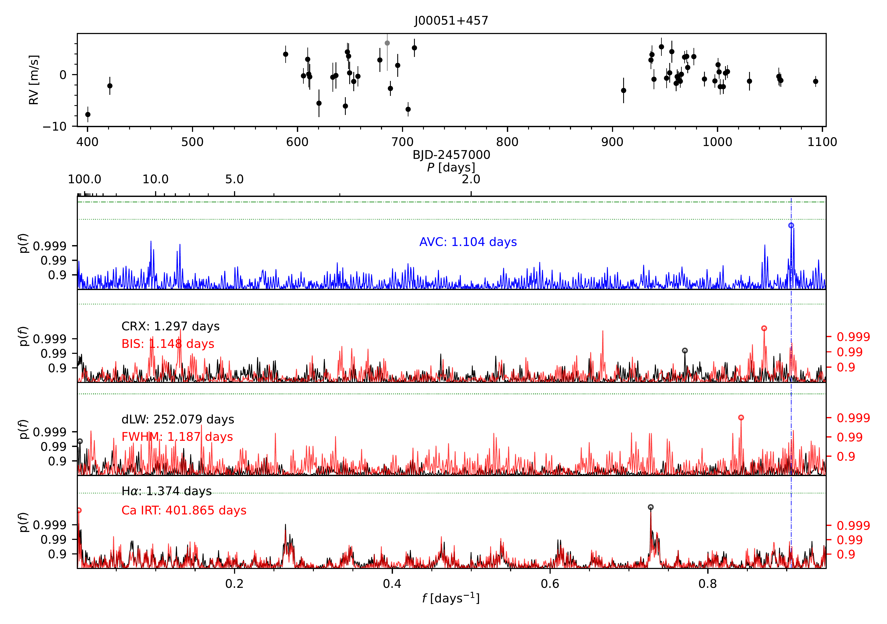
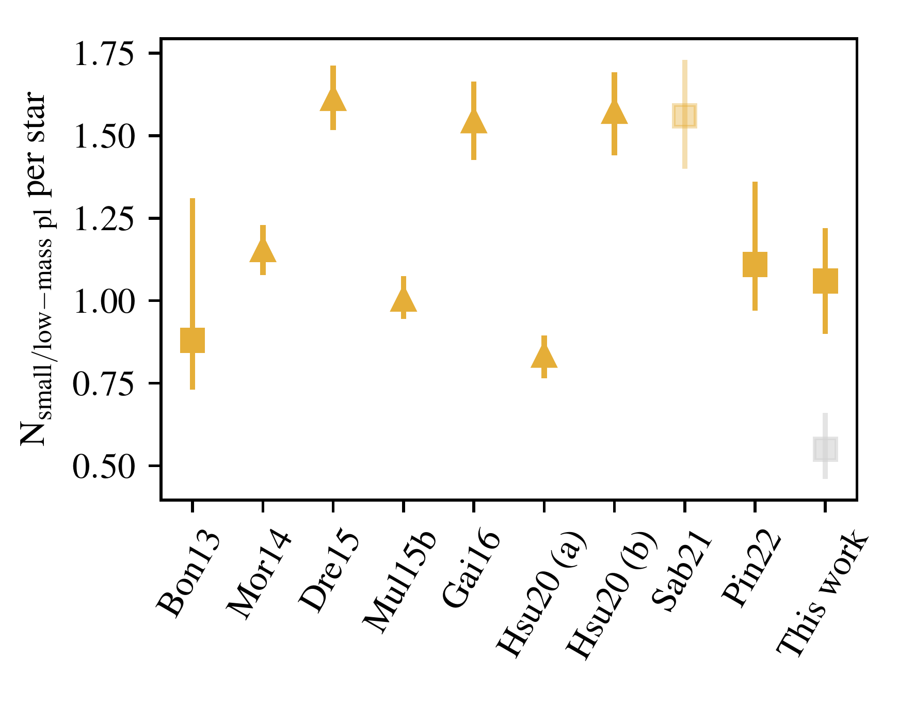
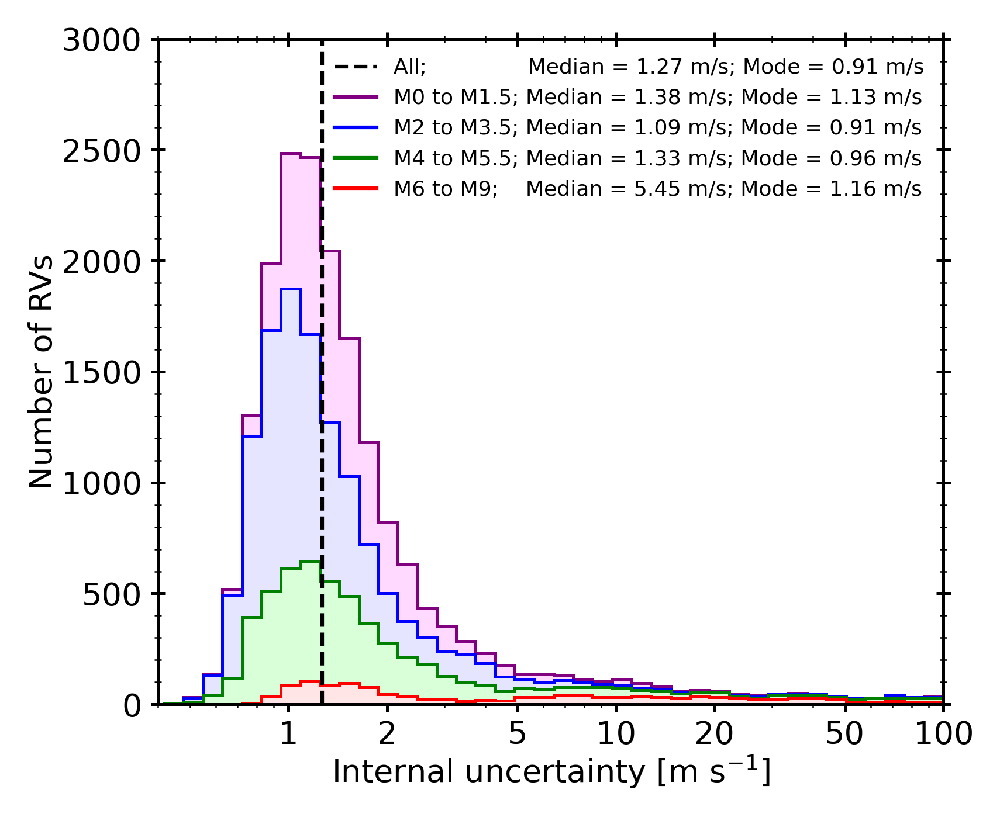

$\newcommand{\ensuremath}{}$
$\newcommand{\xspace}{}$
$\newcommand{\object}[1]{\texttt{#1}}$
$\newcommand{\farcs}{{.}''}$
$\newcommand{\farcm}{{.}'}$
$\newcommand{\arcsec}{''}$
$\newcommand{\arcmin}{'}$
$\newcommand{\ion}[2]{#1#2}$
$\newcommand{\textsc}[1]{\textrm{#1}}$
$\newcommand{\hl}[1]{\textrm{#1}}$
$\newcommand{\AS}[3]{#1^{+#2}_{-#3}}$
$\newcommand{\Comm}[1]{\textcolor{red}{\textbf{#1}}}$
$\newcommand{\inst}[1]{\unskip^{\instrefs{#1}}}$
$\newcommand{\scsep}{\newcommand{\}{scsep}{,}}$
$\newcommand{\}{scsep}$

$\newcommand{$\ensuremath$}{}$
$\newcommand{$\xspace$}{}$
$\newcommand{$\object$}[1]{\texttt{#1}}$
$\newcommand{$\farcs$}{{.}''}$
$\newcommand{$\farcm$}{{.}'}$
$\newcommand{$\arcsec$}{''}$
$\newcommand{$\arcmin$}{'}$
$\newcommand{$\ion$}[2]{#1#2}$
$\newcommand{$\textsc$}[1]{\textrm{#1}}$
$\newcommand{$\hl$}[1]{\textrm{#1}}$
$\newcommand{$\AS$}[3]{#1^{+#2}_{-#3}}$
$\newcommand{$\Comm$}[1]{\textcolor{red}{\textbf{#1}}}$
$\newcommand{$\inst$}[1]{\unskip^{$\inst$refs{#1}}}$
$\newcommand{\scsep}{\newcommand{\}{scsep}{,}}$
$\newcommand{\}{scsep}$

# The CARMENES search for exoplanets around M dwarfs

<mark>Appeared on: 2023-02-22</mark> - _Published in A&A (this https URL), 25 pages, 12 figures, Tables 1 and 2 only available online_

I. Ribas, et al. -- incl., <mark><mark>J. I. González Hernández</mark></mark>, <mark><mark>Th. Henning</mark></mark>, <mark><mark>E. Herrero</mark></mark>

**Abstract:** The CARMENES instrument, installed at the 3.5 m telescope of the Calar Alto Observatory in Almer\'ia, Spain,   was conceived to deliver high-accuracy radial velocity (RV) measurements with long-term stability to search   for temperate rocky planets around a sample of nearby cool stars. Moreover, the broad wavelength coverage   was designed to provide a range of stellar activity indicators to assess the nature of potential RV signals   and to provide valuable spectral information to help characterise the stellar targets.We describe the CARMENES guaranteed time observations (GTO), spanning from 2016 to 2020, during which   19 633 spectra for a sample of 362 targets were collected. We present the CARMENES Data Release 1 (DR1), which   makes public all observations obtained during the GTO of the CARMENES survey.The CARMENES survey target selection was aimed at minimising biases, and about 70\%of all known M   dwarfs within 10 pc and accessible from Calar Alto were included. The data were pipeline-processed, and   high-level data products, including 18 642 precise RVs for 345 targets, were derived.   Time series data of spectroscopic activity indicators were also obtained.We discuss the characteristics of the CARMENES data, the statistical properties of the stellar sample, and the   spectroscopic measurements. We show examples of the use of CARMENES data and provide a contextual view of   the exoplanet population revealed by the survey, including 33 new planets, 17 re-analysed planets, and 26   confirmed planets from transiting candidate follow-up. A subsample of 238 targets was used to derive updated   planet occurrence rates, yielding an overall average of$1.44\pm0.20$planets with 1 M$_\oplus   < M_\mathrm{pl} \sin i < 1000$M$_\oplus$and 1 d$< P_\mathrm{orb} < 1000$d per star, and indicating that   nearly every M dwarf hosts at least one planet. All the DR1 raw data, pipeline-processed data, and high-level   data products are publicly available online.CARMENES data have proven very useful for identifying and measuring planetary companions. They are   also suitable for a variety of additional applications, such as the determination of stellar fundamental   and atmospheric properties, the characterisation of stellar activity, and the study of exoplanet   atmospheres.

**Figure 9. -** Time series data and periodograms for target J00051+457 (GJ 2). {\it Top panel}: NZP-corrected
    RV time series. Outlier measurements (grey symbols; see text) are excluded in the periodogram
    calculation. {\it Bottom panels}(from top to bottom): GLS periodograms of the NZP-corrected RVs (AVC, blue),
    the chromatic index (CRX, black) and CCF bisector span (BIS, red), the differential line width (dLW,
    black) and the CCF FWHM (red), and the chromospheric activity indices corresponding to the H$\alpha$(black) and averaged Ca {\sc ii} IRT lines (red). The dash-dotted blue vertical line in all panels
    marks the position of the most significant peak in the RV periodogram, while the circles in the
    sub-panels highlight the position of the strongest signal in each periodogram, with the period
    given in the legend. The 0.1 \%, 1 \%, and 10 \% FAP levels are shown as horizontal dashed, dash-dotted,
    and dotted  green lines, respectively, and are visible if they fall within the displayed vertical
    range. Vertical axes in panels that show two different datasets are scaled such that the
    FAP levels are identical. The colour code allows the graph to be related with the axis labels and legends. (*fig:sample_periodograms*)

**Figure 5. -** Comparison of low-mass/small planet occurrence rates from various surveys (adapted from Sab21).
    The parameter range is 1 to 10 M$_\oplus$ in $M_\text{pl} \sin i$ for RV surveys and 1.3 to 3.7 R$_\oplus$ in
    $R_\text{pl}$ for transit surveys. The error bars for transit surveys are Poisson errors based on
    the number of planet detections in the respective bins, and error bars from RV surveys are the 16 \% and
    84 \% levels of the occurrence rate posterior distributions. Results using transiting planets from the
    \emph{Kepler} mission are represented as triangles (\citealt{Morton2014}, \citealt{Dressing2015},
    \citealt{Mulders2015a}, \citealt{Gaidos2016},  \citealt{Hsu2020}), and rates from the HARPS, HADES, and
    CARMENES RV surveys are represented as squares
    \citep[][and this work]{Bonfils2013, Sabotta2021A&A...653A.114S, Pinamonti2022}. The grey
    square shows the occurrence rate from this work with the assumption of a log-uniform distribution in
    $M_\text{pl}\sin i$. (*fig:occurrence_comparison*)

**Figure 1. -** Stacked histograms and statistical parameters (median and mode) of the internal precision
    (formal uncertainties) of the 18 642 precise RV measurements in the CARMENES DR1. (*fig:precision*)

