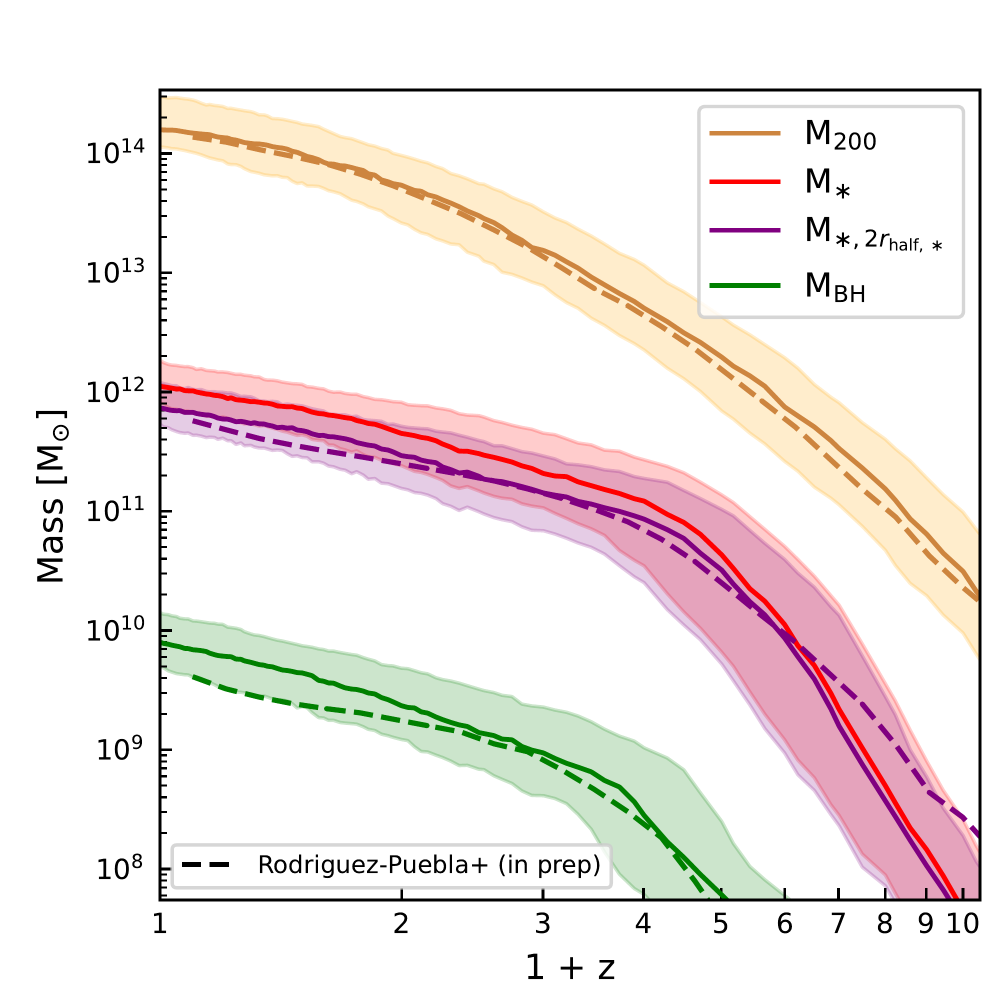
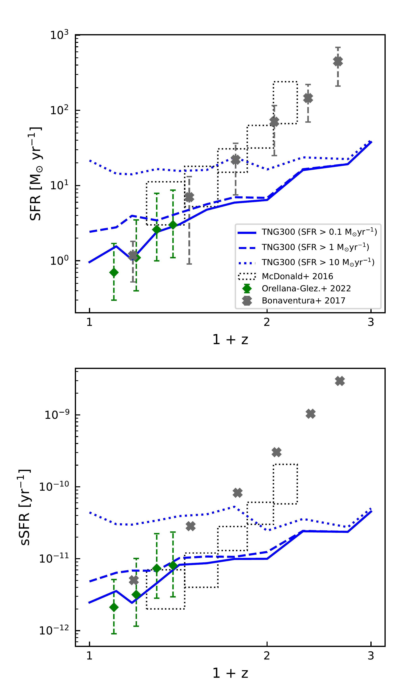
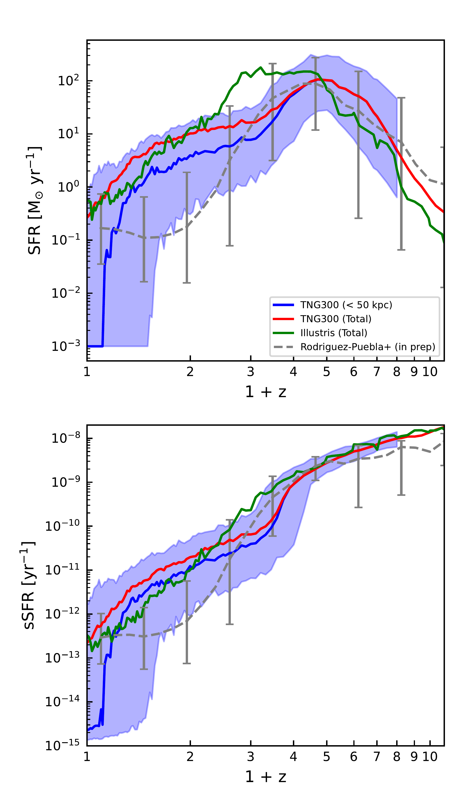

$\newcommand{\ensuremath}{}$
$\newcommand{\xspace}{}$
$\newcommand{\object}[1]{\texttt{#1}}$
$\newcommand{\farcs}{{.}''}$
$\newcommand{\farcm}{{.}'}$
$\newcommand{\arcsec}{''}$
$\newcommand{\arcmin}{'}$
$\newcommand{\ion}[2]{#1#2}$
$\newcommand{\textsc}[1]{\textrm{#1}}$
$\newcommand{\hl}[1]{\textrm{#1}}$
$\newcommand{\daniel}[1]{\textbf{{\color{Emerald}{Daniel: #1}}}}$
$\newcommand{\vicente}[1]{\textbf{{\color{violet}{Vicente: #1}}}}$
$\newcommand{\vlad}[1]{\textbf{{\color{cyan}{VAR: #1}}}}$
$\newcommand{\aldo}[1]{\textbf{{\color{orange}{Aldo: #1}}}}$
$\newcommand{\ap}[1]{\textcolor{magenta}{#1}}$
$\newcommand{\todo}[1]{\textcolor{red}{TODO: please #1}}$
$\newcommand{\Msun}{{\rm M}_{\odot}}$
$\newcommand{\Mtwo}{M_{\rm 200}}$
$\newcommand{\Mfive}{M_{\rm 500}}$
$\newcommand{\Rtwo}{R_{\rm 200}}$
$\newcommand{\Rfive}{R_{\rm 500}}$
$\newcommand{\facc}{f_{\rm acc}}$
$\newcommand{\fex}{f_{\rm ex}}$
$\newcommand{\krot}{\kappa_{\rm rot}}$
$\newcommand{\thefootnote}{\fnsymbol{footnote}}$
$\newcommand{\thefootnote}{\arabic{footnote}}$

$\newcommand{$\ensuremath$}{}$
$\newcommand{$\xspace$}{}$
$\newcommand{$\object$}[1]{\texttt{#1}}$
$\newcommand{$\farcs$}{{.}''}$
$\newcommand{$\farcm$}{{.}'}$
$\newcommand{$\arcsec$}{''}$
$\newcommand{$\arcmin$}{'}$
$\newcommand{$\ion$}[2]{#1#2}$
$\newcommand{$\textsc$}[1]{\textrm{#1}}$
$\newcommand{$\hl$}[1]{\textrm{#1}}$
$\newcommand{$\daniel$}[1]{\textbf{{\color{Emerald}{Daniel: #1}}}}$
$\newcommand{$\vicente$}[1]{\textbf{{\color{violet}{Vicente: #1}}}}$
$\newcommand{$\vlad$}[1]{\textbf{{\color{cyan}{VAR: #1}}}}$
$\newcommand{$\aldo$}[1]{\textbf{{\color{orange}{Aldo: #1}}}}$
$\newcommand{$\ap$}[1]{\textcolor{magenta}{#1}}$
$\newcommand{$\todo$}[1]{\textcolor{red}{TODO: please #1}}$
$\newcommand{$\Msun$}{{\rm M}_{\odot}}$
$\newcommand{$\Mtwo$}{M_{\rm 200}}$
$\newcommand{$\Mfive$}{M_{\rm 500}}$
$\newcommand{$\Rtwo$}{R_{\rm 200}}$
$\newcommand{$\Rfive$}{R_{\rm 500}}$
$\newcommand{$\facc$}{f_{\rm acc}}$
$\newcommand{$\fex$}{f_{\rm ex}}$
$\newcommand{$\krot$}{\kappa_{\rm rot}}$
$\newcommand{$\thefootnote$}{\fnsymbol{footnote}}$
$\newcommand{$\thefootnote$}{\arabic{footnote}}$

#  star formation

<mark>Appeared on: 2023-02-23</mark> - _19 pages, 11 figures. Accepted for publication in MNRAS_

Daniel Montenegro-Taborda, et al. -- incl., <mark><mark>Annalisa Pillepich</mark></mark>

**Abstract:** We investigate the formation of brightest cluster galaxies (BCGs) in the TNG300 cosmological simulation of the IllustrisTNG project. Our cluster sample consists of 700 haloes with$\Mtwo \geq 5 \times 10^{13}   $\Msun$$at$z=0$, along with their progenitors at earlier epochs. This includes 280 systems with$\Mtwo \geq 10^{14}   $\Msun$$at$z=0$, as well as three haloes with$\Mtwo \geq 10^{15}   $\Msun$$. We find that the stellar masses and star formation rates of our simulated BCGs are in good agreement with observations at$z \lesssim 0.4$, and that they have experienced, on average,$\sim$2 ($\sim$3) major mergers since$z=1$($z=2$). Separating the BCG from the intracluster light (ICL) by means of a fixed 30 kpc aperture, we find that the fraction of stellar mass contributed by\textit{ex situ}(i.e. accreted) stars at$z=0$is approximately 70, 80, and 90 per cent for the BCG, BCG+ICL, and ICL, respectively. Tracking our simulated BCGs back in time using the merger trees, we find that they became dominated by\textit{ex situ}stars at$z \sim $1--2, and that half of the stars that are part of the BCG at$z=0$formed early ($z \sim 3$) in other galaxies, but `assembled' onto the BCG until later times ($z $\ap$prox 0.8$for the whole sample,$z $\ap$prox 0.5$for BCGs in$\Mtwo \geq 5 \times 10^{14}   $\Msun$$haloes). Finally, we show that the stellar mass profiles of BCGs are often dominated by\textit{ex situ}stars at all radii, with stars from major mergers being found closer to the centre, while stars that were tidally stripped from other galaxies dominate the outer regions.

**Figure 4. -** Median mass histories of BCGs in the TNG300 simulation selected at $z=0$ with $\Mtwo \geq 10^{14}   $\Msun$$ and tracked back in time along the main branch of their merger trees. The solid red line shows the evolution of the total stellar mass that is gravitationally bound to the central main galaxy, while the solid purple line shows the stellar mass of the central main galaxy within $2 r_{\rm half, \ast}$. The solid orange line shows the mass evolution their host haloes' total mass, quantified by $\Mtwo$, while the solid green line shows the mass evolution of the supermassive BH hosted at the centre of the BCG. The shaded regions indicate the corresponding 16th to 84th percentile ranges, i.e. the galaxy-to-galaxy variation. The dashed lines represent the median mass histories for $\Mtwo$, $M_{\ast, 2 r_{\rm half, \ast}}$, and $M_{\rm BH}$ according to the semi-empirical model of Rodríguez-Puebla et al. (in preparation). Note that, unlike the halo mass history, the shape of the stellar mass history displays an inflection at $z \sim 3$--$4$, such that the stellar mass growth rate slows down after this transition epoch. (*fig:mass-vs-z*)

**Figure 2. -** SFRs of BCGs across cosmic time according to the TNG300 simulation. In the top (bottom) panels, we show SFRs (specific SFRs). Median SFR (top) and specific SFR (bottom) as function of redshift, shown for TNG300 BCGs \textit{selected at each redshift} with $\Mtwo \geq 10^{14}   $\Msun$$. The blue curves show measurements within 50 kpc from TNG300 including galaxies with three different SFR lower limits: 0.1 (solid), 1 (dashed), and 10 (dotted) $\Msun{\rm yr^{-1}}$. The black dotted rectangles, grey crosses and green diamonds represent observational estimates by \protect\cite{mcdonald2016SFR}, \protect\cite{Bonaventura2017} and \protect\cite{Orellana-Gonzalez+2022}, respectively, for SZ- or optically-selected clusters, and thus including a diversity of galaxy and halo mass distributions at different redshifts.
	\label{fig:SFR-vs-z_observation} (*fig:SFR-vs-z_observation*)

**Figure 3. -** SF histories of BCGs across cosmic time according to the TNG300 simulation. In the top (bottom) panels, we show SFRs (specific SFRs).
	Median SFR (top) and specific SFR (bottom) as function of redshift, shown for the main progenitors of simulated BCGs selected at $z=0$ with $\Mtwo \geq 10^{14}   $\Msun$$. The solid curves show measurements from TNG300 within 50 kpc (blue) and for the entire central galaxy (red), as well as for the entire central galaxy in Illustris original (green). The blue shaded regions indicate the 16th to 84th percentile range of the $r < 50$ kpc TNG300 measurements. The dashed grey line shows results from the semi-empirical model of Rodríguez-Puebla et al. (in preparation). Null SFR values have been replaced with the minimum measurable values as discussed in \protect\cite{donnari2019}.
	\label{fig:SFR-vs-z_simulation} (*fig:SFR-vs-z_simulation*)

