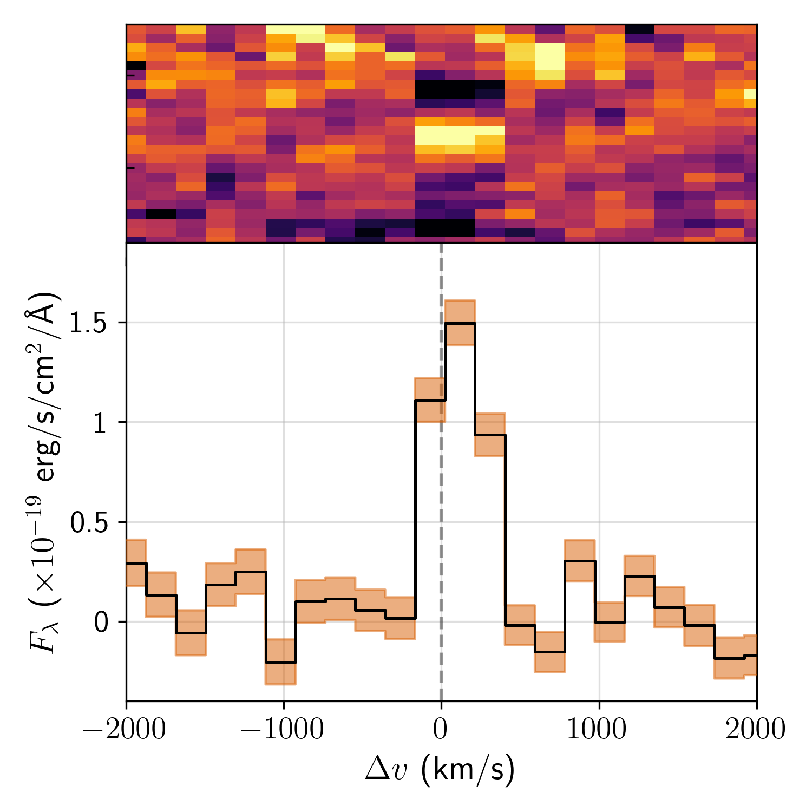
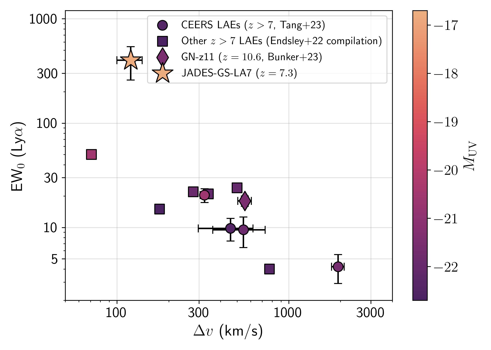
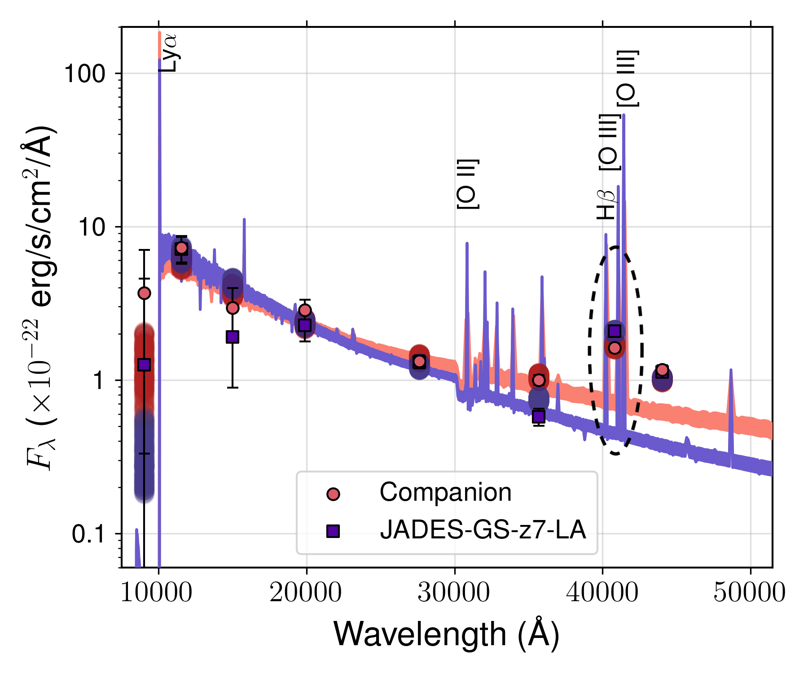

$\newcommand{\ensuremath}{}$
$\newcommand{\xspace}{}$
$\newcommand{\object}[1]{\texttt{#1}}$
$\newcommand{\farcs}{{.}''}$
$\newcommand{\farcm}{{.}'}$
$\newcommand{\arcsec}{''}$
$\newcommand{\arcmin}{'}$
$\newcommand{\ion}[2]{#1#2}$
$\newcommand{\textsc}[1]{\textrm{#1}}$
$\newcommand{\hl}[1]{\textrm{#1}}$
$\newcommand{\footnote}[1]{}$
$\newcommand{\vdag}{(v)^\dagger}$
$\newcommand$
$\newcommand$
$\newcommand{\lya}{Ly\textalpha}$
$\newcommand{\ha}{H\textalpha}$
$\newcommand{\hb}{H\textbeta}$
$\newcommand{\hg}{H\textgamma}$
$\newcommand{\oiii}{[O \textsc{iii}]}$
$\newcommand{\oii}{[O \textsc{ii}]}$
$\newcommand{\hii}{H \textsc{ii}}$
$\newcommand{\xiion}{\xi_\mathrm{ion}}$
$\newcommand{\fesc}{f_\mathrm{esc}}$
$\newcommand{\flux}{erg s^{-1} cm^{-2}}$
$\newcommand{\sfr}{M_\odot yr^{-1}}$
$\newcommand{\kms}{km s^{-1}}$

$\newcommand{\ensuremath}{}$
$\newcommand{\xspace}{}$
$\newcommand{\object}[1]{\texttt{#1}}$
$\newcommand{\farcs}{{.}''}$
$\newcommand{\farcm}{{.}'}$
$\newcommand{\arcsec}{''}$
$\newcommand{\arcmin}{'}$
$\newcommand{\ion}[2]{#1#2}$
$\newcommand{\textsc}[1]{\textrm{#1}}$
$\newcommand{\hl}[1]{\textrm{#1}}$
$\newcommand{\footnote}[1]{}$
$\newcommand{\vdag}{(v)^\dagger}$
$\newcommand$
$\newcommand$
$\newcommand{\lya}{Ly\textalpha}$
$\newcommand{\ha}{H\textalpha}$
$\newcommand{\hb}{H\textbeta}$
$\newcommand{\hg}{H\textgamma}$
$\newcommand{\oiii}{[O \textsc{iii}]}$
$\newcommand{\oii}{[O \textsc{ii}]}$
$\newcommand{\hii}{H \textsc{ii}}$
$\newcommand{\xiion}{\xi_\mathrm{ion}}$
$\newcommand{\fesc}{f_\mathrm{esc}}$
$\newcommand{\flux}{erg s^{-1} cm^{-2}}$
$\newcommand{\sfr}{M_\odot yr^{-1}}$
$\newcommand{\kms}{km s^{-1}}$

# JADES: Discovery of extremely high equivalent width Lyman-alpha emission from a faint galaxy within an ionized bubble at $z=7.3$

<mark>Appeared on: 2023-02-24</mark> - _12 pages, 7 figures, submitted to Astronomy & Astrophysics, comments welcome!_

Aayush Saxena, et al. -- incl., <mark><mark>Anna De Graaff</mark></mark>, <mark><mark>Hans-Walter Rix</mark></mark>

**Abstract:** We report the discovery of a remarkable Ly $\alpha$ emitting galaxy at $z=7.278$ , JADES-GS+53.16746-27.7720 (shortened to JADES-GS-z7-LA), with EW $_0$ (Ly $\alpha$ ) $\approx400 \pm 90$ Å and UV magnitude $-16.7$ . The spectroscopic redshift is confirmed via rest-frame optical lines [ O $ii$ ] , H $\beta$ and [ O $iii$ ] in its JWST/NIRSpec Micro-Shutter Assembly (MSA) spectrum. The Ly $\alpha$ line is detected in both lower resolution ( $R\sim100$ ) PRISM as well as medium resolution ( $R\sim1000$ ) G140M grating spectra. The Ly $\alpha$ FWHM in the grating is $\approx360$ km s $^{-1}$ and the line peaks within $120$ km s $^{-1}$ of the systemic redshift, indicative of very little neutral gas or dust within the galaxy. We estimate the Ly $\alpha$ escape fraction to be $\sim100\%$ . JADES-GS-z7-LA has a [ O $iii$ ] / [ O $ii$ ] ratio (O32) of $8.8 \pm 1.1$ and ( [ O $iii$ ] + [ O $ii$ ] )/H $\beta$ ratio (R23) of $9.6\pm2.2$ , consistent with low metallicity and high ionization parameters. Deep NIRCam imaging also revealed a close companion source (separated by $0.23"$ ), which exhibits similar photometry to that of JADES-GS-z7-LA, with a photometric excess in the F410M NIRCam image consistent with [ O $iii$ ] +H $\beta$ emission at the same redshift. The spectral energy distribution of JADES-GS-z7-LA indicates a `bursty' star-formation history, with a low stellar mass of $10^{7.15}$ M $_\odot$ . The only explanation of the high EW Ly $\alpha$ emission seen in JADES-GS-z7-LA is if it resides in an ionized bubble with radius $\gtrsim 3$ pMpc. Owing to the faint nature of JADES-GS-z7-LA, we show that it is incapable of single-handedly ionizing a bubble large enough. Therefore, we suggest that JADES-GS-z7-LA (and possibly the companion source) may be a part of a larger overdensity, presenting direct evidence of overlapping ionized bubbles at $z>7$ , allowing us to study the process of reionization across both small and large scales.

**Figure 1. -** Velocity shift of the $\lya$ emission line in the G140M NIRSpec spectrum with a resolution of $R\sim1000$ compared to the systemic redshift ($\Delta v=0$\kms) traced by the $\oiii$ and $\hb$ lines. The emission line appears to be symmetric, centred very close to the systemic redshift with an offset of $120\pm80$\kms, with flux bluewards of the peak. The observed line profile is indicative of significant $\lya$ photon escape thanks to virtually no neutral gas along the line-of-sight in the galaxy. (*fig:R1000_spec*)

**Figure 2. -** Distribution of $\lya$ EW and its velocity offset from the systemic redshift for JADES-GS-z7-LA (star), compared with GN-z11  ([Bunker, Saxena and Cameron 2023]()) (diamond), $z>7$ LAEs identified from CEERS by  ([Tang, Stark and Chen (2023)]()) (circles) and other known $z>7$ LAEs from the  ([Endsley, Stark and Bouwens (2022)]())  compilation (squares), which include sources from the ALMA REBELS survey amongst others such as B14-65666 at $z=7.15$ ([Furusawa, Kashikawa and Kobayashi 2016](), [Hashimoto, Inoue and Mawatari 2019]()) , EGS-zs8-1 at $z=7.72$ ([Oesch and Illingworth 2015](), [Stark, Ellis and Charlot 2017]()) , COS-zs7-1 at $z=7.15$ ([Pentericci, Carniani and Castellano 2016](), [Laporte, Nakajima and Ellis 2017](), [Stark, Ellis and Charlot 2017]())  and BDF-3299 at $z=7.11$ ([Vanzella, Pentericci and Fontana 2011](), [Maiolino, Carniani and Fontana 2015](), [Carniani, Maiolino and Pallottini 2017]()) . We also include the $z=7.68$ galaxy Y002  ([Valentino, Brammer and Fujimoto 2022]()) . JADES-GS-z7-LA lines up well with the observed strong anti-correlation between the strength of the $\lya$ emission line and its velocity offset compared to systemic redshift, and its faint UV magnitude and high $\lya$ EW compared to other $z>7$ LAEs stand out. (*fig:vel_comp*)

**Figure 3. -** Best-fitting SEDs of JADES-GS-z7-LA and its companion source, fixing the redshift to be at $z=7.278$ for both objects. We find that a good fit is obtained for the companion source at the same redshift as JADES-GS-z7-LA, which in particular can explain the photometric excess observed in the F410M band (dashed oval). Overall, JADES-GS-z7-LA has a `bluer' SED, which is reflected in the preference for a bursty star-formation history when compared to the companion source. (*fig:SED*)

