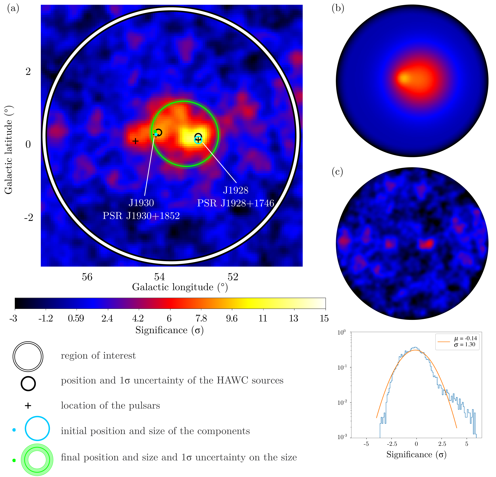
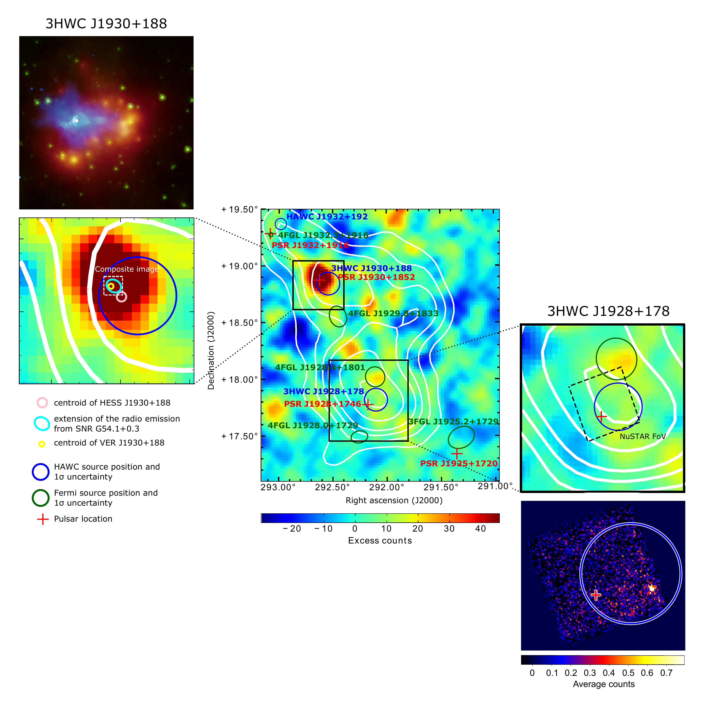

$\newcommand{\ensuremath}{}$
$\newcommand{\xspace}{}$
$\newcommand{\object}[1]{\texttt{#1}}$
$\newcommand{\farcs}{{.}''}$
$\newcommand{\farcm}{{.}'}$
$\newcommand{\arcsec}{''}$
$\newcommand{\arcmin}{'}$
$\newcommand{\ion}[2]{#1#2}$
$\newcommand{\textsc}[1]{\textrm{#1}}$
$\newcommand{\hl}[1]{\textrm{#1}}$
$\newcommand{\vdag}{(v)^\dagger}$
$\newcommand$
$\newcommand$

$\newcommand{\ensuremath}{}$
$\newcommand{\xspace}{}$
$\newcommand{\object}[1]{\texttt{#1}}$
$\newcommand{\farcs}{{.}''}$
$\newcommand{\farcm}{{.}'}$
$\newcommand{\arcsec}{''}$
$\newcommand{\arcmin}{'}$
$\newcommand{\ion}[2]{#1#2}$
$\newcommand{\textsc}[1]{\textrm{#1}}$
$\newcommand{\hl}[1]{\textrm{#1}}$
$\newcommand{\vdag}{(v)^\dagger}$
$\newcommand$
$\newcommand$

# Detailed Analysis of the TeV $\gamma$-Ray Sources 3HWC J1928+178, 3HWC J1930+188, and the New Source HAWC J1932+192

<mark>Appeared on: 2023-03-01</mark> - __

A. Albert, et al. -- incl., <mark><mark>W. H. Lee</mark></mark>

**Abstract:** The latest High Altitude Water Cherenkov (HAWC) point-like source catalog up to  56 TeV reported the detection of two sources in the region of the Galactic plane at galactic longitude 52 \textdegree $< \ell <$ 55 \textdegree , 3HWC J1930+188 and 3HWC J1928+178. The first one is associated with a known TeV source, the supernova remnant SNR G054.1+00.3. It was discovered by one of the currently operating Imaging Atmospheric Cherenkov Telescope (IACT), the Very Energetic Radiation Imaging Telescope Array System (VERITAS), detected by the High Energy Stereoscopic System (H.E.S.S.), and identified as a composite SNR.However, the source 3HWC J1928+178, discovered by HAWC and coincident with the pulsar PSR J1928+1746, was not detected by any IACT despite their long exposure on the region, until a recent new analysis of H.E.S.S. data was able to confirm it.Moreover, no X-ray counterpart has been detected from this pulsar.We present a multicomponent fit of this region using the latest HAWC data. This reveals an additional new source, HAWC J1932+192, which is potentially associated with the pulsar PSR J1932+1916, whose $\gamma$ -ray emission could come from the acceleration of particles in its pulsar wind nebula. In the case of 3HWC J1928+178, several possible explanations are explored, in a attempt to unveil the origins of the very-high-energy $\gamma$ -ray emission.

**Figure 3. -**  The significance map (a) indicates the region of interest (ROI) of radius 3\textdegree5 (the white circle) and the two components for J1928 and J1930. The blue/green dot and circle show the initial/fitted position and size. The width of the green circle represents the 1$\sigma$ uncertainty on the size of the Gaussian.
    Map (b) is the significance map of the model in the ROI.
    Map (c) is the significance map of the residuals in the ROI and the significance distribution in the inner 2\textdegree  radius region, with a Gaussian fit. The color scale holds for all maps.
     (*summary_a*)

**Figure 8. -** The HAWC significance map is shown in panel (a). The black circle shows the location and 1$\sigma$ uncertainty of the HAWC source \citep{3HWC_catalog}. The black cross is the location of the pulsar PSR J1928+1746. The white box is the region with $>5\sigma$$\gamma$-ray emission of 3HWC J1928+178, with the velocity dispersion being averaged and plotted in panel (b) as a function of the brightness temperature. For the three peaks at $\sim$4.5 km s$^{-1}$, $\sim$22 km s$^{-1}$ and $\sim$46 km s$^{-1}$, the $^{13}$CO maps are shown in panel (c). (*HAWC_CO_velocity*)

**Figure 1. -** Multiwavelength view of the region surrounding 3HWC J1928+177. The middle map is the VERITAS excess map of the region, adapted from \citet{Veritas_Fermi_2HWCsources}. Superimposed are the locations and the 1$\sigma$ uncertainties on the locations of the HAWC sources (blue circles) and the Fermi 4FGL sources (green circles), as well as the locations of the pulsars (red crosses). The white contours are HAWC significance contours for 5$\sigma$, 6$\sigma$, 7$\sigma$, 8$\sigma$, 10$\sigma$ and 12$\sigma$ for 1523 days of data.
    The top source, 3HWC J1930+188, is detailed in the zoomed-in view on the left-hand side. The locations of the counterparts detected by VERITAS (yellow) and H.E.S.S. (pink) are represented. The extension of the radio emission is also shown (cyan). The dashed white box represents the size of the composite image at the top (3$\arcmin$ - 0\textdegree05). It depicts the X-ray emission of the pulsar (the bright white star) and the PWN detected by _Chandra_(blue - NASA/CXC/SAO/T.Temim et al.), as well as the IR emission detected by _Spitzer_(green is 8$\mu$m and red is 24$\mu$m - NASA/JPL-Caltech), revealing the dusty remains of a collapsed star. The bottom source 3HWC J1928+178 is detailed in the zoomed-in image on the right-hand side. The dashed black box represents the NuSTAR background-subtracted map shown at the bottom (adapted from \citet{J1928_dark_accelerator}). The bright source to the bottom right is CXO J192812.0+174712.
     (*Veritas_Chandra_NuSTAR*)

