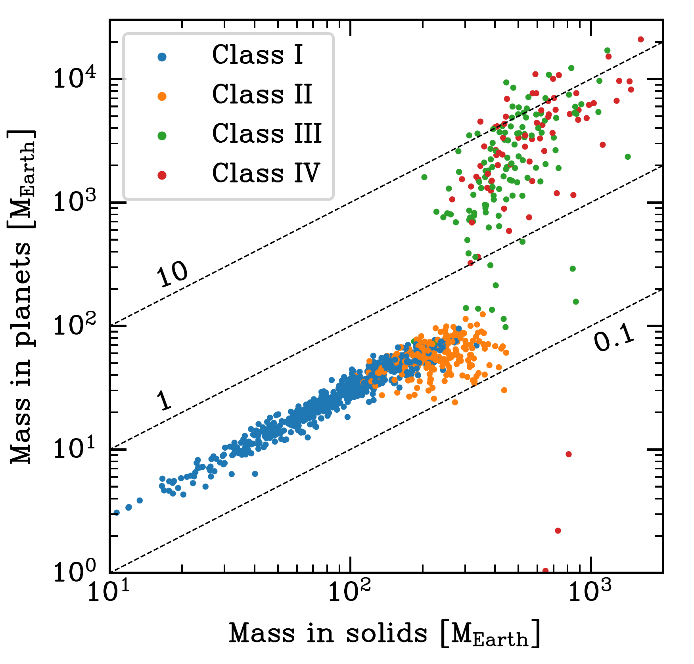
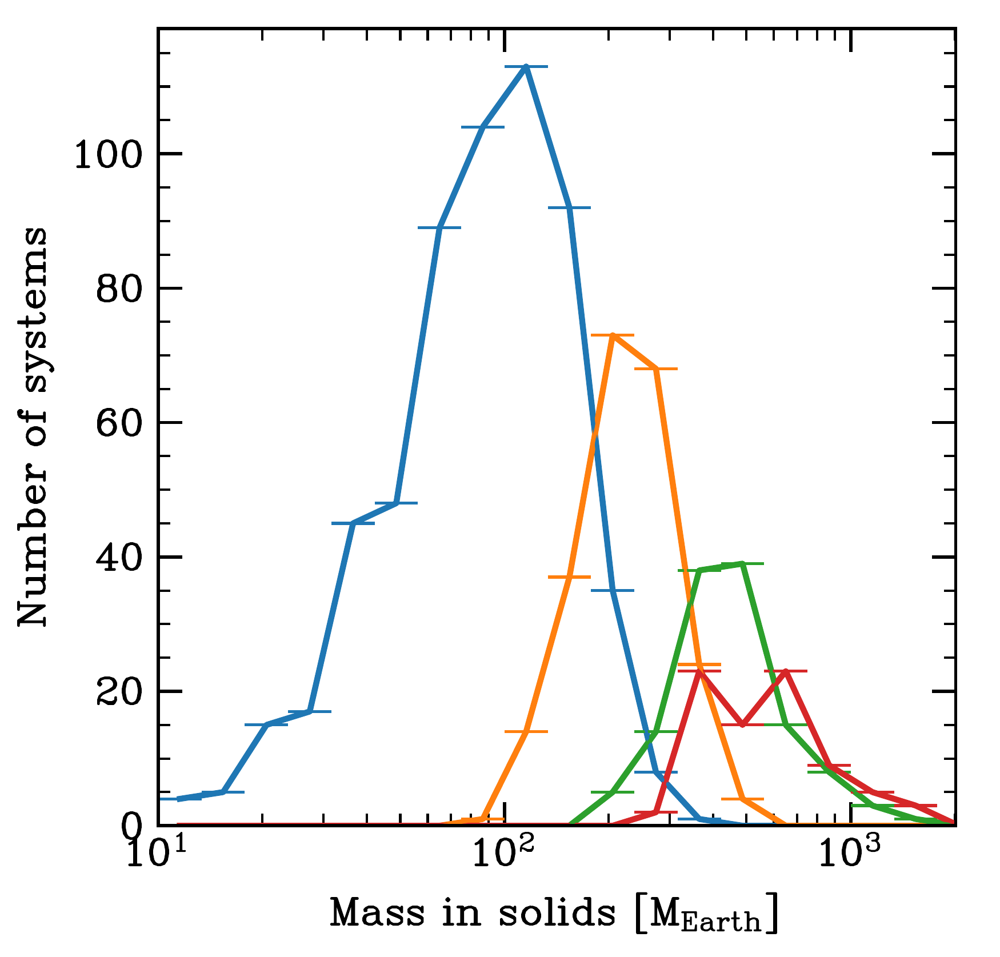
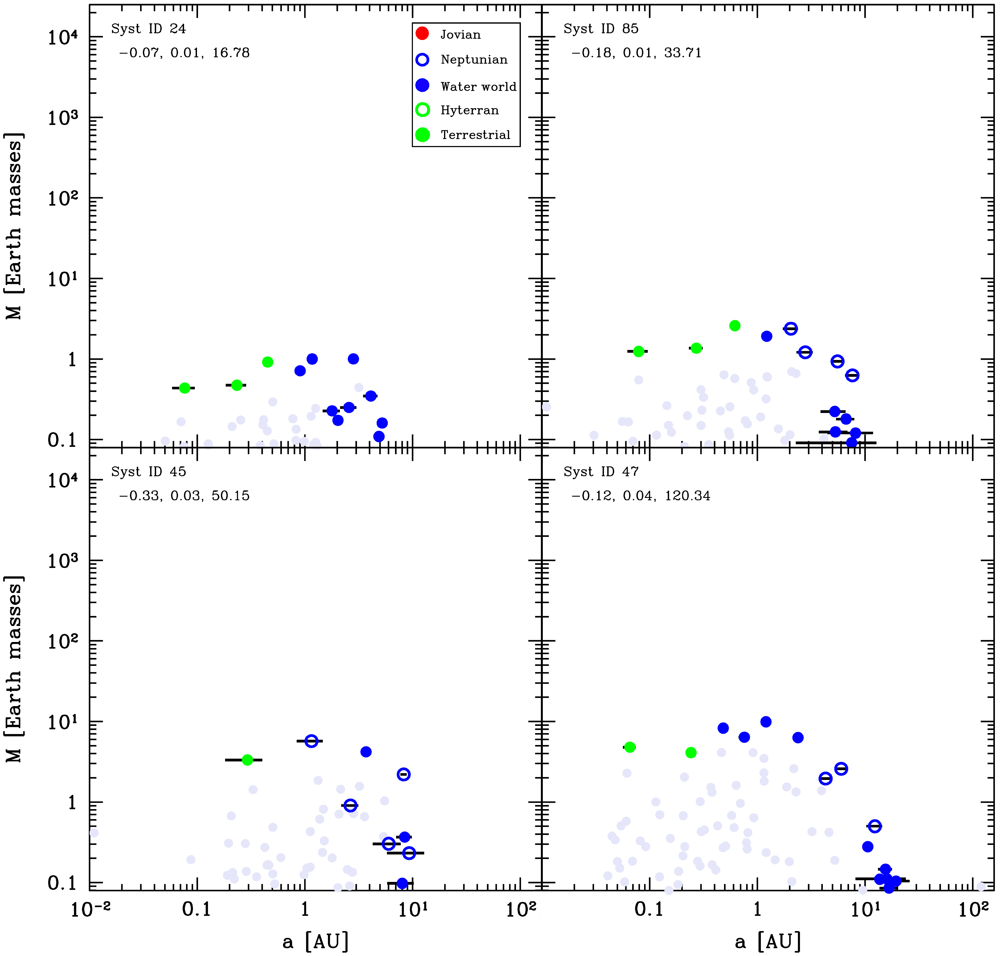
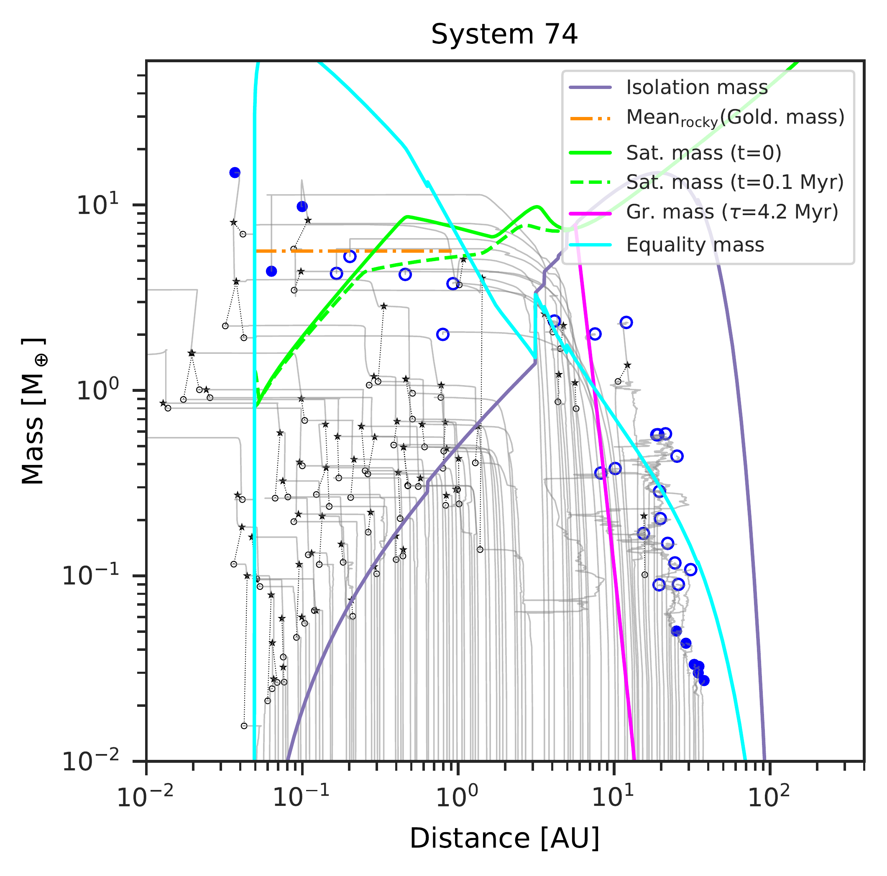

$\newcommand{\ensuremath}{}$
$\newcommand{\xspace}{}$
$\newcommand{\object}[1]{\texttt{#1}}$
$\newcommand{\farcs}{{.}''}$
$\newcommand{\farcm}{{.}'}$
$\newcommand{\arcsec}{''}$
$\newcommand{\arcmin}{'}$
$\newcommand{\ion}[2]{#1#2}$
$\newcommand{\textsc}[1]{\textrm{#1}}$
$\newcommand{\hl}[1]{\textrm{#1}}$

$\newcommand{\ensuremath}{}$
$\newcommand{\xspace}{}$
$\newcommand{\object}[1]{\texttt{#1}}$
$\newcommand{\farcs}{{.}''}$
$\newcommand{\farcm}{{.}'}$
$\newcommand{\arcsec}{''}$
$\newcommand{\arcmin}{'}$
$\newcommand{\ion}[2]{#1#2}$
$\newcommand{\textsc}[1]{\textrm{#1}}$
$\newcommand{\hl}[1]{\textrm{#1}}$

# Planetary Population Synthesis and the Emergence of Four Classes of Planetary System Architectures

<mark>Appeared on: 2023-03-02</mark> - _Invited review accepted for publication in EPJ+, Focus Point on Environmental and Multiplicity Effects on Planet Formation by guest editors G. Lodato and C.F. Manara_

Alexandre Emsenhuber, Christoph Mordasini, <mark>Remo Burn</mark>

**Abstract:** Planetary population synthesis is a helpful tool to understand the physics of planetary system formation. It builds on a global model, meaning that the model has to include a multitude of physical processes. The outcome can be statistically compared with exoplanet observations. Here, we review the population synthesis method and then use one population computed using the Generation III Bern model to explore how different planetary system architectures emerge and which conditions lead to their formation. The emerging systems can be classified into four main architectures: Class I of near-in situ compositionally ordered terrestrial and ice planets, Class II of migrated sub-Neptunes, Class III of mixed low-mass and giant planets, broadly similar to the Solar System, and Class IV of dynamically active giants without inner low-mass planets. These four classes exhibit distinct typical formation pathways and are characterised by certain mass scales. We find that Class I forms from the local accretion of planetesimals followed by a giant impact phase, and the final planet masses correspond to what is expected from such a scenario, the `Goldreich mass'. Class II, the migrated sub-Neptune systems form when planets reach the `equality mass' where accretion and migration timescales are comparable before the dispersal of the gas disc, but not large enough to allow for rapid gas accretion. Giant planets form when the `equality mass' allows for gas accretion to proceed while the planet are migrating, i.e., when the critical core mass is reached. The main discriminant of the four classes is the initial mass of solids in the disc, with contributions from the lifetime and mass of the gas disc. The distinction between mixed Class III systems and Class IV dynamically-active giants is in part due to the stochastic nature of dynamical interactions, such as scatterings between giant planets, rather than the initial conditions only. The breakdown of system into classes allows to better interpret the outcome of a complex model and understand which physical processes are dominant. Comparison with observations reveals differences to the actual population, pointing at limitation of theoretical understanding. For example, the overrepresentation of synthetic super Earths and sub-Neptunes in Class I systems causes these planets to be found at lower metallicities than in observations.

**Figure 14. -** System architecture as function of the initial solids mass content in the disc $M_{\rm p,ini}$ and the total mass (accounting for solids and gas) in the final planets per system $M_{\rm sys}$(left) and a histogram of initial solids mass only (right). In the left panel, the three dashed diagonal lines again denote the conversion efficiency from disc solids to planets, with the value given next to them. In the right panel, the small horizontal lines show the extent of each bin. (*fig:sys_dsm_ptm*)

**Figure 4. -** Final architecture of four example systems in Class I. Coloured dots show the position in the mass-semimajor axis plane of different planet composition types as indicated in the legend. The three numbers in the top left give the initial conditions [M/H], initial gas disc mass [\si{\msun}], and initial mass of planetesimals [\si{\mearth}]. The systems are ordered according to the latter. Horizontal black bars indicate the periastron to apastron distance, reflecting  orbital eccentricity. Grey full circles show the last position of protoplanets that were lost. The ones lost by accretion onto the star are put on the left y-axis of each panel and those ejected on the right one. The remaining grey points correspond to protoplanets that were accreted by another more massive protoplanet. The point then shows the mass and semi-major axis just before this accretion event. (*fig:class1examples*)

**Figure 5. -** Example of formation tracks and final architecture of a system that belong to Class II. In this class, the governing mass scale in the inner system is linked to orbital migration and is thus given by the saturation mass $M_{\rm sat}$ where planets are released from migration traps (green lines, evaluated at $t=0$ and $t=\SI{0.1}{\mega\year}$) and/or the equality mass $M_{\rm{eq}}$ where the timescales of oligarchic growth and type I orbital migration  are equal (cyan line). (*fig:class2*)

