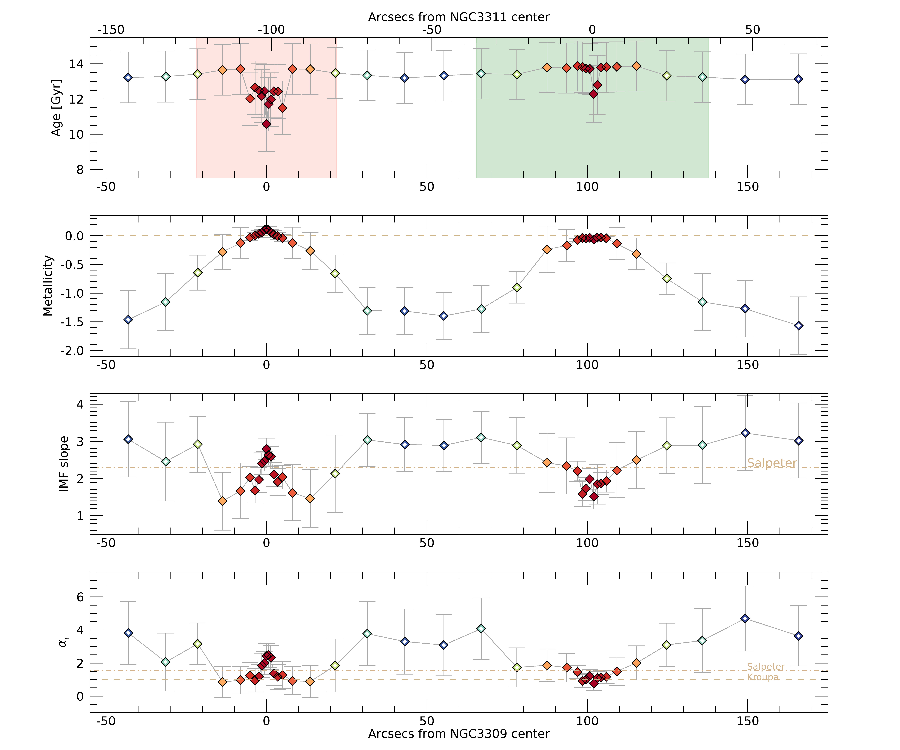
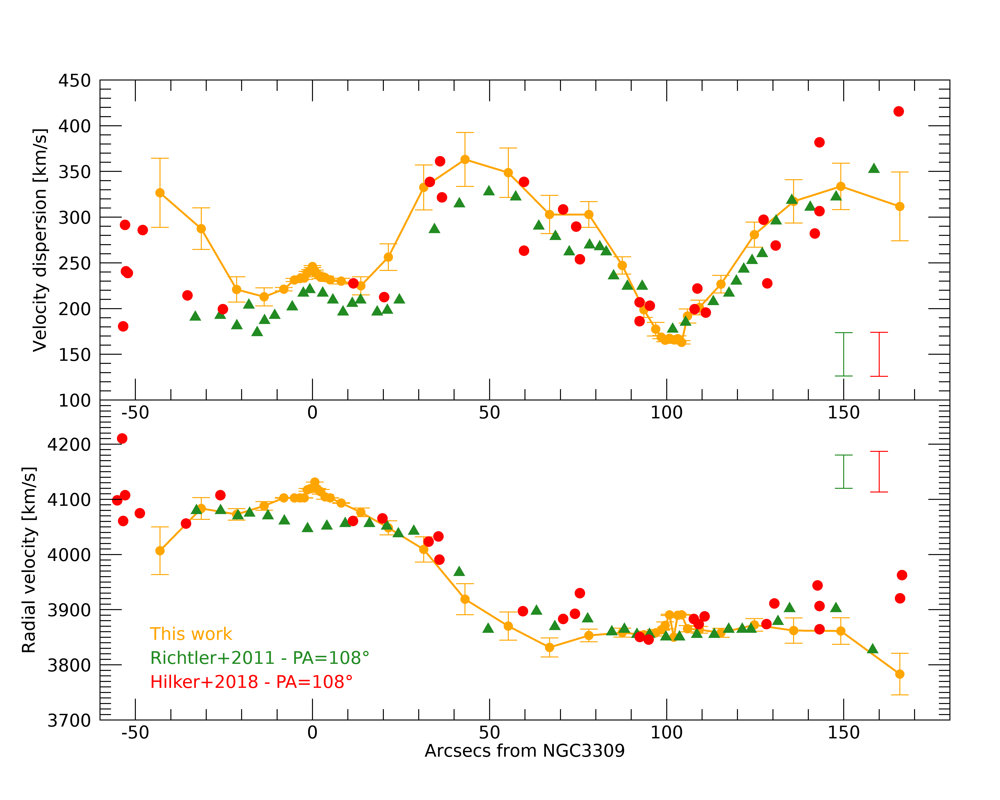
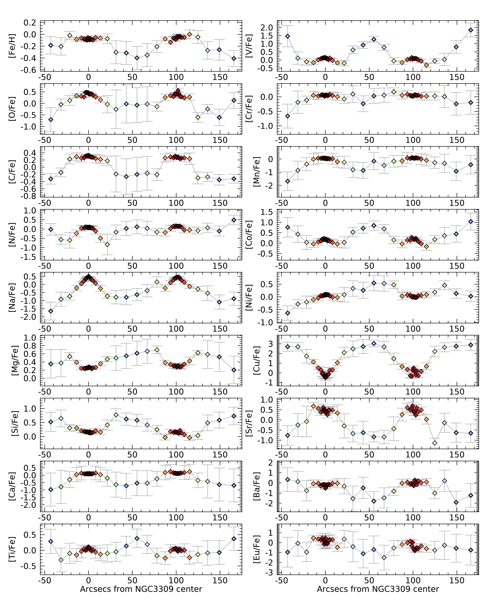

$\newcommand{\ensuremath}{}$
$\newcommand{\xspace}{}$
$\newcommand{\object}[1]{\texttt{#1}}$
$\newcommand{\farcs}{{.}''}$
$\newcommand{\farcm}{{.}'}$
$\newcommand{\arcsec}{''}$
$\newcommand{\arcmin}{'}$
$\newcommand{\ion}[2]{#1#2}$
$\newcommand{\textsc}[1]{\textrm{#1}}$
$\newcommand{\hl}[1]{\textrm{#1}}$
$\newcommand$
$\newcommand$
$\newcommand{\afk}[1]{\textcolor{purple}{\uline{#1}}}$
$\newcommand{\afks}[1]{\textcolor{purple}{\sout{#1}}}$
$\newcommand{\il}[1]{\textcolor{cyan}{\uline{#1}}}$
$\newcommand{\ils}[1]{\textcolor{cyan}{\sout{#1}}}$
$\newcommand{\wf}[1]{\textcolor{blue}{\uline{#1}}}$
$\newcommand{\wfs}[1]{\textcolor{blue}{\sout{#1}}}$

$\newcommand{\ensuremath}{}$
$\newcommand{\xspace}{}$
$\newcommand{\object}[1]{\texttt{#1}}$
$\newcommand{\farcs}{{.}''}$
$\newcommand{\farcm}{{.}'}$
$\newcommand{\arcsec}{''}$
$\newcommand{\arcmin}{'}$
$\newcommand{\ion}[2]{#1#2}$
$\newcommand{\textsc}[1]{\textrm{#1}}$
$\newcommand{\hl}[1]{\textrm{#1}}$
$\newcommand$
$\newcommand$
$\newcommand{\afk}[1]{\textcolor{purple}{\uline{#1}}}$
$\newcommand{\afks}[1]{\textcolor{purple}{\sout{#1}}}$
$\newcommand{\il}[1]{\textcolor{cyan}{\uline{#1}}}$
$\newcommand{\ils}[1]{\textcolor{cyan}{\sout{#1}}}$
$\newcommand{\wf}[1]{\textcolor{blue}{\uline{#1}}}$
$\newcommand{\wfs}[1]{\textcolor{blue}{\sout{#1}}}$

# The initial mass function and other stellar properties across the core of the Hydra I cluster\footnote{This paper includes data gathered with the 6.5 meterMagellan Telescopes located at Las Campanas Observatory, Chile.}

<mark>Appeared on: 2023-03-02</mark> - _32 pages, 18 figures. Accepted for publication in ApJ_

Ilaria Lonoce, W. L. Freedman, <mark>A. Feldmeier-Krause</mark>

**Abstract:** The Hydra I cluster offers an excellent opportunity to study and compare the relic old stellar populations in the core of its two brightest galaxies. In addition, the differing kinematics of the two galaxies allows a test of the local validity of general scaling relations. In this work we present a direct comparison employing full spectral fitting of new high-quality long-slit optical and NIR spectroscopic  data. We retrieve age, metallicity and 19 elemental abundances out to $\sim12$ kpc within each galaxy, as well as the IMF in their central regions.Our results suggest that the inner $\sim5$ kpc region of both galaxies, despite their different masses, formed at the same time and evolved with a similar star formation time-scale and chemical enrichment, confirming their early formation in the cluster build up. Only the overall metallicity and IMF radial profiles show differences connected with their different velocity dispersion profiles. The radial trend of the IMF positively correlates with both [ Z/H ] and $\sigma$ . While the trends of the IMF with metallicity agree with a global trend for both galaxies, the trends with the velocity dispersion exhibit differences. The outer regions show signs of mixed stellar populations with large differences in chemical content compared to the centers, but with similar old ages.

**Figure 8. -** \small{Age, metallicity and IMF slope trends across the Hydra I cluster center as retrieved with ALF. West is on the left, East is on the right. The bottom panel
shows the derived mismatch parameter $\alpha_r$.
Dash-dotted horizontal tan lines in the IMF and $\alpha_r$ panels outline the corresponding values for a Salpeter IMF, dashed those for a Kroupa IMF. Open diamonds refer to regions where the results are less robust due to lower S/N, velocity dispersion broadening and/or lack of important features. } (*fig:ageZimf*)

**Figure 11. -** \small{Velocity dispersion (upper panel) and radial velocity (lower panel) profiles as retrieved with ALF (orange).
Green triangles and red circles show an indication of the trends retrieved by the works of  ([Richtler, et. al (2011)](https://ui.adsabs.harvard.edu/abs/2011A&A...531A.119R))  and  ([Hilker, et. al (2018)](https://ui.adsabs.harvard.edu/abs/2018A&A...619A..70H)) , respectively, as they appear in figure $6$ of  ([Hilker, et. al (2018)](https://ui.adsabs.harvard.edu/abs/2018A&A...619A..70H))  for the case of position angle $108$\degr.  Typical error bars are shown on the right of both panels.
} (*fig:kinematics*)

**Figure 9. -** \small{Similar to Figure \ref{fig:ageZimf} but for all the retrieved elemental abundances.} (*fig:elements*)

